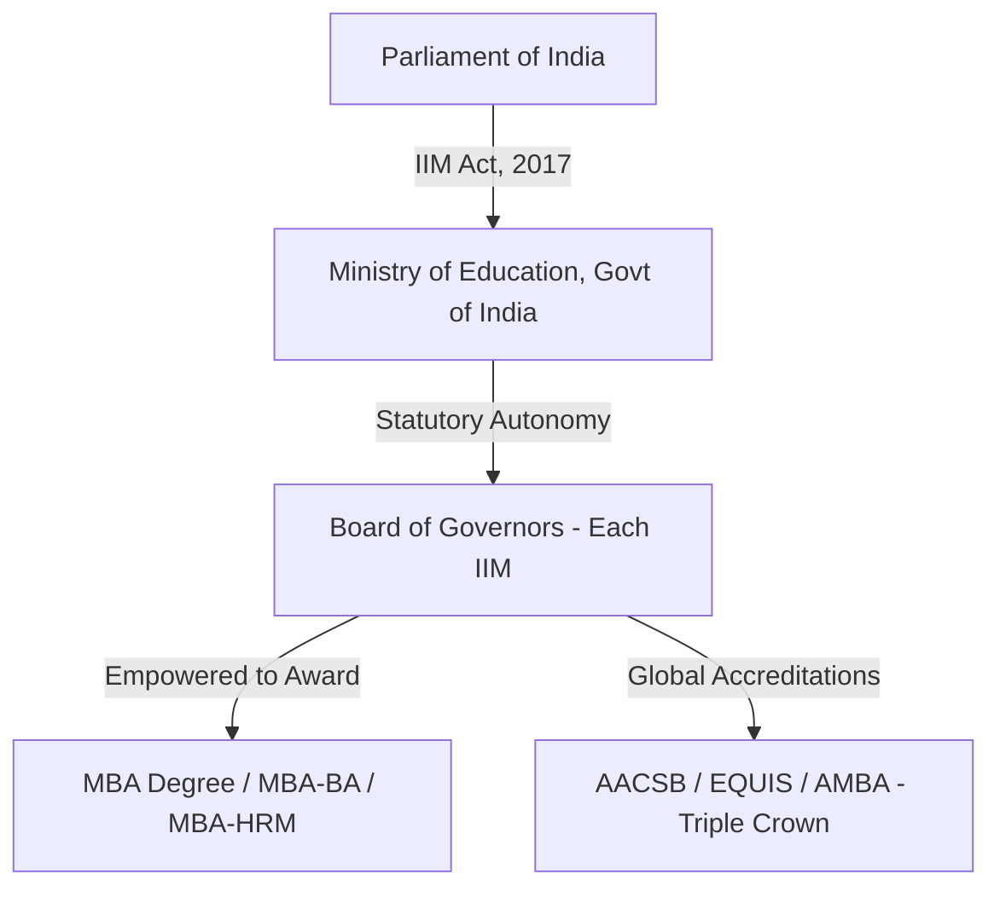
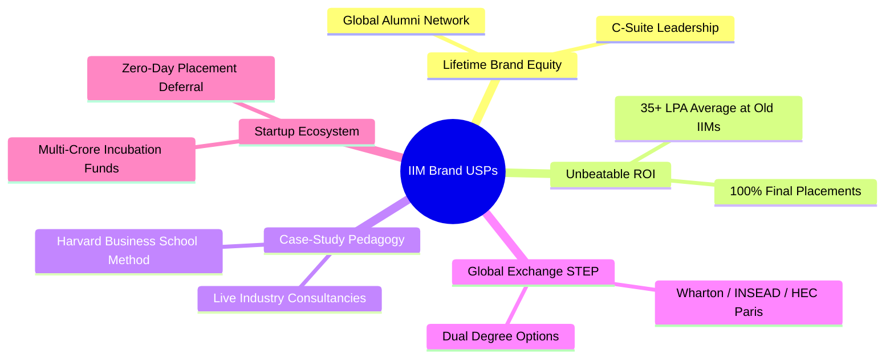

The **Indian Institutes of Management (IIMs)** represent the pinnacle of management education in India. For over six decades, an IIM degree has been the gold standard for corporate leadership, entrepreneurship, and global business excellence. Whether you are aiming for prestigious MBB consulting firms, bulge-bracket investment banks, or high-growth tech unicorns, entering an IIM is often the most transformative career decision an aspirant can make.

With the addition of **IIM Mumbai** (formerly NITIE) in 2023, there are now **21 IIMs in India**. However, each IIM differs significantly in terms of placement benchmarks, fee structures, batch sizes, and admission cutoffs. 

In this comprehensive guide, we cover **everything you need to know about all 21 IIMs**—from granular placement statistics (**lowest, average, and highest salary packages**) and **statutory affiliation** to **unique selling propositions (USPs)** and the complete **2026–28 selection criteria**.

---

#

[InquiryCard title="Need Help Choosing the Right IIM or Top MBA College?" description="Get personalized profile evaluation, CAT cutoff mapping, and admission counseling from expert counselor Mohit Jain." cta="Get Free Career Counselling" type="admission"]

---

## 1. Complete List of All 21 IIMs: Placement Statistics (Lowest, Average & Highest)

When evaluating IIMs, aspirants typically categorize them into three core clusters based on their establishment year, alumni maturity, and corporate standing:
1. **Old IIMs ([IIM BLACKI](/blog/what-is-iim-blacki-complete-guide-2026) + IIM Mumbai)**
2. **New IIMs (Est. 2007–2011)**
3. **[Baby IIMs](/blog/baby-iims-review-2026-honest-analysis) (Est. 2015–2016)**

Below is the exhaustive comparison table of **all 21 IIMs**, detailing their establishment year, approx. 2-year MBA fee, and latest placement highlights including the **lowest (minimum recorded base)**, **average**, and **highest** annual packages.

| Institute Name | Category & Est. Year | Approx. Total Fees | Lowest Package (Base/Min) | Average Package (LPA) | Highest Package (LPA / Cr) | CAT Cutoff (General) |
| :--- | :--- | :--- | :--- | :--- | :--- | :--- |
| **[IIM Ahmedabad](/colleges/iim-ahmedabad)** | Old (1961) | ₹27.5 – 30.0 L | ₹18.0 – 20.0 LPA | **₹35.0 – 36.5 LPA** | ₹1.30+ Cr (Intl) / ₹70 LPA | 99.5+ %ile |
| **[IIM Bangalore](/colleges/iim-bangalore)** | Old (1973) | ₹24.5 – 26.5 L | ₹18.0 – 20.0 LPA | **₹35.0 – 36.0 LPA** | ₹1.15+ Cr (Intl) / ₹65 LPA | 99.0+ %ile |
| **[IIM Calcutta](/colleges/iim-calcutta)** | Old (1961) | ₹27.0 – 29.0 L | ₹18.5 – 20.0 LPA | **₹35.0 – 35.5 LPA** | ₹1.20+ Cr (Intl) / ₹70 LPA | 99.5+ %ile |
| **IIM Lucknow** | Old (1984) | ₹20.5 – 22.5 L | ₹16.0 – 18.0 LPA | **₹30.0 – 33.0 LPA** | ₹1.00+ Cr (Intl) / ₹65 LPA | 98.5+ %ile |
| **IIM Kozhikode** | Old (1996) | ₹22.0 – 24.0 L | ₹15.0 – 17.0 LPA | **₹28.0 – 30.0 LPA** | ₹70.0 LPA | 98.0+ %ile |
| **IIM Indore** | Old (1996) | ₹21.0 – 23.0 L | ₹14.0 – 16.0 LPA | **₹25.0 – 27.5 LPA** | ₹65.0 LPA | 98.0+ %ile |
| **IIM Mumbai (NITIE)** | Old / Elite (1963) | ₹21.0 – 22.5 L | ₹16.0 – 18.0 LPA | **₹31.0 – 32.5 LPA** | ₹78.0 LPA | 97.5+ %ile |
| **IIM Shillong** | New (2007) | ₹19.0 – 21.0 L | ₹14.0 – 15.0 LPA | **₹26.1 LPA** | ₹71.5 LPA | 96.5+ %ile |
| **IIM Raipur** | New (2010) | ₹18.0 – 20.0 L | ₹13.0 – 14.0 LPA | **₹21.0 LPA** | ₹43.4 LPA | 94.0+ %ile |
| **IIM Trichy** | New (2010) | ₹18.0 – 20.0 L | ₹13.0 – 14.0 LPA | **₹20.5 LPA** | ₹41.6 LPA | 94.0+ %ile |
| **IIM Udaipur** | New (2011) | ₹18.5 – 20.5 L | ₹12.5 – 13.5 LPA | **₹20.3 LPA** | ₹47.0 LPA | 94.0+ %ile |
| **IIM Rohtak** | New (2010) | ₹18.0 – 19.5 L | ₹12.5 – 13.5 LPA | **₹19.2 LPA** | ₹48.2 LPA | 96.0+ %ile |
| **IIM Ranchi** | New (2010) | ₹18.0 – 20.0 L | ₹12.5 – 13.5 LPA | **₹18.6 LPA** | ₹37.8 LPA | 94.0+ %ile |
| **IIM Kashipur** | New (2011) | ₹17.5 – 19.0 L | ₹12.0 – 13.0 LPA | **₹18.1 LPA** | ₹37.0 LPA | 94.0+ %ile |
| **IIM Nagpur** | Baby (2015) | ₹17.4 – 18.5 L | ₹11.5 – 12.5 LPA | **₹16.7 LPA** | ₹38.4 LPA | 93.5+ %ile |
| **IIM Sambalpur** | Baby (2015) | ₹17.5 – 18.5 L | ₹11.5 – 12.5 LPA | **₹16.6 LPA** | ₹35.0 LPA | 92.5+ %ile |
| **IIM Amritsar** | Baby (2015) | ₹17.6 – 18.5 L | ₹11.5 – 12.5 LPA | **₹16.5 LPA** | ₹36.0 LPA | 93.0+ %ile |
| **IIM Jammu** | Baby (2016) | ₹18.0 – 19.0 L | ₹11.0 – 12.0 LPA | **₹16.4 LPA** | ₹32.0 LPA | 92.5+ %ile |
| **IIM Visakhapatnam** | Baby (2015) | ₹17.2 – 18.2 L | ₹11.5 – 12.5 LPA | **₹16.0 LPA** | ₹32.5 LPA | 93.0+ %ile |
| **IIM Bodh Gaya** | Baby (2015) | ₹17.0 – 18.0 L | ₹11.0 – 12.0 LPA | **₹15.8 LPA** | ₹30.5 LPA | 92.5+ %ile |
| **IIM Sirmaur** | Baby (2015) | ₹17.0 – 18.0 L | ₹10.5 – 11.5 LPA | **₹14.5 LPA** | ₹28.0 LPA | 91.5+ %ile |

> [!NOTE]
> **Understanding the "Lowest Package"**: While media reports focus heavily on average and highest packages, the **lowest package (base salary)** at Old IIMs rarely drops below **₹16–18 LPA** even during global economic slowdowns. For Baby IIMs, the lowest salary floors sit around **₹10.5–12 LPA**, which still offers a strong ROI compared to tier-2 private B-schools.

---

### Deep-Dive into IIM Clusters

#### 1. Old IIMs (IIM BLACKI + IIM Mumbai)
*   **The Uncontested Leaders**: [IIM Ahmedabad](/colleges/iim-ahmedabad), [IIM Bangalore](/colleges/iim-bangalore), and [IIM Calcutta](/colleges/iim-calcutta) form the holy trinity ("ABC") of Indian management education. Their average placement packages consistently cross **₹35 LPA**.
*   **Recruiting Giants**: These campuses attract exclusive front-end roles from MBB (**McKinsey, BCG, Bain**), global investment banks (**Goldman Sachs, Morgan Stanley, JP Morgan**), and private equity/venture capital firms.
*   **IIM Mumbai Factor**: Formerly known as NITIE Mumbai, **IIM Mumbai** is India’s premier destination for Supply Chain, Operations, and Analytics, boasting an average package of **₹31+ LPA**.

#### 2. New IIMs (Est. 2007–2011)
*   **Established Corporate Standing**: Institutions like **IIM Shillong, IIM Udaipur, IIM Raipur, and IIM Trichy** have completed over a decade of academic excellence and boast state-of-the-art permanent campuses.
*   **Placement Sweet Spot**: With average salaries hovering around **₹18–26 LPA**, they offer exceptional ROI for candidates with CAT percentiles in the **94–97 range**.

#### 3. Baby IIMs (Est. 2015–2016)
*   **High Growth Trajectory**: As covered in our [Baby IIMs Review 2026](/blog/baby-iims-review-2026-honest-analysis), third-generation IIMs such as **IIM Nagpur, IIM Visakhapatnam, and IIM Amritsar** are growing rapidly through industry mentorship from Old IIMs.
*   **Accessible Cutoffs**: For aspirants scoring between **91 and 94 percentile**, Baby IIMs provide a guaranteed entry into the IIM ecosystem with average packages between **₹14.5 LPA and ₹17 LPA**.

---

## 2. Affiliation, Approved By & Degree Status (IIM Act, 2017)

A frequent question among MBA aspirants is: *"Are IIMs approved by AICTE or UGC, and do they offer an MBA degree or a PGDM diploma?"*

### 1. Statutory Recognition: Institutes of National Importance (INI)
*   Unlike private universities or affiliated colleges that require **AICTE (All India Council for Technical Education)** or **UGC (University Grants Commission)** approval, **all 21 IIMs are autonomous federal business schools**.
*   They are established and governed by the **IIM Act, 2017**, passed by the Parliament of India, which formally declares every IIM as an **Institute of National Importance (INI)** under the **Ministry of Education (MoE), Government of India**.

### 2. MBA Degree vs. PGDM Diploma
*   Prior to 2018, IIMs were registered as societies and could only award a **Post Graduate Diploma in Management (PGDM)** or **Post Graduate Programme in Management (PGP)** certificate.
*   Following the **IIM Act, 2017**, all 21 IIMs are legally empowered to award standard **Master of Business Administration (MBA)** degrees. This ensures seamless recognition when applying for global PhD programs, overseas employment, or immigration credentials.

### 3. Global Accreditations & Quality Standards
The leading IIMs hold international accreditations from the world’s most prestigious business school review bodies:
*   **Triple Crown Accreditation (AACSB, EQUIS, AMBA)**: Held by **[IIM Calcutta](/colleges/iim-calcutta)** and **IIM Indore**—a distinction shared by fewer than 1% of B-schools globally.
*   **AACSB & EQUIS**: Held by **[IIM Ahmedabad](/colleges/iim-ahmedabad)**, **[IIM Bangalore](/colleges/iim-bangalore)**, **IIM Lucknow**, and **IIM Kozhikode**.

---

## 3. Key USPs (Unique Selling Propositions) of Studying at an IIM

Why do more than **3.3 lakh applicants** compete for roughly **5,500 seats** across the 21 IIMs every year? Here are the defining USPs that make an IIM degree irreplaceable:

### 1. Lifetime Brand Value & "IIM Alumni" Network
The **"IIM Tag"** is a permanent badge of professional credibility. Across India Inc., IIM alumni dominate executive boardrooms, startup foundries, and policy think-tanks. Mentorship from senior alumni opens doors to unadvertised leadership roles across the globe.

### 2. Harvard-Style Case-Study Pedagogy
IIMs move away from rote textbook learning and utilize the **Case-Study Teaching Method** pioneered by Harvard Business School. Students solve real-world corporate dilemmas, analyze balance sheets of failing enterprises, and defend strategic recommendations in high-pressure classroom debates.

### 3. Global Student Exchange Programs (STEP)
Top IIMs maintain partner exchange programs with premier international business schools including **Wharton, INSEAD, HEC Paris, London Business School, NUS Singapore, and ESSEC**. Students spend a full semester abroad, gaining cross-border exposure without paying additional foreign tuition fees.

### 4. World-Class Startup Incubators & Entrepreneurial Deferrals
For students who aspire to build their own startups:
*   **Incubators**: Centres like **CIIE.CO (IIM Ahmedabad)** and **NSRCEL (IIM Bangalore)** provide seed funding, office space, and mentor networks.
*   **Placement Deferral Policy**: Most Old and New IIMs allow graduating students to defer their campus placements for **up to 2 years** to work on their startup ventures with a safety net to return to campus drives if needed.

### 5. Need-Blind Admissions & Easy Educational Loans
Because IIMs are Institutes of National Importance, every major bank in India (SBI, HDFC, ICICI, PNB) offers **collateral-free educational loans up to ₹30–40 Lakhs** at subsidized interest rates under special scholar schemes. Financial constraints never stop a selected candidate from graduating.

---

## 4. Complete IIM Selection Criteria (2026–28 Batch)

Getting admission into an IIM is a rigorous, multi-stage screening process that evaluates both analytical intelligence and holistic personal consistency. For a comprehensive look at expected cutoffs, refer to our [All IIM Cut Off 2026–28 Admission Guide](/blog/all-iim-cut-off-2026-28-admission-mba-pgdm).

### Stage 1: CAT Entrance Exam & Sectional Cutoffs
*   You must first appear for the **Common Admission Test (CAT)**.
*   **Qualifying Cutoff vs. Final Call Cutoff**: While qualifying cutoffs may sit at **85–90 percentile**, actual shortlists for General category candidates require:
    *   **Old IIMs (BLACKI)**: **98.5 to 99.8+ Percentile**
    *   **New IIMs**: **94.0 to 97.5+ Percentile**
    *   **Baby IIMs**: **91.5 to 93.5+ Percentile**
*   **Sectional Cutoffs are Mandatory**: You must clear individual percentiles in **VARC (80+ %ile)**, **DILR (80+ %ile)**, and **QA (75–80+ %ile)**.

---

### Stage 2: Shortlisting for WAT / PI / CAP
Candidates who clear the CAT cutoff and academic profile screens are invited for the second stage:
1.  **Written Ability Test (WAT)**: A 20–30 minute essay writing test on current economic, social, or abstract topics to assess analytical clarity and communication skills.
2.  **Personal Interview (PI)**: An intensive panel interview testing managerial aptitude, subject knowledge from graduation, work experience depth, and current affairs awareness.
3.  **CAP (Common Admission Process)**: The **9 New and Baby IIMs** (Udaipur, Trichy, Ranchi, Raipur, Kashipur, Bodh Gaya, Jammu, Sambalpur, Sirmaur) conduct a **single unified WAT-PI process** coordinated by one participating IIM each year.

---

### Stage 3: Composite Score (CS) Calculation & Weightage
IIMs do not select candidates based on CAT score alone. They prepare a **Final Merit List** by calculating a **Composite Score (CS)** using a balanced weightage matrix:

| Evaluation Parameter | Weightage Range across IIMs | What IIMs Look For |
| :--- | :--- | :--- |
| **CAT Exam Score** | **35% – 55%** | Scaled score across VARC, DILR, and QA sections. |
| **Personal Interview (PI) & WAT** | **25% – 40%** | Communication, clarity of thought, leadership traits, and maturity. |
| **Academic Performance (10th & 12th)** | **10% – 20%** | Consistency in board exams (90%+ marks get maximum points). |
| **Graduation Score** | **5% – 10%** | Academic discipline in bachelor's degree. |
| **Work Experience** | **5% – 15%** | Duration (12–36 months is ideal) and quality of professional exposure. |
| **Academic / Gender Diversity** | **5% – 10%** | Bonus points for Non-Engineers (Arts, Commerce, Medicine) and Female candidates. |

> [!IMPORTANT]
> **Why 10th & 12th Marks Matter**: Top campuses like **IIM Bangalore** and **IIM Indore** give significant weightage (**up to 35-40% in initial shortlists**) to Class 10th and 12th academic records. A candidate with 99.5%ile in CAT but 70% in school boards may miss an IIM-B or IIM-I call, whereas an applicant with 98.8%ile and 95%+ throughout school exams has a very high chance of shortlisting.

---

## 5. Conclusion: Which IIM Should You Target?

Choosing the right IIM comes down to aligning your CAT percentile, profile strength, and career aspirations with the correct campus cluster:

*   **If you score 98.5 to 100 Percentile**: Focus your energies on **IIM BLACKI and IIM Mumbai**. These campuses offer the highest domestic and international packages, elite consulting/finance roles, and the strongest brand equity in Asia.
*   **If you score 94 to 98 Percentile**: Target **New IIMs** like **IIM Shillong, Udaipur, Trichy, Raipur, and Ranchi**. With average salaries approaching **₹20–26 LPA** and excellent infrastructure, they provide a premium career trajectory.
*   **If you score 91 to 94 Percentile**: Do not hesitate to join **Baby IIMs** such as **IIM Nagpur, IIM Visakhapatnam, or IIM Amritsar**. They outperform almost all non-IIM private B-schools in their fee bracket and give you the lifelong power of the IIM emblem.

Whatever your score, thorough preparation for both the CAT written test and the WAT/PI interview rounds is the key to entering these elite institutions.

---

## 6. Frequently Asked Questions (FAQs)

### 1. How many IIMs are there in India and who approves them?
There are currently **21 Indian Institutes of Management (IIMs)** in India, including IIM Mumbai (formerly NITIE). All IIMs are autonomous federal business schools declared as **Institutes of National Importance (INI)** under the **IIM Act, 2017**, and are approved by the **Ministry of Education, Government of India**.

### 2. What is the highest, average, and lowest placement package across all IIMs?
Across the 21 IIMs, the **highest package** reaches **₹1.3+ Crore per annum (international)** and **₹65–70 LPA (domestic)** at Old IIMs. **Average salary packages** range from **₹35–36.5 LPA** at IIM Ahmedabad, Bangalore, and Calcutta to **₹14.5–17 LPA** at Baby IIMs. The **lowest (minimum recorded base)** salary across batches typically sits between **₹12 LPA and ₹18 LPA** depending on campus maturity.

### 3. Do IIMs offer an MBA degree or a PGDM diploma?
Following the enactment of the **IIM Act, 2017**, all 21 IIMs are legally empowered to award standard **Master of Business Administration (MBA)** degrees instead of the traditional PGDM diplomas.

### 4. What is the difference between Old IIMs, New IIMs, and Baby IIMs?
*   **Old IIMs (BLACKI + Mumbai)**: Established between 1961 and 1996 (and NITIE in 1963); average placements > ₹30–36 LPA.
*   **New IIMs**: Established between 2007 and 11 (Shillong, Rohtak, Ranchi, Raipur, Trichy, Kashipur, Udaipur); average placements ~ ₹18–26 LPA.
*   **Baby IIMs**: Established in 2015–2016 (Nagpur, Amritsar, Bodh Gaya, Sirmaur, Visakhapatnam, Sambalpur, Jammu); average placements ~ ₹14.5–17 LPA.

### 5. What is the selection criteria for IIM MBA admissions in 2026?
IIM selection is a multi-step process based on **CAT entrance exam percentile** (including sectional cutoffs in VARC, DILR, QA), **Written Ability Test (WAT)**, **Personal Interview (PI)**, academic consistency (**10th, 12th, and graduation marks**), **work experience**, and **academic/gender diversity points**.

---

*Looking for personalized guidance on CAT 2026 preparation, profile building, or choosing between top MBA and PGDM programs? Reach out to [Career with Mohit](/) for expert 1-on-1 counseling today.*

---

### 🚀 Boost Your Preparation

Looking for more resources? **[Explore Our Premium MBA Mock Test Series 2026](/mock-tests)** to get real-time exam experience and detailed performance analytics.

---
