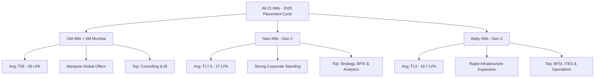
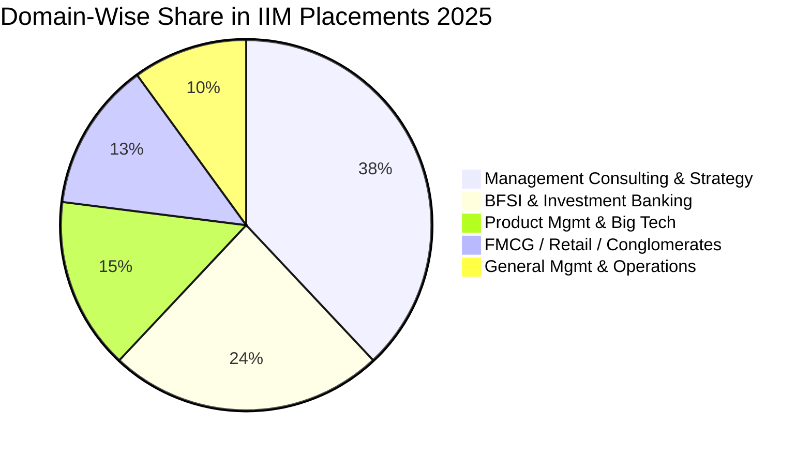

The **Indian Institutes of Management (IIMs)** have concluded their recent placement cycle for the graduating batch of 2025. Despite broader global macroeconomic fluctuations and cautious tech hiring worldwide, the 21 IIMs once again reinforced their position as India's premier executive talent incubators.

From the pinnacle of the **[IIM BLACKI](/blog/what-is-iim-blacki-complete-guide-2026)** elite campuses to the rapid growth of **New and [Baby IIMs](/blog/baby-iims-review-2026-honest-analysis)**, the 2025 placement season highlighted clear structural trends: strong demand for management consultants, robust recruitment from bulge-bracket investment banks, and an increasing salary benchmark across newer campuses.

In this definitive guide, we provide a complete, verified analysis of the **All IIM Recent Placement Report 2025**—covering college-wise average CTCs, median packages, highest international/domestic offers, lowest base salaries, top recruiters, and ROI metrics.

---

[InquiryCard title="Evaluating IIMs or Top B-Schools for Your Profile?" description="Get personalized CAT percentile mapping, college selection advice, and MBA admissions guidance from Mohit Jain." cta="Get Free Career Counselling" type="admission"]

---

## 1. Master Summary: All 21 IIMs Placement Report 2025

Below is the consolidated placement comparison table for **all 21 Indian Institutes of Management** for the 2025 graduating MBA/PGP batches:

| Institute | Tier / Generation | Average Package (CTC) | Median Package | Highest Package (Reported) | Top Recruiting Sector |
| :--- | :--- | :--- | :--- | :--- | :--- |
| **[IIM Ahmedabad](/colleges/iim-ahmedabad)** | Old / Top-Tier | **₹34.45 LPA** | ₹31.50 LPA | ₹1.10 Cr (Domestic) | Management Consulting |
| **[IIM Bangalore](/colleges/iim-bangalore)** | Old / Top-Tier | **₹34.88 LPA** | ₹32.00 LPA | ₹1.15+ Cr (Intl) | Consulting & Tech |
| **[IIM Calcutta](/colleges/iim-calcutta)** | Old / Top-Tier | **₹34.23 LPA** | ₹31.20 LPA | **₹1.45 Cr (Intl)** | BFSI & Investment Banking |
| **IIM Lucknow** | Old / Top-Tier | **₹32.30 LPA** | ₹30.00 LPA | ₹1.00 Cr | Consulting & Gen Management |
| **IIM Mumbai (NITIE)** | Old / Elite | **₹31.00 – 34.50 LPA** | ₹29.50 LPA | ₹71.40 LPA | Supply Chain, Ops & Fin |
| **IIM Indore** | Old / Top-Tier | **₹29.75 LPA** | ₹27.20 LPA | ₹70.00 LPA | Consulting, Sales & Marketing |
| **IIM Kozhikode** | Old / Top-Tier | **₹28.18 LPA** | ₹26.50 LPA | ₹81.00 LPA | Consulting & BFSI |
| **IIM Shillong** | New / Gen-2 | **₹27.03 LPA** | ₹25.00 LPA | ₹71.50 LPA | Strategy, Consulting & IT |
| **IIM Rohtak** | New / Gen-2 | **₹20.03 LPA** | ₹18.80 LPA | ₹48.20 LPA | Consulting & Analytics |
| **IIM Ranchi** | New / Gen-2 | **₹19.29 LPA** | ₹17.50 LPA | ₹37.80 LPA | BFSI, HR & Marketing |
| **IIM Trichy** | New / Gen-2 | **₹19.27 LPA** | ₹18.20 LPA | ₹41.60 LPA | BFSI & Consulting |
| **IIM Raipur** | New / Gen-2 | **₹18.80 LPA** | ₹17.50 LPA | ₹43.40 LPA | IT/ITES & Operations |
| **IIM Udaipur** | New / Gen-2 | **₹17.58 LPA** | ₹16.50 LPA | ₹47.00 LPA | Consulting & Analytics |
| **IIM Kashipur** | New / Gen-2 | **₹15.04 – 18.10 LPA** | ₹15.20 LPA | ₹37.00 LPA | Operations & Analytics |
| **IIM Amritsar** | Baby / Gen-3 | **₹19.73 LPA** | ₹17.00 LPA | ₹58.52 LPA (Intl) / ₹28 LPA | BFSI, IT & Consulting |
| **IIM Nagpur** | Baby / Gen-3 | **₹18.07 LPA** | ₹16.80 LPA | ₹69.57 LPA | IT/ITES & Strategy |
| **IIM Visakhapatnam** | Baby / Gen-3 | **₹16.40 LPA** | ₹15.50 LPA | ₹32.50 LPA | BFSI & Consulting |
| **IIM Jammu** | Baby / Gen-3 | **₹16.00+ LPA** | ₹15.80 LPA | ₹32.00 LPA | Marketing & BFSI |
| **IIM Sambalpur** | Baby / Gen-3 | **₹15.65 LPA** | ₹14.50 LPA | ₹48.60 LPA | BFSI & IT/ITES |
| **IIM Bodh Gaya** | Baby / Gen-3 | **₹13.10 – 15.80 LPA** | ₹13.00 LPA | ₹22.00 – 30.50 LPA | Banking, Finance & Sales |
| **IIM Sirmaur** | Baby / Gen-3 | **₹13.30 – 14.50 LPA** | ₹12.50 LPA | ₹28.00 LPA | General Management & Ops |

> [!NOTE]
> **Understanding Audit Standards & CTC Variance**: Institutes like [IIM Ahmedabad](/colleges/iim-ahmedabad) and IIM Udaipur follow Indian Placement Reporting Standards (IPRS), providing audited reports with distinct fixed basic salaries, performance bonuses, and guaranteed cash components. In contrast, non-IPRS figures reflect total cost-to-company (CTC).

---

## 2. Cluster Breakdown & In-Depth Analysis

### A. Old IIMs (IIM BLACKI & IIM Mumbai): The Gold Standard

The top tier of Indian management education demonstrated immense placement power, capturing virtually all high-profile global investment banking and front-end strategy roles.

1. **[IIM Ahmedabad](/colleges/iim-ahmedabad)**:
   - **Average CTC**: ₹34.45 LPA | **Median CTC**: ₹31.50 LPA
   - **Highest Domestic Offer**: ₹1.10 Crore per annum
   - **Key Highlights**: Over 38% of the batch secured offers in Management Consulting. Top recruiters included McKinsey & Company, Boston Consulting Group (BCG), Bain & Company, Oliver Wyman, and Kearney.
2. **[IIM Bangalore](/colleges/iim-bangalore)**:
   - **Average CTC**: ₹34.88 LPA | **Median CTC**: ₹32.00 LPA
   - **Key Highlights**: Saw an exceptional pre-placement offer (PPO) conversion rate of over 45%. Major recruiters included Accenture Strategy, Bain, BCG, Microsoft, Amazon, and Goldman Sachs.
3. **[IIM Calcutta](/colleges/iim-calcutta)**:
   - **Average CTC**: ₹34.23 LPA | **Median CTC**: ₹31.20 LPA
   - **Highest International Package**: **₹1.45 Crore per annum**
   - **Key Highlights**: Retained its undisputed reputation as the **Finance Capital of Indian B-Schools**. Over 32% of offers came from bulge-bracket investment banks, private equity, and hedge funds including Avendus Capital, Barclays, Citi, Goldman Sachs, and JP Morgan Chase.
4. **IIM Lucknow & IIM Mumbai**:
   - **IIM Lucknow** averaged **₹32.30 LPA**, with top 25% students averaging **₹44+ LPA**.
   - **IIM Mumbai (NITIE)** achieved an average of **₹34.50 LPA** for its top 50% students and ₹31.00 LPA overall, solidifying its spot as the #1 destination for Supply Chain, Industrial Management, and Technology leadership.
5. **IIM Indore & IIM Kozhikode**:
   - **IIM Kozhikode** reached **₹28.18 LPA** with a highest package of ₹81.00 LPA, supported by leading FMCG and consulting recruiters.
   - **IIM Indore** averaged **₹29.75 LPA**, with 150+ recruiters extending offers across BFSI, IT, and Brand Management.

---

### B. New IIMs (Gen-2): High Stability & Corporate Trust

Established between 2007 and 2011, New IIMs have achieved campus maturity and deep corporate recruitment ties.

*   **IIM Shillong**: The clear outlier among second-generation IIMs, recording an outstanding average package of **₹27.03 LPA** and a highest package of **₹71.50 LPA**. Its strategic location and international partnerships have driven immense recruiter preference.
*   **IIM Rohtak**: Recorded an average of **₹20.03 LPA** with a 100% placement record across its 400+ student cohort.
*   **IIM Ranchi & IIM Trichy**: Recorded solid average CTCs of **₹19.29 LPA** and **₹19.27 LPA** respectively, with heavy recruitment from ICICI Bank, KPMG, Deloitte, HSBC, and Wells Fargo.
*   **IIM Raipur & IIM Udaipur**: Maintained steady averages of **₹18.80 LPA** and **₹17.58 LPA**, with Udaipur being praised for its strictly audited transparent IPRS placement reports.

---

### C. Baby IIMs (Gen-3): The Fast-Growing Contenders

Established between 2015 and 2016, Baby IIMs are outperforming numerous legacy private business schools:

*   **IIM Amritsar**: The standout performer in Gen-3, clocking an impressive average CTC of **₹19.73 LPA** alongside a top international offer of **₹58.52 LPA**.
*   **IIM Nagpur**: Recorded **₹18.07 LPA** average (up from ₹16.29 LPA in 2024) with a highest CTC of **₹69.57 LPA** and 4 international offers on its state-of-the-art MIHAN campus.
*   **IIM Visakhapatnam & IIM Jammu**: Achieved average packages of **₹16.40 LPA** and **₹16.00+ LPA** respectively, backed by brand new permanent campuses and rising recruiters in IT/ITES and Fintech.
*   **IIM Sambalpur, Bodh Gaya & Sirmaur**: Maintained healthy salary brackets between **₹13.10 LPA and ₹15.65 LPA**, providing high return on investment for students scoring in the 91–94 CAT percentile bracket.

---

## 3. Sector-Wise Placement Analysis 2025

Where are IIM graduates getting hired? Below is the aggregated domain distribution across the 2025 placement cycle:

### 1. Management Consulting & Strategy (38% Share)
Consulting maintained its status as the most coveted domain across Old and New IIMs.
*   **Top Recruiters**: McKinsey, BCG, Bain & Co, Kearney, Strategy&, Accenture Strategy, PwC, EY-Parthenon, KPMG, Deloitte USI, Roland Berger.
*   **Average Package**: ₹32.00 – 38.50 LPA at Old IIMs; ₹20.00 – 24.00 LPA at New IIMs.

### 2. Banking, Financial Services & Insurance - BFSI (24% Share)
High-stakes financial roles witnessed intense competition.
*   **Top Recruiters**: Goldman Sachs, JP Morgan Chase, Morgan Stanley, Avendus Capital, Citibank, Standard Chartered, HSBC, HDFC Bank, Axis Capital, ICICI Bank.
*   **Roles Offered**: Private Equity Analyst, Front-End Investment Banking, Equity Research, Wealth Management, Risk Advisory.

### 3. Product Management & Big Tech (15% Share)
Despite industry hiring rationalization, top tech and product companies recruited for leadership tracks.
*   **Top Recruiters**: Microsoft, Amazon, Google, Adobe, Cisco, Uber, Media.net, Samsung, Flipkart.
*   **Roles Offered**: Technical Product Manager (TPM), Program Manager, Growth Lead, Business Development.

### 4. FMCG, Consumer Durables & Conglomerates (13% Share)
*   **Top Recruiters**: Hindustan Unilever Limited (HUL), Procter & Gamble (P&G), ITC Limited, Nestlé, Mondelez, Tata Administrative Services (TAS), Aditya Birla Group (ABG), Mahindra GMC.
*   **Roles Offered**: Brand Manager, Management Trainee (MT), Supply Chain Leader, Territory Sales Manager.

---

## 4. ROI Matrix: Fees vs Average Placement Package

When selecting an IIM, comparing the total 2-year investment against the post-MBA earning potential is critical:

| Institute Tier | Approx. 2-Year Total Fees | Average Starting CTC (2025) | Estimated Payback Period |
| :--- | :--- | :--- | :--- |
| **Old IIMs (A, B, C, L, K, I)** | ₹21.0 – 30.0 Lakhs | **₹28.0 – 35.0 LPA** | 10 to 14 Months |
| **IIM Mumbai** | ₹21.0 – 22.5 Lakhs | **₹31.0 – 34.5 LPA** | 9 to 12 Months |
| **New IIMs (Shillong, Rohtak, etc.)** | ₹17.5 – 21.0 Lakhs | **₹17.5 – 27.0 LPA** | 12 to 18 Months |
| **Baby IIMs (Nagpur, Amritsar, etc.)**| ₹16.0 – 18.5 Lakhs | **₹13.5 – 19.7 LPA** | 14 to 22 Months |

---

## 5. What This Means for CAT Aspirants

1. **Brand Resilience**: Even during economic slowdowns, IIM average packages did not drop drastically, demonstrating strong recruiter retention.
2. **Growth in Baby IIMs**: Campuses like **IIM Amritsar** and **IIM Nagpur** are now directly competing with and outperforming several older tier-2 private B-schools in both salary averages and recruiter diversity.
3. **Specialization Demand**: Operations, Analytics, and FinTech domains saw increased hiring, giving candidates with technical or domain-specific backgrounds a distinct edge.
4. **Targeting the Right CAT Percentile**: Aspirants should target **99+ percentile** for Old IIMs, **95-98 percentile** for New IIMs, and **91-95 percentile** for Baby IIMs to maximize their conversion chances.

---

## Related Guides & Resources

*   **[All About IIM Colleges: Fees, Placements & Selection Criteria 2026](/blog/all-about-iim-colleges-placements-fees-selection-2026)**
*   **[All IIM Cut Off 2026-28: CAT Expected & Final Percentiles](/blog/all-iim-cut-off-2026-28-admission-mba-pgdm)**
*   **[What is IIM BLACKI? Complete Guide](/blog/what-is-iim-blacki-complete-guide-2026)**
*   **[Baby IIMs Review 2026: Honest Pros & Cons Analysis](/blog/baby-iims-review-2026-honest-analysis)**
*   **[Top 10 High-Yield CAT Topics (VARC, DILR, QA)](/blog/top-10-high-yield-cat-topics-2026-varc-dilr-qa)**

---

### 🚀 Boost Your Preparation

Looking for more resources? **[Explore Our Premium MBA Mock Test Series 2026](/mock-tests)** to get real-time exam experience and detailed performance analytics.

---
