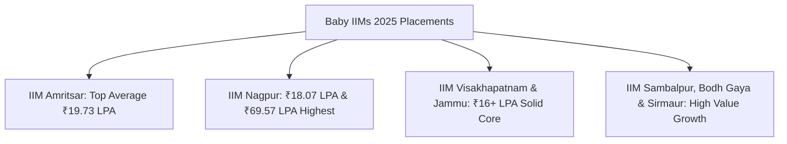

Established between 2015 and 2016 under the **IIM Act, 2017**, the **Baby IIMs**—comprising **IIM Nagpur, IIM Amritsar, IIM Visakhapatnam (Vizag), IIM Sambalpur, IIM Jammu, IIM Bodh Gaya, and IIM Sirmaur**—have completed nearly a decade of institutional existence.

The **2025 placement reports** from these third-generation IIMs demonstrate impressive upward mobility. With permanent campuses operational, rapidly expanding corporate alumni networks, and lower tuition costs than comparable private B-schools, Baby IIMs are no longer emerging experiments—they are established Tier-1.5 powerhouses.

In this detailed report, we break down the **Baby IIMs Placement Report 2025**, analyzing average CTCs, top offers, lowest package safety nets, and return on investment (ROI).

---

[InquiryCard title="Choosing Between Baby IIMs and Top Private Colleges?" description="Get unbiased college comparison, fee-to-salary ROI mapping, and direct admission counselling from Mohit Jain." cta="Get Free Counselling" type="admission"]

---

## 1. Baby IIMs Placement Statistics 2025: Complete Overview

Below is the comparative breakdown of all 7 Baby IIMs for the graduating class of 2025:

| Institute | Est. Year | Average Package (CTC) | Median Package | Highest Package (Reported) | 2-Year Total Fees |
| :--- | :--- | :--- | :--- | :--- | :--- |
| **IIM Amritsar** | 2015 | **₹19.73 LPA** | ₹17.00 LPA | **₹58.52 LPA (Intl)** / ₹28 LPA | ₹17.6 – 18.5 Lakhs |
| **IIM Nagpur** | 2015 | **₹18.07 LPA** | ₹16.80 LPA | **₹69.57 LPA** | ₹17.4 – 18.5 Lakhs |
| **IIM Visakhapatnam** | 2015 | **₹16.40 LPA** | ₹15.50 LPA | ₹32.50 LPA | ₹17.2 – 18.2 Lakhs |
| **IIM Jammu** | 2016 | **₹16.00+ LPA** | ₹15.80 LPA | ₹32.00 LPA | ₹18.0 – 19.0 Lakhs |
| **IIM Sambalpur** | 2015 | **₹15.65 LPA** | ₹14.50 LPA | ₹48.60 LPA | ₹17.5 – 18.5 Lakhs |
| **IIM Bodh Gaya** | 2015 | **₹13.10 – 15.80 LPA** | ₹13.00 LPA | ₹22.00 – 30.50 LPA | ₹17.0 – 18.0 Lakhs |
| **IIM Sirmaur** | 2015 | **₹13.30 – 14.50 LPA** | ₹12.50 LPA | ₹28.00 LPA | ₹17.0 – 18.0 Lakhs |

---

## 2. In-Depth Campus Highlights: 2025 Placement Cycle

### 1. IIM Amritsar: The Outperformer
*   **Average Salary**: ₹19.73 LPA | **Highest International Package**: ₹58.52 LPA
*   **Performance Surge**: IIM Amritsar recorded strong recruitment across both its General MBA and specialized MBA in Business Analytics (MBA-BA) & MBA-HR programs.
*   **Key Recruiters**: Accenture, Amazon, BNY Mellon, Deloitte, ICICI Bank, Infosys, Kotak Mahindra, and PwC.

### 2. IIM Nagpur: The MIHAN Advantage
*   **Average Salary**: ₹18.07 LPA (significant increase from ₹16.29 LPA in 2024)
*   **Highest Salary**: ₹69.57 LPA (4 international offers)
*   **Strategic Location**: Situated within the MIHAN SEZ multi-modal industrial hub, IIM Nagpur leveraged strong regional corporate integration for high-paying strategy and supply chain roles.

### 3. IIM Visakhapatnam (IIM Vizag)
*   **Average Salary**: ₹16.40 LPA | **Median Salary**: ₹15.50 LPA
*   **Highlights**: Located on its world-class permanent Gambheeram campus, IIM Vizag witnessed heavy recruitment in IT/ITES (33%), BFSI (28%), and Consulting (21%).

### 4. IIM Jammu, Sambalpur, Bodh Gaya & Sirmaur
*   **IIM Jammu**: Recorded average compensation exceeding ₹16.00 LPA, with its newly expanded permanent campus attracting over 120 recruiters.
*   **IIM Sambalpur**: Achieved a high offer of ₹48.60 LPA and an average of ₹15.65 LPA, championing digital innovation and sustainability consulting.
*   **IIM Bodh Gaya & Sirmaur**: Delivered steady salary floors with median CTCs around ₹13.00 LPA and lowest package protection around ₹10.5–11.5 LPA.

---

## 3. Baby IIMs vs. Top Private B-Schools: The Real Comparison

A critical dilemma for CAT test-takers with 90–96 percentiles is whether to choose a Baby IIM or an established private B-school (e.g., [NMIMS Mumbai](/colleges/nmims-mumbai), [SIBM Pune](/colleges/sibm-pune), TAPMI, GIM Goa, FORE Delhi).

| Feature / Metric | Baby IIMs (Nagpur, Amritsar, Vizag, etc.) | Top Private B-Schools (NMIMS, SIBM, TAPMI) |
| :--- | :--- | :--- |
| **Degree Awarded** | **Master of Business Administration (MBA)** under IIM Act | MBA (Deemed Univ) or PGDM (AICTE Diploma) |
| **Total 2-Year Fees** | **₹16.0 – 18.5 Lakhs** (All Inclusive) | ₹22.0 – 28.0 Lakhs (+ High City Living Expenses) |
| **Average CTC (2025)** | **₹15.5 – 19.7 LPA** | ₹14.5 – 21.0 LPA |
| **Batch Size Pressure** | Manageable (~250 – 350 students) | High competition (600 – 800+ students in some) |
| **Alumni Network Equity** | **IIM Pan-India Alumni Ecosystem** | Institutional-Specific Alumni Network |
| **Educational Loans** | 100% Collateral-Free Subsidized Loans | Standard Education Loan Rates |

> [!TIP]
> **Verdict**: For candidates looking for long-term career growth, a globally recognized statutory degree, and lower debt burden, **Baby IIMs offer superior return on investment (ROI)** over expensive private institutions.

---

## 4. Summary & Actionable Advice

1. **Aim for 92–95 Percentile**: To secure calls from Baby IIMs through the Common Admission Process (CAP), target an overall CAT percentile above 92, with balanced 75+ sectional percentiles.
2. **Explore Specialized Tracks**: Programs like MBA-BA at IIM Amritsar or MBA-Analytics at IIM Kashipur often see higher median starting salaries.
3. **Check the Complete 21 IIMs Report**: Read our **[All IIM Recent Placement Report 2025](/blog/all-iim-recent-placement-report-2025)** for the national benchmark.
4. **Evaluate Cutoffs**: Read our **[All IIM Cut Off 2026-28 Analysis](/blog/all-iim-cut-off-2026-28-admission-mba-pgdm)** to plan your prep.

---

### 🚀 Boost Your Preparation

Looking for more resources? **[Explore Our Premium MBA Mock Test Series 2026](/mock-tests)** to get real-time exam experience and detailed performance analytics.

---
