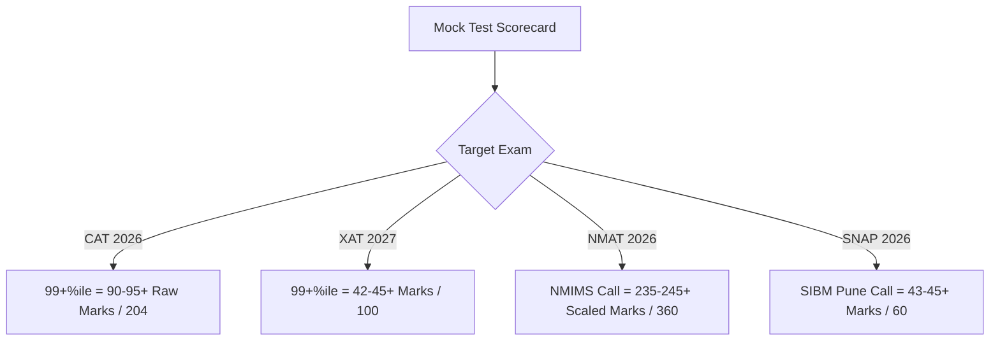

# Best Mock Tests for MBA Entrance Exams 2026: CAT, NMAT, XAT & SNAP Test Series Compared

For every MBA aspirant targeting India’s premier business schools—from **IIM Ahmedabad, IIM Bangalore, and XLRI Jamshedpur** to **NMIMS Mumbai and SIBM Pune**—the mock test series is the single most critical asset in your preparation arsenal. 

Solving textbook questions builds conceptual knowledge, but **mock tests build exam temperament, speed, accuracy, and strategic question selection under timed pressure**. However, each management entrance exam has a distinct personality:

* **CAT** tests intellectual stamina, question elimination, and conceptual depth across 3 non-switchable 40-minute sections.
* **XAT** challenges critical thinking through multi-faceted Decision Making, complex Reading Comprehensions, and penalty-linked unattempted questions.
* **NMAT by GMAC** evaluates speed and accuracy in an adaptive, no-negative-marking environment with candidate-chosen section order.
* **SNAP** is a high-speed sprint testing your ability to solve 60 questions in just 60 minutes with zero sectional time limits.

In this comprehensive guide, we compare the **best mock test providers for CAT, NMAT, XAT, and SNAP 2026**, break down their features, evaluate free vs. paid options, and explain how to extract maximum ROI from every test you take.

---

> 🎯 **Benchmark your MBA prep right now with 100% Free Full-Length CBT Mocks:**
>
> * [👉 **Take Free CAT 2026 CBT Mock Test (68 Qs | 120 Mins)**](https://www.careerwithmohit.online/tools/cat-mock-test)
> * [👉 **Take Free XAT 2027 CBT Mock Test (Decision Making & DM Predictor)**](https://www.careerwithmohit.online/tools/mock-test/xat/)
> * [👉 **Take Free NMAT 2026 Full Practice Exam (NMIMS Predictor)**](https://www.careerwithmohit.online/tools/nmat-mock-test)
> * [👉 **Take Free SNAP 2026 60-Min Speed Mock Test (SIBM Pune Predictor)**](https://www.careerwithmohit.online/tools/mock-test/snap/)
>
> *No credit card or login barriers — Instant AI Scorecard, Sectional Analytics, & Call Benchmarks.*

---

## Master Comparison: CAT vs. XAT vs. NMAT vs. SNAP Mock Test Dynamics

Before selecting a mock test package, understand the structural differences across all four entrance exams:

| Parameter | CAT 2026 | XAT 2027 | NMAT 2026 | SNAP 2026 |
| :--- | :--- | :--- | :--- | :--- |
| **Total Duration** | 120 Minutes (2 Hours) | 210 Minutes (3.5 Hours) | 120 Minutes (2 Hours) | 60 Minutes (1 Hour) |
| **Total Questions** | 66 – 68 Questions | 95 – 100 Questions + Essay | 108 Questions | 60 Questions |
| **Sectional Timers** | 40 mins/section (Strict) | Part 1 (175 mins) + Part 2 (35 mins) | Custom Section Timers (28–52 mins) | **None** (Free Section Switching) |
| **Negative Marking** | +3 / -1 (MCQs), 0 (TITA) | +1 / -0.25 (MCQs), -0.10 for >8 unattempted | **No Negative Marking** | +1 / -0.25 |
| **On-Screen Calculator** | Yes (Scientific/Basic) | Yes (Part 1 Only) | **No Calculator** | **No Calculator** |
| **Core Skill Tested** | Question Filtering & Stamina | Analytical Judgment & Ethics | Speed, Mental Math & Accuracy | Rapid Spotting & 1-Min Problem Solving |
| **Ideal Mock Count** | 25 – 35 Full Mocks | 15 – 20 Full Mocks | 10 – 15 Full Mocks | 20 – 30 Full Mocks |

---

## 1. Best Mock Tests for CAT 2026 (Common Admission Test)

The **Common Admission Test (CAT)** is taken by over 3.3 lakh aspirants targeting the 21 IIMs, [FMS Delhi](/colleges/fms-delhi), [SPJIMR Mumbai](/colleges/spjimr-mumbai), MDI Gurgaon, and IIT Management Departments. 

### What Makes a Great CAT Mock Test?
1. **Unpredictable DILR Sets:** CAT DILR has shifted toward unconventional logic-based puzzles, scheduling matrices, and games/tournaments rather than standard DI bar charts.
2. **Authentic VARC Passage Tone:** Passages must reflect philosophy, sociology, art history, and ecology, with nuanced inference-based question options (eliminating close 50-50 traps).
3. **Realistic Percentile Scaling:** A mock series with tens of thousands of serious test-takers ensures your projected percentile accurately mirrors actual D-Day performance.

### Top CAT Mock Test Providers Reviewed

#### A. CareerWithMohit Free CAT 2026 CBT Simulation
* **Best For:** Instant realistic diagnostic benchmark, full CBT interface practice, and instant IIM call prediction.
* **Format:** Full 68-question simulation across VARC (24 Qs), DILR (22 Qs), and QA (22 Qs) with 40-minute locked timers and an on-screen calculator.
* **Standout Advantage:** 100% Free with zero paywalls. Instant AI Scorecard benchmarks raw scores against historic IIM Ahmedabad, Bangalore, Calcutta, Lucknow, and FMS cutoffs.
* **Direct Access:** [Attempt Free CAT CBT Mock Test Now](/tools/cat-mock-test).

#### B. IMS SimCAT
* **Best For:** Flawless user interface, realistic VARC passages, and comprehensive video solutions.
* **Key Features:** Provides proctored (Take-Home / Center-Based) SimCATs and unproctored Take-Home Mocks with detailed percentile analytics and AI-powered strength/weakness heatmaps.
* **Price Range:** ₹6,000 – ₹10,000 (depending on package).

#### C. TIME AIMCAT
* **Best For:** Highest difficulty level and largest national test-taker pool.
* **Key Features:** AIMCATs are historically renowned for pushing candidates beyond their comfort zone, particularly in Quantitative Aptitude and complex DILR caselets.
* **Price Range:** ₹6,500 – ₹11,000.

#### D. Career Launcher (CL) Prime CAT Mocks
* **Best For:** Accurate CAT-level difficulty calibration and balanced sectional distribution.
* **Key Features:** Features the Countdown CAT (CDC) series with video analytics by GP, CL Toppers, and Gejo.

---

## 2. Best Mock Tests for XAT 2027 (Xavier Aptitude Test)

The **Xavier Aptitude Test (XAT)**, conducted by XLRI Jamshedpur, is the gateway to [XLRI Jamshedpur & Delhi-NCR](/blog/all-about-xlri-jamshedpur), XIMB Bhubaneswar, IMT Ghaziabad, GIM Goa, and TAPMI Manipal.

### What Makes a Great XAT Mock Test?
1. **Decision Making (DM) Section Rigor:** Decision Making is exclusive to XAT. High-quality mocks present complex business case studies, managerial ethics conflicts, and multi-stakeholder trade-offs with logical, non-ambiguous answer keys.
2. **Heavy-Text Verbal & Logical Ability (VALR):** Critical reasoning, poem comprehension, and dense vocabulary-infused passages.
3. **Unattempted Question Penalty Engine:** Simulating the -0.10 mark deduction for leaving more than 8 consecutive questions unattempted.

### Top Recommended XAT Test Series
* **[CareerWithMohit Free XAT Mock Test Tool](/tools/mock-test/xat/):** Features authentic Decision Making scenarios, Data Interpretation caselets, and instant XLRI percentile projections.
* **XLRI Official Past Mock Papers:** Must-solve 10 years of actual XAT previous year papers (2016–2026) to calibrate your mindset to XLRI’s evaluation philosophy.
* **Cracku XAT Mocks & IMS SimXAT:** Excellent Decision Making sectional practice with detailed video rationales.

---

## 3. Best Mock Tests for NMAT 2026 (NMAT by GMAC)

The **NMAT by GMAC** is the primary entrance test for [NMIMS Mumbai (SBM)](/blog/all-about-nmims-mumbai), K.J. Somaiya Institute of Management, TAPMI, XIM University (Rural), and SDA Bocconi Asia Center.

### What Makes a Great NMAT Mock Test?
1. **Computer-Adaptive Algorithm:** Questions dynamically adjust difficulty based on your previous answers.
2. **Section Timing Constraint:** 
   * Language Skills: 36 Questions in 28 Minutes (Fast reading required).
   * Quantitative Skills: 36 Questions in 52 Minutes (Modern Math & Arithmetic heavy).
   * Logical Reasoning: 36 Questions in 40 Minutes (Critical Reasoning & Coding-Decoding).
3. **Zero Negative Marking Strategy:** Mocks must train you to never leave any question unattempted before the countdown clock expires.

### Top Recommended NMAT Test Series
* **[CareerWithMohit NMAT CBT Practice Exam](/tools/nmat-mock-test):** Free full 108-question CBT format with instant scaled scoring (72–360 mark range) and NMIMS Mumbai cutoff benchmarking (235+ score benchmark).
* **Official GMAC NMAT Prep Mocks (Exam Pack 1 & 2):** Provides 2 free and 4 paid adaptive exams on the exact software engine used in testing centers.
* **Oliveboard & Cracku NMAT Series:** Excellent for sectional speed drills in Language Skills and Input-Output logic.

---

## 4. Best Mock Tests for SNAP 2026 (Symbiosis National Aptitude Test)

The **Symbiosis National Aptitude Test (SNAP)** is the gateway to 16 Symbiosis institutes, led by [SIBM Pune](/blog/all-about-sibm-pune), [SCMHRD Pune](/blog/all-about-scmhrd-pune), and SIBM Bangalore.

### What Makes a Great SNAP Mock Test?
1. **Strict 60-Minute Rapid-Fire Pressure:** Solving 60 questions in 60 minutes means you have an average of 60 seconds per question.
2. **No Sectional Time Limits:** Mocks must allow free movement between General English (15 Qs), Analytical & Logical Reasoning (25 Qs), and Quantitative/DI (20 Qs) to practice customized section-order strategies.
3. **Direct, Trick-Based Questions:** Syllogisms, clocks, calendars, blood relations, series completion, and arithmetic shortcuts.

### Top Recommended SNAP Test Series
* **[CareerWithMohit SNAP 60-Minute Speed CBT Mock](/tools/mock-test/snap/):** Instant timer simulation with +1 / -0.25 scoring, accuracy metrics, and SIBM Pune 98.5+%ile cutoff estimator.
* **IMS SimSNAP / TIME SNAP Test Series:** Great for high-intensity question spotting and negative-marking risk management.

---

## Score vs. Percentile Benchmarks Across All 4 Exams

Use these benchmark scores from our national mock analytics to evaluate your preparation levels:

### Realistic Cutoffs & Safe Scores

| Exam | Maximum Marks | Safe Score for Tier-1 B-Schools | Target Colleges & Cutoffs |
| :--- | :---: | :---: | :--- |
| **CAT 2026** | 204 | **85 – 95+ Marks (98.5+%ile)** | IIM Ahmedabad, IIM Bangalore, IIM Calcutta, FMS Delhi |
| **XAT 2027** | 100 | **38 – 42+ Marks (96+%ile)** | XLRI Jamshedpur BM (96%ile) & HRM (94%ile), XIMB |
| **NMAT 2026** | 360 | **235 – 245+ Scaled Score** | NMIMS Mumbai Core MBA (232+ with 70+ in each section) |
| **SNAP 2026** | 60 | **42 – 45+ Marks (98.5+%ile)** | SIBM Pune (98.5%ile), SCMHRD Pune (97.5%ile) |

---

## The 4-Step Scientific Mock Analysis Framework: The 1:2 Rule

Taking a mock test without deep post-exam analysis is like taking a medical diagnostic test and never reading the report. For every **1 hour spent taking a mock test, spend at least 2 hours analyzing it**.

Follow this **4-step diagnostic framework**:

### Step 1: Segregate Questions into 4 Quadrants
* **Quadrant 1: Correct & Fast (Mastery)** — You understood the concept and solved it within the standard time limit.
* **Quadrant 2: Correct but Slow (Efficiency Gap)** — You got the marks, but took 4–5 minutes on a 2-minute question. Look for shortcut methods or algebra-free logic.
* **Quadrant 3: Incorrect due to Silly Error / Misreading (Focus Gap)** — Calculation mistakes or misinterpreting "Which of the following is NOT true?". Maintain an **Error Log Diary**.
* **Quadrant 4: Incorrect / Unattempted due to Conceptual Blindspot (Knowledge Gap)** — Revisit the core concept before taking your next test.

### Step 2: Calculate Your "Potential Score"
Re-solve the entire mock paper untimed and without looking at solutions. 
$$\text{Potential Score} = \text{Marks Obtained} + \text{Marks Lost in Silly Mistakes} + \text{Solvable Unattempted Questions}$$
If your Actual Score is 52 and your Potential Score is 84, your issue is not lack of knowledge—it is **time management and anxiety control**.

### Step 3: Question Selection Strategy Audit
Review the questions you skipped versus the ones you attempted. Did you waste 6 minutes on an unsolvable geometry problem and miss 3 easy arithmetic questions at the end of the section? **In CAT and XAT, question selection accounts for 30% of your total percentile.**

### Step 4: Track Trajectory over Rolling 5-Mock Windows
Do not panic over a single low mock score. Track your average percentile across 5 consecutive mocks to gauge real progress.

---

## Recommended Free MBA Entrance Mock Test Tools & Resources

Start practicing immediately with our dedicated free mock tests, rank predictors, and college guides:

* 📊 [Free CAT 2026 Full-Length CBT Mock Test](/tools/cat-mock-test)
* 🧮 [CAT Score Calculator & Percentile Predictor 2026](/tools/cat-score-calculator)
* 🎯 [Free XAT 2027 CBT Mock Test with Decision Making](/tools/mock-test/xat/)
* ⚡ [Free NMAT 2026 Adaptive Practice Test](/tools/nmat-mock-test)
* ⏱️ [Free SNAP 2026 60-Minute Speed CBT Mock](/tools/mock-test/snap/)
* 🏛️ [Top IIM Admissions, Fees, and Cutoffs Guide 2026](/blog/all-about-iim-colleges-placements-fees-selection-2026)
* 💡 [10 Proven Tips to Crack CAT 2026 from Toppers](/blog/10-tips-to-crack-cat-exam-2026)
* 📚 [All About Non-CAT OMETs Guide 2026](/blog/all-about-omets-mba-entrance-exams-2026)

---

## ❓ Frequently Asked Questions (FAQ)

### Which mock test series is closest to the actual CAT exam?
The best CAT mock series replicate the unpredictable difficulty of DILR, the nuanced tone of VARC, and the arithmetic/algebra balance of Quant. Combining an authentic free CBT simulation (such as [CareerWithMohit Free CAT Mock](/tools/cat-mock-test)) with premium series like IMS SimCAT or TIME AIMCAT gives the most realistic percentile benchmarking.

### How many mock tests should I take for CAT, XAT, NMAT, and SNAP?
For CAT, aim for 25–35 full-length mocks; for XAT, 15–20 mocks (with special focus on Decision Making); for NMAT, 10–15 adaptive mocks; and for SNAP, 20–30 high-speed 60-minute tests.

### Are free online MBA mock tests reliable?
Yes, provided they offer official CBT interfaces, authentic marking schemes (+3/-1 for CAT, +1/-0.25 for XAT, +1/-0.25 for SNAP, and non-adaptive/adaptive scales for NMAT), sectional timers, and comprehensive step-by-step solutions.

### How do I choose between CAT mocks and OMET (XAT, NMAT, SNAP) mocks?
CAT mocks prioritize deep problem-solving stamina and question filtering over 120 minutes. NMAT and SNAP mocks focus on speed-accuracy trade-offs without negative marking or tight 60-minute clocks. XAT mocks emphasize ethical Decision Making and multi-step reasoning.

---

### 🚀 Boost Your Preparation

Looking for more resources? **[Explore Our Premium MBA Mock Test Series 2026](/mock-tests)** to get real-time exam experience and detailed performance analytics.

---
