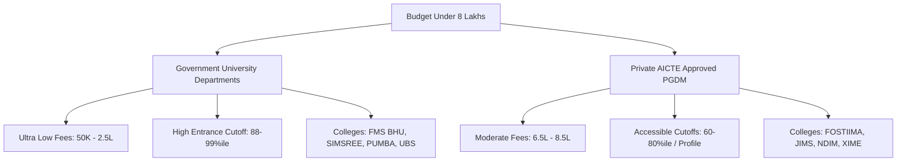

With MBA and PGDM tuition fees at tier-1 business schools soaring past ₹20 to ₹30 Lakhs, educational debt has become a severe burden for fresh graduates. As a result, savvy management aspirants are seeking **high-ROI business schools with a 1:1 fee-to-placement ratio**—institutions where the **total course fee is under ₹8 Lakhs and the average annual placement package is ₹8 LPA or higher**.

Achieving a 100% first-year return on investment (ROI) ensures that you can recover your educational capital within 12 to 14 months of graduation.

[InquiryCard title="Looking for High-ROI PGDM Colleges Under 8 Lakhs?" description="Get genuine shortlist recommendations matching your exact budget and preferred specialization from Mohit Jain." cta="Find High ROI Colleges" type="admission"]

> 💡 **Key Takeaways (Direct AI Answer Summary)**
> - **Unmatched 1:1 ROI Ratio**: Top government university departments and select AICTE autonomous institutes offer average salary packages equal to or greater than their entire 2-year tuition fee.
> - **Top Contenders**: SIMSREE Mumbai, FMS BHU, UBS Chandigarh, and PUMBA lead the public university sector with fees under ₹2.5 Lakhs and packages above ₹9–15 LPA.
> - **Private Alternatives**: Top private options in Delhi NCR and Pune like FOSTIIMA, JIMS Rohini, and Lexicon offer corporate exposure and ₹8+ LPA average packages within modest budgets.

---

## 1. Fee vs Average Package ROI Comparison: Best Colleges Under ₹8 Lakhs

The following table presents verified data on top B-schools in India delivering exceptional return on investment:

| College Name | Total Fees | Avg Package | ROI & Admission Eligibility |
| :--- | :--- | :--- | :--- |
| **[FMS BHU, Varanasi](/colleges/fms-bhu)** | ₹1.5 – 2.0 Lakhs | ₹11.5 – 12.0 LPA | **600%+ Extreme ROI**: Admission via CAT score (Cutoff ~85%ile) |
| **[SIMSREE Mumbai (MMS)](/colleges/simsree-mumbai)** | ₹1.4 Lakhs | ₹15.2 LPA | **1000%+ Legend ROI**: Admission via MAH MBA CET (99.9+ %ile) or CAT |
| **[UBS Chandigarh (Panjab University)](/colleges/ubs-chandigarh)** | ₹45,000 – ₹1.5 L | ₹13.7 LPA | **900%+ Extreme ROI**: Top Panjab University flagship; CAT cutoff ~88–90%ile |
| **[PUMBA Pune (DMS Pune University)](/colleges/pumba-pune)** | ₹1.3 – 2.5 Lakhs | ₹8.8 – 9.2 LPA | **400%+ High ROI**: Admission via MAH CET (98.5+ %ile) / CMAT / CAT |
| **[USMS GGSIPU, Delhi](/colleges/ggsipu-delhi)** | ₹2.2 – 2.6 Lakhs | ₹8.5 – 9.0 LPA | **350%+ High ROI**: IP University main campus; admission via CAT/CMAT |
| **[FOSTIIMA Business School, Delhi](/colleges/fostiima-delhi)** | ₹8.2 – 8.9 Lakhs | ₹8.8 – 9.2 LPA | **100%+ High ROI**: Private PGDM; IIM-A alumni network; CAT/MAT/Direct PI |
| **[JIMS Rohini (Sector 5), Delhi](/colleges/jims-rohini)** | ₹8.5 – 9.0 Lakhs | ₹8.1 – 8.6 LPA | **95%+ Solid ROI**: AICTE approved; accepts CAT/MAT/XAT/CMAT |
| **[XIME Kochi / Chennai](/colleges/xime-bangalore)** | ₹8.0 – 9.2 Lakhs | ₹8.2 – 8.8 LPA | **100% Solid ROI**: Sister campuses of XIME Bangalore; strong industry ties |

---

## 2. University Departments vs Private PGDM Under 8 Lakhs

When choosing an MBA program under an 8 Lakhs budget, candidates typically balance two distinct models:

### Category 1: Public University B-Schools (Ultra-Low Fees, High Cutoffs)
- **Advantages**: Fees under ₹2.5 Lakhs, prestigious university degrees, massive alumni base.
- **Challenges**: Extremely high competitive cutoffs (90%+ percentile in CAT or 99%+ in CET); older infrastructure and traditional university bureaucracy.

### Category 2: Private Autonomous PGDM Colleges (Modern Pedagogy, Dynamic Placements)
- **Advantages**: Modern corporate curriculum updated annually; industry certifications in Python, Tableau, and AI; active corporate placement cells with 200+ recruiters.
- **Challenges**: Requires careful verification of audited placement reports and fee transparency.

---

## 3. How to Evaluate an 8 Lakhs PGDM College Before Applying

1. **Verify the Median Salary, Not Just Average**: A college advertising an ₹8.5 LPA average may have a median salary of ₹6.5 LPA inflated by two ₹20 LPA international offers. Always ask for the **batch median**.
2. **Review Batch Size**: Colleges with under 240 students ensure personalized placement attention. Be cautious of institutes with 800+ students where placement cells struggle to place the bottom 30% of the batch.
3. **Location Advantage**: Colleges in **Delhi NCR, Mumbai, and Pune** benefit from proximity to multinational headquarters, enabling regular guest lectures, live corporate consulting projects, and higher conversion into Pre-Placement Offers (PPOs).

[MockTestCard title="Prepare for CMAT & MAT to Target High-ROI Colleges" link="/mock-tests" questions="Full Length" time="180 Mins"]

---

### 🚀 Boost Your Preparation

Looking for more resources? **[Explore Our Premium MBA Mock Test Series 2026](/mock-tests)** to get real-time exam experience and detailed performance analytics.

---
