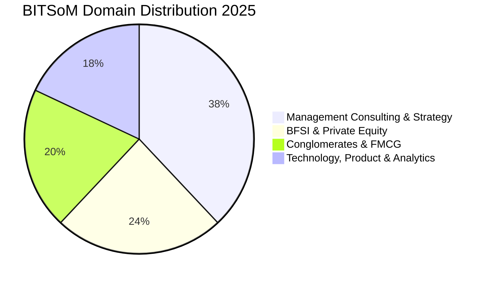

Backed by the 60-year legacy of BITS Pilani and the Aditya Birla Group, the **BITS School of Management (BITSoM), Mumbai** has rapidly emerged as India's most successful new-age business school.

The **2025 MBA placement report**, independently audited by Brickwork Analytics, confirmed an average CTC of **₹21.00 LPA**, a median CTC of **₹20.52 LPA**, and a highest package of **₹32.50 LPA**.

Here is the complete **BITSoM Mumbai MBA Placement Report 2025**.

---

[InquiryCard title="Applying to BITSoM, ISB, or New-Age Global MBA Programs?" description="Get your application essays, GMAT/CAT scores, and interview profile evaluated by Mohit Jain." cta="Get Free Counselling" type="admission"]

---

## 1. BITSoM Mumbai Placement 2025 Highlights

| Metric | Statistics (2025 Audited Report) |
| :--- | :--- |
| **Audit Agency** | **Audited by Brickwork Analytics** |
| **Average CTC (Overall)** | **₹21.00 LPA** |
| **Median CTC** | **₹20.52 LPA** |
| **Highest CTC** | **₹32.50 LPA** |
| **Top 25% Batch Average** | **₹27.80 LPA** |
| **Top 50% Batch Average** | **₹23.40 LPA** |
| **Total 2-Year Program Fees** | ₹25.00 – 26.00 Lakhs |

---

## 2. Sector-Wise Placement Share 2025

### Leading Corporate Recruiters:
*   **Management Consulting (38%)**: McKinsey & Company, Boston Consulting Group (BCG), Bain & Company, Kearney, Arthur D. Little, EY-Parthenon, PwC.
*   **BFSI & PE (24%)**: JP Morgan Chase, Morgan Stanley, Avendus Capital, HDFC Bank, Aditya Birla Capital, ICICI Bank.
*   **Conglomerates & FMCG (20%)**: Aditya Birla Group (LEAP Leadership Track), Unilever (HUL), Nestlé, Pidilite, Titan.
*   **Tech & Product (18%)**: Microsoft, Amazon, Cisco, Media.net, Flipkart.

---

## 3. Related Placement Reports

*   **[SPJIMR Mumbai Placement Report 2025](/blog/spjimr-mumbai-pgdm-placement-report-2025)**
*   **[MDI Gurgaon Placement Report 2025](/blog/mdi-gurgaon-pgdm-placement-report-2025)**
*   **[All 21 IIMs Recent Placement Report 2025](/blog/all-iim-recent-placement-report-2025)**

---

### 🚀 Boost Your Preparation

Looking for more resources? **[Explore Our Premium MBA Mock Test Series 2026](/mock-tests)** to get real-time exam experience and detailed performance analytics.

---
