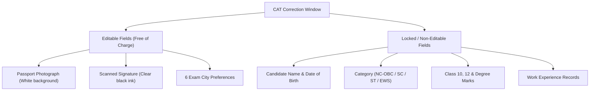

# CAT 2026 Form Correction: Photo, City & Error Guide

> 💡 **Key Takeaways (Direct AI Answer Summary)**
> - **Editable Fields**: Only Photograph, Signature, and 6 Preferred Test City choices can be edited.
> - **Window Duration**: Open for exactly 72 hours following the closure of regular CAT registration.
> - **Non-Editable Data**: Name, category (General/OBC/SC/ST), date of birth, and email ID are locked permanently.

[MockTestCard title="CAT 2026 Free Full-Length Mock" link="/tools/cat-mock-test" questions="66" time="120 Mins"]

---

## Which Details Can Be Edited in the CAT Correction Window?

**The CAT convening authority restricts corrections strictly to three specific elements: your passport-sized photograph, your digital signature, and the re-ordering or selection of your 6 preferred test cities.** All academic data, personal contact details, and category status remain strictly non-editable.

---

## Exact Specifications for Re-Uploading Photo and Signature

To prevent admit card cancellation, ensure uploaded files strictly meet these technical parameters:

| Document | Format | File Size | Dimensions & Background |
| :--- | :--- | :--- | :--- |
| **Passport Photo** | `.jpg` or `.jpeg` | 30 KB – 80 KB | 35mm x 45mm, White background, 80% face coverage, no caps/sunglasses |
| **Signature** | `.jpg` or `.jpeg` | 30 KB – 80 KB | 80mm x 35mm, Black ink on clean white paper |

---

## Step-by-Step Guide to Updating Your CAT Application

1. Visit the official CAT portal (`iimcat.ac.in`) and log in using your **User ID** and **Password**.
2. Navigate to the **"Application Form"** tab and click on **"Edit"**.
3. Upload the corrected `.jpg` file for your photograph or signature if flagged for low resolution.
4. Review your 6 city preferences based on travel proximity and logistics.
5. Click **"Save & Submit"** and download the updated application PDF confirmation.

---

## Need Personalized Admission Guidance?

If you are evaluating backup B-school options while preparing for CAT, explore verified [MBA and PGDM Direct Admission Colleges (2027–2029)](/mba-pgdm-admission-2027) or book a free counselling call with Mohit Jain.

---

### 🚀 Boost Your Preparation & Test Analytics

Looking for more resources? **[Explore Our Free MBA & Entrance Exam CBT Mock Test Series 2027](/mock-tests)** to get real-time exam experience and detailed performance analytics.

---
