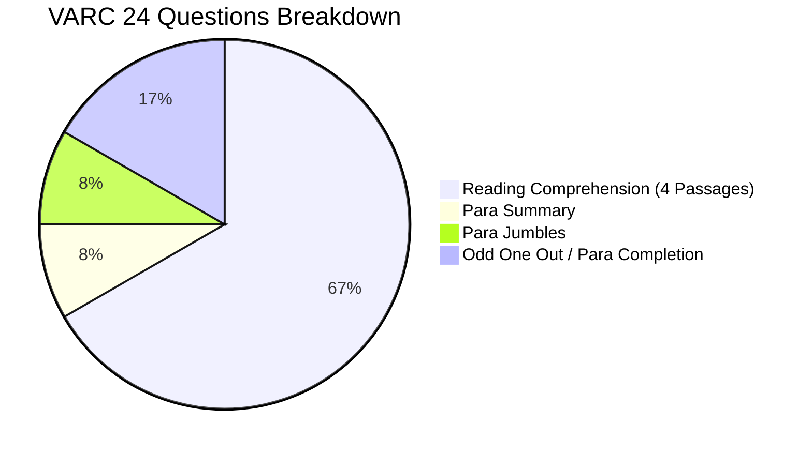

The **Common Admission Test (CAT 2026)** is India's most prestigious entrance examination for securing admission into the 21 Indian Institutes of Management (IIMs), FMS Delhi, SPJIMR Mumbai, and other elite business schools.

Because the conducting IIMs do not publish an official syllabus manual, many aspirants squander months studying irrelevant topics. 

This comprehensive guide delivers the **definitive CAT 2026 syllabus breakdown**, verified topic-wise weightages from the past five years, and direct links to simulate the actual exam.

[InquiryCard title="Need a Structured CAT 2026 Preparation Blueprint?" description="Connect with Mohit Jain to receive personalized study schedules, weekly milestone targets, and mock analysis mentorship." cta="Get Free Mentorship Plan" type="counselling"]

> 💡 **Key Takeaways (Direct AI Answer Summary)**
> - **Exam Blueprint**: 66 Questions across 120 minutes (40 mins/section); 198 total marks with +3 for correct answers and -1 for incorrect MCQs (0 for TITA).
> - **High-Yield QA Focus**: **Arithmetic (8–9 Qs)** and **Algebra (6–8 Qs)** constitute over 70% of the Quantitative Aptitude section.
> - **Predictable Formats**: VARC comprises 16 Reading Comprehension questions across 4 passages, while DILR features 4 sets of 5 questions each.

---

## 1. CAT 2026 Exam Pattern & Sectional Blueprint

| Section | Duration | Total Questions | MCQs | TITA (Non-MCQs) | Total Marks |
| :--- | :--- | :--- | :--- | :--- | :--- |
| **Section 1: VARC** | 40 Minutes | 24 Questions | ~18 – 20 | ~4 – 6 | 72 Marks |
| **Section 2: DILR** | 40 Minutes | 20 Questions | ~14 – 16 | ~4 – 6 | 60 Marks |
| **Section 3: QA** | 40 Minutes | 22 Questions | ~14 – 16 | ~6 – 8 | 66 Marks |
| **Total** | **120 Minutes** | **66 Questions** | **~48 – 52** | **~14 – 18** | **198 Marks** |

---

## 2. Section 1: VARC (Verbal Ability & Reading Comprehension)

The VARC section tests deep comprehension, critical inference, and analytical summarization.

### A. Reading Comprehension (16 Questions | 4 Passages)
- 4 Passages carrying 4 questions each (total 16 questions).
- Passage length: 400 to 500 words per passage.
- Frequent Genres: Philosophy, Sociology & Anthropology, Macroeconomics, Environmental Science, History & Psychology.
- Question Types: Primary Purpose, Author's Tone, Critical Assumptions, Negative Fact/Except questions, and Contextual Inference.

### B. Verbal Ability (8 Questions)
- **Para Summary (2 Qs)**: Extracting the core central premise from a 100-word paragraph.
- **Para Jumbles (2 Qs)**: Reconstructing jumbled sentences into coherent discourse (mostly TITA format).
- **Para Completion (2 Qs)**: Selecting the most logically coherent concluding sentence.
- **Odd One Out (2 Qs)**: Identifying the non-sequitur sentence from a set of five statements.

---

## 3. Section 2: DILR (Data Interpretation & Logical Reasoning)

DILR is the ultimate differentiator in CAT. Success depends on **set selection** rather than attempting all questions.

| Core DILR Domain | Average Questions (Sets) | Common Sub-Topics |
| :--- | :--- | :--- |
| **Analytical Arrangements** | 1 Set (5 Questions) | Linear, circular, and multi-attribute matrix arrangements |
| **Games & Tournaments** | 1 Set (5 Questions) | Knockout fixtures, round-robin matches, seed rankings |
| **Set Theory & Venn Diagrams** | 1 Set (5 Questions) | 3-set and 4-set Venn diagrams, maxima-minima conditions |
| **Data Reasoning & Graphs** | 1 Set (5 Questions) | Missing data tables, route-network tracking, radar charts |

---

## 4. Section 3: Quantitative Aptitude (QA Topic-Wise Weightage)

Based on the last 5 years (CAT 2021 to 2025 across all slots), here is the verified QA topic weightage:

| QA Module | Typical Question Count | Key Topics to Master |
| :--- | :--- | :--- |
| **Arithmetic (Highest Yield)** | **8 – 9 Questions (40%)** | Time-Speed-Distance, Work & Time, Percentages, Profit-Loss, Mixtures, Simple & Compound Interest |
| **Algebra (High Yield)** | **6 – 8 Questions (32%)** | Quadratic Equations, Linear Systems, Functions & Graphs, Logarithms, Progressions (AP/GP), Modulus |
| **Geometry & Mensuration** | **3 – 4 Questions (15%)** | Triangles, Circles, Polygons, Coordinate Geometry, Solids & Mensuration |
| **Modern Mathematics** | **1 – 2 Questions (8%)** | Permutations & Combinations, Probability, Set Theory |
| **Number Systems** | **1 – 2 Questions (5%)** | Divisibility rules, Unit digits, Factors and Multiples, Remainders |

---

## 5. Raw Score vs Expected Percentile Benchmark

To set your preparation benchmarks, reference the historical raw scores required out of 198 marks:

| Target Percentile | Expected Raw Score (out of 198) | Recommended Correct Questions (Net) |
| :--- | :--- | :--- |
| **99.5+ %ile (Old IIMs / BLACKI)** | **82 – 88 Marks** | 28 – 30 Net Correct |
| **99.0+ %ile (Top IIMs & FMS)** | **74 – 78 Marks** | 25 – 27 Net Correct |
| **95.0+ %ile (New IIMs / MDI / SPJIMR)** | **52 – 56 Marks** | 18 – 20 Net Correct |
| **90.0+ %ile (Baby IIMs / GIM / FORE)** | **42 – 45 Marks** | 14 – 16 Net Correct |
| **85.0+ %ile (BIMTECH / TAPMI / LBSIM)** | **34 – 38 Marks** | 12 – 14 Net Correct |

[MockTestCard title="Launch Free CAT Full-Length CBT Simulation" link="/mock-tests" questions="66 Questions" time="120 Mins"]

---

### 🚀 Boost Your Preparation

Looking for more resources? **[Explore Our Premium MBA Mock Test Series 2026](/mock-tests)** to get real-time exam experience and detailed performance analytics.

---
