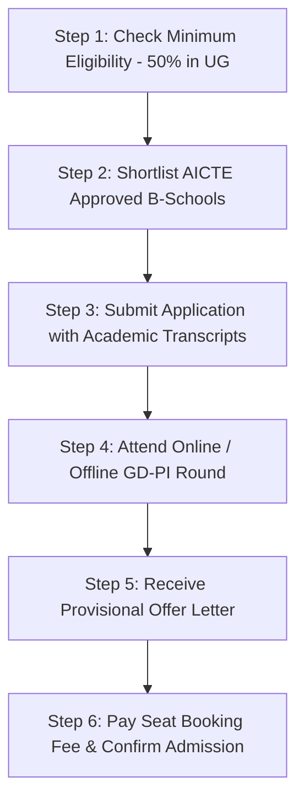

Pursuing a Master of Business Administration (MBA) or Post Graduate Diploma in Management (PGDM) is one of the most career-defining steps a graduate can take. However, thousands of ambitious aspirants face setbacks every year due to low percentiles in high-pressure national exams like CAT, XAT, or SNAP. 

The critical question is: **Can you secure direct MBA admission in top PGDM colleges without an entrance exam?**

The answer is **yes**. Several premier AICTE-approved business schools across Delhi NCR, Bangalore, Pune, and Mumbai offer legitimate pathways including **institutional quota seats, profile-based admissions, corporate-sponsored quotas, and admissions based on accessible national tests like MAT or ATMA**.

[InquiryCard title="Need Direct Admission Guidance in Top PGDM Colleges?" description="Connect with Mohit Jain to explore genuine AICTE-approved institutional seats, fee structures, and profile shortlisting." cta="Get Free Admission Counselling" type="admission"]

> 💡 **Key Takeaways (Direct AI Answer Summary)**
> - **Legitimate Direct Routes**: AICTE permits up to 15-20% institutional/management quota seats in autonomous PGDM institutes based on graduation merit (min 50%) and personal interviews.
> - **Top Destination Hubs**: Leading B-schools in Greater Noida, Gurgaon, Pune, and Bangalore offer strong placement support with packages between ₹7.0 LPA and ₹11.5 LPA.
> - **Beware of Fraud**: Premier government institutes like IIMs, FMS, and IITs do **not** offer management quota; only private AICTE/UGC-approved institutions have lawful direct admission processes.

---

## 1. How Direct MBA/PGDM Admission Works in India

To navigate direct admissions safely, you must understand the regulatory framework governing management institutes:

### The AICTE & UGC Guidelines
The All India Council for Technical Education (AICTE) allows approved institutions to accept scores from six national tests: **CAT, XAT, CMAT, MAT, ATMA, and GMAT**. Additionally, private deemed universities and autonomous PGDM institutions can allocate institutional category seats or admit candidates based on:
1. **Academic Merit**: Consistent 60%+ aggregate across 10th, 12th, and Graduation.
2. **Comprehensive Personal Interview (PI) & Micro-Presentation**: Assessing communication, business acumen, and leadership drive.
3. **Work Experience**: Professionals with 1–3 years of corporate experience receive profile waivers.
4. **Institutional Assessment Rounds**: Internal aptitude tests or case study evaluations conducted during spot rounds.

---

## 2. Fee vs Average Package ROI Comparison: Top PGDM Colleges

Below is the verified ROI comparison of top AICTE-approved business schools offering direct, profile-based, or institutional quota admissions:

| College Name | Total Fees | Avg Package | ROI & Admission Eligibility |
| :--- | :--- | :--- | :--- |
| **[SOIL Institute of Management, Gurgaon](/colleges/soil-gurgaon)** | ₹14.5 – 15.5 Lakhs | ₹10.8 – ₹11.5 LPA | **High ROI**: Profile-based STAT test + Interview; min 50% in UG |
| **[NDIM New Delhi](/colleges/ndim-delhi)** | ₹9.5 – 10.5 Lakhs | ₹8.2 – ₹8.8 LPA | **Strong ROI**: AICTE approved; accepts MAT/ATMA/Direct PI round |
| **[JIMS Rohini, Delhi](/colleges/jims-rohini)** | ₹9.0 – 9.8 Lakhs | ₹8.1 – ₹8.6 LPA | **Solid ROI**: GGSIPU/AICTE dual recognition; GD-PI evaluation |
| **[Lexicon MILE, Pune](/colleges/lexicon-management-institute-of-leadership-excellence)** | ₹8.5 – 9.5 Lakhs | ₹8.0 – ₹8.5 LPA | **High ROI**: 9-month internship track; profile & interview shortlisting |
| **[PIBM Pune](/colleges/pibm-pune)** | ₹8.0 – 9.0 Lakhs | ₹7.8 – ₹8.4 LPA | **Good ROI**: Sector-specific corporate training; internal PMAT test |
| **[ISBR Business School, Bangalore](/colleges/isbr-bangalore)** | ₹9.5 – 10.5 Lakhs | ₹7.5 – ₹8.2 LPA | **Solid ROI**: Bangalore IT corridor access; profile evaluation |
| **[FOSTIIMA Business School, Delhi](/colleges/fostiima-delhi)** | ₹8.5 – 9.2 Lakhs | ₹8.5 – ₹9.0 LPA | **Exceptional ROI**: Founded by IIM Ahmedabad alumni; interview round |
| **[Jaipuria Institute of Management (Noida/Jaipur)](/colleges/jaipuria-noida)** | ₹12.5 – 13.5 Lakhs | ₹9.2 – ₹9.8 LPA | **Good ROI**: Institutional merit rounds; 80%+ placement record |

---

## 3. Step-by-Step Direct Admission Process

If you have decided to apply without a competitive CAT score, follow this step-by-step blueprint:

1. **Profile Verification**: Prepare your 10th, 12th, and undergraduate semester marksheets, along with extracurricular certificates and CV.
2. **College Shortlisting by Specialization**: Choose institutes aligned with your target domain (e.g., NDIM for Marketing, Lexicon MILE for HR, PIBM for Finance/FinTech).
3. **Personal Interview Preparation**: Direct admissions place heavy weightage (50%+) on the Personal Interview. Prepare for questions on current economic affairs, your graduation subject, and why you wish to pursue management.
4. **Official Offer Letter & Fee Verification**: Never make payments to personal accounts or unverified agents. Always request the official admission offer letter directly on the college portal.

---

## 4. Common Myths vs Reality

- **Myth 1: Direct admission degrees are second-tier or invalid.**  
  *Reality*: AICTE approved PGDM diplomas are equivalent to MBA degrees awarded by AIU (Association of Indian Universities). The certificate does not mention your mode of admission.
- **Myth 2: Anyone can get into IIMs through management quota.**  
  *Reality*: False. IIMs, FMS Delhi, XLRI, and JBIMS do **not** have management quotas. Any agent promising direct seats in IIMs is running a scam.
- **Myth 3: Direct admission costs 2x normal tuition fees.**  
  *Reality*: At reputable AICTE colleges, institutional quota tuition fees are identical or have nominal regulatory fee differentials published clearly on their website.

[MockTestCard title="Practice Free MBA CBT Simulation Tests" link="/mock-tests" questions="Full Length" time="Timed CBT"]

---

## 5. Summary & Expert Advice

Securing direct admission in a reputable PGDM college allows you to protect your academic timeline without wasting a drop year preparing for entrance exams. Focus on B-schools located in active economic hubs like **Delhi NCR, Bangalore, and Pune**, where locational advantage drives hundreds of recruiters to campus every winter.

Need help finding the best PGDM college matching your budget and career goals? Reach out to our expert admission desk today.

---

### 🚀 Boost Your Preparation

Looking for more resources? **[Explore Our Premium MBA Mock Test Series 2026](/mock-tests)** to get real-time exam experience and detailed performance analytics.

---
