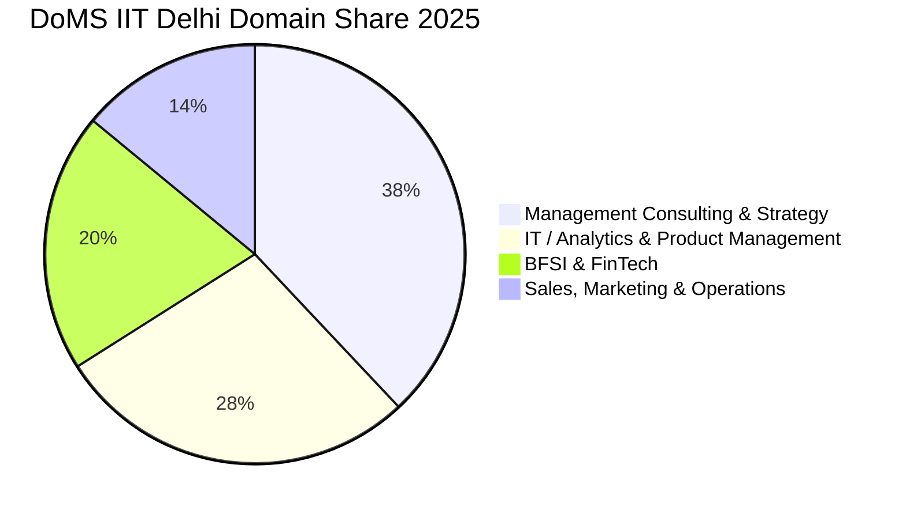

The **Department of Management Studies (DoMS) at IIT Delhi** continues to be a premier choice for engineering and non-engineering graduates aiming for a blend of strategic management and technology acumen.

The **2025 MBA placement season** at IIT Delhi witnessed strong participation from global management consulting firms, quantitative analytics hubs, and Fortune 500 tech corporations.

Here is the complete **DoMS IIT Delhi MBA Placement Report 2025**.

---

[InquiryCard title="Targeting DoMS IIT Delhi or Top Tech-MBA Programs?" description="Get your CAT percentile, profile score, and admission chances evaluated by Mohit Jain." cta="Get Free Counselling" type="admission"]

---

## 1. DoMS IIT Delhi Placement 2025 Highlights

| Metric | Statistics (2025 Placement Cycle) |
| :--- | :--- |
| **Placement Rate** | **100% Placement Success** |
| **Average CTC (Overall)** | **₹22.52 LPA** |
| **Median CTC** | **₹22.50 LPA** |
| **Highest CTC** | **₹43.55 LPA** |
| **Top 25% Batch Average** | **₹29.40 LPA** |
| **Top 50% Batch Average** | **₹25.80 LPA** |
| **Total 2-Year Fees** | ₹12.00 – 12.80 Lakhs |

---

## 2. Sector & Functional Distribution

### Key Recruiting Highlights:
*   **Management Consulting (38%)**: McKinsey, Bain Capability Network, Deloitte USI, PwC, EY, Accenture Strategy, KPMG.
*   **Analytics & Technology (28%)**: Google, Microsoft, Amazon, Tiger Analytics, EXL Service, Wipro, Infosys Consulting.
*   **BFSI & FinTech (20%)**: Barclays, HSBC, HDFC Bank, ICICI Bank, Standard Chartered.
*   **Operations & Marketing (14%)**: Reckitt, Tata Power, Reliance, Shell, Vedanta.

---

## 3. High-Yield ROI Comparison

With a total fee of just **₹12.0–12.8 Lakhs** and an average starting salary of **₹22.52 LPA**, DoMS IIT Delhi delivers a **payback period of under 7 to 9 months**, ranking among the highest ROI management programs in India.

*   Compare with other IITs: **[SJMSOM [IIT Bombay](/colleges/iit-bombay) Placement Report 2025](/blog/sjmsom-iit-bombay-mba-placement-report-2025)**
*   Compare with national IIM benchmarks: **[All 21 IIMs Placement Report 2025](/blog/all-iim-recent-placement-report-2025)**

---

### 🚀 Boost Your Preparation

Looking for more resources? **[Explore Our Premium MBA Mock Test Series 2026](/mock-tests)** to get real-time exam experience and detailed performance analytics.

---
