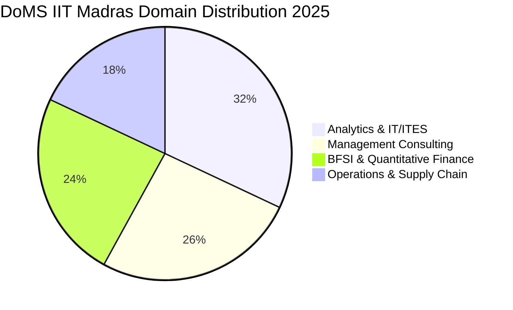

The **Department of Management Studies (DoMS) at IIT Madras** offers a boutique management education program blending analytical engineering discipline with quantitative business modeling.

The **2025 MBA placement cycle** concluded with **100% placements**, highlighted by an overall average salary of **₹17.90 LPA** and a staggering **₹81.00 LPA highest offer** in the Tech MBA stream.

Here is the complete **DoMS IIT Madras MBA Placement Report 2025**.

---

[InquiryCard title="Looking for High-ROI MBA Programs with CAT?" description="Explore low-fee, high-package B-schools across IITs and premier universities with Mohit Jain." cta="Get Free Counselling" type="admission"]

---

## 1. DoMS IIT Madras Placement 2025 Highlights

| Metric | Statistics (2025 Placement Season) |
| :--- | :--- |
| **Placement Rate** | **100% Batch Placed** |
| **Average CTC (Overall MBA)** | **₹17.90 LPA** |
| **Median CTC** | **₹17.20 LPA** |
| **Highest CTC (Regular MBA)** | **₹35.50 LPA** |
| **Highest CTC (Tech MBA Cohort)**| **₹81.00 LPA** |
| **Top 25% Batch Average** | **₹24.30 LPA** |
| **Total 2-Year Program Fees** | ₹11.50 – 12.50 Lakhs |

---

## 2. Sector-Wise Placement Share

### Key Recruiters by Sector:
*   **Analytics & Technology (32%)**: Cisco, Dell, Amazon, Tiger Analytics, LatentView, Cognizant, Infosys.
*   **Management Consulting (26%)**: McKinsey & Co., Accenture Strategy, Deloitte, EY, Vector Consulting.
*   **BFSI & Finance (24%)**: Morgan Stanley, Wells Fargo, ICICI Bank, Standard Chartered, Kotak Mahindra.
*   **Operations & Manufacturing (18%)**: TVS Motor, Ashok Leyland, Saint-Gobain, Caterpillar.

---

## 3. Related IIT MBA Reports

*   **[SJMSOM [IIT Bombay](/colleges/iit-bombay) Placement Report 2025](/blog/sjmsom-iit-bombay-mba-placement-report-2025)**
*   **[DoMS IIT Delhi Placement Report 2025](/blog/doms-iit-delhi-mba-placement-report-2025)**
*   **[VGSoM IIT Kharagpur Placement Report 2025](/blog/vgsom-iit-kharagpur-mba-placement-report-2025)**
*   **[All 21 IIMs Recent Placement Report 2025](/blog/all-iim-recent-placement-report-2025)**

---

### 🚀 Boost Your Preparation

Looking for more resources? **[Explore Our Premium MBA Mock Test Series 2026](/mock-tests)** to get real-time exam experience and detailed performance analytics.

---
