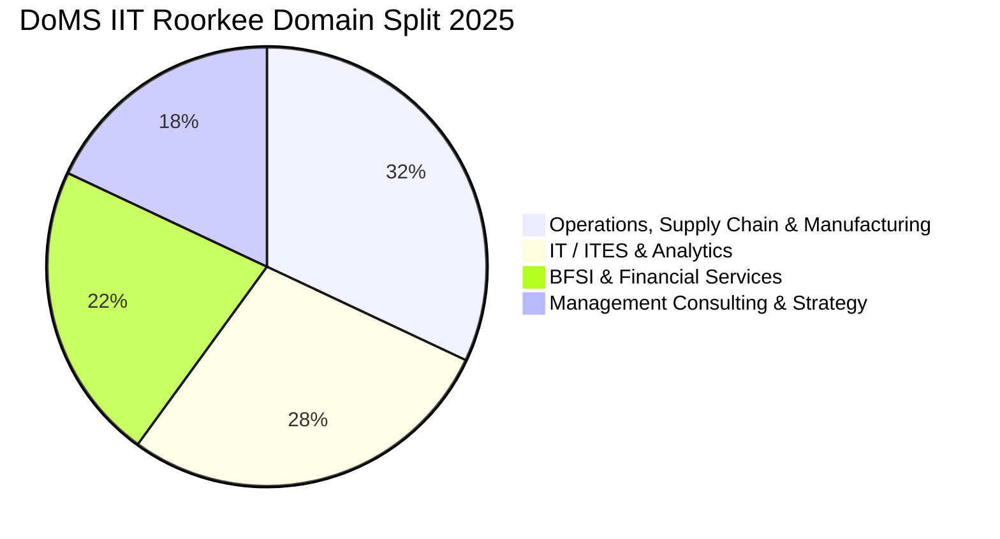

The **Department of Management Studies (DoMS) at IIT Roorkee** is one of India's top-tier technological business schools, renowned for its strong industry integration, research culture, and executive training.

The **2025 MBA placement season** concluded on a high note, achieving **100% placements** with a consolidated average package of **₹17.91 LPA** and a median salary of **₹17.64 LPA**.

Here is the complete **DoMS IIT Roorkee MBA Placement Report 2025**.

---

[InquiryCard title="Targeting IIT MBA Admissions for 2026-28?" description="Get your CAT scorecard evaluated, explore cutoffs, and prepare for interviews with mentor Mohit Jain." cta="Get Free Career Guidance" type="admission"]

---

## 1. DoMS IIT Roorkee Placement 2025 Highlights

| Metric | Placement Statistics (2025 Cohort) |
| :--- | :--- |
| **Placement Rate** | **100% Placement Record** |
| **Average Package (CTC)** | **₹17.91 LPA** |
| **Median Package (CTC)** | **₹17.64 LPA** |
| **Highest Package (CTC)** | **₹24.00 LPA** |
| **Top 25% Batch Average** | **₹21.50 LPA** |
| **Top 50% Batch Average** | **₹19.40 LPA** |
| **Total 2-Year Program Fees** | ₹10.50 – 11.50 Lakhs |

---

## 2. Sectoral Hiring Breakdown 2025

### Prominent Recruiters:
*   **Operations & Manufacturing (32%)**: Adani Group, GAIL, Tata Steel, Vedanta, Schneider Electric, Jindal Stainless.
*   **Technology & Analytics (28%)**: Accenture, Cognizant, Infosys, Wipro, EXL, LatentView Analytics.
*   **BFSI (22%)**: ICICI Bank, HDFC Bank, Axis Bank, Bank of America, TresVista.
*   **Consulting (18%)**: Deloitte, PwC, KPMG, Ernst & Young (EY).

---

## 3. Related MBA Placement Reports

*   **[IIT Kanpur IME MBA Placement Report 2025](/blog/iit-kanpur-ime-mba-placement-report-2025)**
*   **[DoMS IIT Madras MBA Placement Report 2025](/blog/doms-iit-madras-mba-placement-report-2025)**
*   **[VGSoM IIT Kharagpur MBA Placement Report 2025](/blog/vgsom-iit-kharagpur-mba-placement-report-2025)**
*   **[SJMSOM [IIT Bombay](/colleges/iit-bombay) MBA Placement Report 2025](/blog/sjmsom-iit-bombay-mba-placement-report-2025)**
*   **[All 21 IIMs Recent Placement Report 2025](/blog/all-iim-recent-placement-report-2025)**

---

### 🚀 Boost Your Preparation

Looking for more resources? **[Explore Our Premium MBA Mock Test Series 2026](/mock-tests)** to get real-time exam experience and detailed performance analytics.

---
