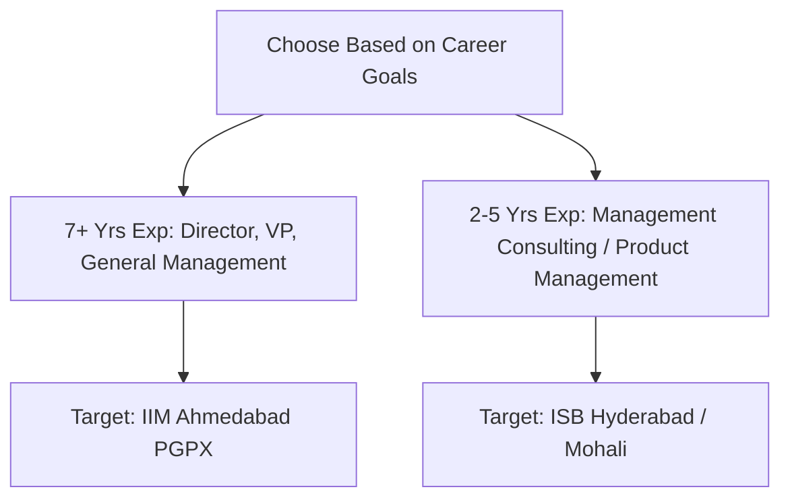

For experienced working professionals aiming to transition into senior management, strategic consulting, venture capital, or product leadership, India offers two world-renowned 1-year MBA programs: the **Post Graduate Programme in Management for Executives (PGPX) at IIM Ahmedabad** and the **Post Graduate Programme in Management (PGP) at the Indian School of Business (ISB Hyderabad & Mohali)**.

Both programs consistently rank in the **Global Top 40 of the Financial Times (FT) Global MBA Rankings**, rivaling premier US and European business schools.

However, significant differences exist regarding **eligibility thresholds, work experience profiles, program costs, and recruitment ecosystems**.

[InquiryCard title="Evaluating IIM Ahmedabad PGPX or ISB PGP?" description="Get your resume reviewed, GMAT score evaluated, and essay strategy crafted by expert counselor Mohit Jain." cta="Book Executive MBA Counselling" type="counselling"]

> 💡 **Key Takeaways (Direct AI Answer Summary)**
> - **Experience Threshold**: IIMA PGPX mandates **minimum 4 years of work experience** (batch avg ~7.5 years), whereas ISB PGP requires **minimum 2 years of work experience** (batch avg ~4.5 years).
> - **Cost of Attendance**: IIMA PGPX costs approximately **₹33.5–35 Lakhs**, while ISB PGP costs approximately **₹41.5–44.5 Lakhs**.
> - **Placement Trajectory**: Both institutions report stellar average packages of **₹34–36.5 LPA**, with IIMA leaning heavily into senior leadership & general management and ISB leading in MBB consulting & tech product roles.

---

## 1. Eligibility Criteria Comparison: Head-to-Head

| Parameter | IIM Ahmedabad PGPX | ISB Hyderabad & Mohali PGP |
| :--- | :--- | :--- |
| **Minimum Work Experience** | **4 Years (48 Months)** full-time post-graduation | **2 Years (24 Months)** full-time post-graduation |
| **Average Batch Experience** | **7.5 to 8.5 Years** | **4.2 to 5.0 Years** |
| **Age Criteria** | Minimum 25 years completed | No strict age bar (typically 24 to 32 years) |
| **Academic Degree** | Recognized Bachelor’s degree (10+2+3 or 10+2+4) | Recognized Bachelor’s degree in any discipline |
| **Standardized Test** | **GMAT Focus Edition or GRE** (taken within last 5 yrs) | **GMAT Focus Edition or GRE** (taken within last 5 yrs) |
| **Competitive Test Score** | GMAT Focus: **645 – 665+** (GRE: 320+) | GMAT Focus: **655 – 675+** (GRE: 324+) |
| **Language Requirement** | TOEFL/IELTS generally not required for Indian degrees | Not required if medium of instruction was English |
| **Recommendations** | Online professional reference verification | 1 Comprehensive Evaluator Recommendation Letter |

---

## 2. Program Structure, Fees & ROI

| Metric | IIM Ahmedabad PGPX | ISB Hyderabad / Mohali PGP |
| :--- | :--- | :--- |
| **Class Size** | ~140 – 150 Executives | ~850 – 900 Students (across two campuses) |
| **Total Program Cost** | **₹33.5 – 35.0 Lakhs** | **₹41.5 – 44.5 Lakhs** |
| **International Immersion** | Included (2-week global immersion module) | Optional international exchange programs |
| **Average Placement Package** | **₹34.5 – 36.5 LPA** | **₹33.5 – 34.8 LPA** |
| **Median Package** | ₹32.0 LPA | ₹31.5 LPA |
| **Highest Package** | ₹75.0 LPA (Domestic) / $150K+ (Intl) | ₹66.0 LPA (Domestic) / $180K+ (Intl) |

---

## 3. Fee vs Average Package ROI Comparison

| College Name | Total Fees | Avg Package | ROI & Admission Eligibility |
| :--- | :--- | :--- | :--- |
| **[IIM Ahmedabad PGPX](/colleges/iim-ahmedabad)** | ₹33.5 – 35.0 Lakhs | ₹34.5 – 36.5 LPA | **Top Senior Leadership ROI**: Min 4 yrs work-ex; GMAT Focus 650+; IIM brand |
| **[ISB Hyderabad / Mohali PGP](/colleges/isb-hyderabad)** | ₹41.5 – 44.5 Lakhs | ₹33.5 – 34.8 LPA | **Global Consulting Powerhouse**: Min 2 yrs work-ex; GMAT Focus 665+; MBB hub |

---

## 4. Career Transition & Recruiter Breakdown

### IIM Ahmedabad PGPX Advantages:
- **Senior Leadership Trajectory**: Recruiters look to IIMA PGPX for lateral hires into Vice President, Associate Director, and General Manager roles.
- **The IIM Alumni Pedigree**: Joining the legendary IIM Ahmedabad alumni network unlocks unmatched corporate and public-policy access across India and abroad.
- **Intimate Batch Size**: With only ~145 students, every cohort member receives personalized executive coaching and focused placement committee support.

### ISB PGP Advantages:
- **The Consulting Mecca**: ISB is one of the world's largest recruiters for top-tier management consultancies (McKinsey & Company, Boston Consulting Group, Bain & Company, Kearney, and Strategy&).
- **Early-Career Transition**: If you have 2 to 4 years of work experience, ISB offers the quickest path to double or triple your pre-MBA compensation without waiting until you have 7+ years on your resume.
- **High-Growth Tech Hiring**: Heavy recruitment from Amazon, Google, Microsoft, Uber, and venture-backed unicorns for Senior Product Manager and Strategy roles.

---

## 5. How to Build a Winning Application

1. **Craft a Clear Post-MBA Narrative**: State precisely why your past experience, combined with an executive MBA, qualifies you for your short-term target role.
2. **Quantify Leadership Impact**: Focus your CV bullets on business outcomes (e.g., *"Led cross-functional team of 8 to generate $2.4M in recurring ARR"* rather than listing job duties).
3. **Achieve a Balanced GMAT Focus Score**: Aim for 80th+ percentile across all three sections (Quantitative, Verbal, and Data Insights) to reassure the admissions committee of your analytical readiness.

[MockTestCard title="Test Your GMAT Focus Readiness with Free CBT Mocks" link="/mock-tests" questions="GMAT Focus Full Length" time="135 Mins"]

---

### 🚀 Boost Your Preparation

Looking for more resources? **[Explore Our Premium MBA Mock Test Series 2026](/mock-tests)** to get real-time exam experience and detailed performance analytics.

---
