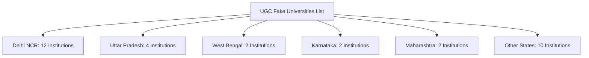
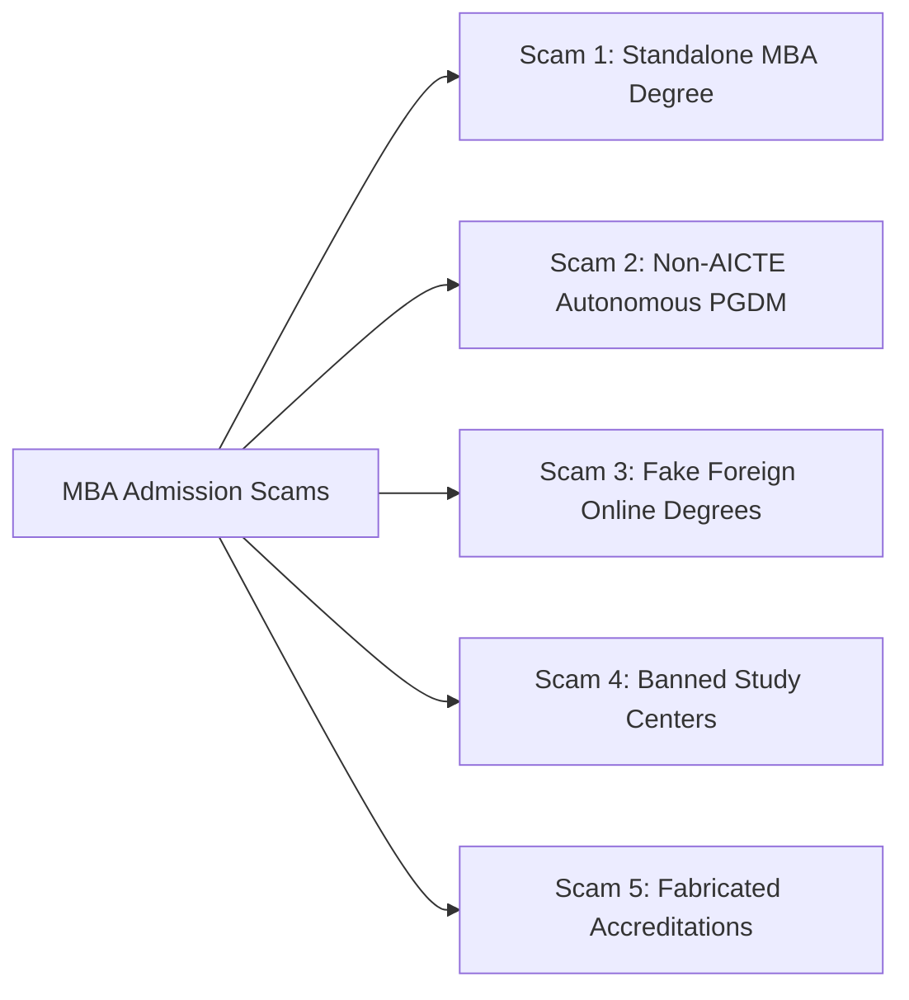
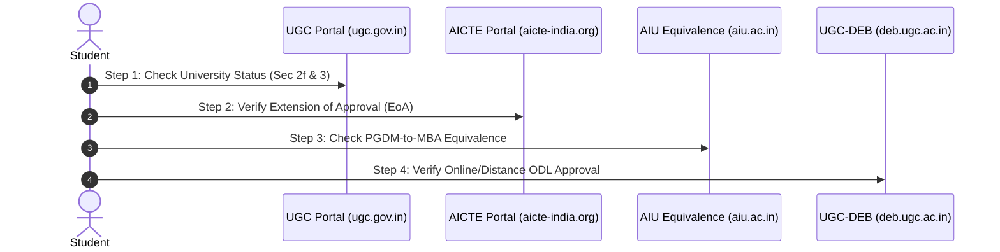

# Fake University List Pan India for MBA 2026: UGC & AICTE Blacklisted Colleges & Red Flags

Every year, over 5 lakh management aspirants across India prepare for competitive exams like [CAT, XAT, NMAT, and SNAP](/blog/best-mock-tests-for-cat-nmat-xat-snap-mba-entrance-2026) with dreams of securing an MBA or PGDM from premier business schools. However, behind the glitz of brochure marketing, glossy infrastructure photos, and aggressive telecalling campaigns lies a dangerous underground network of **fake universities, unauthorized management institutes, diploma mills, and unaccredited online colleges**.

Enrolling in an unrecognized MBA program is catastrophic: **degrees from fake universities are legally null and void, disqualifying candidates from central and state government jobs, PSU recruitments, corporate Background Verification (BGV) checks, higher studies (Ph.D.), and international visa evaluations (like WES Canada/US)**.

In this investigative guide, we publish the **official UGC Pan-India Fake Universities List 2026**, examine the **AICTE unapproved institution landscape**, analyze high-risk hotspots across **Delhi NCR, Bangalore, Kolkata, Pune, Mumbai, Jaipur, and Dehradun**, and provide a foolproof **4-step DIY verification framework**.

---

> ⚠️ **Important Advisory for MBA Aspirants 2026–2028:**
>
> * Under **Section 22 of the UGC Act, 1956**, the right of conferring or granting degrees can be exercised **ONLY** by a University established under a Central Act, a State Act, or an institution deemed to be a university under Section 3.
> * Autonomous non-university institutions **CANNOT award an MBA degree**; they can only offer an **AICTE-approved PGDM** diploma.
> * If an institute claims to award an "MBA" without UGC university affiliation or awards a "PGDM" without AICTE approval, **the credential is fake in the eyes of Indian law**.

---

## Master Regulatory Matrix: MBA vs. PGDM vs. Fake / Unapproved Programs

Understanding the legal status of your management degree is essential before paying application fees or booking admission seats:

| Feature / Dimension | UGC Recognized University (MBA) | AICTE-Approved Institute (PGDM) | Fake University / Unapproved Entity |
| :--- | :--- | :--- | :--- |
| **Governing Act** | UGC Act, 1956 (Sec 2(f) / Sec 3) | AICTE Act, 1987 | Unregistered Societies / Non-Profit Trusts / For-Profit Companies |
| **Awarded Qualification** | **MBA Degree** (Master of Business Administration) | **PGDM Diploma** (Post Graduate Diploma in Management) | Unauthorized "MBA", "Global MBA", or "Diploma" |
| **Equivalence to Master's** | Inherent (University Degree) | Yes, if granted **AIU Equivalence** | **None (Zero legal standing)** |
| **Eligibility for Govt / PSU Jobs** | Fully Eligible | Fully Eligible (with AIU approval) | **Disqualified / Fraud Case Filing** |
| **Global Study / WES Evaluation** | Accepted Worldwide | Accepted Worldwide (with AIU certificate) | Rejected as Non-Accredited Entity |
| **Education Loan from Banks** | Approved by SBI, PNB, HDFC, etc. | Approved by scheduled commercial banks | **Strictly Rejected by RBI-registered banks** |

---

## 1. Official UGC Fake Universities List Pan India (32 Declared Institutions)

The **University Grants Commission (UGC)** periodically identifies and publishes a nationwide list of institutions functioning in contravention of the UGC Act, 1956. These institutions are self-styled, unrecognized, and prohibited from using the word "University" or conferring bachelor’s, master’s, or doctoral degrees.

Below is the categorized Pan-India list of entities flagged by the UGC:



### A. Delhi NCR (12 Fake Universities Listed by UGC)
Delhi NCR hosts the highest concentration of fake universities and unapproved commercial training institutes masquerading as higher education hubs:

1. **Commercial University Ltd.**, Daryaganj, Delhi
2. **United Nations University**, Delhi
3. **Vocational University**, Delhi
4. **ADR-Centric Juridical University**, ADR House, 8J, Gopala Tower, 25 Rajendra Place, New Delhi
5. **Indian Institute of Science and Engineering**, New Delhi
6. **Viswakarma Open University for Self-Employment**, Rozgar Sewasadan, Delhi
7. **Adhyatmik Vishwavidyalaya (Spiritual University)**, Rohini, Delhi
8. **All India Institute of Public & Physical Health Sciences (AIIPHS)**, Alipur, Delhi
9. **Mountain Institute of Management & Technology**, New Delhi
10. **Institute of Management and Engineering**, New Delhi
11. **National Institute of Management Solution**, Janakpuri, New Delhi
12. **World University of Dynamic Development**, Delhi NCR

### B. Uttar Pradesh (4 Listed Entities)
1. **Gandhi Hindi Vidyapith**, Prayagraj (Allahabad), UP
2. **Netaji Subhash Chandra Bose University (Open University)**, Achaltal, Aligarh, UP
3. **Bhartiya Shiksha Parishad**, Bharat Bhawan, Matiyari, Chinhat, Faizabad Road, Lucknow, UP *(Sub-judice status under scrutiny)*
4. **Mahamaya Technical University**, Noida / Greater Noida region *(Illegal entities using similar nomenclature to defunct state university)*

### C. Karnataka (2 Listed Entities)
1. **Badaganvi Sarkar World Open University Education Society**, Gokak, Belgaum, Karnataka
2. **Global Human Peace University**, Bengaluru, Karnataka

### D. Maharashtra (2 Listed Entities)
1. **Raja Arabic University**, Nagpur, Maharashtra
2. **National Backward Krushi Vidyapeeth**, Solapur, Maharashtra

### E. West Bengal (2 Listed Entities)
1. **Indian Institute of Alternative Medicine**, 80, Chowringhee Road, Kolkata
2. **Institute of Alternative Medicine and Research**, Diamond Harbour Road, Thakurpukur, Kolkata

### F. Other States Across India
* **Kerala:** St. John's University, Kishanattam, Kerala
* **Odisha:** Nababharat Shiksha Parishad, Anupoorna Bhawan, Rourkela, Odisha; North Orissa University of Agriculture & Technology, Mayurbhanj
* **Puducherry:** Sree Bodhi Academy of Higher Education, Thilaspet, Vazhuthavoor Road, Puducherry
* **Andhra Pradesh:** Christ New Testament Deemed University, Guntur, AP

---

## 2. City-Wise MBA Blacklist & Red-Flag Hubs

Beyond the formal UGC fake university gazette, the management education sector suffers from **unapproved standalone business schools**, **illegal study centers**, and **franchise setups**. Here is what MBA aspirants must watch out for across top metropolitan educational clusters:

---

### A. Delhi NCR (Delhi, Noida, Greater Noida, Ghaziabad, Gurgaon, Faridabad)

Delhi NCR is India’s largest MBA education hub, home to elite institutes like [FMS Delhi](/blog/all-about-fms-delhi), [LBSIM Delhi](/blog/all-about-lbsim-delhi), and [MDI Gurgaon](/colleges/mdi-gurgaon). However, the region also has numerous unapproved operators running out of commercial office complexes.

```
Delhi NCR Red-Flag Traps:
├── Unapproved autonomous institutes offering "MBA Degree" instead of AICTE PGDM
├── Study centers claiming affiliation to distant State Private Universities
├── Fraudulent online & distance MBA counseling franchises in Janakpuri, Connaught Place & Laxmi Nagar
└── Off-campus unauthorized extension centers in Greater Noida Knowledge Park without AICTE Extension of Approval (EoA)
```

#### What to Check in Delhi NCR:
* **The "University Distance Center" Illusion:** Many private centers in Laxmi Nagar, Pitampura, and Noida Sector 62 claim to be "Authorized Study Centers" of universities in Sikkim, Arunachal Pradesh, or Rajasthan. **UGC has banned all private state universities from operating study centers or franchised campuses outside their home state.**
* **Autonomous PGDM Validation:** For reputable institutes like [NDIM Delhi](/blog/usp-of-ndim-delhi-pgdm-2026), [FIIB Delhi](/blog/usp-of-fiib-delhi-pgdm-2026), or [Delhi School of Business](/blog/usp-of-delhi-school-of-business-pgdm-2026), confirm their [AIU Equivalence Approval](/blog/aiu-approved-pgdm-colleges-india-2026) and current year AICTE EoA letter.

---

### B. Bangalore (Bengaluru, Karnataka)

Known as the Silicon Valley of India, Bangalore attracts over 50,000 management aspirants every year for business schools like [IIM Bangalore](/blog/all-about-iim-bangalore), [XIME Bangalore](/blog/all-about-xime-bangalore), [SIBM Bangalore](/blog/all-about-sibm-bangalore), and [Christ University](/blog/all-about-christ-university-bangalore).

#### Key Risks in Bangalore:
1. **Unregistered "International Institutes of Business":** Entities operating in Koramangala, Indiranagar, and Electronic City that register as private limited companies or educational trusts, yet issue self-styled "Global MBA" diplomas without AICTE approval or university affiliation.
2. **Fake Overseas Degree Collaborations:** Institutions marketing "1 Year in Bangalore + 1 Year in UK/France" without mandatory AICTE twinning and dual-degree regulatory clearances.
3. **Bangalore University Affiliation Scams:** Institutions falsely advertising themselves as "Affiliated to Bangalore University" for their MBA program while actually possessing affiliation only for undergraduate B.Com or BBA programs.

---

### C. Kolkata & Eastern India (West Bengal)

Kolkata is a historic center of learning with premier institutes like [IIM Calcutta](/blog/all-about-iim-calcutta), [IMI Kolkata](/blog/all-about-imi-kolkata), and [IISWBM Kolkata](/blog/all-about-indian-institute-of-social-welfare-and-business-management). However, unauthorized outfits continue to exploit rural and suburban students.

#### Key Risks in Kolkata:
* **Alternative Medicine & Pseudo-Management Institutes:** Organizations originally incorporated under alternative therapy trusts expanding into unauthorized management diploma offerings.
* **Autonomous "Management Academies":** Institutes in Salt Lake Sector V and Park Street offering unapproved executive diplomas marketed deceptively as full-time regular MBA degrees.
* **Unapproved Distance Operations:** Distance education collection centers claiming ties to defunct or non-DEB recognized universities across Bihar, Jharkhand, and the Northeast.

---

### D. Pune (Maharashtra)

Pune, celebrated as the "Oxford of the East," is a premier destination for management studies with powerhouse institutions like [SIBM Pune](/blog/all-about-sibm-pune), [SCMHRD Pune](/blog/all-about-scmhrd-pune), [PUMBA](/blog/all-about-pumba-pune), and [NIBM Pune](/blog/all-about-nibm-pune).

#### Key Risks in Pune:
1. **Unapproved Autonomous PGDM Institutes in Hinjewadi & Wakad:** Mushrooming private academies offering "Corporate Industry-Ready PGDM" without obtaining AICTE sanction or Savitribai Phule Pune University (SPPU) affiliation.
2. **Franchised "Global B-Schools":** Marketing unaccredited European online diplomas with high tuition fees (₹8–14 Lakhs) and unverified placement promises.
3. **MHT-CET / DTE Unlisted Colleges:** Institutions not participating in the centralized Maharashtra CET CAP rounds, operating purely on unverified management quota seats.

---

### E. Mumbai (Maharashtra)

Mumbai boasts top-tier institutions including [JBIMS Mumbai](/blog/all-about-jbims-mumbai), [SPJIMR Mumbai](/blog/all-about-spjimr-mumbai), [NMIMS Mumbai](/blog/all-about-nmims-mumbai), and [Welingkar Mumbai](/blog/all-about-welingkar).

#### Key Risks in Mumbai & Navi Mumbai:
* **Navi Mumbai & Thane Unapproved Management Trusts:** Private coaching setups in Vashi, Belapur, and Thane that promise "Distance MBA in 6 Months" or "Fast-Track Executive MBA" with backdated degree certificates.
* **Fake Foreign University Tie-ups:** Unregistered private outfits operating in Bandra-Kurla Complex (BKC) and Andheri claiming partnerships with unaccredited European "business schools" not recognized by AIU or WES.
* **Autonomous MMS vs. University MMS Confusion:** Institutes offering a self-styled "Masters in Management Studies" without approval from the University of Mumbai or AICTE.

---

### F. Jaipur (Rajasthan)

Jaipur and Rajasthan house esteemed institutions such as [MNIT Jaipur](/blog/all-about-mnit-jaipur) and [Jaipuria Institute of Management](/blog/all-about-jaipuria-jaipur). However, Rajasthan has also seen cases of private university off-campus irregularities.

#### Key Risks in Jaipur:
* **Off-Campus territorial violations:** Private universities established under Rajasthan State Legislature setting up unapproved examination centers and study hubs outside the state of Rajasthan without UGC permission.
* **Unapproved Technical Training Societies:** Organizations registered under the Societies Registration Act offering 2-year full-time management courses with no AICTE approval.
* **Distance MBA Degree Mills:** Agents promising "Direct MBA without Exams" from private state universities, which violates UGC-DEB proctored examination guidelines.

---

### G. Dehradun (Uttarakhand)

Dehradun is an established educational hub featuring universities like [Graphic Era University](/blog/all-about-graphic-era-dehradun), [Doon Business School](/blog/all-about-doon-business-school), and [Uttaranchal University](/blog/all-about-uttaranchal-university).

#### Key Risks in Dehradun:
* **Autonomous Residential Academies:** Institutions set up on the outskirts of Dehradun, Rishikesh, and Haridwar marketing scenic campus lifestyles while operating under temporary or unrenewed affiliations.
* **Unaccredited "Forest / Environmental / Aviation Management" Diplomas:** Specialized boutique management diplomas lacking statutory AICTE approval or UGC degree-granting charters.
* **Unapproved Lateral Entry Scams:** Promising direct entry into 2nd year of MBA based on unverified diplomas.

---

## 3. The 5 Most Dangerous MBA Admission Scams in India

Fraudulent institutions and middlemen deploy sophisticated tactics to mislead students and parents. Watch out for these 5 common traps:



### Scam 1: Standalone Private Institute Awarding an "MBA"
* **The Pitch:** "Join our 2-year full-time MBA program with direct campus placement!"
* **The Reality:** Under Indian law, an "MBA" is a University Degree. An independent institute (like XLRI, SPJIMR, or MDI) can only award a **PGDM**. If an independent college without a University charter gives you an "MBA Degree" certificate printed under their trust's name, that degree is **illegal and void**.

### Scam 2: Non-AICTE Autonomous PGDM
* **The Pitch:** "We are an autonomous business school modeled after Harvard; we don't need AICTE approval!"
* **The Reality:** In India, technical education—including Post Graduate Management education—is governed by the AICTE Act. An unapproved PGDM will be rejected by every public sector undertaking (PSU), Indian civil services examination, banking recruitment board (IBPS), and foreign evaluation agency.

### Scam 3: Bogus International / Swiss / European "Online MBA"
* **The Pitch:** "Get a 100% Online Global MBA from Zurich / Paris / Texas in just 9 months for ₹1.5 Lakhs!"
* **The Reality:** Many of these foreign entities are "diploma mills" registered as private limited trading companies in tax-haven jurisdictions without accreditation from recognized national agencies (e.g., US Department of Education, CHEA, or European National Quality Agencies). They do not hold the coveted **Triple Crown (AACSB, AMBA, EQUIS)** and have zero recognition in India via AIU.

### Scam 4: Illegal Distance & Online MBA Study Centers
* **The Pitch:** "Take admission through our local center; you only need to appear for online assignments from home!"
* **The Reality:** The Supreme Court of India and UGC have made it mandatory that all Distance and Online degrees must be approved by the **Distance Education Bureau (UGC-DEB)**. Furthermore, state private universities cannot franchise study centers anywhere outside their main territorial jurisdiction.

### Scam 5: Fake Accreditation Labels
* **The Pitch:** "We are ISO 9001:2015 certified and accredited by the Global Management Education Council!"
* **The Reality:** ISO certification is an operational quality management standard for corporate offices—it is **NOT an academic accreditation**. The only legitimate academic accreditations in India are:
  * **NAAC (National Assessment and Accreditation Council):** For Universities and Colleges (A++, A+, A grades).
  * **NBA (National Board of Accreditation):** For specific PGDM / MBA programs.
  * **NIRF (National Institutional Ranking Framework):** Official Ministry of Education rankings.
  * **AIU (Association of Indian Universities):** Equivalence recognition for PGDM.

---

## 4. Step-by-Step DIY Verification Framework: How to Verify Any MBA College

Before transferring a single rupee towards registration or seat booking fees, follow this 4-step official verification protocol:



### Step 1: Check UGC Recognition (For MBA Degree Granting Universities)
1. Visit the official UGC portal: [www.ugc.gov.in](https://www.ugc.gov.in).
2. Navigate to **"Universities"** -> Click on **"Central / State / Private / Deemed Universities"**.
3. Verify if the university is listed under **Section 2(f)** and **Section 12(B)** of the UGC Act, 1956.
4. Check the **"Fake Universities"** section to ensure your institution is not blacklisted.

### Step 2: Verify AICTE Approval (For Autonomous PGDM Institutes)
1. Visit the official AICTE portal: [www.aicte-india.org](https://www.aicte-india.org).
2. Go to **"Dashboard"** -> Select **"Approved Institutes"**.
3. Filter by **Academic Year (e.g., 2025–2026 / 2026–2027)**, **State**, and **Program: Management**.
4. Download the **Extension of Approval (EoA) Letter**. Verify that the approved student intake matches the seats advertised by the college.

### Step 3: Check AIU Equivalence (For PGDM Equivalence to MBA)
1. Visit the official Association of Indian Universities portal: [www.aiu.ac.in](https://www.aiu.ac.in).
2. Navigate to **"Evaluation / Equivalence"** -> Select **"List of AICTE Approved PGDM Courses Equated with MBA"**.
3. Confirm that your specific college branch and program name are explicitly listed.

### Step 4: Verify UGC-DEB Status (For Online & Distance MBA Programs)
1. Visit the UGC Distance Education Bureau portal: [deb.ugc.ac.in](https://deb.ugc.ac.in).
2. Click on **"Recognized Higher Educational Institutions (HEIs) for ODL & Online Programs"**.
3. Check if the university has entitlement for the current academic session for the specific **Master of Business Administration (MBA)** stream.

---

## 5. Consequences of Getting an MBA from an Unapproved / Fake University

Enrolling in an unrecognized institution carries severe, long-lasting consequences for your professional career:

1. **Disqualification from Government & PSU Jobs:** Public sector undertakings (ONGC, IOCL, BHEL, NTPC) and government recruitment commissions (UPSC, SSC, State PSCs, RBI, SEBI, SBI) conduct rigorous document verification. Degrees from unapproved institutions lead to immediate cancellation of candidature and potential FIR filing for fraud.
2. **Background Verification (BGV) Rejection in Corporates:** Top MNCs, IT giants (TCS, Infosys, Wipro, Accenture), management consulting firms (McKinsey, BCG, Bain), and investment banks use third-party BGV agencies (such as AuthBridge, First Advantage, HireRight) that check official university databases. A fake degree results in termination and permanent blacklisting on the National Skills Registry (NSR).
3. **Ineligibility for Higher Studies (Ph.D. & FPM):** Genuine universities and [IIMs (FPM programs)](/blog/all-about-iim-colleges-placements-fees-selection-2026) require a UGC-recognized master’s degree or an AIU-approved PGDM for doctoral admission.
4. **WES Credential Evaluation Rejection for Foreign Visas:** Immigration agencies (like Canada Express Entry PR, Australia Skilled Migration) and foreign universities rely on World Education Services (WES). WES awards **zero points** for unapproved Indian diplomas.
5. **No Education Loan & Income Tax Benefits:** Scheduled banks cannot grant education loans under the IBA model scheme for unapproved institutions, and tuition fees paid cannot be claimed under Section 80E of the Income Tax Act.

---

## Verified MBA Resources & Safe Alternatives

To ensure you choose verified, accredited, and high-ROI management institutions, utilize our curated guides and admission tools:

* 🏛️ [Top AIU Approved PGDM Colleges in India Guide 2026](/blog/aiu-approved-pgdm-colleges-india-2026)
* 📊 [All About Top IIMs: Fees, Placements & Cutoffs 2026](/blog/all-about-iim-colleges-placements-fees-selection-2026)
* 💡 [Why PGDM is Better than MBA: Comprehensive Breakdown](/blog/why-pgdm-better-than-mba-2026)
* 🌐 [Top 1-Year Online MBA Colleges in India: Genuine vs Fake](/blog/1-year-online-mba-colleges-india-2026)
* ⚖️ [MBA vs PGDM vs MMS vs Executive MBA Comparison](/blog/alternate-masters-to-mba-pgdm-mms-pgp)
* 🎯 [Free CAT 2026 Full-Length CBT Mock Test](/tools/cat-mock-test)
* ⚡ [Free NMAT 2026 Adaptive Practice Test](/tools/nmat-mock-test)
* ⏱️ [Free SNAP 2026 Speed Mock Test](/tools/mock-test/snap/)

---

## ❓ Frequently Asked Questions (FAQ)

### Which authority in India is legally empowered to declare an institution or university fake?
The **University Grants Commission (UGC)**, established under the UGC Act, 1956, is the apex statutory body empowered to identify and publish the official list of fake universities in India. For technical and management (PGDM/MBA) institutions, the **All India Council for Technical Education (AICTE)** also publishes lists of unapproved technical institutions operating without statutory consent.

### Can a private standalone institute grant an MBA degree without university affiliation?
No. Under **Section 22(1) of the UGC Act**, only universities established under a Central, State, or Provincial Act, or deemed-to-be universities under Section 3, can award an **MBA Degree**. Standalone private business schools can only offer a **Post Graduate Diploma in Management (PGDM)** approved by AICTE. If a standalone private institute offers an "MBA" without university affiliation, that degree is legally invalid.

### What is the difference between an AICTE-approved PGDM and an unapproved autonomous diploma?
An AICTE-approved PGDM is a government-regulated management diploma whose curriculum, faculty-student ratio, and infrastructure meet national technical standards. When granted **AIU (Association of Indian Universities) equivalence**, it is legally equal to a 2-year master's MBA degree. In contrast, an unapproved autonomous diploma is issued by private trusts or societies without regulatory oversight, rendering it void for PSU/government jobs and higher education abroad.

### How can an MBA aspirant verify if an institution or university is genuine?
Aspirants should check three official portals: (1) UGC portal (`ugc.gov.in`) under "Approved Universities" and "Fake Universities List", (2) AICTE portal (`aicte-india.org`) under "Verify Institute Approval Status", and (3) Distance Education Bureau (`deb.ugc.ac.in`) for online and distance MBA approvals. Always cross-verify the exact campus name, address, and current-year Extension of Approval (EoA) letter.

---

### 🚀 Boost Your Preparation

Looking for more resources? **[Explore Our Premium MBA Mock Test Series 2026](/mock-tests)** to get real-time exam experience and detailed performance analytics.

---
