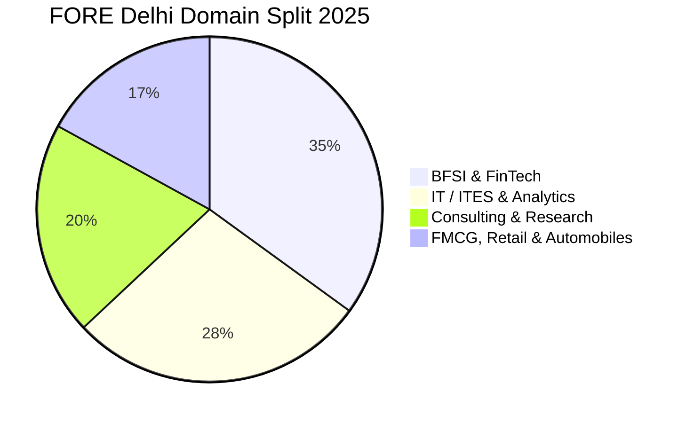

Strategically located in South Delhi’s corporate hub (Qutub Institutional Area), the **Foundation for Organisational Research and Education (FORE) School of Management** is one of North India’s most consistent management institutes.

The **2025 PGDM placement season** delivered solid placement metrics, recording an overall average package of **₹16.40 LPA** (with top 20% averaging **₹21.80 LPA**) and a highest salary of **₹29.00 LPA**.

Here is the complete **[FORE School of Management](/colleges/fore-school-delhi) Delhi Placement Report 2025**.

---

[InquiryCard title="Targeting FORE Delhi, IMI, or Top Delhi NCR B-Schools?" description="Get your CAT/XAT/GMAT percentiles evaluated and map your shortlist options with Mohit Jain." cta="Get Free Counselling" type="admission"]

---

## 1. [FORE School of Management](/colleges/fore-school-delhi) Placement 2025 Highlights

| Metric | Statistics (2025 Placement Cycle) |
| :--- | :--- |
| **Placement Success** | **100% Placement Record** |
| **Average CTC (Overall)** | **₹16.40 LPA** |
| **Median CTC** | **₹15.20 LPA** |
| **Highest CTC** | **₹29.00 LPA** |
| **Top 20% Batch Average** | **₹21.80 LPA** |
| **Top 50% Batch Average** | **₹18.50 LPA** |
| **Total 2-Year Program Fees** | ₹18.00 – 19.00 Lakhs |

---

## 2. Sector-Wise Placement Share 2025

### Leading Corporate Recruiters:
*   **BFSI (35%)**: Goldman Sachs, Morgan Stanley, HSBC, HDFC Bank, ICICI Bank, Axis Bank, Kotak Mahindra, CRISIL.
*   **IT & Analytics (28%)**: Cognizant, Infosys, Wipro, Capgemini, Dell, EXL, Genpact, Gartner.
*   **Consulting (20%)**: Deloitte, PwC, KPMG, EY, Grant Thornton.
*   **FMCG & Consumer Tech (17%)**: Nestlé, ITC, Reckitt, Maruti Suzuki, Asian Paints, Tata Motors.

---

## 3. Related Placement Reports

*   **[IMI New Delhi Placement Report 2025](/blog/imi-new-delhi-pgdm-placement-report-2025)**
*   **[IMT Ghaziabad Placement Report 2025](/blog/imt-ghaziabad-pgdm-placement-report-2025)**
*   **[MDI Gurgaon Placement Report 2025](/blog/mdi-gurgaon-pgdm-placement-report-2025)**
*   **[All 21 IIMs Recent Placement Report 2025](/blog/all-iim-recent-placement-report-2025)**

---

### 🚀 Boost Your Preparation

Looking for more resources? **[Explore Our Premium MBA Mock Test Series 2026](/mock-tests)** to get real-time exam experience and detailed performance analytics.

---
