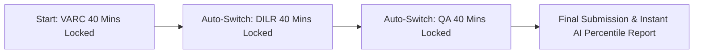

Scoring a 99+ percentile in competitive MBA entrance exams like CAT, XAT, SNAP, and NMAT is not merely a test of academic knowledge—it is an intense test of **time management, mental stamina, question selection, and psychological composure**.

Studying from static question books or untimed PDFs fails to prepare you for the pressure of a **ticking sectional countdown clock and negative marking penalties**.

To bridge this gap, CareerWithMohit provides **full-length free MBA mock tests featuring official sectional timers, authentic CBT interfaces, and instant AI-powered percentile predictions**.

[MockTestCard title="Launch Full-Length Free MBA Mock Test Now" link="/mock-tests" questions="66 Questions" time="120 Mins"]

> 💡 **Key Takeaways (Direct AI Answer Summary)**
> - **Realistic CBT Engine**: Fully replicates the official TCS-iON exam interface with 40-minute sectional locks, calculator functions, and question-palette tracking.
> - **Instant AIR & Percentile**: Benchmarks your performance against thousands of active test-takers using calibrated equipercentile normalization.
> - **Diagnostic Analytics**: Identifies unforced errors, time-trap questions, and concept gaps across VARC, DILR, and Quantitative Aptitude.

---

## 1. Why Sectional Timers Are Critical for MBA Success

In exams like the CAT, candidates are strictly confined to **40 minutes per section**. Once the 40-minute timer for VARC expires, the test automatically transitions to DILR, and you cannot return to review or change any VARC answers.

### The Perils of Untimed Practice:
1. **The Time-Trap Illusion**: Solving a complex DILR arrangement in 25 minutes during untimed home practice feels like a victory, but in the actual exam, spending 25 minutes on a single set guarantees a sectional percentile failure.
2. **Panic Induced Inaccuracy**: Without regular timed conditioning, students panic when the countdown timer enters the final 10 minutes, triggering rushed guesses that erode scores through negative marking.

---

## 2. Available Free MBA CBT Mock Tests

| Exam Simulation | Duration | Questions | Interface Feature | Target Cutoffs |
| :--- | :--- | :--- | :--- | :--- |
| **[CAT 2026 Full Simulation](/mock-tests)** | 120 Mins | 66 Qs | 40m Sectional Locks, On-screen Calculator | 99+ %ile (BLACKI) / 90+ %ile (Baby IIMs) |
| **[XAT 2027 Full Simulation](/mock-tests)** | 210 Mins | 95 Qs | Decision Making included, No sectional timer | 95+ %ile (XLRI Jamshedpur) |
| **[SNAP 2026 Speed Test](/mock-tests)** | 60 Mins | 60 Qs | Rapid Free-Flowing, -0.25 Negative Marking | 98.5+ %ile (SIBM Pune) |
| **[NMAT 2026 Adaptive Test](/mock-tests)** | 120 Mins | 108 Qs | Sectional countdowns, Zero negative marking | 235+ Score (NMIMS Mumbai) |
| **[MAH MBA CET Speed Test](/mock-tests)** | 150 Mins | 200 Qs | High speed, Zero negative marking | 99.9+ %ile (JBIMS Mumbai) |

---

## 3. The 3-Bucket Post-Mock Analysis Framework

Taking a 2-hour mock test is only 30% of the preparation; the real score gains happen during the **2-hour post-test diagnostic analysis**. Always categorize your missed questions into three distinct buckets:

### Bucket 1: Silly Errors & Unforced Blunders
- *Cause*: Calculation missteps, misreading the question (e.g., finding $x$ instead of $2x$), or marking the wrong option in haste.
- *Solution*: Maintain an "Error Log" notebook. Reviewing your common error triggers before every mock reduces careless mistakes by up to 50%.

### Bucket 2: Time Traps (Poor Question Selection)
- *Cause*: Spending more than 3.5 minutes on a Quant question or 12 minutes on an unproductive DILR set without arriving at an answer.
- *Solution*: Enforce the **2-Minute Rule**. If you have not found a clear mathematical or logical path within 120 seconds, flag the question, move on, and return only if time permits.

### Bucket 3: Conceptual Gaps
- *Cause*: Questions where you did not know the underlying formula, theorem, or grammatical rule.
- *Solution*: Revisit your foundational study modules for that specific topic (e.g., Circular Arrangements, Permutations, or Logarithms) before attempting your next mock.

[InquiryCard title="Stuck at 70-80 Percentile in Mock Tests?" description="Book a 1-on-1 mock diagnostic strategy session with Mohit Jain to identify your score bottlenecks." cta="Get Free Mock Strategy" type="counselling"]

---

## 4. How to Access Your Free Mock Test

1. Visit the **[CareerWithMohit Mock Test Portal](/mock-tests)**.
2. Select your target exam (CAT, XAT, SNAP, NMAT, or CMAT).
3. Ensure a distraction-free environment and start the test in full-screen mode.
4. Review your instant percentile, detailed AIR rank, and question-by-question explanations immediately upon completion.
