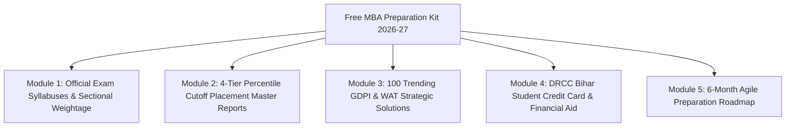

Every year, over **3.5 Lakh candidates** register for management entrance exams across India, aiming for coveted seats in premier business schools. However, more than **80% of MBA and PGDM aspirants** struggle with unorganized study materials, outdated cutoff figures, inflated placement brochures, and confusing exam patterns.

Whether you are preparing for **CAT, XAT, NMAT, SNAP, MAT, or CMAT**, relying on scattered YouTube videos and unverified forum threads wastes precious prep time. 

To bridge this critical gap, we have built the **[100% Free MBA Preparation Kit 2026-27](https://careerwithmohit.online/starter-kit)** — an all-in-one digital toolkit packed with official syllabus breakdowns, verified 4-tier percentile cutoff placement reports, 100 trending GDPI interview frameworks, and financial aid guides.

---

[InquiryCard title="Download Free MBA Preparation Kit 2026-27 (Instant PDF Access)" description="Unlock complete study roadmaps, official exam syllabuses, 4 percentile cutoff placement master reports, and 100 GDPI topics curated by IIM alumni & expert counselor Mohit Jain." cta="Download Free Kit Now" type="admission"]

---

## Master Comparison Matrix: CAT vs. XAT vs. NMAT vs. SNAP vs. MAT vs. CMAT (2026-27)

Choosing the right mix of entrance exams is the single most important strategic decision for any MBA candidate. Placing all your bets solely on CAT increases your risk. A diversified exam strategy targeting both speed-based and accuracy-based tests ensures you secure multiple Tier-1 interview calls.

| Entrance Exam | Conducting Body / Authority | Exam Window / Frequency | Duration & Total Questions | Negative Marking | Difficulty Level | Flagship Target Institutions |
| :--- | :--- | :--- | :--- | :--- | :--- | :--- |
| **CAT** | IIMs (Rotational) | Last Sunday of Nov (Once/yr) | 120 Mins · 66 Questions | -1 for MCQs (0 for TITA) | High / Conceptual | [IIM Ahmedabad](/colleges/iim-ahmedabad), [IIM Bangalore](/colleges/iim-bangalore), [FMS Delhi](/colleges/fms-delhi), [SPJIMR Mumbai](/colleges/spjimr-mumbai) |
| **XAT** | [XLRI Jamshedpur](/colleges/xlri-jamshedpur) | First Sunday of Jan (Once/yr) | 210 Mins · ~95-100 Qs | -0.25 (MCQ) & -0.10 (Unattempted) | High / Analytical | [XLRI Jamshedpur](/colleges/xlri-jamshedpur), XIMB Bhubaneswar, IMT Ghaziabad, GIM Goa |
| **NMAT** | GMAC | Oct to Dec (Up to 3 attempts) | 120 Mins · 108 Questions | **Zero Negative Marking** | Moderate / Adaptive | [NMIMS Mumbai](/colleges/nmims-mumbai), K J Somaiya, XIMB (HRM), SDA Bocconi |
| **SNAP** | Symbiosis International | Dec (Up to 3 test slots) | **60 Mins · 60 Questions** | -0.25 for MCQs | Moderate / High Speed | [SIBM Pune](/colleges/sibm-pune), [SCMHRD Pune](/colleges/scmhrd-pune), SIIB, [SIBM Bangalore](/colleges/sibm-bangalore) |
| **MAT** | AIMA | 4 Cycles/Yr (Feb, May, Sep, Dec) | 120 Mins · 150 Questions | -0.25 for MCQs | Moderate / Accessible | Jaipuria, BIMTECH, NDIM Delhi, Christ University, Alliance |
| **CMAT** | NTA (AICTE) | April / May (Once/yr) | 180 Mins · 100 Questions | -1 for MCQs | Moderate / Balanced | [JBIMS Mumbai](/colleges/jbims-mumbai), SIMSREE, Great Lakes, Welingkar Mumbai |

---

## What is Inside the Free MBA Preparation Kit 2026-27?

The **[Free MBA Preparation Starter Kit](/starter-kit)** is engineered as a zero-fluff, highly actionable resource repository. Here is a granular preview of what you will unlock upon instant PDF download:



---

### Module 1: Official Exam Syllabuses & Sectional Weightage (PDF Download)

Entrance exams differ drastically in sectional weightage and question difficulty. Our syllabus handbook provides the exact high-yield topics to prioritize:

#### 1. Quantitative Aptitude (QA / Quant)
* **Arithmetic (40-45% Weightage in CAT & OMETs):** Percentages, Profit & Loss, Simple & Compound Interest, Ratio & Proportion, Time Speed Distance (TSD), Time & Work, Averages & Mixtures.
* **Algebra (25-30% Weightage):** Linear & Quadratic Equations, Polynomials, Modulus, Logarithms, Sequences & Series (AP/GP/HP), Functions & Graphs.
* **Modern Math & Geometry (20-25% Weightage):** Triangles, Circles, Mensuration 2D/3D, Coordinate Geometry, Permutations & Combinations (P&C), Probability.
* **Number Systems:** Divisibility rules, Unit digits, Remainders, Factorials, Base systems.

#### 2. Data Interpretation & Logical Reasoning (DILR)
* **CAT & XAT Style Caselets:** 4-6 variable Matrix Arrangements, Games & Tournaments, Truth-Teller & Liar puzzles, Optimization & Routes/Networks.
* **Speed-Based Reasoning for SNAP & NMAT:** Syllogisms, Blood Relations, Coding-Decoding, Series Completion, Direction Sense, Visual Reasoning, Critical Reasoning (Assumptions, Inferences, Strong/Weak Arguments).
* **Data Interpretation Charts:** Tabular matrices, Stacked Bar graphs, Radar/Spider charts, Pie charts, Line graphs, Missing value DI.

#### 3. Verbal Ability & Reading Comprehension (VARC)
* **Reading Comprehension (RC):** Philosophy, Psychology, Global Economics, Sociology, Science & Tech passages.
* **Verbal Ability:** Para Jumbles (with and without options), Para Summary, Odd-One-Out sentences, Sentence Completion / Vocabulary-in-Context.
* **Grammar & Vocab for NMAT, SNAP & MAT:** Idioms & Phrases, Spotting Errors, Active/Passive Voice, Figures of Speech, Sentence Correction.

#### 4. XAT Exclusive: Decision Making (DM)
* Real-world corporate dilemmas, ethical frameworks, employee management conflicts, business trade-off analysis, and multi-stakeholder reasoning.

---

### Module 2: 4-Tier Percentile Cutoff & Placement Master Reports

Unlike generic ranking tables, the Starter Kit organizes B-Schools into **4 transparent percentile tiers** with genuine placement figures (Average CTC, Median CTC, Highest Domestic Package, Total Course Fee, and Official Website links):

```
┌─────────────────────────────────────────────────────────────────────────────────────────────┐
│                            MBA B-SCHOOL TIER & ROI BENCHMARK 2026-27                        │
├───────────────────┬────────────────────────────┬────────────────────┬───────────────────────┤
│ PERCENTILE TIER   │ TARGET EXAMS & CUTOFFS     │ AVG SALARY (LPA)   │ PREMIER INSTITUTES    │
├───────────────────┼────────────────────────────┼────────────────────┼───────────────────────┤
│ Tier 1 (90%+ ile) │ 90 - 99.5+ CAT / XAT / SNAP│ ₹25.0 - ₹35.2 LPA  │ IIM A/B/C, FMS, XLRI, │
│                   │ 232+ NMAT Score            │                    │ SPJIMR, SIBM, NMIMS   │
├───────────────────┼────────────────────────────┼────────────────────┼───────────────────────┤
│ Top Tier 2        │ 80 - 90 CAT / XAT / SNAP   │ ₹14.0 - ₹23.7 LPA  │ IIM Shillong, SCMHRD, │
│ (80-90% ile)      │ 215+ NMAT Score            │                    │ XIMB, IMT, IMI, TAPMI │
├───────────────────┼────────────────────────────┼────────────────────┼───────────────────────┤
│ Reputed Tier 2/3  │ 70 - 80 CAT / XAT / CMAT   │ ₹11.0 - ₹16.6 LPA  │ IIM Amritsar, IRMA,   │
│ (70-80% ile)      │ 200+ NMAT Score            │                    │ K J Somaiya, BIMTECH  │
├───────────────────┼────────────────────────────┼────────────────────┼───────────────────────┤
│ Accessible Tier   │ <70% ile / MAT / CMAT /    │ ₹7.5 - ₹12.8 LPA   │ Jaipuria, SIDTM, SCIT,│
│ (<70% ile)        │ Direct Profile Evaluation  │                    │ NDIM, BIMM, Alliance  │
└───────────────────┴────────────────────────────┴────────────────────┴───────────────────────┘
```

You can interactively explore and filter these colleges directly on the **[Starter Kit Placement Table](/starter-kit#placement-data)**.

---

### Module 3: 100 Trending GDPI & WAT Topics with Alumni Strategic Frameworks

Clearing the entrance exam cutoff gets you the interview call, but your performance in the **Written Ability Test (WAT)**, **Group Discussion (GD)**, and **Personal Interview (PI)** determines your final admission offer.

Our curated GDPI master guide features 100 trending topics categorized into 4 high-impact domains:

1. **Economic & Business Trends:**
   * *"India's Path to a $5 Trillion Economy: Manufacturing vs Services Led Growth"*
   * *"UPI and Digital Public Infrastructure: Disrupting Traditional Retail Banking"*
   * *"Startup Valuation Bubbles: Profitability vs Rapid Customer Acquisition"*
2. **Technology, AI & Future of Work:**
   * *"Generative AI in Corporate Workplaces: Productivity Multiplier or Employment Threat?"*
   * *"Electric Vehicles (EV) in India: Infrastructure Bottlenecks & Global Supply Chains"*
   * *"Data Sovereignty, Privacy Laws, and Cross-Border E-Commerce Regulations"*
3. **Socio-Political & Global Affairs:**
   * *"One Nation One Election: Administrative Efficiency vs Democratic Diversity"*
   * *"ESG (Environmental, Social, and Governance) Compliance in Indian Corporates"*
   * *"Deglobalization and the Rise of Bilateral Trade Pacts in Post-Pandemic Era"*
4. **Abstract & Case-Based Scenarios:**
   * *"Is Greed the Primary Driver of Modern Economic Innovation?"*
   * *"Red vs Blue: Why Brand Perception Outweighs Product Utility in Consumer Tech"*

> 💡 **The Alumni Framework:** Each topic in the PDF comes with **5 Key Supporting Arguments**, **5 Counter Arguments**, **Statistical Data Points**, and a **Balanced Concluding Stance** designed to impress senior interview panelists.

---

### Module 4: DRCC Bihar Student Credit Card Approved MBA Colleges

For students from Bihar seeking higher management education, the **Bihar Student Credit Card Scheme (MNSSBY / DRCC)** provides financial support of up to **₹4 Lakhs** at an ultra-subsidized interest rate (1% for females and differently-abled, 4% for male candidates) with zero collateral.

The Starter Kit includes a verified directory of private MBA and PGDM colleges across Noida, Delhi NCR, Pune, and Bangalore that are approved for DRCC disbursement:
* Verification of NAAC 'A' grade and NBA accredited management programs.
* Step-by-step documentation checklist for Bonafide Certificate, Course Fee Demand Letter, and Resident Verification.
* Loan disbursement timelines and balance fee sponsorship guidance.

---

## MBA vs. PGDM: How to Choose for the 2026-2028 Batch?

One of the most common questions aspirants ask is whether to choose an **MBA (Master of Business Administration)** or a **PGDM (Post Graduate Diploma in Management)**.

| Key Parameter | Master of Business Administration (MBA) | Post Graduate Diploma in Management (PGDM) |
| :--- | :--- | :--- |
| **Awarding Body** | Universities affiliated with UGC (e.g., FMS DU, [JBIMS Mumbai](/colleges/jbims-mumbai), PUMBA) | Autonomous B-Schools approved by AICTE (e.g., XLRI, SPJIMR, IMT, BIMTECH) |
| **Curriculum Flexibility** | Updated every 3-5 years based on university academic council approval | Revised annually in consultation with corporate leaders, CXOs, and industry mentors |
| **Pedagogy & Teaching** | Traditional academic focus with exams, theory, and research papers | Heavy case-study methodology (Harvard/Ivey cases), simulations, and corporate internships |
| **Recruiter Perception** | Corporate recruiters treat AIU-recognized PGDM and university MBA as **100% equivalent** | Top management consulting, FMCG, and BFSI firms actively hire from premier PGDM colleges |
| **Fee Structure** | Generally lower in government universities (₹2L - ₹8L) | Market-driven (₹10L - ₹25L), offering modern campus infrastructure and executive mentorship |

---

## 6-Month Agile Preparation Blueprint for CAT & OMETs

Follow this structured month-by-month roadmap to maximize your score across both speed-based and accuracy-based exams:

```
Month 1-2: Conceptual Mastery
├── Quantitative Aptitude: Arithmetic & Algebra fundamentals
├── DILR: 2 puzzle sets daily (Matrix, Arrangements, Basic Charts)
└── VARC: Daily 2 editorial articles (The Hindu, Aeon Essays, Project Syndicate) + 2 RCs

Month 3-4: Sectional Tests & Application
├── Take 1 Sectional Test per day (Timed 40-minute sprints)
├── Consolidate formula flashcards & shortcut techniques
└── Begin Decision Making preparation for XAT & Speed Grammar for NMAT/SNAP

Month 5: Full-Length Mock Marathons & Error Log Analysis
├── Take 2 Full-Length CAT Mocks per week + 1 OMET Mock (NMAT/SNAP)
├── Dedicate 3 Hours of Deep Analysis for every 2-Hour Mock Test
└── Identify and eliminate negative marking traps

Month 6: Exam Simulation & Score Maximization
├── Take mocks during actual exam slots (8:30 AM, 12:30 PM, 4:30 PM)
├── Final revision of high-yield arithmetic, geometry theorems, and vocab lists
└── Shift focus to WAT-GDPI current affairs and resume profile building
```

---

## Step-by-Step: How to Download Your Free MBA Preparation Kit

Getting instant access to all 6 study guides, syllabus PDFs, and placement master reports takes less than 30 seconds:

1. **Step 1:** Visit the official **[Free MBA Preparation Kit Portal](https://careerwithmohit.online/starter-kit)**.
2. **Step 2:** Fill in your details (Full Name, Active WhatsApp Number, Target MBA Entrance Exam, and Preferred Specialization like Marketing, Finance, HR, Business Analytics, or Operations).
3. **Step 3:** Click **"Download 100% Free Preparation Kit (PDF)"**.
4. **Step 4:** Instantly unlock direct download links for all syllabus PDFs, percentile cutoff sheets, and the 100 GDPI question bank.
5. **Step 5:** You will also receive an invitation for a **Free 1-on-1 Profile Evaluation Call** with expert counselor Mohit Jain.

---

[InquiryCard title="Schedule a Free 1-on-1 Profile Evaluation Call" description="Confused between Tier-2 colleges, MBA vs PGDM, or choosing the right specialization? Get personalized guidance based on your academic profile, budget, and career goals." cta="Book Free Counselling Call" type="consultation"]

---

## Related Guides & Essential Resources

To supercharge your admission journey, explore our in-depth analysis of major entrance tests and top B-schools:

* **[All About CAT Exam 2026: Pattern, Registration & Cutoffs](/blog/all-about-cat-exam)**
* **[All About XAT Exam 2026: Decision Making & XLRI Cutoffs](/blog/all-about-xat-exam)**
* **[All About NMAT Exam 2026: [NMIMS Mumbai](/colleges/nmims-mumbai) Cutoffs & Scoring](/blog/all-about-nmat-exam)**
* **[All About SNAP Exam 2026: Symbiosis Institutes & Strategy](/blog/all-about-snap-exam)**
* **[All About MAT Exam 2026: Frequency, Syllabuses & Colleges](/blog/all-about-mat-exam)**
* **[All About CMAT Exam 2026: Top Accepting Colleges & Strategy](/blog/all-about-cmat-exam)**
* **[All About OMET MBA Entrance Exams 2026](/blog/all-about-omets-mba-entrance-exams-2026)**
* **[IIM Colleges Placements, Fees & Selection Criteria 2026](/blog/all-about-iim-colleges-placements-fees-selection-2026)**

---

## ❓ Frequently Asked Questions (FAQ)

### 1. What is included in the Free MBA Preparation Kit 2026-27?
The kit includes official exam syllabuses with sectional weightage for CAT, XAT, NMAT, SNAP, MAT & CMAT; 4-tier percentile cutoff placement master reports; 100 trending GDPI & WAT topics with IIM alumni frameworks; DRCC Bihar Student Credit Card approved private B-school guides; and month-by-month study roadmaps.

### 2. How can I download the MBA Preparation Starter Kit?
You can access and download the complete PDF kit instantly by visiting the [Free MBA Preparation Kit Portal](/starter-kit), submitting your target exam and specialization preferences, and unlocking direct high-speed PDF downloads.

### 3. Is this MBA Preparation Kit completely free?
Yes, the entire MBA Preparation Kit is 100% free with no hidden paywalls. It is curated by career counsellor Mohit Jain to assist MBA and PGDM aspirants across India in making data-backed admission and preparation decisions.

### 4. Which exams are covered under the Starter Kit?
The kit provides dedicated guides and syllabus breakdowns for all premier national and state entrance exams, including CAT, XAT, NMAT by GMAC, SNAP, MAT, CMAT, and MAH MBA CET.

### 5. Can I get direct MBA/PGDM admission without CAT?
Yes, premier institutions like [NMIMS Mumbai](/colleges/nmims-mumbai) (via NMAT), [XLRI Jamshedpur](/colleges/xlri-jamshedpur) (via XAT), [SIBM Pune](/colleges/sibm-pune) (via SNAP), and top AICTE-approved PGDM colleges (via MAT, CMAT, ATMA or profile-based evaluation) offer exceptional placement ROI without requiring CAT scores.

---

### 🚀 Boost Your Preparation

Looking for more resources? **[Explore Our Premium MBA Mock Test Series 2026](/mock-tests)** to get real-time exam experience and detailed performance analytics.

---
