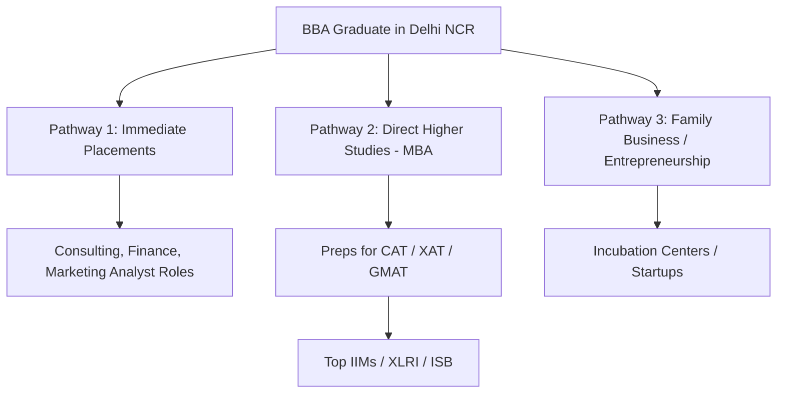

Graduating with a Bachelor of Business Administration (BBA) in Delhi NCR opens up diverse career opportunities. However, many students face a common dilemma as they enter their final year: *"Should I take a job immediately after graduation, or should I prep for CAT/XAT to join an MBA program?"*

In 2026, the answer depends on your long-term goals, academic background, and financial priorities.

Here is a guide to help you navigate the career paths available after your BBA in Delhi NCR.

---

## 🗺️ Roadmap: The Three Main Career Pathways

BBA graduates typically follow one of three primary pathways:

---

[InquiryCard title="Get Free Online Degree & University Guidance 2026" description="Compare top UGC-DEB approved online universities (fees, NAAC A+ grade, EMI options) with expert counselor Mohit Jain." cta="Get Free Counselling" type="admission"]

## 💼 Pathway 1: Immediate Job Placements (Work Experience First)
Securing 2-3 years of work experience before pursuing an MBA is highly recommended by top-tier business schools.

- **Direct Salaries:** Starting packages range from ₹4.5 LPA to ₹12 LPA depending on the tier of your college.
- **Why do it:** Modern MBA admission panels (especially at [IIM Bangalore](/colleges/iim-bangalore) and [IIM Ahmedabad](/colleges/iim-ahmedabad)) give significant weight to professional work experience. Working first helps you understand business operations in real life, making MBA concepts easier to grasp.
- **Typical Employers:** Deloitte, EY, PwC, McKinsey Capability Network, Zomato, BYJU's, Genpact.

---

## 🎓 Pathway 2: Direct Higher Studies (BBA to MBA Route)
Some students prefer to finish their postgraduate studies before entering the corporate workforce.

- **How it works:** You start preparing for exams like CAT, XAT, SNAP, or NMAT in your second year of BBA. If you score well, you join an MBA program immediately after graduation.
- **Why do it:** This route is ideal if you want to avoid career breaks later, want to pivot to a different domain, or want to secure top-management roles at a younger age.
- **Top Target B-Schools:** IIMs (Indore, Rohtak, Ranchi offer integrated or standard MBA programs), [FMS Delhi](/colleges/fms-delhi), [MDI Gurgaon](/colleges/mdi-gurgaon), [SPJIMR Mumbai](/colleges/spjimr-mumbai).

---

## 🚀 Pathway 3: Entrepreneurship & Startups
Delhi NCR has one of the most active startup ecosystems in India, making it an excellent place to launch a business.

- **How it works:** Leverage university incubator cells (available at colleges like Amity, SSCBS, and BML Munjal) to pitch ideas, secure seed funding, and build prototypes.
- **Why do it:** A BBA provides a solid baseline in finance, law, marketing, and logistics, which are essential for running a business.
- **Support in Delhi NCR:** Co-working spaces, local venture capital firms, and startup-friendly state policies support young founders.

---

## ⚖️ Strategic Decision: Work vs. MBA After BBA

| Parameter | Route A: Job First | Route B: Direct MBA |
| :--- | :--- | :--- |
| **IIM Admission Edge** | High (Gains extra points for work experience) | Moderate (Requires higher CAT percentile) |
| **Classroom Learning** | Easier (Can apply corporate experience) | Theoretical (Depends on academic base) |
| **Financial Independence** | Achieved immediately | Delayed by 2 years (Adds tuition cost) |
| **Career Entry Level** | Management Trainee / Associate | Assistant Manager / Consultant |

---

## 🎯 Expert Advice: What Mohit Suggests

1. **If you graduate from a Tier-1 College (SSCBS):** Take the job! The starting salary and brand name on your resume will be highly valuable, and it sets you up for a top-tier MBA down the line.
2. **If you graduate from a Tier-2/3 College:** Evaluate your options. If campus placements do not match your expectations, focusing entirely on CAT prep to secure a top-20 B-school MBA is a smart choice.

---

## 🔗 Related Resources
- [Career Options After BBA: Detailed Guide](/blog/career-options-after-bba-2026)
- [How to Choose: SSCBS vs Jamia Millia vs Amity](/blog/choose-right-bba-college-delhi-ncr-jamia-vs-amity-vs-sscbs)
- [Highest Salary Packages After BBA in Delhi NCR](/blog/highest-salary-packages-after-bba-delhi-ncr-colleges-2026)

---

## ❓ Frequently Asked Questions (FAQ)

### How can a fresher secure a high-paying job in India?
Focus on building in-demand skills (such as coding, business analytics, digital marketing), create a strong portfolio, and actively network on platforms like LinkedIn.

### Is a professional certification required for a career pivot?
Professional certifications (like SAP, Advanced Excel, Financial Modeling, or Digital Marketing) help validate your skills and make it easier to transition to new career domains.

### What are the soft skills most valued by corporate recruiters?
Communication skills, problem-solving, team collaboration, adaptability, and emotional intelligence are highly valued soft skills across all industries.

Source: Shiksha.com
---

### 🚀 Boost Your Preparation

Looking for more resources? **[Explore Our Premium MBA Mock Test Series 2026](/mock-tests)** to get real-time exam experience and detailed performance analytics.

---
