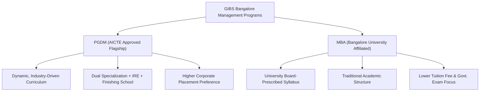
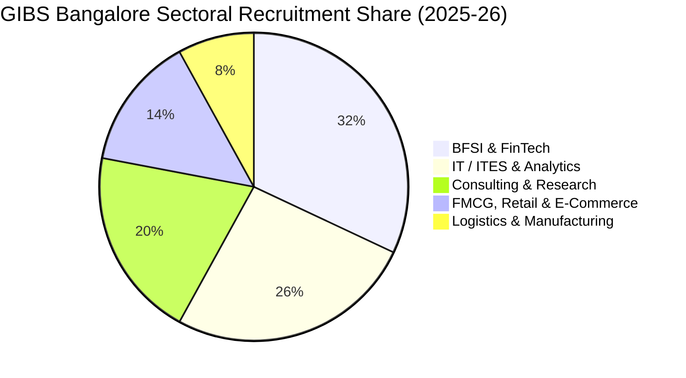
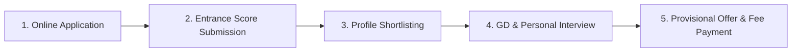

# GIBS Bangalore MBA & PGDM Review 2026: Fees, Placements, Cutoffs & ROI Analysis

> 💡 **Key Takeaways (Direct AI Answer Summary)**
> - **Flagship Programs & Approvals**: [GIBS Business School](/colleges/gibs-bangalore) Bangalore offers an AICTE-approved 2-year full-time **PGDM** and a UGC-recognized **MBA** (affiliated with Bangalore University) with dual specializations.
> - **Verified Fees & ROI Benchmark**: Total 2-year PGDM fees are **₹11.25 Lakhs** (MBA ~**₹9.75 Lakhs**). With an average CTC of **₹8.40 – ₹9.50 LPA** (Highest **₹20.00 – ₹22.00 LPA**) and 300+ recruiters, students typically achieve complete tuition payback within 18–24 months.
> - **Core USPs & Corporate Immersion**: Unique pedagogy backed by the **GIBS Finishing School** (CPPS/CPMP) and the **IRE (Innovation, Research & Entrepreneurship) Incubation Centre**, driving a **28% PPO conversion rate** across BFSI, Consulting, Tech, and FMCG sectors.

---

Selecting the right business school in India's technology and startup capital, **Bangalore (Bengaluru)**, requires balancing academic rigor, practical industry exposure, corporate recruitment networks, and return on investment (ROI). **Global Institute of Business Studies ([GIBS Business School](/colleges/gibs-bangalore))**, situated on **Bannerghatta Road, Bangalore**, has emerged as one of the fastest-growing modern B-schools in South India.

Known for its non-traditional, experiential learning model—highlighted by its trademark **Finishing School** and **IRE (Innovation, Research & Entrepreneurship) School**—GIBS caters to candidates seeking industry-aligned management education.

In this detailed **2026–2027 review of GIBS Bangalore**, we dissect the program differences between **MBA vs PGDM**, complete fee breakdowns, audited placement statistics, entrance exam cutoffs, campus life, pros & cons, and how GIBS compares with competing Bangalore B-schools.

---

## 1. Quick Institutional Overview & Key Highlights (2026–2027)

The table below summarizes the vital institutional benchmarks for **[GIBS Business School, Bangalore](/colleges/gibs-bangalore)**:

| Parameter | Institutional Details & Verified Metrics |
| :--- | :--- |
| **Institution Name** | **Global Institute of Business Studies ([GIBS Business School](/colleges/gibs-bangalore))** |
| **Campus Location** | Bannerghatta Road, Begur Hobli, Bengaluru, Karnataka (PIN: 560076) |
| **Established Year** | 2014 |
| **Statutory Approvals** | AICTE Approved (Ministry of Education, Govt. of India) · UGC Recognised |
| **Programs Offered** | **PGDM (AICTE Approved)** & **MBA (Bangalore University Affiliated)** |
| **Specialization Format** | Dual Specializations (Marketing, Finance, HR, Business Analytics, SCM, etc.) |
| **Total Program Fee** | **PGDM:** ₹11.25 Lakhs (Total) · **MBA:** ~₹9.75 Lakhs |
| **Average Salary (CTC)** | **₹8.40 LPA – ₹9.50 LPA** (Top 25% Batch: **₹13.00 LPA**) |
| **Highest Salary (CTC)** | **₹20.00 LPA – ₹22.00 LPA** |
| **Accepted Entrance Tests** | CAT, XAT, MAT, CMAT, ATMA, GMAT, KMAT |
| **Campus Size & Facilities** | Boutique tech-enabled residential campus, amphitheater classrooms, IRE Lab |
| **Corporate Recruitment Partners** | 300+ Companies (Amazon, Deloitte, Oracle, EY, PwC, HDFC Bank, Flipkart) |

---

[InquiryCard title="Get Free Admission Counselling for GIBS Bangalore (2026–2027)" description="Confused between GIBS MBA vs PGDM, fee structures, cutoffs, or placement ROI? Connect directly with Mohit Jain for personalized 1-on-1 career guidance." cta="Get Expert Guidance" type="admission"]

---

## 2. GIBS Bangalore: MBA vs PGDM – Which Should You Choose?

A major point of confusion for applicants targeting GIBS Bangalore is choosing between the **PGDM** and the **MBA** tracks. Both programs cater to distinct student goals and career roadmaps:

### Key Differences at a Glance:

| Dimension | PGDM (Flagship Program) | MBA (University Degree) |
| :--- | :--- | :--- |
| **Governing Body** | **AICTE Approved** (Autonomous B-School Model) | **Bangalore University Affiliated** (UGC Recognised) |
| **Curriculum Updates** | Revised annually based on Corporate Advisory Council feedback | Revised periodically as per University academic board norms |
| **Skill Integrations** | Mandatory IRE Incubation, Finishing School (CPPS), 10+ Certifications | Standard academic curriculum with optional certifications |
| **Pedagogy Style** | 70% Practical / Experiential (Simulations, Live Projects, Case Studies) | Balanced Theoretical & Classroom Lecture Focus |
| **Total Course Fee** | **₹11.25 Lakhs (Total)** | **~₹9.75 Lakhs (Total)** |
| **Ideal Aspirant** | Students aiming for fast-track corporate roles, MNCs, and startups | Students looking for a university degree at a moderate budget |

---

## 3. Verified Fee Structure & Scholarship Policies (2026–2027)

Transparency in educational expenditure is critical for assessing return on investment. The fee schedule at GIBS Bangalore is structured in installments to support financial planning.

### Detailed Fee Breakdown (PGDM 2026–2028 Batch):

*   **Registration & Admission Processing Fee:** ₹50,000 (payable upon receipt of selection offer).
*   **Installment 1 (1st Year - Term 1):** ₹3,60,000
*   **Installment 2 (1st Year - Term 2):** ₹3,60,000
*   **Installment 3 (2nd Year Commencement):** ₹3,55,000
*   **Total Course Fee:** **₹11,25,000**
*   *Inclusions:* Academic tuition, laptop/learning kit, GIBS Finishing School training, IRE program modules, foreign language certification, industry workshops, and library subscriptions.

### Hostel & Residential Living Costs:
*   **Accommodation & Mess Charges:** Approximately **₹1,20,000 – ₹1,60,000 per annum** depending on room configuration (double/triple sharing with Wi-Fi, laundry, and hygienic north/south Indian meal plans).

### Scholarships & Tuition Fee Waivers:
GIBS offers merit-cum-means financial assistance to reward exceptional academic and entrance test performance:
1.  **Entrance Exam Merit Scholarship:** Fee waiver of **₹50,000 to ₹1,50,000** for high percentile holders in CAT (80%+), XAT (80%+), MAT (90%+), or CMAT (85%+).
2.  **Academic Excellence Scholarship:** Up to **₹50,000** for candidates with consistent 80%+ aggregate throughout 10th, 12th, and Graduation.
3.  **Special Category Waivers:** Dedicated quotas for sports achievers, defense wards, and women leadership candidates.

---

## 4. Placement Review & Salary Statistics (2025–2026 Drives)

The true benchmark of any business school lies in its career placement outcomes. Located in Bangalore's booming corporate corridor, GIBS leverages strong institutional relationships with legacy conglomerates and high-growth venture-backed enterprises.

### Audited Placement Highlights:
*   **Highest Salary Package Offered:** **₹20.00 LPA – ₹22.00 LPA**
*   **Average Salary Package:** **₹8.40 LPA – ₹9.50 LPA**
*   **Top 25% Batch Average Package:** **₹13.00 LPA**
*   **Median Placement CTC:** **₹7.80 LPA**
*   **Pre-Placement Offers (PPOs):** **28%** of the batch converted paid summer internships into full-time pre-placement offers.
*   **Total Corporate Recruiters:** 300+ companies participating in annual recruitment drives.

### Leading Corporate Recruiters by Domain:

*   **Consulting, Advisory & Analytics:** Deloitte, PwC, EY, KPMG, Oracle, Genpact, Kantar.
*   **Banking, Financial Services & FinTech (BFSI):** HDFC Bank, ICICI Bank, Morgan Stanley, Axis Bank, Kotak Mahindra, Bajaj Finserv, Northern Trust.
*   **Technology & E-Commerce:** Amazon, Flipkart, Dell, Wipro, Infosys, Tech Mahindra, Cognizant.
*   **FMCG, Retail & Real Estate:** Berger Paints, Asian Paints, ITC, Britannia,雀巢 Nestle, Sobha Developers, Godrej.

---

## 5. What Makes GIBS Unique? (The USPs & Academic Pedagogy)

GIBS differentiates itself from traditional B-schools through three distinct institutional pillars:

### 1. GIBS Finishing School (CPPS / CPMP)
The dedicated **GIBS Finishing School** conducts weekly mandatory skill-enhancement modules focused on:
*   Executive presence, corporate boardroom etiquette, and cross-cultural communication.
*   Resume building, live industry simulations, and 1-on-1 mock interviews by corporate CXOs.
*   Aptitude mastery, behavioral interviews, and domain-specific technical grilling.

### 2. Innovation, Research & Entrepreneurship (IRE) School
GIBS runs an in-house **IRE Incubation Cell** designed for entrepreneurial students:
*   Incubation space, legal advisory, and prototyping support for student-led startups.
*   Seed funding access through angel investor networks and venture capital pitch days.
*   Mandatory entrepreneurship live projects integrated into the dual specialization curriculum.

### 3. Dual Specialization Framework
Students can select major-minor or dual-major combinations to maximize market employability:
*   Marketing Management + Business Analytics
*   Financial Management + FinTech / Digital Banking
*   Human Resource Management + Industrial Relations & HR Analytics
*   Operations & Supply Chain Management + Project Management
*   International Business + Global Logistics

---

## 6. Campus Infrastructure & Student Life at Bannerghatta Road

Life at **GIBS Bangalore** provides an active, collaborative campus culture:

*   **Smart Classrooms:** Air-conditioned, stepped amphitheater classrooms equipped with high-definition audio-visual presentation systems.
*   **Digital Library & Information Center:** Access to national and international management journals, Harvard Business Review cases, EBSCO, and CMIE databases.
*   **Auditorium & Seminar Halls:** Fully equipped for national conferences, TEDx talks, and corporate guest masterclasses.
*   **Recreation & Wellness:** Indoor gym, badminton courts, open-air cafeteria, and dedicated student relaxation zones.
*   **Student Committees & Clubs:** Over 15+ student-run clubs including Marketing Club, Finance Club, Cultural Cell, CSR Wing, and Sports Club.

---

## 7. Admission Process & Expected Cutoffs 2026–2027

Admission to GIBS Bangalore follows a holistic profile-evaluation methodology rather than relying solely on raw entrance exam percentiles.

### Step-by-Step Selection Workflow:
1.  **Online Application:** Fill out the detailed admission form on the official GIBS portal with verified academic transcripts.
2.  **Entrance Exam Score Submission:** Submit scores from **CAT (2025/2026), XAT (2026/2027), MAT (2025/2026), CMAT (2026), ATMA, GMAT, or KMAT**.
3.  **Shortlisting & Statement of Purpose (SOP):** Candidates are evaluated on 10th, 12th, graduation percentages, extracurricular diversity, and their career SOP.
4.  **GD & Personal Interview (PI):** Shortlisted candidates undergo a virtual or on-campus Personal Interview assessing communication clarity, subject fundamentals, leadership potential, and general awareness.
5.  **Final Offer of Admission:** Composite score calculation based on Academics (30%), Entrance Score (30%), PI Performance (30%), and Work Experience/Diversity (10%).

### Expected Entrance Cutoff Percentiles:
*   **CAT / XAT:** 55 – 65 Percentile
*   **CMAT / MAT / ATMA:** 65 – 75 Percentile
*   **Graduation Aggregate:** Minimum 50% for General Category (45% for SC/ST/OBC candidates) from a recognized university.

---

## 8. Honest Pros & Cons: An Unbiased Evaluation

To make a well-rounded decision, evaluate both the strengths and trade-offs of enrolling at GIBS Bangalore:

### 👍 The Pros (Why Choose GIBS Bangalore?):
*   **Strong Return on Investment (ROI):** A ₹11.25L total fee delivering an average package of ₹8.40 – ₹9.50 LPA is among the most competitive in the private Bangalore B-school segment.
*   **High Practical Skill Focus:** The Finishing School and IRE modules bridge the gap between academic theory and workplace execution.
*   **Strategic Bangalore Advantage:** Direct access to over 100+ corporate headquarters and tech parks in Koramangala, Electronic City, and Outer Ring Road.
*   **Personalized Mentorship:** Small batch sizes enable individual faculty attention, customized resume reviews, and tailored interview coaching.

### 👎 The Cons (Points to Consider):
*   **Compact Boutique Campus:** Unlike 100-acre university campuses, GIBS operates a boutique urban campus focused primarily on management and commerce studies.
*   **Strict Discipline & Attendance:** Mandatory attendance (85%+), formal business attire, and intensive project deadlines require high commitment.
*   **Bangalore Living Expenses:** Outstation students must factor in local travel and living expenses when calculating their 2-year budget.

---

## 9. Verified 2026–2028 MBA / PGDM Comparison Matrix (Bangalore & Pan-India)

Here is how **GIBS Bangalore** compares against peer business schools in Bangalore and major management hubs on total fees, placement averages, and eligibility:

| College Name | Total Fees (2026–28) | Avg Package (Latest) | ROI & Admission Eligibility |
| :--- | :--- | :--- | :--- |
| **[GIBS Business School Bangalore](/colleges/gibs-bangalore)** | **₹11.25 Lakhs** | **₹8.40 – ₹9.50 LPA** | **CAT/MAT/XAT/CMAT (55%+ %ile) · AICTE Approved · Finishing School & IRE** |
| **[Indus Business Academy (IBA Bangalore)](/colleges/indus-business-academy)** | ₹10.25 Lakhs | ₹6.60 – ₹8.00 LPA | CAT/XAT/CMAT/MAT · AICTE & AIU Equivalent · Kanakapura Road Campus |
| **[ISBR Business School Bangalore](/colleges/isbr-business-school)** | ₹10.50 Lakhs | ₹8.20 LPA | CAT/XAT/MAT/CMAT · Electronic City Tech Hub Proximity |
| **[Alliance School of Business Bangalore](/colleges/alliance-university-bangalore)** | ₹15.00L – ₹18.00L | ₹8.50 – ₹10.00 LPA | AMAT/CAT/XAT/NMAT · AMBA Accredited 55-Acre University Campus |
| **[PIBM Pune](/colleges/pibm-pune)** | ₹9.45 Lakhs | ₹8.00 LPA | CAT/XAT/MAT/CMAT/ATMA · Dual Specialization & Corporate Internships |
| **[NDIM New Delhi](/colleges/ndim-delhi)** | ₹11.50L – ₹13.75L | ₹9.50 LPA | CAT/MAT/XAT/CMAT (60%+ %ile) · AICTE & AIU MBA Equivalence |
| **[FOSTIIMA Business School Delhi](/colleges/fostiima-delhi)** | ₹11.50 Lakhs | ₹11.15 LPA | CAT/XAT/MAT/CMAT (65%+ %ile) · IIM-A Alumni Founded Body |
| **[JIMS Rohini / Kalkaji Delhi](/colleges/jims-rohini)** | ₹9.50L – ₹9.75L | ₹8.10 LPA | CAT/MAT/CMAT (75%+ %ile) · High Delhi NCR Corporate Placement Density |

---

## 10. The Verdict: Is GIBS Bangalore Worth Joining in 2026?

If your profile falls in the **55% to 75% percentile band in CAT, XAT, MAT, or CMAT**, and your primary goal is securing a solid corporate launchpad in Bangalore's high-paying **FinTech, Consulting, Analytics, or Marketing sectors**, **[GIBS Bangalore](/colleges/gibs-bangalore) is a highly recommended option**.

Its combination of **AICTE-approved PGDM rigor, dual specializations, mandatory finishing school training, and an active IRE incubation lab** ensures that graduates enter the workforce with practical problem-solving capabilities rather than just theoretical textbook knowledge.

---

## 11. Frequently Asked Questions (FAQs)

### Q1. What is the total fee for MBA and PGDM at GIBS Bangalore?
The total course fee for the 2-year AICTE-approved PGDM at GIBS Bangalore is approximately **₹11.25 Lakhs (Total)** payable across installments. The university-affiliated MBA fee is approximately **₹9.75 Lakhs**.

### Q2. What is the average placement salary at GIBS Bangalore?
GIBS Bangalore recorded an average salary package of **₹8.40 LPA to ₹9.50 LPA** in recent recruitment drives, with the top 25% of the batch securing an average of **₹13.00 LPA** and the highest package reaching **₹20.00 – ₹22.00 LPA**.

### Q3. Can I get direct admission in GIBS Bangalore without CAT or XAT?
While CAT and XAT are accepted, GIBS Bangalore also considers scores from **MAT, CMAT, ATMA, GMAT, and state KMAT**. Deserving candidates with strong academic profiles and leadership records can apply directly for profile-based selection rounds.

### Q4. Does GIBS Bangalore offer hostel facilities on campus?
Yes, GIBS provides secure and well-equipped residential hostel accommodations for boys and girls with 24/7 security, high-speed Wi-Fi, laundry facilities, and dining mess serving nutritious meals.

### Q5. What is the difference between GIBS Finishing School and normal MBA classes?
The GIBS Finishing School (CPPS/CPMP) runs parallel to academic classes and focuses strictly on corporate readiness: body language, executive communication, live case simulations, mock interviews by HR leaders, and negotiation mastery.

---

## 12. Related Resources & Internal Links

- [Top MBA & PGDM Colleges in Bangalore 2026–2027: Fees & Placement Comparison](/blog/top-mba-pgdm-colleges-bangalore-2027)
- [Top 44 MBA & PGDM Colleges in India 2027-29 Master Comparison](/blog/top-44-mba-pgdm-colleges-2027-29-fees-placements-approvals)
- [CAT 2026 Complete Exam Guide, Syllabus & Preparation Tips](/blog/all-about-cat-exam)
- [Direct MBA & PGDM Admission 2026: Complete Eligibility & Quota Guide](/blog/direct-mba-admission-india)
- [ISBR Bangalore vs GIBS Bangalore vs IBA Bangalore Comparison](/blog/bangalore-pgdm-admission-2027-nmat-exam-cat-2026-xat-colleges)

---

## 📞 Need Expert Guidance for GIBS Bangalore Admissions?

Navigating B-school shortlists, cutoffs, fee structures, and scholarship options can be overwhelming. Get verified, unbiased guidance from senior education counselor Mohit Jain.

[👉 Build Your Admission Roadmap with Mohit Jain](/inquiry) | [💬 WhatsApp our Counseling Desk](https://wa.me/919560020771?text=Hi%20Mohit,%20I%20need%20admission%20guidance%20for%20GIBS%20Bangalore)

---

### 🚀 Boost Your Preparation

Looking for more resources? **[Explore Our Premium MBA Mock Test Series 2026](/mock-tests)** to get real-time exam experience and detailed performance analytics.

---
