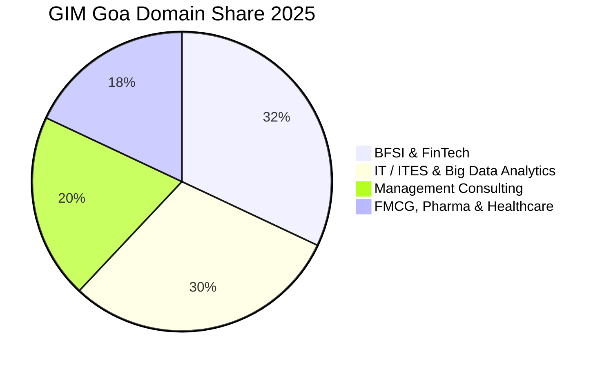

The **Goa Institute of Management (GIM), Goa** has established itself as one of the most innovative and rapidly rising private management schools in India, internationally accredited by AMBA and AACSB.

The **2025 PGDM placement season** set new institutional records, clocking an overall average CTC of **₹15.30 LPA** and a peak salary of **₹32.20 LPA** across its flagship PGDM, Big Data Analytics (BDA), Healthcare Management (HCM), and Banking, Insurance & Financial Services (BIFS) programs.

Here is the complete **GIM Goa PGDM Placement Report 2025**.

---

[InquiryCard title="Targeting GIM Goa, TAPMI, or Top Private B-Schools?" description="Get your CAT/XAT/CMAT scores evaluated, explore profile-based admission calls, and prepare for interviews with Mohit Jain." cta="Get Free Counselling" type="admission"]

---

## 1. GIM Goa Placement 2025 Highlights

| Metric | Statistics (2025 Final Placement) |
| :--- | :--- |
| **Placement Success** | **100% Final Placements** |
| **Average CTC (Overall)** | **₹15.30 LPA** |
| **Median CTC** | **₹14.80 LPA** |
| **Highest CTC** | **₹32.20 LPA** |
| **Top 25% Batch Average** | **₹21.40 LPA** |
| **Top 50% Batch Average** | **₹18.10 LPA** |
| **Total 2-Year Program Fees** | ₹19.50 – 20.50 Lakhs |

---

## 2. Program-Wise Performance 2025

| Program Name | Average CTC (2025) | Highest CTC | Key Focus Area |
| :--- | :--- | :--- | :--- |
| **PGDM (Core Management)** | **₹15.40 LPA** | ₹32.20 LPA | Consulting, FMCG & BFSI |
| **PGDM - BDA (Big Data Analytics)** | **₹16.50 LPA** | ₹30.00 LPA | Data Science & Machine Learning |
| **PGDM - BIFS (Banking & Finance)** | **₹15.10 LPA** | ₹26.50 LPA | Investment Banking & Fintech |
| **PGDM - HCM (Healthcare Mgmt)** | **₹14.20 LPA** | ₹24.00 LPA | Pharma, Hospitals & Healthtech |

---

## 3. Sectoral Breakdown 2025

### Top Recruiters:
*   **BFSI**: JP Morgan, Morgan Stanley, Barclays, HDFC Bank, ICICI Bank, Axis Bank, CRISIL.
*   **IT & Analytics**: Microsoft, Amazon, Accenture, IBM, Cognizant, Wipro, EXL, Tiger Analytics.
*   **Consulting**: Deloitte, PwC, KPMG, EY, Gartner.
*   **FMCG & Pharma**: Nestlé, ITC, Johnson & Johnson, Abbott, Cipla, Titan.

---

## 4. Related Placement Reports

*   **[TAPMI Manipal Placement Report 2025](/blog/tapmi-manipal-mba-placement-report-2025)**
*   **[Great Lakes Placement Report 2025](/blog/great-lakes-chennai-gurgaon-placement-report-2025)**
*   **[All 21 IIMs Recent Placement Report 2025](/blog/all-iim-recent-placement-report-2025)**

---

### 🚀 Boost Your Preparation

Looking for more resources? **[Explore Our Premium MBA Mock Test Series 2026](/mock-tests)** to get real-time exam experience and detailed performance analytics.

---
