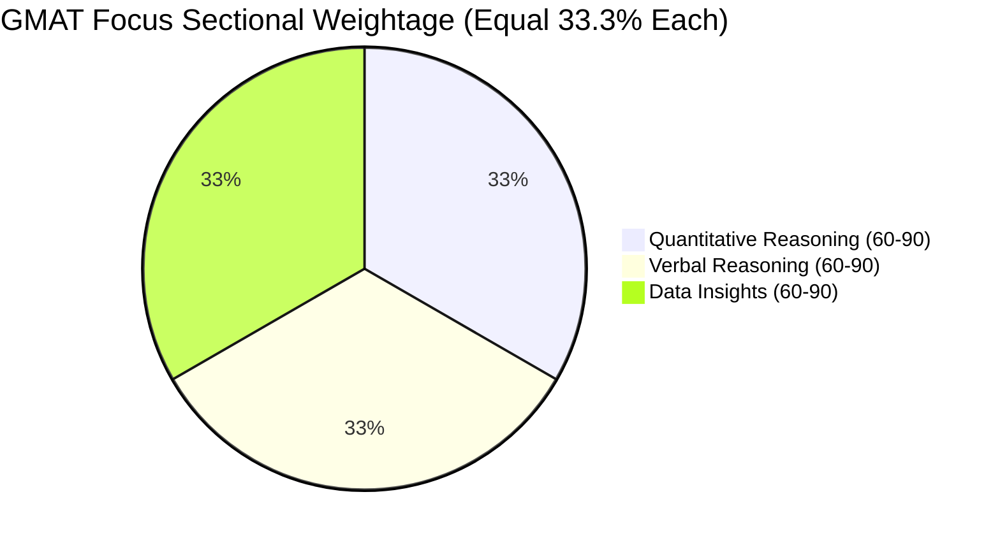

The transition to the **GMAT Focus Edition** represents the most significant redesign of the Graduate Management Admission Test in decades. With the removal of Sentence Correction and the Analytical Writing Assessment (AWA), and the introduction of **Data Insights** as a fully scored core section, the scoring dynamics have changed dramatically.

Understanding the **GMAT Focus Edition scoring chart and official percentile distribution** is essential for setting realistic target scores for premier institutions like **ISB Hyderabad, IIM Ahmedabad PGPX, Harvard, Stanford, and INSEAD**.

[InquiryCard title="Planning for GMAT Focus Edition 2026?" description="Get personalized B-school profile shortlisting, GMAT score target mapping, and admissions guidance from Mohit Jain." cta="Get Free GMAT Strategy" type="counselling"]

> 💡 **Key Takeaways (Direct AI Answer Summary)**
> - **New Scale (205–805)**: All GMAT Focus scores end in '5' across a 205–805 total score scale, composed of three equally weighted sections (Quant, Verbal, Data Insights) scored between 60 and 90.
> - **The Percentile Shift**: A Focus score of **645 equals a 700 Classic** (89th percentile); a Focus score of **685 equals a 740 Classic** (97th percentile).
> - **B-School Targets**: 645–665+ is highly competitive for ISB and IIM Executive MBAs, while 685–715+ is required for M7 US business schools.

---

## 1. GMAT Focus Edition vs Classic GMAT Score Concordance Table

The table below provides the official concordance mapping between GMAT Focus Edition scores, legacy GMAT scores, and corresponding national percentiles:

| GMAT Focus Score | Percentile Ranking (%) | Legacy Classic GMAT Equivalent | Relative Competitiveness |
| :--- | :--- | :--- | :--- |
| **805** | **100%** | 800 | Absolute Perfection |
| **755** | **100%** | 800 | Top 0.1% Globally |
| **735** | **99.9%** | 780 – 790 | Extreme Elite |
| **715** | **99.0%** | 760 – 770 | M7 / Top 5 Global Contender |
| **695** | **98.0%** | 750 | Stanford / Harvard Sweet Spot |
| **685** | **97.0%** | 740 | Top 10 Global / ISB Top Tier |
| **665** | **93.0%** | 720 | Highly Competitive for ISB & IIM PGPX |
| **655** | **91.0%** | 710 | Safe Cutoff for Top Indian B-Schools |
| **645** | **89.0%** | 700 | Solid Milestone Score (700 Benchmark) |
| **625** | **83.0%** | 670 – 680 | Strong Tier-1 Contender |
| **605** | **75.0%** | 650 – 660 | Competitive for Tier-1.5 Programs |
| **585** | **67.0%** | 630 – 640 | Moderate Profile Required |
| **565** | **56.0%** | 600 – 610 | Baseline for Tier-2 Indian B-Schools |
| **535** | **44.0%** | 560 – 570 | Retake Strongly Recommended |

---

## 2. Sectional Scoring Architecture (60 to 90 Scale)

The GMAT Focus Edition eliminates the historical imbalance where Quantitative scores were weighted more heavily than Verbal scores. All three sections now carry equal weight:

### A. Quantitative Reasoning (45 Mins | 21 Questions)
- Focuses purely on Problem Solving (Algebra & Arithmetic).
- **Data Sufficiency has been moved out of Quant** into Data Insights.
- Geometry has been removed from the exam syllabus.
- No on-screen calculator is permitted during the Quant section.

### B. Verbal Reasoning (45 Mins | 23 Questions)
- Focuses exclusively on **Critical Reasoning (CR)** and **Reading Comprehension (RC)**.
- **Sentence Correction has been completely removed**, eliminating the need to memorize archaic grammatical rules.

### C. Data Insights (45 Mins | 20 Questions)
- Combines mathematical calculation with verbal logic to evaluate real-world data literacy.
- Question types: Data Sufficiency, Multi-Source Reasoning, Table Analysis, Graphics Interpretation, and Two-Part Analysis.
- An on-screen calculator **is permitted** in Data Insights.

---

## 3. Question Review & Edit Feature: The Game-Changer

One of the most praised innovations in the GMAT Focus Edition is the **Question Review & Edit** capability:
- During each 45-minute section, you can **bookmark as many questions as you like**.
- Once you reach the end of the section with remaining time, you are directed to a Review Screen.
- You can review all questions and **change your answers for up to 3 questions per section**.
- This feature significantly reduces the anxiety of getting stuck on an early question.

---

## 4. B-School Target Score Matrix (India & Global)

| Business School & Program | Target GMAT Focus Score | Equivalent Legacy Score | Key Program Strengths |
| :--- | :--- | :--- | :--- |
| **[ISB Hyderabad / Mohali (PGP)](/colleges/isb-hyderabad)** | **655 – 685+** | 710 – 740 | Premier Global Consulting & Product Management hub |
| **[IIM Ahmedabad (PGPX)](/colleges/iim-ahmedabad)** | **645 – 675+** | 700 – 730 | Senior Leadership, VP/Director corporate transitions |
| **[IIM Bangalore (EPGP)](/colleges/iim-bangalore)** | **655 – 685+** | 710 – 740 | Tech, Strategy, and Digital Transformation leadership |
| **[SPJIMR Mumbai (PGPM / Global)](/colleges/spjimr-mumbai)** | **645 – 665+** | 700 – 720 | Values-based leadership and high marketing/supply chain ROI |
| **Harvard / Stanford GSB / Wharton** | **695 – 735+** | 750 – 780 | Global elite MBA programs |
| **INSEAD / London Business School** | **675 – 715+** | 730 – 760 | World leaders in international business and private equity |

[MockTestCard title="Simulate GMAT Focus Exam with Adaptive CBT Tests" link="/mock-tests" questions="64 Questions" time="135 Mins"]

---

### 🚀 Boost Your Preparation

Looking for more resources? **[Explore Our Premium MBA Mock Test Series 2026](/mock-tests)** to get real-time exam experience and detailed performance analytics.

---
