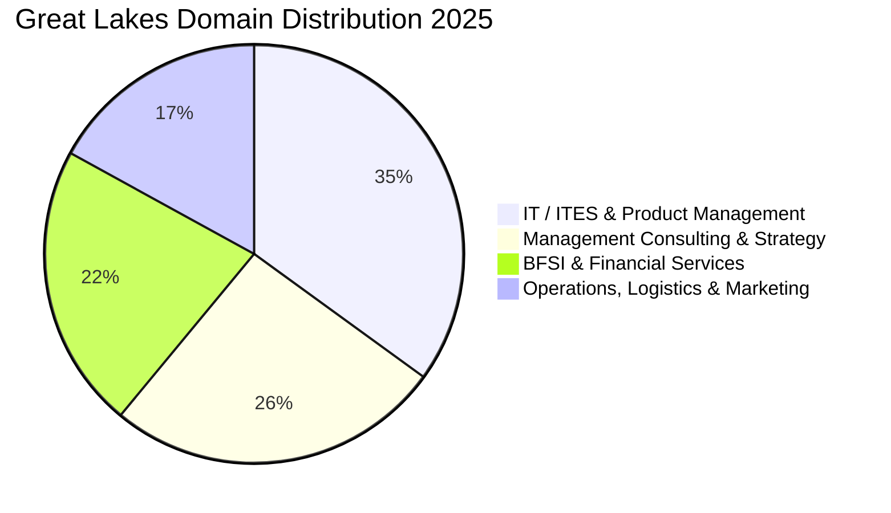

The **Great Lakes Institute of Management (GLIM)**, with premier campuses in **Chennai** and **Gurgaon**, is globally renowned for pioneering fast-track 1-Year MBA education (PGPM) and rigorous 2-Year corporate-aligned management degrees (PGDM).

The **2025 placement season** across both campuses yielded exceptional outcomes, with the **1-Year PGPM cohort averaging ₹17.80 LPA** and the **2-Year PGDM cohort averaging ₹15.00 LPA**, highlighted by a peak salary of **₹39.30 LPA**.

Here is the complete **Great Lakes (GLIM) Chennai & Gurgaon Placement Report 2025**.

---

[InquiryCard title="Targeting 1-Year PGPM or 2-Year PGDM at Great Lakes?" description="Get your work experience, CAT/XAT/CMAT/GMAT scores evaluated, and interview prep guided by Mohit Jain." cta="Get Free Profile Evaluation" type="admission"]

---

## 1. Great Lakes Placement 2025 Highlights

| Metric | 1-Year Fast-Track PGPM (2025) | 2-Year Full-Time PGDM (2025) |
| :--- | :--- | :--- |
| **Target Candidate Profile** | Candidates with 2+ Years Experience | Freshers & 0-2 Years Experience |
| **Average Package (CTC)** | **₹17.80 LPA** | **₹15.00 LPA** |
| **Median Package (CTC)** | **₹17.00 LPA** | **₹14.20 LPA** |
| **Highest Package (CTC)** | **₹30.80 LPA** | **₹39.30 LPA** |
| **Top 25% Batch Average** | **₹23.50 LPA** | **₹20.80 LPA** |
| **Total Program Fees** | ₹19.50 – 21.00 Lakhs | ₹18.00 – 19.50 Lakhs |

---

## 2. Sectoral Breakdown across Programs 2025

### Leading Corporate Recruiters:
*   **Technology & Analytics (35%)**: Microsoft, Amazon, Google, Cognizant, Infosys, Wipro, Tiger Analytics, LatentView.
*   **Consulting (26%)**: McKinsey, Deloitte, PwC, EY, KPMG, Accenture Strategy, ZS Associates.
*   **BFSI (22%)**: Wells Fargo, JP Morgan, Barclays, HDFC Bank, ICICI Bank, Standard Chartered.
*   **Marketing & Operations (17%)**: Nestlé, ITC, Titan, Schneider Electric, TVS, Renault-Nissan.

---

## 3. Related Placement Reports

*   **[GIM Goa Placement Report 2025](/blog/gim-goa-pgdm-placement-report-2025)**
*   **[TAPMI Manipal Placement Report 2025](/blog/tapmi-manipal-mba-placement-report-2025)**
*   **[All 21 IIMs Recent Placement Report 2025](/blog/all-iim-recent-placement-report-2025)**

---

### 🚀 Boost Your Preparation

Looking for more resources? **[Explore Our Premium MBA Mock Test Series 2026](/mock-tests)** to get real-time exam experience and detailed performance analytics.

---
