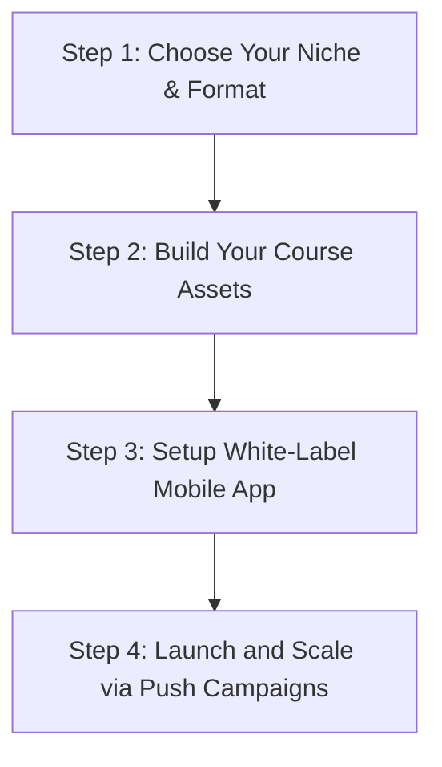

Whether you are a YouTube content creator with an engaged base of subscribers or an offline teacher looking to expand your reach nationally, monetizing your audience online is the most profitable business move you can make in 2026.

However, many educators fail because they rely solely on YouTube AdSense (which pays pennies) or launch on third-party course aggregators that take a huge percentage of their profits. 

To help you scale to a stable, recurring business, we have mapped out a **proven 4-step framework** to transition your audience into a highly profitable digital academy.

---

## 🗺️ The 4-Step Roadmap to Launch Your Branded Academy

### Step 1: Define Your Premium Offer
Don’t just sell basic video lectures that students can find for free on YouTube. Bundle your expertise into a premium offer:
*   **Structured Video Modules:** Organized, ad-free video courses with clear learning objectives.
*   **Custom Test Series:** CAT, JEE, UPSC, or school-level mock test engines with instant performance reports.
*   **Exclusive Interactive Community:** Live doubt-clearing sessions and peer-to-peer discussion chats.

### Step 2: Choose the Right LMS Partner
Avoid platforms that impose high transaction fees or lock you into their ecosystem. You need a white-label partner that lets you keep **100% of your earnings** and own your user data. Popular platforms like **Classplus** and **Graphy** offer standard setups, while **CareerWithMohit** provides a fully custom-branded app designed to highlight your individual authority.

### Step 3: Implement Strong Content Security
Ensure your study materials, premium notes, and video courses are protected against piracy. A native mobile app builder ensures:
*   **Screen-recording blocks** on Android and iOS devices.
*   **Watermarking** that displays the student's phone number or IP address dynamically.
*   **Preventing simultaneous logins** so students cannot share accounts.

### Step 4: Automate Marketing and Payouts
Link your app with a local payment gateway (like Razorpay) supporting UPI, Cards, and Netbanking. Set up automated invoicing to handle GST compliance easily. Once launched, use mobile push notifications to drive sales for new mock test series or study materials directly.

---

[InquiryCard title="Monetize Your Audience the Right Way" description="Connect with Mohit Jain to discuss course structures, app-building options, and payment gateway setup support for your online academy." cta="Talk to Mohit" type="career"]

---

## 📊 Comparison: AdSense vs. Aggregators vs. Branded Turnkey Apps

To understand the difference in earnings, look at the potential revenue model for 1,000 course sales priced at ₹2,000 each (Total Sales = ₹20,000,000):

| Monetization Stream | Typical Revenue Share | What You Earn | Key Drawback |
| :--- | :--- | :--- | :--- |
| **YouTube AdSense** | Negligible CPM | ~₹20,000 - ₹50,000 | Requires millions of views to make minor profits |
| **Course Aggregators (Udemy)** | Takes up to 63% cut | ~₹740,000 | Zero branding, forced discounts, loss of customer data |
| **White-Label App (CareerWithMohit)** | Flat fee + standard PG | **~₹19,600,000 (Keep 98%)** | Requires active promotion to your own audience |

---

## ❓ Frequently Asked Questions (FAQ)

**Q1. Do I need coding skills to launch my app?**
No. White-label app builders handle all the technology, updates, server hosting, and security. You only need to focus on recording courses, uploading PDFs, and engaging with your students.

**Q2. When is the best time for a YouTuber to launch their app?**
Once you have over 5,000 subscribers, AdSense revenue is rarely enough to support full-time content creation. Launching a branded coaching app allows you to convert even a small percentage of your subscribers into high-paying, loyal students.

**Q3. How can I handle student support?**
Choose a platform that supports native live chat inside the app. This allows you or your team to address doubts, handle payment issues, and manage student communications in one central place.

---

*Related articles to optimize your online school:*
*   [Classplus vs. Graphy vs. CareerWithMohit: Side-by-Side Comparison](/blog/classplus-vs-graphy-vs-careerwithmohit-best-coaching-app-builder-2026)
*   [How to Choose the Best Branded Coaching App Builder](/blog/best-platforms-sell-courses-online-comparison-2026)
*   [How to Securing Your Content Against Piracy](/blog/anti-piracy-securing-video-content-educators-2026)

---

**Empower Your Students. Own Your Platform.**
Start treating your educational channel like a real enterprise. Connect with our experts today to outline a monetization strategy that puts you in full control.

[👉 Book My Digital Academy Demo](/sell-your-coaching-online) | [💬 Chat with Mohit](/inquiry)

---

### 🚀 Boost Your Preparation

Looking for more resources? **[Explore Our Premium MBA Mock Test Series 2026](https://www.careerwithmohit.online/tools/mock-tests)** to get real-time exam experience and detailed performance analytics.

---
