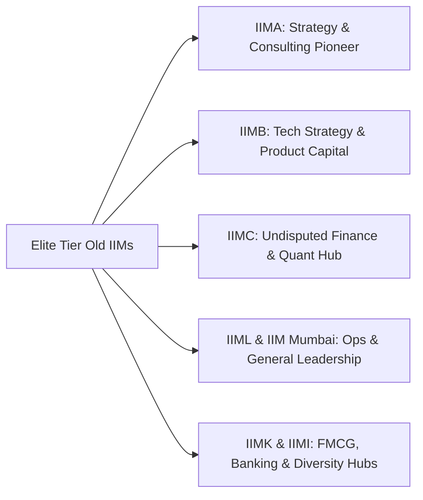
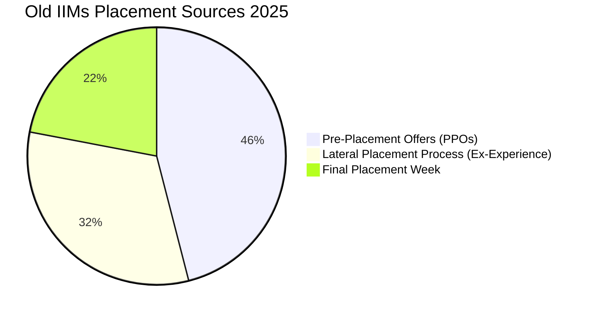

When it comes to elite business education in Asia, the **IIM BLACKI** group—**[IIM Bangalore](/colleges/iim-bangalore), [IIM Lucknow](/blog/all-about-iim-colleges-placements-fees-selection-2026), [IIM Ahmedabad](/colleges/iim-ahmedabad), [IIM Calcutta](/colleges/iim-calcutta), IIM Kozhikode, and IIM Indore**—alongside the newly designated **IIM Mumbai (formerly NITIE)**, represents the pinnacle of executive placements in India.

The **2025 placement season** at these premier institutes demonstrated undeniable institutional strength. While lateral hiring in the broader IT sector experienced recalibration, global management consulting conglomerates, private equity firms, bulge-bracket investment banks, and consumer goods giants competed vigorously on these 7 campuses.

Here is the comprehensive deep-dive into the **IIM BLACKI & IIM Mumbai Placement Report 2025**.

---

[InquiryCard title="Targeting Old IIMs (BLACKI) with CAT 2025/2026?" description="Get your academic profile evaluated, understand calling cutoffs, and receive personalized interview prep mentorship." cta="Get Free Profile Evaluation" type="admission"]

---

## 1. Quick Comparison: Old IIMs & IIM Mumbai Placement 2025

| Institute | Batch Size | Average Package (CTC) | Median Package | Highest Package (Domestic/Intl) | Top Recruiting Domain |
| :--- | :--- | :--- | :--- | :--- | :--- |
| **[IIM Ahmedabad](/colleges/iim-ahmedabad)** | ~400 | **₹34.45 LPA** | ₹31.50 LPA | ₹1.10 Cr (Domestic) | Management Consulting (38%) |
| **[IIM Bangalore](/colleges/iim-bangalore)** | ~500 | **₹34.88 LPA** | ₹32.00 LPA | ₹1.15+ Cr (Intl) | Consulting & Tech Strategy (42%) |
| **[IIM Calcutta](/colleges/iim-calcutta)** | ~460 | **₹34.23 LPA** | ₹31.20 LPA | **₹1.45 Cr (Intl)** | BFSI & Investment Banking (32%) |
| **IIM Lucknow** | ~500 | **₹32.30 LPA** | ₹30.00 LPA | ₹1.00 Cr | Consulting & Gen Management (35%) |
| **IIM Mumbai** | ~480 | **₹31.00 LPA** *(Top 50%: ₹34.50 L)* | ₹29.50 LPA | ₹71.40 LPA | Supply Chain, Fin & Tech (34%) |
| **IIM Indore** | ~580 | **₹29.75 LPA** | ₹27.20 LPA | ₹70.00 LPA | Consulting, Sales & Marketing (30%) |
| **IIM Kozhikode** | ~520 | **₹28.18 LPA** | ₹26.50 LPA | ₹81.00 LPA | Consulting, BFSI & Retail (33%) |

---

## 2. Campus-by-Campus Breakdown

### 1. [IIM Ahmedabad](/colleges/iim-ahmedabad) (IIMA)
*   **Average Salary**: ₹34.45 LPA | **Median Salary**: ₹31.50 LPA
*   **IPRS Audited Reporting**: Adhering to the Indian Placement Reporting Standards (IPRS), IIM Ahmedabad maintains complete transparency across domestic base pay and performance incentives.
*   **Top Recruiters**: McKinsey & Co. (largest recruiter with 18+ offers), Boston Consulting Group (BCG), Bain & Co., Kearney, Strategy&, Goldman Sachs, and Tata Administrative Services (TAS).
*   **Cluster Placement System**: IIMA conducted placements across three distinct cohorts, ensuring equal recruiter access without interview burnout.

### 2. [IIM Bangalore](/colleges/iim-bangalore) (IIMB)
*   **Average Salary**: ₹34.88 LPA | **Median Salary**: ₹32.00 LPA
*   **PPO Strength**: Over 220 students secured Pre-Placement Offers (PPOs) via their summer internships at global investment banks and management consulting firms.
*   **Notable Recruiters**: Accenture Strategy (top recruiter), Bain & Company, Oliver Wyman, Microsoft, Amazon, EY-Parthenon, and American Express.

### 3. [IIM Calcutta](/colleges/iim-calcutta) (IIMC)
*   **Average Salary**: ₹34.23 LPA | **Median Salary**: ₹31.20 LPA
*   **Highest Package**: ₹1.45 Crore per annum (International role based in Europe/Middle East).
*   **The "Joka" Finance Powerhouse**: Joka students swept top-tier private equity, venture capital, and derivatives trading desks including Avendus Capital, Barclays, Citi, DE Shaw, Goldman Sachs, JP Morgan Chase, and Morgan Stanley.

### 4. IIM Mumbai (Formerly NITIE)
*   **Average Salary**: ₹31.00 LPA (Overall) | **Top 50% Average**: ₹34.50 LPA
*   **Highest Offer**: ₹71.40 LPA
*   **Unrivaled Industry Connect**: As India's prime supply chain and operations nerve center, IIM Mumbai witnessed aggressive recruitment from Apple, Amazon, P&G, Unilever, ITC, Landmark Group, and Micron.

### 5. IIM Lucknow (IIML)
*   **Average Salary**: ₹32.30 LPA | **Top 25% Average**: ₹44.00 LPA
*   **Key Trends**: Consulting roles captured 35% of total offers, followed closely by BFSI (25%) and General Management (18%).

### 6. IIM Kozhikode & IIM Indore
*   **IIM Kozhikode**: Recorded an average of ₹28.18 LPA with 100% placement completion, driven by strong recruiter confidence in its highly diverse and gender-balanced cohort.
*   **IIM Indore**: Clocked ₹29.75 LPA average, supported by over 150 marquee recruiters including AB InBev, Dabur, Marico, Kotak Mahindra, and Samsung.

---

## 3. PPO Trends & Why Summer Internships Matter Most

In the 2025 placement cycle across Old IIMs, **over 40% to 48% of the final graduating class received pre-placement offers (PPOs)** directly from their summer internships.

> [!TIP]
> **Key Takeaway for Aspirants**: Getting into an Old IIM is step one; the real battle for 40+ LPA packages is won during the **Summer Internship Placement (SIP)** season conducted within the first 3 months of joining campus.

---

## 4. Summary for MBA Aspirants

The 2025 placement data from IIM BLACKI and IIM Mumbai proves that elite credentials continue to command premium corporate valuation regardless of short-term economic turbulence.

*   To learn more about all 21 IIMs, read our **[All IIM Recent Placement Report 2025 Master Guide](/blog/all-iim-recent-placement-report-2025)**.
*   Check the minimum scores needed with our **[All IIM Cut Off 2026-28 Analysis](/blog/all-iim-cut-off-2026-28-admission-mba-pgdm)**.
*   Understand the strategic advantages in our **[What is IIM BLACKI Guide](/blog/what-is-iim-blacki-complete-guide-2026)**.

---

### 🚀 Boost Your Preparation

Looking for more resources? **[Explore Our Premium MBA Mock Test Series 2026](/mock-tests)** to get real-time exam experience and detailed performance analytics.

---
