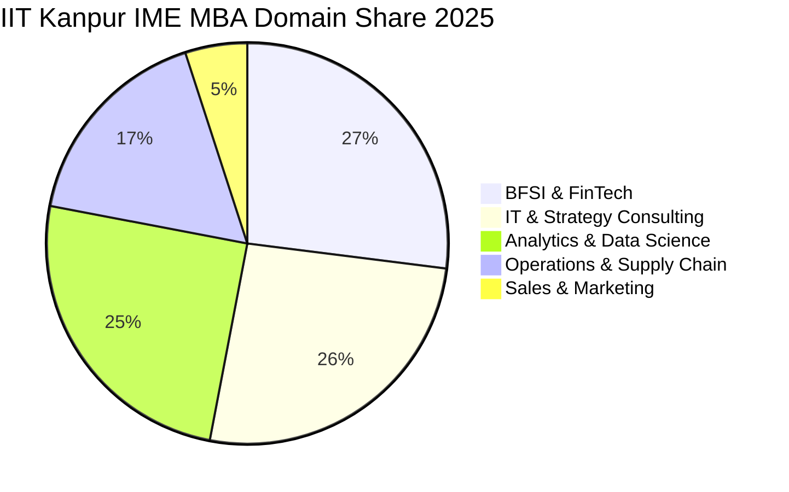

The **Department of Industrial & Management Engineering (IME) at IIT Kanpur** is celebrated for its deep mathematical focus, statistical modeling, and industrial optimization.

The **2025 MBA placement season** at IIT Kanpur reflected intense corporate demand for quantitative business problem-solvers across data science, FinTech, supply chain logistics, and management consulting.

Here is the complete **IIT Kanpur IME MBA Placement Report 2025**.

---

[InquiryCard title="Looking for Unbeatable ROI MBA Colleges?" description="Discover top low-fee MBA options including IIT Kanpur, FMS Delhi, and JBIMS Mumbai with Mohit Jain." cta="Get Free Counselling" type="admission"]

---

## 1. IIT Kanpur IME MBA Placement 2025 Highlights

| Metric | Statistics (2025 Placement Cycle) |
| :--- | :--- |
| **Placement Success** | **100% Placement Record** |
| **Average CTC (Estimated/Reported)**| **₹17.50 – 18.20 LPA** |
| **Median CTC** | **₹16.80 LPA** |
| **Top 25% Batch Average** | **₹23.50 LPA** |
| **Top 50% Batch Average** | **₹20.40 LPA** |
| **Highest CTC** | **₹28.50+ LPA** |
| **Total 2-Year Program Fees** | **₹5.50 – 6.50 Lakhs (Extremely Low)** |

---

## 2. Domain-Wise Hiring Distribution 2025

### Top Recruiters by Function:
*   **Analytics & Data Science**: Tiger Analytics, Fractal, EXL, Mu Sigma, Genpact, LatentView.
*   **BFSI & Quantitative Risk**: Wells Fargo, Barclays, ICICI Bank, HDFC Bank, Axis Capital, TresVista.
*   **IT & Consulting**: Deloitte, PwC, Cognizant, Infosys Consulting, Capgemini.
*   **Operations & Manufacturing**: Tata Motors, Reliance Industries, Adani Group, Havells.

---

## 3. Superlative ROI: Fees vs Placement Earnings

With tuition fees under **₹6.5 Lakhs** for the entire 2-year duration and an average salary near **₹18 LPA**, students recover their entire educational investment within **under 4 to 5 months** of starting their corporate jobs.

*   Read related IIT analysis: **[DoMS IIT Roorkee Placement Report 2025](/blog/doms-iit-roorkee-mba-placement-report-2025)**
*   Read national overview: **[All 21 IIMs Placement Report 2025](/blog/all-iim-recent-placement-report-2025)**

---

### 🚀 Boost Your Preparation

Looking for more resources? **[Explore Our Premium MBA Mock Test Series 2026](/mock-tests)** to get real-time exam experience and detailed performance analytics.

---
