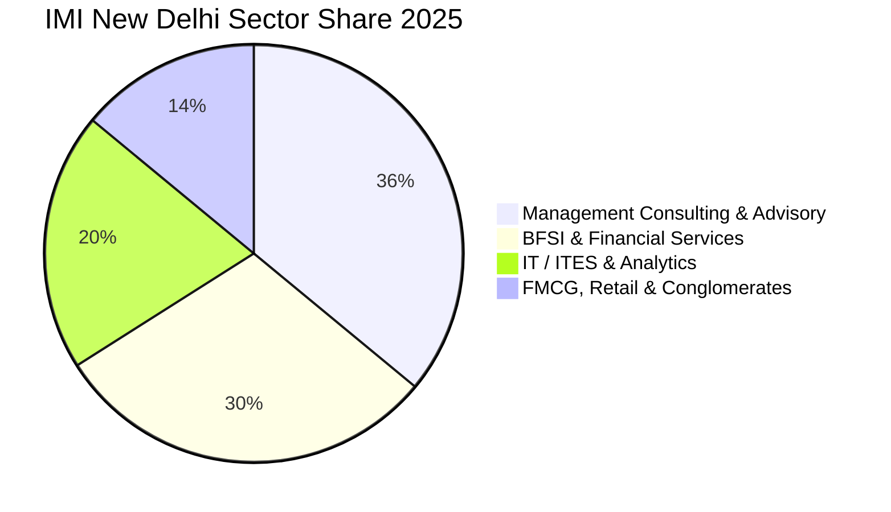

Located in the heart of South Delhi’s institutional area, the **International Management Institute (IMI), New Delhi** is India’s first corporate-sponsored business school and holds coveted international accreditations from AMBA, AACSB, and SAQS.

The **2025 PGDM placement season** delivered high salary growth, achieving an average CTC of **₹18.28 LPA** and a peak offer of **₹40.31 LPA**, powered by massive recruitment in Management Consulting, BFSI, and Information Technology.

Here is the complete **IMI New Delhi PGDM Placement Report 2025**.

---

[InquiryCard title="Targeting IMI New Delhi, FORE, or Top Delhi NCR B-Schools?" description="Get your CAT/XAT percentiles evaluated and map your admission chances with Mohit Jain." cta="Get Free Counselling" type="admission"]

---

## 1. IMI New Delhi Placement 2025 Highlights

| Metric | Statistics (2025 Graduating Cohort) |
| :--- | :--- |
| **Placement Rate** | **100% Final Placements** |
| **Average Package (CTC)** | **₹18.28 LPA** |
| **Median Package (CTC)** | **₹17.10 LPA** |
| **Highest Package (CTC)** | **₹40.31 LPA** |
| **Top 25% Batch Average** | **₹24.80 LPA** |
| **Top 50% Batch Average** | **₹21.20 LPA** |
| **Total 2-Year Program Fees** | ₹21.00 – 22.00 Lakhs |

---

## 2. Sectoral Placement Split 2025

### Top Recruiters by Industry:
*   **Management Consulting (36%)**: Deloitte, PwC, KPMG, EY, Accenture Strategy, Gartner, GEP, Bain Capability Network.
*   **BFSI (30%)**: Goldman Sachs, Morgan Stanley, HSBC, Barclays, HDFC Bank, ICICI Bank, Standard Chartered, Axis Bank.
*   **Technology & Analytics (20%)**: Microsoft, Amazon, Infosys, Wipro, Capgemini, EXL, Genpact.
*   **FMCG & Conglomerates (14%)**: Nestlé, ITC, Reckitt, Tata Steel, Reliance, RPG Group.

---

## 3. Related Placement Reports

*   **[MDI Gurgaon Placement Report 2025](/blog/mdi-gurgaon-pgdm-placement-report-2025)**
*   **[IMT Ghaziabad Placement Report 2025](/blog/imt-ghaziabad-pgdm-placement-report-2025)**
*   **[FORE School of Management Placement Report 2025](/blog/fore-school-of-management-delhi-placement-report-2025)**
*   **[All 21 IIMs Recent Placement Report 2025](/blog/all-iim-recent-placement-report-2025)**

---

### 🚀 Boost Your Preparation

Looking for more resources? **[Explore Our Premium MBA Mock Test Series 2026](/mock-tests)** to get real-time exam experience and detailed performance analytics.

---
