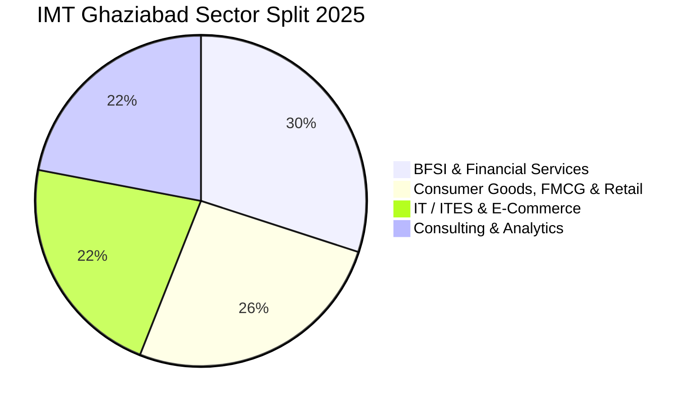

Recognized across India Inc. as the "Marketing Mecca" of management education, the **Institute of Management Technology (IMT), Ghaziabad** continues to deliver commanding placements across Consumer Goods, BFSI, Consulting, and Analytics.

The **2025 PGDM placement season** saw robust recruitment, achieving a consolidated average CTC of **₹16.25 LPA** (with top 25% averaging **₹23.50+ LPA**) and a peak offer of **₹41.55 LPA**.

Here is the complete **IMT Ghaziabad PGDM Placement Report 2025**.

---

[InquiryCard title="Targeting IMT Ghaziabad or Top Delhi NCR B-Schools?" description="Get your CAT/XAT score evaluated, explore shortlisting criteria, and prepare for PI rounds with Mohit Jain." cta="Get Free Counselling" type="admission"]

---

## 1. IMT Ghaziabad Placement 2025 Highlights

| Metric | Placement Statistics (2025 Graduating Batch) |
| :--- | :--- |
| **Average CTC (Overall)** | **₹16.25 LPA** *(Interim touches ₹18.89 L)* |
| **Median CTC** | **₹15.00 LPA** |
| **Highest Domestic Package** | **₹41.55 LPA** |
| **Top 25% Batch Average** | **₹23.80 LPA** |
| **Top 50% Batch Average** | **₹19.40 LPA** |
| **Total 2-Year Program Fees** | ₹21.00 – 22.00 Lakhs |

---

## 2. Sectoral Distribution: The Marketing & BFSI Stronghold

### Key Recruiters by Sector:
*   **FMCG & Consumer Goods (26%)**: Marico, HUL, Nestlé, Britannia, Reckitt, Asian Paints, Tata Consumer, Dabur, L'Oréal.
*   **BFSI & FinTech (30%)**: Goldman Sachs, Morgan Stanley, HSBC, HDFC Bank, ICICI Bank, Kotak Mahindra, Standard Chartered.
*   **Consulting & Analytics (22%)**: Deloitte, PwC, KPMG, EY, Accenture, Gartner, Cognizant.
*   **Technology & E-Commerce (22%)**: Amazon, Microsoft, Google, Flipkart, Media.net, Cisco.

---

## 3. Related Placement Reports

*   **[MDI Gurgaon Placement Report 2025](/blog/mdi-gurgaon-pgdm-placement-report-2025)**
*   **[IMI New Delhi Placement Report 2025](/blog/imi-new-delhi-pgdm-placement-report-2025)**
*   **[FORE School of Management Placement Report 2025](/blog/fore-school-of-management-delhi-placement-report-2025)**
*   **[All 21 IIMs Recent Placement Report 2025](/blog/all-iim-recent-placement-report-2025)**

---

### 🚀 Boost Your Preparation

Looking for more resources? **[Explore Our Premium MBA Mock Test Series 2026](/mock-tests)** to get real-time exam experience and detailed performance analytics.

---
