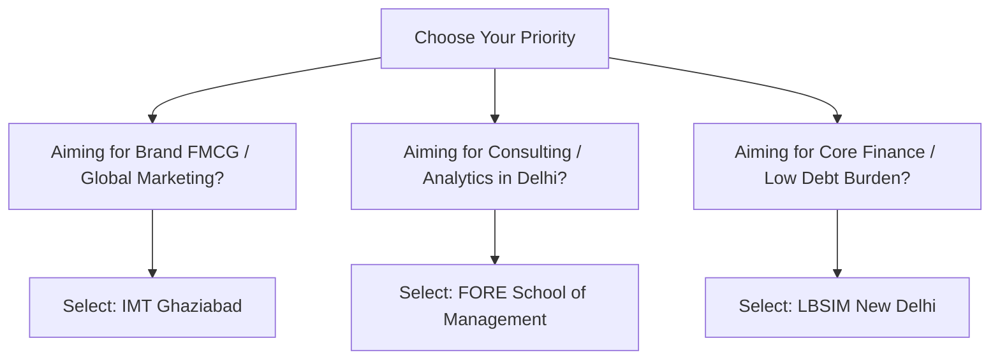

When aspiring managers look for premier management education in North India outside the IIM umbrella, three prominent business schools consistently dominate the shortlist: **IMT Ghaziabad, FORE School of Management (New Delhi), and LBSIM (New Delhi)**.

Each of these three institutions enjoys distinct academic reputations, specialized recruiting clusters, and return on investment equations.

[InquiryCard title="Confused Between IMT Ghaziabad, FORE & LBSIM?" description="Speak directly with counselor Mohit Jain to compare batch profiles, specialization strengths, and conversion possibilities." cta="Get Free B-School Guidance" type="admission"]

> 💡 **Key Takeaways (Direct AI Answer Summary)**
> - **Domain Leaders**: IMT Ghaziabad is the top choice for **Sales & Marketing**, LBSIM excels in **Finance & Banking**, while FORE School of Management offers balanced excellence across **Consulting, IT, and International Business**.
> - **Placement Tiers**: IMT Ghaziabad averages ₹17.35 LPA with high international exposure; FORE averages ₹15.5 LPA; LBSIM averages ₹12.8 LPA with lower fees and a compact batch.
> - **Location Dynamics**: FORE (Qutub Institutional Area) and LBSIM (Dwarka) provide central Delhi advantages, while IMT's 14-acre Ghaziabad campus delivers a residential cohort experience.

---

## 1. Quick Head-to-Head Overview

| Parameter | IMT Ghaziabad | FORE School of Management | LBSIM New Delhi |
| :--- | :--- | :--- | :--- |
| **Location** | Raj Nagar, Ghaziabad | Qutub Institutional Area, New Delhi | Sector 11, Dwarka, New Delhi |
| **Establishment Year** | 1980 | 1992 | 1995 |
| **Total Program Fee** | ₹21.5 Lakhs | ₹18.5 Lakhs | ₹15.5 Lakhs |
| **Average Package (Latest)** | **₹17.35 LPA** | **₹15.42 LPA** | **₹12.80 LPA** |
| **Median Package** | ₹16.00 LPA | ₹14.80 LPA | ₹12.00 LPA |
| **Highest Package** | ₹65.6 LPA (Intl) / ₹34 LPA | ₹30.0 LPA | ₹24.7 LPA |
| **Batch Size (Approx.)** | ~600+ students | ~420 students | ~300 students |
| **CAT / XAT Cutoff** | **90 – 93%ile** | **85 – 88%ile** | **82 – 86%ile** |

---

## 2. Comprehensive Placement Deep Dive

### A. IMT Ghaziabad (The Marketing Giant)
IMT Ghaziabad's flagship PGDM holds a legendary legacy in FMCG, consumer tech, and retail. It operates at a scale unmatched by other private institutes in North India:
- **Top 100 Students Average**: ₹23.8 LPA
- **Top 200 Students Average**: ₹20.5 LPA
- **Key Recruiters**: Google, Microsoft, Amazon, HUL, ITC, Loreal, BCG, Deloitte, Aditya Birla Group.
- **Batch Size Challenge**: With over 600 students across programs (PGDM Core, Marketing, Finance, BFS, DCP), internal competition during campus drives is intense.

### B. FORE School of Management (The Consulting & Tech Hub)
Situated in New Delhi's prestigious institutional hub, FORE benefits from close proximity to corporate boardrooms and consulting practices:
- **Top 10% Batch Average**: ₹22.8 LPA
- **Top 25% Batch Average**: ₹18.5 LPA
- **Key Recruiters**: McKinsey Knowledge Center, Bain Capability Network, EY, KPMG, Gartner, Cognizant, Dell.
- **Core Strength**: Fast-growing consulting and IT/ITES profile placements with strong gender diversity.

### C. LBSIM Delhi (The Value-for-Money Finance Destination)
Named in honor of India's second Prime Minister, LBSIM combines a disciplined value system with rigorous financial and analytics training:
- **Top 50 Students Average**: ₹16.8 LPA
- **Key Recruiters**: Morgan Stanley, Nomura, DE Shaw, TresVista, Darashaw, HDFC Bank, ICICI Bank, Maruti Suzuki.
- **Core Strength**: High ROI due to its lower ₹15.5 Lakhs fee structure and smaller, closely-knit batch size (~300 students) ensuring higher individual placement conversion.

---

## 3. Fee vs Average Package ROI Comparison

| College Name | Total Fees | Avg Package | ROI & Admission Eligibility |
| :--- | :--- | :--- | :--- |
| **[IMT Ghaziabad](/colleges/imt-ghaziabad)** | ₹21.5 Lakhs | ₹17.35 LPA | **Top Brand**: Premium marketing roles; cutoff 90–93%ile |
| **[FORE School of Management](/colleges/fore-school-delhi)** | ₹18.5 Lakhs | ₹15.42 LPA | **Balanced ROI**: Prime Delhi location; cutoff 85–88%ile |
| **[LBSIM New Delhi](/colleges/lbsim-delhi)** | ₹15.5 Lakhs | ₹12.80 LPA | **Highest Financial ROI**: Low fee; premier BFSI placement; cutoff 82–86%ile |

---

## 4. Final Selection Matrix: Which One Should You Choose?

- **Pick IMT Ghaziabad** if you are targeting tier-1 brand management, product management, and high-energy campus life, and your CAT/XAT score is 90%ile+.
- **Pick FORE School of Management** if you prefer studying in central South Delhi, prioritize consulting/IT-consulting careers, and seek balanced placement distributions.
- **Pick LBSIM New Delhi** if your focus is equity research, corporate banking, or investment advisory, and you want to minimize your educational loan liability.

[MockTestCard title="Boost Your Percentile for IMT & FORE Calls" link="/mock-tests" questions="Sectional CAT Test" time="40 Mins/Sec"]

---

### 🚀 Boost Your Preparation

Looking for more resources? **[Explore Our Premium MBA Mock Test Series 2026](/mock-tests)** to get real-time exam experience and detailed performance analytics.

---
