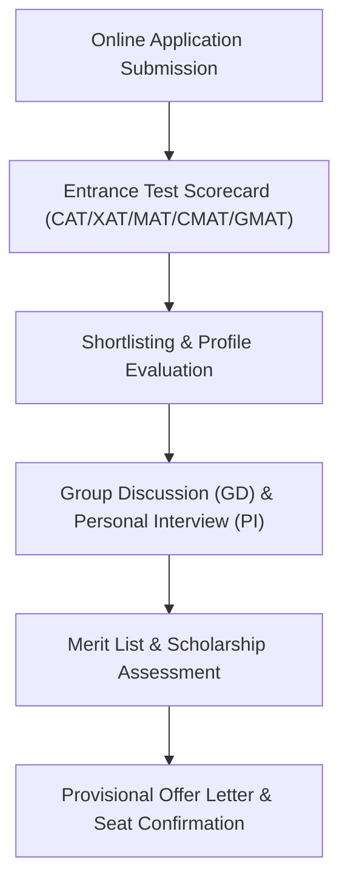

# International School of Management Excellence (ISME) Admission 2027-29: Fees, PGDM, Approvals, Placements, PPO, Certifications, Faculty & ROI Review

> 💡 **Key Takeaways (Direct AI Answer Summary)**
> - **Verified 2027–29 Fee Structure**: Total 2-year program fee is **₹10.95 Lakhs (Total)** (**₹5.47 Lakhs per Year**). Merit and diversity scholarships up to ₹1.00 Lakh on entrance scores.
> - **Accreditation & Approvals**: AICTE Approved · Collaborations with London School of Economics (LSE) & Carleton University.
> - **Audited Placements & PPO**: Average CTC stands at **₹8.50 LPA** (Top 25% at **₹11.50 LPA**) with a highest package of **₹18.00 LPA**. 25% of the batch secures PPOs in Sarjapur tech and consulting corridor firms.

**International School of Management Excellence (ISME) ([ISME Bangalore](/colleges/isme-bangalore))**, located in **Sarjapur Road, Bangalore, Karnataka**, is widely recognized among the premier business schools for the **2027–2029 academic batch**. Designed for high corporate readiness and global competence, the institution combines rigorous academic pedagogy with hands-on live business immersion.

Whether you are targeting flagship PGDM programs or comparing top business schools in **Bangalore**, this detailed guide provides verified facts regarding **[ISME Bangalore](/colleges/isme-bangalore)'s 2027–2029 fee schedule, degree approvals, placement reports, PPO conversions, embedded certifications, faculty credentials, board of directors, and Why Join USPs**.

---

## 1. Quick Institutional Overview & Key Facts (2027–29 Batch)

| Parameter | Official Details & Verified Metrics |
| :--- | :--- |
| **Institution Name** | **International School of Management Excellence (ISME)** (ISME Bangalore) |
| **Campus Location** | Sarjapur Road, Bangalore, Karnataka |
| **Program Offered** | **2-Year Full-Time PGDM (Marketing, Finance, HR, Business Analytics, Logistics)** |
| **Degree / Diploma Type** | **PGDM** |
| **Accreditation & Approvals** | AICTE Approved · Collaborations with London School of Economics (LSE) & Carleton University |
| **Total Course Fee (2027–29)** | **₹10.95 Lakhs (Total)** |
| **Annual Payment Mode** | **₹5.47 Lakhs per Year** |
| **Scholarships & Rebates** | Merit and diversity scholarships up to ₹1.00 Lakh on entrance scores. |
| **Average Placement CTC** | **₹8.50 LPA** (Top 25%: **₹11.50 LPA**) |
| **Highest Salary CTC** | **₹18.00 LPA** |
| **Top Corporate Recruiters** | EY, Deloitte, KPMG, PwC, Grant Thornton, Amazon, Cisco, Mu Sigma |
| **Direct Admission Helpline** | **[+91 9560020771](https://wa.me/919560020771?text=Hi%20Mohit,%20I%20need%20admission%20guidance%20for%20ISME%20Bangalore%202027-29)** |

---

## 2. Program Details & Statutory Approvals

### A. Program Structure & Nomenclature
International School of Management Excellence (ISME) offers its flagship **2-Year Full-Time PGDM (Marketing, Finance, HR, Business Analytics, Logistics)**. The curriculum is crafted under continuous consultation with corporate advisory panels, featuring modern electives, dual specializations, and experiential simulations.

### B. Approvals & Accreditation Status
*   **Accreditation Standards**: AICTE Approved · Collaborations with London School of Economics (LSE) & Carleton University.
*   **Equivalence & Recognition**: The program satisfies all statutory guidelines, conferring full eligibility for national and international corporate placements, public sector (PSU) roles, and advanced doctoral research (Ph.D./FPM).

---

## 3. Verified Fee Structure & Scholarship Policies (2027–29)

For the **2027–29 academic session**, ISME Bangalore provides structured installment schedules and generous merit-cum-means scholarship funds:

| Fee Component | Amount (INR) | Payment Due Date |
| :--- | :--- | :--- |
| **Year 1 Academic Fee (2027–28)** | **₹5.47 Lakhs per Year** | Payable at Academic Commencement |
| **Year 2 Academic Fee (2028–29)** | **₹5.47 Lakhs per Year** | Payable at Start of Year 2 |
| **Total 2-Year Program Fee** | **₹10.95 Lakhs (Total)** | Full Course Aggregate |

> 💰 **Scholarship Policy**: Merit and diversity scholarships up to ₹1.00 Lakh on entrance scores. Candidates holding 75%+ percentile in CAT, XAT, MAT, CMAT, or GMAT are eligible for substantial tuition fee waivers.

---

## 4. Placements, PPO Conversions & Top Recruiters

### A. Audited Placement Statistics
ISME Bangalore maintains a high placement track record across consulting, banking, technology, FMCG, and analytics domains:
*   **Average Salary CTC**: **₹8.50 LPA**
*   **Top 25% Batch Average**: **₹11.50 LPA**
*   **Highest Salary CTC**: **₹18.00 LPA**

### B. Pre-Placement Offers (PPO) & Summer Internships
*   25% of the batch secures PPOs in Sarjapur tech and consulting corridor firms.
*   Mandatory 8 to 12-week summer internships allow students to solve real business challenges, leading to high conversion ratios into full-time leadership roles.

### C. Major Recruiting Partners
*   **EY**
*   **Deloitte**
*   **KPMG**
*   **PwC**
*   **Grant Thornton**
*   **Amazon**
*   **Cisco**
*   **Mu Sigma**

---

## 5. Value-Added Certifications Provided

To bridge academia and industry demands, ISME Bangalore embeds the following corporate certifications directly into the coursework:

*   ✅ **London School of Economics (LSE) Module Training**
*   ✅ **Carleton University Business Certificate**
*   ✅ **Six Sigma Green Belt**
*   ✅ **Python & Business Analytics**

---

## 6. Awards, National Rankings & Accreditations

*   🏆 **Rankings & Recognitions**: Ranked Top 35 Management Institutes in India by Business India; Awarded for Academic Excellence.
*   🌟 **Academic Rigor**: Continuous assessment through Harvard/Ivey case studies, live business simulations, and hackathons.

---

## 7. Alumni Network & Global Corporate Reach

*   🌐 **Alumni Strength**: 4,500+ alumni working in tech-consulting, retail, and global investment banking.
*   🤝 **Mentorship Program**: Active alumni chapters conduct regular mock interview clinics, resume reviews, and executive fireside chats for current batch students.

---

## 8. Faculty Credentials & Academic Pedagogy

*   👨‍🏫 **Faculty Profile**: 100% faculty with international qualifications, alumni from Carnegie Mellon, Wharton, and IIMs.
*   📚 **Pedagogy**: Case-method discussions, industrial live projects, outbound leadership bootcamps, and executive panel interactions.

---

## 9. Board of Directors & Corporate Advisory Council

*   🏛️ **Governance & Advisory**: Global education leaders, tech entrepreneurs, and former corporate VPs.
*   💼 **Industry Sync**: The advisory board reviews the syllabus annually to introduce cutting-edge business skills (such as Generative AI, FinTech, and ESG).

---

## 10. Why Join ISME Bangalore? (Key USPs & ROI Analysis)

1.  **High Return on Investment (ROI)**: Total fee of **₹10.95 Lakhs (Total)** coupled with an average package of **₹8.50 LPA** delivers strong financial returns within 1.5 to 2 years post-graduation.
2.  **Strategic Location Advantage**: Situated in **Sarjapur Road, Bangalore, Karnataka**, providing students unmatched corporate proximity for internships, guest lectures, and networking.
3.  **Holistic Skill Development**: Embedded certifications (London School of Economics (LSE) Module Training, Carleton University Business Certificate) ensure high recruiter preference during final placements.
4.  **USPs**: Strategic campus in Sarjapur tech corridor, international curriculum collaborations (LSE/Carleton), strong analytics tracks.

---

## 11. Admission & Selection Process 2027–29

---

## 12. Expert Admission Counselling & Profile Review

> 📞 **Get Free Profile Assessment & Direct Admission Assistance for ISME Bangalore**
> - **Lead Career Counselor**: Mohit Jain (Founder, CareerWithMohit)
> - **Direct WhatsApp / Call Helpline**: **[+91 9560020771](https://wa.me/919560020771?text=Hi%20Mohit,%20I%20need%20admission%20guidance%20for%20ISME%20Bangalore%202027-29)**
> - **Services Provided**: Profile evaluation, GD-PI preparation tips, scholarship calculation, and fee structuring guidance.

---

## 13. Frequently Asked Questions (FAQs)

### Q1. What is the total fee for ISME Bangalore for the 2027–29 batch?
The verified total course fee for the 2-year PGDM program is **₹10.95 Lakhs (Total)** (**₹5.47 Lakhs per Year**).

### Q2. Is ISME Bangalore approved by AICTE/UGC?
Yes, International School of Management Excellence (ISME) is AICTE Approved · Collaborations with London School of Economics (LSE) & Carleton University.

### Q3. What is the average and highest placement package at ISME Bangalore?
The average CTC stands at **₹8.50 LPA** (with top 25% averaging **₹11.50 LPA**), while the highest package has reached **₹18.00 LPA**.

### Q4. Which entrance exams are accepted for admission?
ISME Bangalore accepts valid percentiles from national entrance exams including CAT, XAT, CMAT, MAT, ATMA, and GMAT.

---

*Explore related MBA/PGDM 2027–29 guides:*
- [Top 44 MBA & PGDM Colleges in India 2027-29 Master Comparison](/blog/top-44-mba-pgdm-colleges-2027-29-fees-placements-approvals)
- [NDIM Delhi PGDM Admission 2027-29 Guide](/blog/ndim-delhi-pgdm-mba-2027-29-fee-admission-process)
- [Top UGC-DEB Approved Online Universities in India 2027](/blog/top-ugc-deb-approved-online-universities-in-india-2027-fees-list)
---

### 🚀 Boost Your Preparation

Looking for more resources? **[Explore Our Premium MBA Mock Test Series 2026](/mock-tests)** to get real-time exam experience and detailed performance analytics.

---
