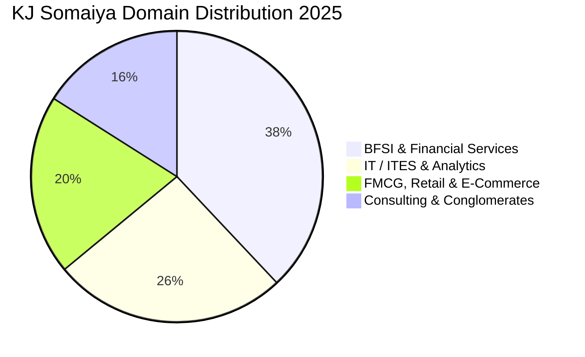

Located on a sprawling 60-acre green campus in Mumbai, the **K.J. Somaiya Institute of Management (KJSIM)** under Somaiya Vidyavihar University is one of Western India's most established private management institutions, holding global AACSB accreditation.

The **2025 MBA placement report**, strictly audited for transparency, recorded an average package of **₹12.70 LPA**, a top offer of **₹23.03 LPA**, and active participation from over **100 marquee recruiters**.

Here is the complete **KJ Somaiya Mumbai MBA Placement Report 2025**.

---

[InquiryCard title="Targeting KJ Somaiya, NMIMS, or Top Mumbai MBA Colleges?" description="Get your CAT/XAT/NMAT/CMAT percentiles evaluated and explore admission options with Mohit Jain." cta="Get Free Counselling" type="admission"]

---

## 1. KJ Somaiya Placement 2025 Highlights

| Metric | Statistics (2025 Audited Report) |
| :--- | :--- |
| **Average CTC (Overall MBA)** | **₹12.70 LPA** |
| **Median CTC** | **₹12.25 LPA** |
| **Highest CTC** | **₹23.03 LPA** |
| **Top 25% Batch Average** | **₹16.80 LPA** |
| **Top 50% Batch Average** | **₹14.50 LPA** |
| **Total Participating Recruiters** | 100+ Companies |
| **Total 2-Year Program Fees** | ₹20.50 – 21.50 Lakhs |

---

## 2. Sectoral Placement Split 2025

### Leading Corporate Recruiters:
*   **BFSI & Banking (38%)**: JP Morgan, Morgan Stanley, Barclays, HDFC Bank, ICICI Bank, Axis Bank, IndusInd, Nomura, Kotak Mahindra.
*   **IT & Analytics (26%)**: Accenture, Infosys, Cognizant, Wipro, Capgemini, Dell, Oracle.
*   **FMCG & Retail (20%)**: Nestlé, ITC, Britannia, Marico, Tata Consumer, Reliance Retail.
*   **Consulting & Research (16%)**: Deloitte, PwC, KPMG, EY, NielsenIQ, Kantar.

---

## 3. Related Placement Reports

*   **[SPJIMR Mumbai Placement Report 2025](/blog/spjimr-mumbai-pgdm-placement-report-2025)**
*   **[BITSoM Mumbai Placement Report 2025](/blog/bitsom-mumbai-mba-placement-report-2025)**
*   **[TAPMI Manipal Placement Report 2025](/blog/tapmi-manipal-mba-placement-report-2025)**
*   **[All 21 IIMs Recent Placement Report 2025](/blog/all-iim-recent-placement-report-2025)**

---

### 🚀 Boost Your Preparation

Looking for more resources? **[Explore Our Premium MBA Mock Test Series 2026](/mock-tests)** to get real-time exam experience and detailed performance analytics.

---
