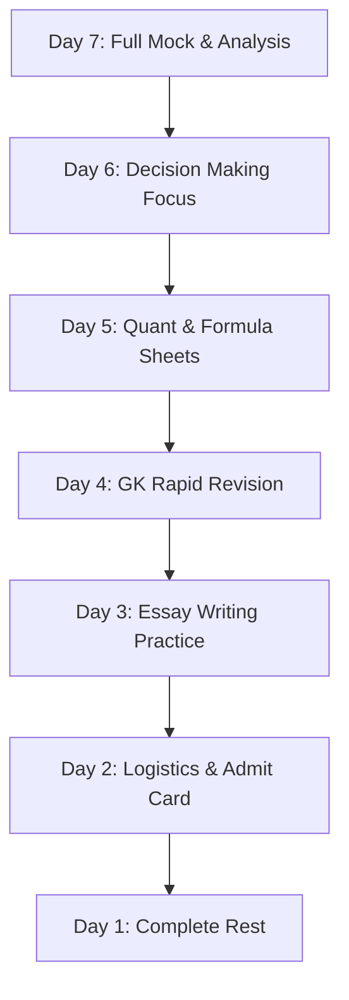

The final week leading up to the Xavier Aptitude Test (XAT) is often filled with anxiety. Unlike CAT, which is held in November, XAT takes place in early January. This gives candidates an extra month of preparation, but it also increases the pressure to perform, as XAT is often the final opportunity to secure a seat at a premier Tier-1 business school like [XLRI Jamshedpur](/colleges/xlri-jamshedpur).

To maximize your performance, you must shift your focus from learning new concepts to consolidation, mock analysis, and mental conditioning. 

Here is a day-by-day preparation strategy for the final 7 days before XAT 2026.

---

## The 7-Day Day-by-Day Action Plan

### Day 7: The Final Full-Length Mock
- **Action:** Take a full-length XAT mock test at the exact time of the actual exam.
- **Goal:** Practice your sectional time management. Remember, Part 1 of XAT is 175 minutes long, and you must distribute this time among VALR, Decision Making, and QADI.
- **Analysis:** Focus on *why* you made mistakes. Were they due to calculation errors, conceptual gaps, or poor set selection?

### Day 6: Decision Making Marathon
- **Action:** Solve 40 to 50 Decision Making questions from past XAT papers (2018 to 2025).
- **Goal:** Align your thinking with the XLRI key. Focus on resolving conflicts ethically, pragmatically, and with stakeholder consensus.
- **Resource:** Read our detailed guide on [XAT 2026 Decision-Making Section Strategy](/blog/xat-2026-decision-making-question-trends-how-to-crack).

### Day 5: Quantitative Aptitude Revision
- **Action:** Review your formula sheets and shortcut notes. Focus on arithmetic, algebra, and geometry.
- **Goal:** Do not solve new, complex math problems. Instead, ensure you remember basic properties (such as triangle theorems, logarithm rules, and progression formulas).

### Day 4: General Knowledge (GK) Rapid Revision
- **Action:** Revise the GK highlights of the last 12 months. Focus on: business mergers, CEO appointments, national awards, sports championships, and global treaties.
- **Goal:** GK marks are not counted for the initial percentile, but they are evaluated during the XLRI interview process and have a separate cutoff. Spend 2–3 hours revising current affairs.

### Day 3: Essay Writing Practice
- **Action:** Pick 3 past XAT essay topics (e.g., topics related to technology, philosophy, or social trends) and practice writing them.
- **Goal:** Write a structured essay within a 250-word limit. Ensure you include: an introduction, arguments for, arguments against, and a clear conclusion.

### Day 2: Document Check & Logistics
- **Action:** Download and print your XAT admit card. Affix your passport-size photo. Locate your test center and plan your travel.
- **Goal:** Avoid any last-minute panic. Organize your stationery, ID proofs, and clothing.

### Day 1: Complete Rest
- **Action:** Do not study today. Spend time with family, watch a light movie, and sleep for at least 8 hours.
- **Goal:** Go into the exam hall with a fresh, active mind. Mental fatigue is the biggest enemy of performance in a 3.5-hour exam like XAT.

---

## Critical XAT Exam-Day Strategy

- **Negative Marking for Skips:** Remember that XAT has a unique marking scheme. You get -0.25 marks for a wrong answer, but you also get **-0.10 marks for consecutive unattempted questions beyond 8 skips**. Keep track of your skips; if you are skipping too many questions, make a calculated attempt on close options.
- **Sectional Time Management:** We recommend the following time split for Part 1:
  - **VALR:** 55 Minutes
  - **Decision Making:** 35 Minutes
  - **Quantitative Aptitude & DI:** 80 Minutes
  - **Buffer/Review:** 5 Minutes
- **The Essay is Important:** Do not neglect the essay writing section. Write in a neutral, professional, and clear tone.

For a review of other speed-based exams that take place around this time, read our guide on the [NMAT Speed & Accuracy Trends](/blog/nmat-2026-speed-accuracy-trends-3-attempts-prep-strategy) or prepare using our [Free NMAT Mock Test](/blog/free-nmat-mock-test-2026-nmims-prep).

[👉 Unsure about your exam-day strategy? Speak to our MBA admission experts for last-minute guidance!](/inquiry)

---

## ❓ Frequently Asked Questions (FAQ)

### How do I check my exam results online?
You can check results on the official website of the conducting bodies (e.g., NTA for JEE/NEET/CUET, or respective boards/testing organizations) using your application registration number.

### Are mock tests helpful in exam preparation?
Yes, attempting mock tests helps candidates build speed and accuracy, understand the exam pattern, and perform detailed analytics of strong and weak sections.

### What is the significance of negative marking in entrance exams?
Many competitive exams deduct marks for wrong answers (e.g., -1 or -0.25). Candidates should avoid guessing to maintain accuracy and prevent score drops.

Source: Shiksha.com
---

### 🚀 Boost Your Preparation

Looking for more resources? **[Explore Our Premium MBA Mock Test Series 2026](/mock-tests)** to get real-time exam experience and detailed performance analytics.

---
