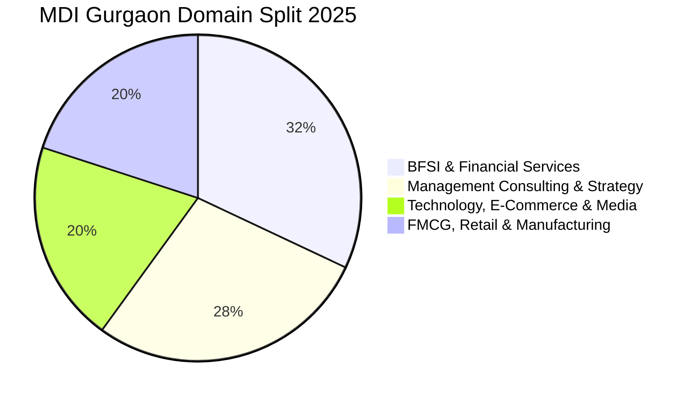

The **Management Development Institute (MDI), Gurgaon** is recognized as one of India's premier B-schools, benefiting immensely from its prime location at the epicenter of Delhi-NCR's corporate hub.

The **2025 PGDM placement season** at MDI Gurgaon concluded with **100% placements across a massive batch of 555 students**, recording an average CTC of **₹25.60 LPA** and a highest package of **₹53.60 LPA**.

Here is the complete **MDI Gurgaon PGDM Placement Report 2025**.

---

[InquiryCard title="Targeting MDI Gurgaon, SPJIMR, or Top Private B-Schools?" description="Get personalized CAT percentile mapping, profile analysis, and WAT-GD-PI interview mentorship from Mohit Jain." cta="Get Free Counselling" type="admission"]

---

## 1. MDI Gurgaon Placement 2025 Highlights

| Metric | Placement Statistics (2025 Cohort) |
| :--- | :--- |
| **Total Students Placed** | **555 Students (100% Placement)** |
| **Total Participating Recruiters** | **147 Companies (67 New Recruiters)** |
| **Average Package (CTC)** | **₹25.60 LPA** |
| **Median Package (CTC)** | **₹24.20 LPA** |
| **Highest Package (CTC)** | **₹53.60 LPA** |
| **Top 25% Batch Average** | **₹33.50 LPA** |
| **Top 50% Batch Average** | **₹28.90 LPA** |
| **Total 2-Year Program Fees** | ₹24.50 – 25.50 Lakhs |

---

## 2. Program-Wise Placement Comparison 2025

| Program Name | Average CTC (2025) | Median CTC | Highest CTC |
| :--- | :--- | :--- | :--- |
| **PGDM (Flagship Core)** | **₹26.20 LPA** | ₹24.80 LPA | ₹53.60 LPA |
| **PGDM - HRM (Human Resources)** | **₹24.50 LPA** | ₹23.00 LPA | ₹38.00 LPA |
| **PGDM - IB (International Business)**| **₹25.10 LPA** | ₹23.80 LPA | ₹44.00 LPA |

---

## 3. Sector-Wise Placement Split 2025

### Top Recruiters:
*   **BFSI (32%)**: Goldman Sachs, JP Morgan, Morgan Stanley, Barclays, Avendus Capital, Bank of America, Standard Chartered, ICICI Bank.
*   **Consulting (28%)**: McKinsey, BCG, Bain, Deloitte, PwC, EY, KPMG, Accenture Strategy, GEP.
*   **Tech & E-Commerce (20%)**: Microsoft, Amazon, Google, Flipkart, Media.net, Cisco, Adobe.
*   **FMCG & Conglomerates (20%)**: ITC, HUL, Nestlé, Mondelez, ABG, TAS, Mahindra GMC, Godrej.

---

## 4. Related Placement Reports

*   **[SPJIMR Mumbai Placement Report 2025](/blog/spjimr-mumbai-pgdm-placement-report-2025)**
*   **[XLRI Jamshedpur & Delhi Placement Report 2025](/blog/xlri-jamshedpur-delhi-placement-report-2025)**
*   **[IMI New Delhi Placement Report 2025](/blog/imi-new-delhi-pgdm-placement-report-2025)**
*   **[All 21 IIMs Recent Placement Report 2025](/blog/all-iim-recent-placement-report-2025)**

---

### 🚀 Boost Your Preparation

Looking for more resources? **[Explore Our Premium MBA Mock Test Series 2026](/mock-tests)** to get real-time exam experience and detailed performance analytics.

---
