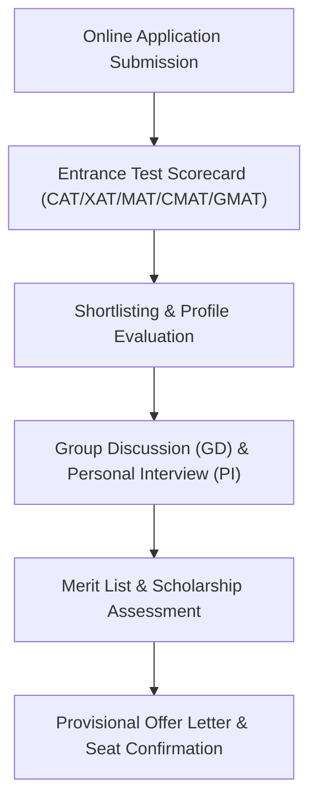

# [Management Education & Research Institute (MERI)](/colleges/management-education-research-institute-meri) Admission 2027-29: Fees, MBA / PGDM, Approvals, Placements, PPO, Certifications, Faculty & ROI Review

> 💡 **Key Takeaways (Direct AI Answer Summary)**
> - **Verified 2027–29 Fee Structure**: Total 2-year program fee is **₹5.95 Lakhs (Total)** (**₹2.97 Lakhs per Year**). Merit rebates and fee concessions for meritorious candidates and defense wards.
> - **Accreditation & Approvals**: AICTE Approved · Affiliated to GGSIPU (for MBA) · NAAC Grade A.
> - **Audited Placements & PPO**: Average CTC stands at **₹7.50 LPA** (Top 25% at **₹9.80 LPA**) with a highest package of **₹20.00 LPA**. Strong local corporate internship ties leading to 20% PPO conversions.

**[Management Education & Research Institute (MERI)](/colleges/management-education-research-institute-meri) (MERI Janakpuri)**, located in **Janakpuri, West Delhi**, is widely recognized among the premier business schools for the **2027–2029 academic batch**. Designed for high corporate readiness and global competence, the institution combines rigorous academic pedagogy with hands-on live business immersion.

Whether you are targeting flagship MBA / PGDM programs or comparing top business schools in **New Delhi**, this detailed guide provides verified facts regarding **MERI Janakpuri's 2027–2029 fee schedule, degree approvals, placement reports, PPO conversions, embedded certifications, faculty credentials, board of directors, and Why Join USPs**.

---

## 1. Quick Institutional Overview & Key Facts (2027–29 Batch)

| Parameter | Official Details & Verified Metrics |
| :--- | :--- |
| **Institution Name** | **Management Education & Research Institute (MERI)** (MERI Janakpuri) |
| **Campus Location** | Janakpuri, West Delhi |
| **Program Offered** | **PGDM (AICTE Approved) & MBA (GGSIPU Affiliated)** |
| **Degree / Diploma Type** | **MBA / PGDM** |
| **Accreditation & Approvals** | AICTE Approved · Affiliated to GGSIPU (for MBA) · NAAC Grade A |
| **Total Course Fee (2027–29)** | **₹5.95 Lakhs (Total)** |
| **Annual Payment Mode** | **₹2.97 Lakhs per Year** |
| **Scholarships & Rebates** | Merit rebates and fee concessions for meritorious candidates and defense wards. |
| **Average Placement CTC** | **₹7.50 LPA** (Top 25%: **₹9.80 LPA**) |
| **Highest Salary CTC** | **₹20.00 LPA** |
| **Top Corporate Recruiters** | TCS, Infosys, HCL, Axis Bank, Kotak Mahindra, ICICI Bank, Amazon, Grail Research |
| **Direct Admission Helpline** | **[+91 9560020771](https://wa.me/919560020771?text=Hi%20Mohit,%20I%20need%20admission%20guidance%20for%20MERI%20Janakpuri%202027-29)** |

---

## 2. Program Details & Statutory Approvals

### A. Program Structure & Nomenclature
Management Education & Research Institute (MERI) offers its flagship **PGDM (AICTE Approved) & MBA (GGSIPU Affiliated)**. The curriculum is crafted under continuous consultation with corporate advisory panels, featuring modern electives, dual specializations, and experiential simulations.

### B. Approvals & Accreditation Status
*   **Accreditation Standards**: AICTE Approved · Affiliated to GGSIPU (for MBA) · NAAC Grade A.
*   **Equivalence & Recognition**: The program satisfies all statutory guidelines, conferring full eligibility for national and international corporate placements, public sector (PSU) roles, and advanced doctoral research (Ph.D./FPM).

---

## 3. Verified Fee Structure & Scholarship Policies (2027–29)

For the **2027–29 academic session**, MERI Janakpuri provides structured installment schedules and generous merit-cum-means scholarship funds:

| Fee Component | Amount (INR) | Payment Due Date |
| :--- | :--- | :--- |
| **Year 1 Academic Fee (2027–28)** | **₹2.97 Lakhs per Year** | Payable at Academic Commencement |
| **Year 2 Academic Fee (2028–29)** | **₹2.97 Lakhs per Year** | Payable at Start of Year 2 |
| **Total 2-Year Program Fee** | **₹5.95 Lakhs (Total)** | Full Course Aggregate |

> 💰 **Scholarship Policy**: Merit rebates and fee concessions for meritorious candidates and defense wards. Candidates holding 75%+ percentile in CAT, XAT, MAT, CMAT, or GMAT are eligible for substantial tuition fee waivers.

---

## 4. Placements, PPO Conversions & Top Recruiters

### A. Audited Placement Statistics
MERI Janakpuri maintains a high placement track record across consulting, banking, technology, FMCG, and analytics domains:
*   **Average Salary CTC**: **₹7.50 LPA**
*   **Top 25% Batch Average**: **₹9.80 LPA**
*   **Highest Salary CTC**: **₹20.00 LPA**

### B. Pre-Placement Offers (PPO) & Summer Internships
*   Strong local corporate internship ties leading to 20% PPO conversions.
*   Mandatory 8 to 12-week summer internships allow students to solve real business challenges, leading to high conversion ratios into full-time leadership roles.

### C. Major Recruiting Partners
*   **TCS**
*   **Infosys**
*   **HCL**
*   **Axis Bank**
*   **Kotak Mahindra**
*   **ICICI Bank**
*   **Amazon**
*   **Grail Research**

---

## 5. Value-Added Certifications Provided

To bridge academia and industry demands, MERI Janakpuri embeds the following corporate certifications directly into the coursework:

*   ✅ **Digital Marketing & SEO Mastery**
*   ✅ **Advanced Excel for Financial Analysis**
*   ✅ **NSE NCFM Financial Markets Certification**
*   ✅ **Retail Analytics & Operations**

---

## 6. Awards, National Rankings & Accreditations

*   🏆 **Rankings & Recognitions**: NAAC Grade A Accredited; Awarded Best ROI B-School in West Delhi.
*   🌟 **Academic Rigor**: Continuous assessment through Harvard/Ivey case studies, live business simulations, and hackathons.

---

## 7. Alumni Network & Global Corporate Reach

*   🌐 **Alumni Strength**: 7,000+ alumni across IT, banking, and public sector organizations.
*   🤝 **Mentorship Program**: Active alumni chapters conduct regular mock interview clinics, resume reviews, and executive fireside chats for current batch students.

---

## 8. Faculty Credentials & Academic Pedagogy

*   👨‍🏫 **Faculty Profile**: Core faculty with average teaching and industry experience exceeding 14 years.
*   📚 **Pedagogy**: Case-method discussions, industrial live projects, outbound leadership bootcamps, and executive panel interactions.

---

## 9. Board of Directors & Corporate Advisory Council

*   🏛️ **Governance & Advisory**: Chaired by veteran educationists and former senior bureaucrats from Delhi administration.
*   💼 **Industry Sync**: The advisory board reviews the syllabus annually to introduce cutting-edge business skills (such as Generative AI, FinTech, and ESG).

---

## 10. Why Join MERI Janakpuri? (Key USPs & ROI Analysis)

1.  **High Return on Investment (ROI)**: Total fee of **₹5.95 Lakhs (Total)** coupled with an average package of **₹7.50 LPA** delivers strong financial returns within 1.5 to 2 years post-graduation.
2.  **Strategic Location Advantage**: Situated in **Janakpuri, West Delhi**, providing students unmatched corporate proximity for internships, guest lectures, and networking.
3.  **Holistic Skill Development**: Embedded certifications (Digital Marketing & SEO Mastery, Advanced Excel for Financial Analysis) ensure high recruiter preference during final placements.
4.  **USPs**: Highly affordable fee structure (₹5.95L), outstanding placement ROI, located right next to Janakpuri metro corridor.

---

## 11. Admission & Selection Process 2027–29

---

## 12. Expert Admission Counselling & Profile Review

> 📞 **Get Free Profile Assessment & Direct Admission Assistance for MERI Janakpuri**
> - **Lead Career Counselor**: Mohit Jain (Founder, CareerWithMohit)
> - **Direct WhatsApp / Call Helpline**: **[+91 9560020771](https://wa.me/919560020771?text=Hi%20Mohit,%20I%20need%20admission%20guidance%20for%20MERI%20Janakpuri%202027-29)**
> - **Services Provided**: Profile evaluation, GD-PI preparation tips, scholarship calculation, and fee structuring guidance.

---

## 13. Frequently Asked Questions (FAQs)

### Q1. What is the total fee for MERI Janakpuri for the 2027–29 batch?
The verified total course fee for the 2-year MBA / PGDM program is **₹5.95 Lakhs (Total)** (**₹2.97 Lakhs per Year**).

### Q2. Is MERI Janakpuri approved by AICTE/UGC?
Yes, Management Education & Research Institute (MERI) is AICTE Approved · Affiliated to GGSIPU (for MBA) · NAAC Grade A.

### Q3. What is the average and highest placement package at MERI Janakpuri?
The average CTC stands at **₹7.50 LPA** (with top 25% averaging **₹9.80 LPA**), while the highest package has reached **₹20.00 LPA**.

### Q4. Which entrance exams are accepted for admission?
MERI Janakpuri accepts valid percentiles from national entrance exams including CAT, XAT, CMAT, MAT, ATMA, and GMAT.

---

*Explore related MBA/PGDM 2027–29 guides:*
- [Top 44 MBA & PGDM Colleges in India 2027-29 Master Comparison](/blog/top-44-mba-pgdm-colleges-2027-29-fees-placements-approvals)
- [NDIM Delhi PGDM Admission 2027-29 Guide](/blog/ndim-delhi-pgdm-mba-2027-29-fee-admission-process)
- [Top UGC-DEB Approved Online Universities in India 2027](/blog/top-ugc-deb-approved-online-universities-in-india-2027-fees-list)
---

### 🚀 Boost Your Preparation

Looking for more resources? **[Explore Our Premium MBA Mock Test Series 2026](/mock-tests)** to get real-time exam experience and detailed performance analytics.

---
