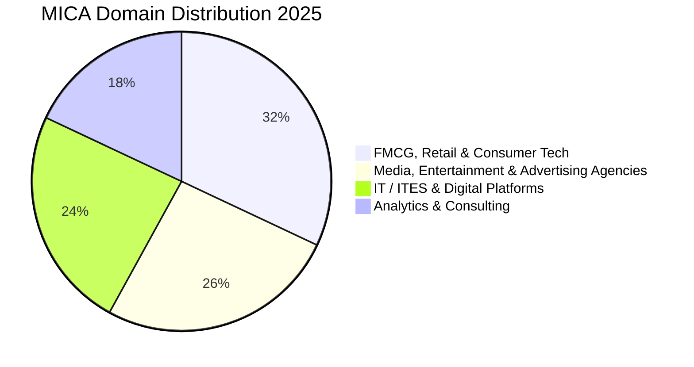

Known as the "School of Ideas", **MICA Ahmedabad** is the undisputed leader in South Asia for Strategic Marketing, Creative Brand Communications, Digital Transformation, and Media Analytics.

The **2025 PGDM placement season** at MICA concluded with a **100% placement track record**, recording an average CTC of **₹19.22 LPA** and a highest package of **₹40.91 LPA**.

Here is the complete **MICA Ahmedabad PGDM Placement Report 2025**.

---

[InquiryCard title="Preparing for MICAT 2026 or Targeting Brand Management?" description="Get your profile evaluated and receive structured guidance for MICAT, descriptive tests, and GE-PI with Mohit Jain." cta="Get Free MICAT Counselling" type="admission"]

---

## 1. MICA Ahmedabad Placement 2025 Highlights

| Metric | Placement Statistics (2025 Graduating Class) |
| :--- | :--- |
| **Placement Success** | **100% Placement Record** |
| **Average CTC (Overall)** | **₹19.22 LPA** |
| **Median CTC** | **₹18.00 LPA** |
| **Highest CTC** | **₹40.91 LPA** |
| **Top 25% Batch Average** | **₹26.50 LPA** |
| **Top 50% Batch Average** | **₹22.10 LPA** |
| **Total 2-Year Program Fees** | ₹23.00 – 24.50 Lakhs |

---

## 2. Sectoral & Functional Hiring Breakdown 2025

### Leading Recruiters by Industry:
1. **FMCG & Consumer Goods (32%)**: Procter & Gamble (P&G), Hindustan Unilever (HUL), ITC, Nestlé, Amul, L'Oréal, Titan, Dabur.
2. **Media, OTT & Advertising (26%)**: Ogilvy, GroupM, DDB Mudra, Leo Burnett, Disney+ Hotstar, Sony Pictures, Spotify, Zee Entertainment.
3. **Tech & E-Commerce (24%)**: Google, Amazon, Microsoft, Meta, Flipkart, Swiggy, Zomato, Adobe.
4. **Consulting & Analytics (18%)**: Kantar, NielsenIQ, Deloitte, EY, PwC.

---

## 3. Related Placement Reports

*   **[SPJIMR Mumbai Placement Report 2025](/blog/spjimr-mumbai-pgdm-placement-report-2025)**
*   **[IMT Ghaziabad Placement Report 2025](/blog/imt-ghaziabad-pgdm-placement-report-2025)**
*   **[All 21 IIMs Recent Placement Report 2025](/blog/all-iim-recent-placement-report-2025)**

---

### 🚀 Boost Your Preparation

Looking for more resources? **[Explore Our Premium MBA Mock Test Series 2026](/mock-tests)** to get real-time exam experience and detailed performance analytics.

---
