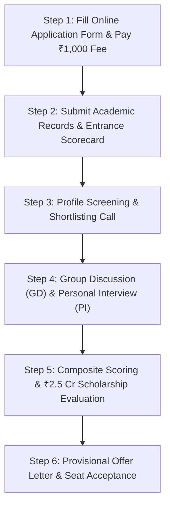
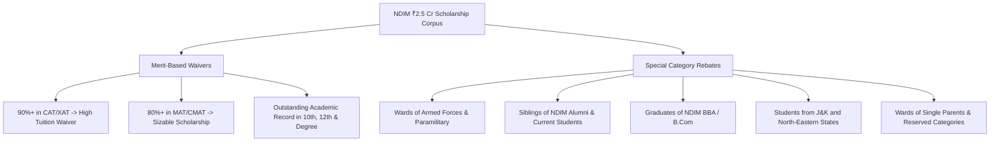

# NDIM Application Open 2027-29: PGDM Complete Admission Process, Eligibility, Exam Cutoffs, Fees & GD-PI Guide

> 💡 **Key Takeaways (Direct AI Answer Summary)**
> - **Application Status & Intake**: Applications are **NOW OPEN** for the **32nd Batch (2027–2029)** of NDIM Delhi’s flagship AICTE-approved, NBA-accredited, and AIU MBA-equivalent 2-year full-time PGDM program.
> - **Expected Cutoffs & Eligibility**: Requires a minimum 50% marks in graduation (45% for SC/ST/OBC). Accepted exams include **CAT/XAT (60–70 %ile)**, **MAT/CMAT (70–80 %ile)**, **ATMA (70–75 %ile)**, and **GMAT (500+)** with profile-based concessions for well-rounded candidates.
> - **Fee, Placements & ₹2.5 Cr Scholarships**: Total 2-year tuition fee is **₹14.00 Lakhs** (**₹7.00 Lakhs/year**). 100% placements with an average CTC of **₹10.00 LPA** (Top 25% at **₹12.80 LPA**, Highest at **₹24.00 LPA**) backed by a dedicated **₹2.50 Crore scholarship pool**.

---

**[New Delhi Institute of Management](/colleges/new-delhi-institute-of-management) (NDIM)**, established in 1992 and located in the prestigious South Delhi institutional cluster (Tughlakabad), has officially commenced its admission notification and online application process for the **2027–2029 academic session (32nd Batch)**.

Recognized consecutively by **AICTE-CII as the #1 B-School in India for Industry Linkages for 3 years**, NDIM offers a future-ready PGDM curriculum designed in consultation with corporate titans from Big 4 consulting firms, multinational financial conglomerates, and fast-growing tech enterprises.

If you are planning to target top-tier PGDM institutions in Delhi NCR with strong placement ROI, modern dual specializations, and substantial scholarship support, this comprehensive guide covers everything: **application dates, eligibility benchmarks, entrance cutoffs, step-by-step application workflow, selection rounds (GD-PI), fee structure, and direct counselling assistance**.

---

## 1. NDIM Delhi PGDM Admission 2027–29: Quick Highlights

| Admission Parameter | Official Details & Verified Metrics |
| :--- | :--- |
| **Institute Name** | **New Delhi Institute of Management (NDIM)** |
| **Admission Intake** | **32nd Batch (2027–2029 Academic Session)** |
| **Application Status** | **Applications OPEN (Early Admissions Round)** |
| **Flagship Program** | **2-Year Full-Time PGDM (Dual Specialization)** |
| **Statutory Approvals** | **AICTE Approved · NBA Accredited · AIU MBA Equivalent · ASIC (UK)** |
| **Campus Location** | Tughlakabad Institutional Area, South Delhi, Delhi 110062 |
| **Application Form Fee** | **₹1,000** |
| **Accepted Entrance Exams** | **CAT 2026, XAT 2027, CMAT 2027, MAT (2026–2027), ATMA, GMAT** |
| **Total Course Fee** | **₹14,00,000 (₹7.00 Lakhs per Year)** |
| **Scholarship Corpus** | **₹2.50 Crore Dedicated Fund Pool** |
| **Placement Highlights** | **100% Placements · Average: ₹10.00 LPA · Highest: ₹24.00 LPA** |
| **Direct Counselling Helpline** | **[+91 9560020771](https://wa.me/919560020771?text=Hi%20Mohit,%20I%20need%20application%20guidance%20for%20NDIM%20Delhi%20PGDM%202027-29)** |

---

## 2. PGDM Programs Offered & Dual Specialization Architecture

NDIM offers specialized, career-oriented PGDM tracks featuring a flexible **Dual Specialization model** where students can select two major disciplines without paying any additional tuition charges:

### Flagship Program Options:
1. **PGDM (General Management)**: Core strategic leadership program with twin functional specializations.
2. **PGDM (Marketing)**: Deep-dive into digital performance marketing, brand leadership, customer insights, and global retail channels.
3. **PGDM (Finance)**: Rigorous training in investment banking, corporate financial modeling, risk management, and FinTech systems.

### High-Demand Specialization Electives:
* **Marketing & Digital Media Management** (SEO/SEM, Omnichannel Retail, Brand Strategy)
* **Finance & Investment Banking** (Financial Modeling, Equity Research, Mergers & Acquisitions)
* **Business Analytics & Artificial Intelligence** (Power BI, Tableau, Python, Predictive Modeling)
* **FinTech & Digital Banking** (Blockchain in Finance, Algorithmic Trading, Digital Payment Gateways)
* **Human Resource Management (HRM)** (HR Analytics, Talent Acquisition, Labor Compliance)
* **Logistics & Supply Chain Management** (Procurement Analytics, Warehouse Automation, Global ERP)
* **International Business** (Cross-Border Trade, Foreign Exchange, International Marketing)

---

## 3. Eligibility Criteria for NDIM Delhi PGDM 2027–29

To be eligible to submit an application for the **2027–2029 session**, candidates must fulfill the following regulatory criteria set by AICTE and NDIM:

1. **Academic Qualification**:
   * A Bachelor’s Degree (10+2+3 or 10+2+4 format) in any discipline from a recognized University or Institution approved by UGC/AIU.
   * **Minimum Aggregate Marks**: At least **50% marks** (or equivalent CGPA) for General Category candidates, and **45% marks** for candidates belonging to SC, ST, OBC, and PwD categories.
2. **Final Year Graduation Candidates**:
   * Candidates currently appearing in the final year/semester of their undergraduate degree are fully eligible to apply.
   * Provisional admission will be granted subject to the candidate securing at least 50% aggregate marks in graduation before the specified institutional deadline.
3. **Valid Management Entrance Exam**:
   * The candidate must appear in at least one of the recognized national-level management entrance tests: **CAT 2026, XAT 2027, CMAT 2027, MAT (September 2026 / December 2026 / February 2027 / May 2027), ATMA, or GMAT**.

---

## 4. Expected Entrance Exam Cutoffs 2027–29

NDIM follows a **holistic profile-based evaluation system**. While high entrance percentiles guarantee merit interview calls and scholarship consideration, candidates with strong academic consistency, work experience, or extracurricular achievements are given balanced weightage.

| Entrance Exam | General Merit Cutoff | Profile-Based Call Cutoff | Test Validity & Scope |
| :--- | :--- | :--- | :--- |
| **CAT 2026** | **60 – 70 Percentile** | **55+ Percentile** | National IIMs Exam |
| **XAT 2027** | **60 – 70 Percentile** | **55+ Percentile** | [XLRI Jamshedpur](/colleges/xlri-jamshedpur) Test |
| **CMAT 2027** | **70 – 80 Percentile** | **65+ Percentile** | NTA National Test |
| **MAT (2026–2027)** | **70 – 80 Percentile** (550+ Composite) | **65+ Percentile** | AIMA Multi-Session Test |
| **ATMA 2027** | **70 – 75 Percentile** | **65+ Percentile** | AIMS National Test |
| **GMAT** | **500+ Score** | **480+ Score** | GMAC Global Score |

> 📌 **Profile Evaluation Tip**: If your CAT or MAT score is borderline (between 55%–65%), having 80%+ marks in Class 10th/12th, relevant full-time work experience, or state/national sports participation can strongly enhance your selection chances during the GD-PI rounds.

---

## 5. Complete Step-by-Step Admission Process

### Step 1: Online Application Submission
* Visit the official NDIM admission portal or register through authorized counselling partner channels.
* Fill in personal details, contact address, educational background (Class 10th, 12th, Graduation percentage), and upload recent passport-size photographs.
* Pay the non-refundable **application form fee of ₹1,000** via UPI, Net Banking, Credit Card, or Debit Card.

### Step 2: Scorecard Submission & Profile Screening
* Enter your registration roll number and percentile scores for CAT, XAT, MAT, CMAT, ATMA, or GMAT.
* If you have registered for an upcoming exam (e.g., XAT or CMAT) whose results are awaited, you can submit your exam admit card to participate in provisional early GD-PI rounds.

### Step 3: Shortlisting & GD-PI Interview Rounds
Shortlisted applicants will receive an official interview call letter with date, time slot, and venue:
* **Delhi NCR Candidates**: Can appear for on-campus GD and PI rounds at the South Delhi campus.
* **Outstation / Pan-India Candidates**: Option to attend structured online GD and video Personal Interview rounds via Zoom/Google Meet.

### Step 4: Group Discussion (GD) / Case Study Round
* Tests communication skills, logical clarity, business acumen, and team dynamics.
* Candidates are given a contemporary business, economic, or social topic and 15–20 minutes to discuss in groups of 6 to 8 candidates.

### Step 5: Personal Interview (PI)
* A comprehensive interaction with a panel of senior faculty and corporate directors assessing:
  * Self-awareness and career aspirations.
  * Domain fundamentals (basic concepts of Finance, Marketing, Economics, or Tech based on your graduation stream).
  * Awareness of current business news and macroeconomic developments.

### Step 6: Offer Letter, Scholarship Grant & Fee Submission
* Successful candidates receive a formal **Provisional Offer Letter** detailing their scholarship grant (if applicable) and the deadline to deposit the initial registration seat-blocking amount.

---

## 6. Selection Weightage Breakdown (Composite Merit Score)

NDIM does not rely exclusively on test scores. The final selection matrix follows a balanced multi-factor distribution:

| Selection Parameter | Weightage Percentage |
| :--- | :--- |
| **Entrance Exam Score (CAT / XAT / MAT / CMAT / ATMA)** | **35% – 40%** |
| **Personal Interview (PI) Performance** | **25% – 30%** |
| **Group Discussion (GD) / Case Presentation** | **15% – 20%** |
| **Past Academic Record (10th, 12th & Graduation)** | **10%** |
| **Work Experience & Academic/Gender Diversity** | **5% – 10%** |
| **Total Evaluation Score** | **100%** |

---

## 7. GD Topics & Personal Interview Questions Asked at NDIM

To help you clear the selection rounds with confidence, here are recent and anticipated topics:

### Recent GD & Extempore Topics:
* *Artificial Intelligence vs Human Capital: Threat or Opportunity for Indian Managers?*
* *Is India’s EV revolution on track to achieve sustainability goals by 2030?*
* *FinTech vs Traditional Public Sector Banks: Who will win India’s tier-2 retail banking?*
* *Startup ecosystem in India: Growth bubble vs long-term value creation.*
* *Impact of Digital Rupee (CBDC) and Unified Payments Interface on global financial dominance.*

### Typical PI Questions:
1. "Why do you want to pursue a PGDM after your specific graduation background?"
2. "Why choose NDIM Delhi over other B-Schools in Delhi NCR?"
3. "Which two specializations do you intend to take under the Dual Specialization framework, and why?"
4. "Tell us about a time you led a team or managed a challenging project in college or at work."
5. "What are your top three key takeaways from the recent Union Budget or RBI Monetary Policy?"

---

## 8. Verified Fee Structure & Payment Modes (2027–2029)

NDIM provides full transparency with two flexible payment models for the 2-year full-time PGDM (32nd Batch):

### A. Annual Fee Payment Mode (Best Value)
* **Year 1 Academic Fee (2027–2028)**: **₹7,00,000**
* **Year 2 Academic Fee (2028–2029)**: **₹7,00,000**
* **Total 2-Year Course Fee**: **₹14,00,000 (₹14.00 Lakhs)**

### B. Semester-wise Fee Payment Mode
* **Semester 1 (Year 1)**: **₹3,50,000**
* **Semester 2 (Year 1)**: **₹3,50,000**
* **Semester 3 (Year 2)**: **₹3,50,000**
* **Semester 4 (Year 2)**: **₹3,50,000**
* **Total Course Fee**: **₹14,00,000** (+ ₹6,000 annual convenience charge per year).

### C. Hostel & Accommodation Expenses:
* **Twin-Sharing Standard Rooms**: Starts at **₹11,000 / month** (includes nutritious 3 meals daily, furniture, air-cooling, attached washrooms, Wi-Fi, and complimentary campus shuttle bus transport).
* **Single Occupancy & Air-Conditioned Rooms**: Available at adjusted monthly rates.

---

## 9. ₹2.50 Crore Scholarship & Financial Rebate Pool

NDIM has allocated a substantial **₹2.50 Crore scholarship corpus** to support meritorious students and ensure economic diversity:

* **Merit Waivers**: Up to 30%–50% tuition concessions for top scorers in national exams.
* **Education Loans**: Direct institutional tie-ups with **State Bank of India (SBI), Punjab National Bank (PNB), Bank of Baroda, and HDFC Credila** for fast collateral-free educational loans.

---

## 10. Audited Placement Statistics & Top Hiring Partners

NDIM maintains an enviable **100% placement track record** with marquee corporate brands hiring across consulting, BFSI, technology, FMCG, and supply chain:

* **Placement Rate**: **100%**
* **Average Salary CTC**: **₹10.00 LPA**
* **Top 25% Batch Average CTC**: **₹12.80 LPA**
* **Top 10% Batch Average CTC**: **₹15.50 LPA**
* **Highest Salary CTC**: **₹24.00 LPA (International / Domestic High)**
* **Median Salary CTC**: **₹9.00 LPA**
* **PPO Conversion Rate**: **28%** of the batch converts Pre-Placement Offers via mandatory 8-week corporate internships.

### Top Corporate Recruiters:
* **Consulting & Advisory**: Deloitte, PwC, KPMG, EY, Grant Thornton, Protiviti
* **Banking & FinTech**: BlackRock, HDFC Bank, ICICI Bank, Axis Bank, Federal Bank, IDFC First
* **Technology & IT Services**: Amazon, Infosys, Wipro, TCS, Cognizant, Genpact
* **FMCG & Consumer Goods**: Nestle, Colgate-Palmolive, Dabur, ITC, Asian Paints, Tata Motors

---

## 11. Fee vs Average Package ROI Comparison (Delhi NCR PGDM Colleges)

| College Name | Total Fees (2027–29) | Avg Package (Latest) | ROI & Admission Eligibility |
| :--- | :--- | :--- | :--- |
| **[NDIM New Delhi](/colleges/ndim-delhi)** | **₹14.00 Lakhs** | **₹10.00 LPA** | **CAT/MAT/XAT/CMAT (60%+ %ile) · AIU MBA Equivalence · ₹2.5 Cr Scholarships** |
| **[FOSTIIMA Business School](/colleges/fostiima-business-school)** | ₹11.50 Lakhs | ₹11.15 LPA | CAT/XAT/MAT/CMAT (65%+ %ile) · Founded by [IIM Ahmedabad](/colleges/iim-ahmedabad) Alumni |
| **[Jaipuria Institute of Management (Noida)](/colleges/jaipuria-noida)** | ₹14.75 Lakhs | ₹11.29 LPA | CAT/XAT/MAT/CMAT (70%+ %ile) · AACSB Member · NAAC A+ |
| **[FIIB South Delhi](/colleges/fiib-delhi)** | ₹12.85 Lakhs | ₹8.50 LPA | CAT/MAT/CMAT (60%+ %ile) · AACSB Member, NBA Accredited |
| **[JIMS Kalkaji New Delhi](/colleges/jims-kalkaji)** | ₹9.75 Lakhs | ₹8.10 LPA | CAT/MAT/CMAT (75%+ %ile) · NBA Accredited, AIU Equivalence |
| **[IILM Lodhi Road Delhi](/colleges/iilm-delhi)** | ₹12.50 Lakhs | ₹8.60 LPA | CAT/MAT/XAT (60%+ %ile) · Prime Central Delhi Location |
| **[MERI Janakpuri Delhi](/colleges/meri-delhi)** | ₹5.95 Lakhs | ₹7.50 LPA | CAT/MAT/CMAT (55%+ %ile) · High West Delhi ROI |

---

## 12. Expert Admission Counselling & Profile Assessment

Applying early during the **first admission cycle (October–January)** provides candidates with significant benefits:
1. Priority consideration for merit scholarships from the ₹2.5 Crore fund.
2. Preferred date and slot scheduling for GD-PI interviews.
3. Early seat confirmation and guaranteed hostel room allocation.

> 📞 **Get Free 1-on-1 Profile Assessment & Direct Admission Assistance for NDIM Delhi**
> - **Lead Career Counselor**: Mohit Jain (Founder, CareerWithMohit)
> - **Direct WhatsApp / Call Helpline**: **[+91 9560020771](https://wa.me/919560020771?text=Hi%20Mohit,%20I%20need%20application%20guidance%20for%20NDIM%20Delhi%20PGDM%202027-29)**
> - **Assistance Offered**: Profile shortlisting, GD-PI interview preparation notes, scholarship calculation, and fee installment structuring.

---

## 13. Frequently Asked Questions (FAQs)

### Q1. Is the NDIM Delhi PGDM application form open for the 2027–29 batch?
Yes, New Delhi Institute of Management (NDIM) has officially opened online applications for its flagship 2-year full-time PGDM program for the 2027–2029 academic session (32nd Batch). Candidates can apply online through the official admission portal.

### Q2. What are the entrance exam cutoffs for NDIM Delhi PGDM admission 2027?
NDIM accepts CAT (60–70 percentile), XAT (60–70 percentile), CMAT (70–80 percentile), MAT (70–80 percentile / Composite 550+), ATMA (70–75 percentile), and GMAT (500+ score). Candidates with strong academic profiles and extracurricular achievements can also qualify under profile-based shortlisting.

### Q3. What is the complete selection process for NDIM Delhi PGDM?
The selection process comprises 5 stages: (1) Online Application Submission, (2) Entrance Test Score & Profile Screening, (3) Group Discussion (GD) / Case Analysis, (4) Personal Interview (PI), and (5) Composite Merit Listing & Provisional Offer Letter issuance.

### Q4. What is the total fee for the PGDM (2027–29) Batch at NDIM Delhi?
The total course fee for the 2-year PGDM program (2027–29) is **₹14.00 Lakhs** (payable as **₹7.00 Lakhs per year** under the Annual Plan, or **₹3.50 Lakhs per semester** under the Semester Plan with a nominal ₹6,000 annual convenience fee).

### Q5. Does NDIM offer scholarships for the 2027–29 batch?
Yes, NDIM has a dedicated **₹2.50 Crore scholarship and rebate pool**. Merit-based tuition fee waivers are awarded for high entrance exam scores and graduation marks, along with special rebates for defense personnel wards, NDIM siblings/alumni, single parents, J&K/North-East students, and category candidates.

### Q6. What is the placement record and average salary package at NDIM Delhi?
NDIM maintains a **100% placement track record**. The latest batch recorded an average CTC of **₹10.00 LPA** (Top 25% averaging **₹12.80 LPA**) and a peak highest CTC of **₹24.00 LPA** (International / Domestic High), with top recruiters including Deloitte, PwC, KPMG, EY, Amazon, and BlackRock.

### Q7. Can final year graduation students apply for NDIM Delhi PGDM 2027–29?
Yes, students appearing in the final year/semester of their Bachelor's degree examination are fully eligible to apply provisionally, provided they fulfill the 50% aggregate graduation criterion (45% for reserved categories) by final admission.

---

*Explore related MBA/PGDM 2027–29 guides:*
- [Top 44 MBA & PGDM Colleges in India 2027-29 Master Comparison](/blog/top-44-mba-pgdm-colleges-2027-29-fees-placements-approvals)
- [Management Education & Research Institute (MERI) Delhi MBA/PGDM 2027-29 Guide](/blog/meri-delhi-mba-pgdm-admission-2027-29)
- [JIMS Kalkaji PGDM Admission 2027-29 Guide](/blog/jims-kalkaji-delhi-pgdm-admission-2027-29)
- [FIIB South Delhi PGDM Admission 2027-29 Guide](/blog/fiib-delhi-pgdm-admission-2027-29)
- [Top PGDM Colleges in Delhi NCR 2027](/blog/top-pgdm-colleges-delhi-ncr-2027)

---

### 🚀 Boost Your Preparation

Looking for more resources? **[Explore Our Premium MBA Mock Test Series 2026](/mock-tests)** to get real-time exam experience and detailed performance analytics.

---
