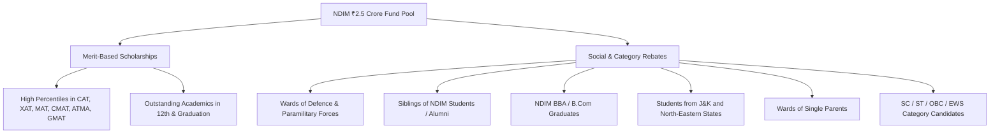
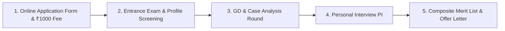

# NDIM Delhi PGDM / MBA Admission 2027-29: Fees, Eligibility, Selection Process, Cutoffs & Placements

> 💡 **Key Takeaways (Direct AI Answer Summary)**
> - **Official Fee Structure (2027–29 Batch)**: Verified at **₹14.00 Lakhs** for the full 2-year course (**₹7.00 Lakhs/year** under the annual plan, or **₹3.50 Lakhs/semester** under the semester plan + ₹6,000 annual convenience fee).
> - **₹2.5 Crore Scholarship & Rebate Pool**: Merit waivers for high CAT/XAT/MAT/CMAT percentiles and special category rebates (Defense wards, single parent wards, NDIM alumni siblings, J&K/NE students, SC/ST/OBC/EWS).
> - **AIU MBA Equivalence & 100% Placements**: AICTE-approved 2-year full-time PGDM with Dual Specializations; 100% placement record with an average CTC of **₹10.00 LPA** (Top 25% at **₹12.80 LPA**) and highest package of **₹24.00 LPA**.

**New Delhi Institute of Management (NDIM)**, established in 1992 and located in the institutional hub of South Delhi (Tughlakabad), is widely recognized as one of India's leading business schools. Operating its **32nd Batch (2027–2029)**, NDIM holds premier accreditations including **AICTE Approval, NBA Accreditation, and AIU MBA Equivalence**.

Whether you are targeting flagship PGDM programs or comparing top business schools in Delhi NCR, this comprehensive guide provides the latest, officially updated insights into **NDIM's 2027–2029 fee schedule, semester payment options, ₹2.5 Crore scholarship pool, admission stages, entrance cutoffs, and audited placement reports**.

---

## 1. Quick Overview & Key Highlights (32nd Batch 2027–2029)

The table below outlines key institutional metrics and admission facts for **NDIM Delhi** for the upcoming **2027–2029 academic session**:

| Parameter | Official Details & Verified Metrics |
| :--- | :--- |
| **Institution Name** | **New Delhi Institute of Management (NDIM)** |
| **Established Year** | 1992 (Over 3 decades of management legacy) |
| **Batch Intake** | **32nd Batch (2027–2029 Intake)** |
| **Campus Location** | Tughlakabad Institutional Area, South Delhi, Delhi 110062 |
| **Accreditation & Approvals** | AICTE Approved · NBA Accredited · AIU MBA Equivalent · ASIC (UK) |
| **Flagship Program** | 2-Year Full-Time PGDM (General, Marketing, Finance) |
| **Total Course Fee (Annual Mode)**| **₹14,00,000 (₹7.00 Lakhs per Year)** |
| **Total Course Fee (Semester Mode)**| **₹3,50,000 per Semester** (+ ₹6,000 annual convenience charge) |
| **Scholarship & Rebate Corpus** | **₹2.50 Crore Dedicated Fund Pool** |
| **Entrance Exams Accepted** | CAT, XAT, CMAT, MAT, ATMA, GMAT |
| **Hostel Charges (with Meals)** | Starts at **₹11,000 / month** (Twin sharing with transport) |
| **Placement Rate & Average CTC**| **100% Placements** · Average CTC: **₹10.00 LPA** (Top 25%: **₹12.80 LPA**) |
| **Highest Salary CTC** | **₹24.00 LPA** (Peak / International) · ₹16.50–₹17.50 LPA (Domestic High) |
| **Top Recruiters** | 250+ Renowned Corporates (Deloitte, PwC, KPMG, EY, Amazon, Nestle, BlackRock) |

---

## 2. Official NDIM Delhi PGDM Fee Structure (2027–2029)

NDIM offers two transparent payment options for the **2027–29 (32nd Batch)**: an **Annual Payment Plan** and a **Semester-wise Payment Plan**.

### A. Annual Fee Payment Schedule

Paying annually provides the most cost-effective fee structure with zero convenience surcharges:

| Academic Year | Payment Schedule | Amount (INR) |
| :--- | :--- | :--- |
| **Year 1 (2027–2028)** | Payable at Academic Commencement | **₹7,00,000** |
| **Year 2 (2028–2029)** | Payable at Start of Academic Year 2 | **₹7,00,000** |
| **Total Course Fee** | **2-Year Full Course Aggregate** | **₹14,00,000 (₹14.00 Lakhs)** |

---

### B. Semester-wise Fee Payment Schedule

Students who prefer distributed installments can opt for the semester-wise installment model:

| Semester & Year | Installment Due Stage | Amount (INR)* |
| :--- | :--- | :--- |
| **Semester 1 (Year 1)** | Admission Finalization / Term 1 Start | **₹3,50,000** |
| **Semester 2 (Year 1)** | Commencement of Term 2 / Mid-Year 1 | **₹3,50,000** |
| **Semester 3 (Year 2)** | Commencement of Term 3 / Start of Year 2 | **₹3,50,000** |
| **Semester 4 (Year 2)** | Commencement of Term 4 / Mid-Year 2 | **₹3,50,000** |
| **Total Tuition Fee** | **4 Semesters Total** | **₹14,00,000** |

> 📌 **Important Note on Semester Payments**: If opting to pay the fee semester-wise, an additional annual convenience charge of **₹6,000 per year** applies (totaling ₹12,000 across 2 years).
>
> **Fee Inclusions**: The course fee is inclusive of all core academic charges, digital library databases, case-study subscriptions, and corporate workshops. Hostel and international study tours are optional and charged separately.

---

### C. Hostel Fee & Accommodation Details

NDIM has established tie-ups with multiple safe, fully managed hostel accommodations separately for male and female students within walking distance of the South Delhi campus:

*   **Standard Twin Sharing**: Starting at **₹11,000 per month** (inclusive of nutritious meals, furniture, air-cooling, attached washrooms, high-speed Wi-Fi, and common recreation/TV lounge).
*   **Upgraded Amenities**: Single occupancy, air-conditioned rooms, and married student accommodation are available at adjusted rates.
*   **Free Transport**: Complimentary to-and-fro campus shuttle bus service is provided for all hostellers.
*   **Faculty Residence**: Select faculty members reside in these residential complexes, ensuring student mentorship and safety.

---

## 3. ₹2.5 Crore Scholarships and Rebates Pool

NDIM has created a substantial **₹2.50 Crore scholarship pool** to recognize academic excellence and extend financial support to deserving candidates.

### 1. Merit Scholarship Criteria:
*   Awarded based on high percentile scores in **CAT, XAT, CMAT, MAT, GMAT, or ATMA**. The waiver amount scales proportionally with the percentile and test difficulty.
*   Consistent academic distinction across **Class 10th, 12th, and Undergraduate Degree**.

### 2. Rebate Schemes:
*   **Defence & Paramilitary Personnel Wards**: Special tuition fee rebate as tribute to national service.
*   **Family & Alumni Siblings**: Rebates for blood siblings of current NDIM students or registered alumni.
*   **NDIM Internal Progression**: Rebates for graduates of NDIM’s undergraduate (BBA/B.Com) programs.
*   **Regional Diversity**: Special financial concessions for students hailing from Jammu & Kashmir and the North-Eastern states.
*   **Social & Economic Diversity**: Support for SC/ST/OBC/EWS applicants and wards of single parents.

*Note: All scholarship applicants must first apply online at NDIM's admission portal and clear the GD-PI rounds to qualify.*

---

## 4. Flagship Programs & Dual Specialization Architecture

A standout academic feature of NDIM is its **Dual Specialization framework**, allowing students to master two high-demand functional domains simultaneously.

### Programs Offered:
1.  **PGDM (General Management)**: Core flagship program with broad general management grounding and twin functional majors.
2.  **PGDM (Marketing)**: Focused on brand strategy, digital performance marketing, consumer insights, and modern retail leadership.
3.  **PGDM (Finance)**: Tailored for investment banking, corporate financial modeling, wealth advisory, and fin-tech solutions.

### High-Growth Specialization Electives:
*   **Marketing & Digital Media Strategy** (SEO/SEM, performance analytics, consumer behaviour)
*   **Financial Management & Investment Banking** (Valuation, equity research, M&A)
*   **Business Analytics & Artificial Intelligence** (Python, R, predictive modeling, big data visualization)
*   **FinTech & Modern Banking** (Blockchain, digital lending systems, payment gateways)
*   **Human Resource Management (HRM)** (Strategic HR analytics, talent management, labor codes)
*   **Logistics & Supply Chain Management** (Global procurement, ERP systems, warehouse automation)
*   **International Business & Global Trade** (Cross-border finance, foreign trade logistics)

---

## 5. Eligibility Criteria for PGDM 2027–2029

Candidates planning to apply for the **32nd Batch (2027–29)** must satisfy the following admission eligibility criteria:

1.  **Graduation Degree**:
    *   Bachelor’s Degree (10+2+3 or 10+2+4 format) in any discipline from a university recognized by UGC or AIU.
    *   **Minimum Marks**: At least **50% aggregate marks** (or equivalent CGPA) for General Category, and **45% marks** for SC/ST/OBC/PwD candidates.
2.  **Final Year Students**:
    *   Undergraduate students in their final year/semester of graduation are fully eligible to apply provisionally, provided they fulfill the 50% graduation benchmark before final enrollment.
3.  **Entrance Exam Score**:
    *   Valid test score in any of the national management exams: **CAT 2026, XAT 2027, CMAT 2027, MAT (2026–2027 sessions), ATMA, or GMAT**.

---

## 6. Step-by-Step Admission Process & Selection Rounds

NDIM follows a structured, multi-stage selection workflow:

### Stage 1: Application Form Submission
*   Register online on the [official NDIM portal](https://www.ndimdelhi.org/application-form/).
*   Submit academic details (10th, 12th, Graduation), entrance test score/admit card, and pay the **₹1,000 application fee**.

### Stage 2: Shortlisting & GD-PI Rounds
*   Shortlisted candidates are invited for the selection process conducted either on-campus in South Delhi or through online video interviews for outstation applicants.
*   **Group Discussion (GD)**: Evaluates articulation, structured thought process, current economic affairs, and teamwork.
*   **Personal Interview (PI)**: In-depth interaction assessing career objectives, managerial aptitude, communication skills, and general awareness.

### Stage 3: Final Selection Weightages
*   **Entrance Exam Score (CAT/XAT/MAT/CMAT/ATMA)**: 35% – 40%
*   **Personal Interview (PI)**: 25% – 30%
*   **Group Discussion & Case Presentation**: 15% – 20%
*   **Past Academic Consistency (10th, 12th, Degree)**: 10%
*   **Work Experience & Diversity Factor**: 5% – 10%

---

## 7. Expected Cutoffs 2027 (CAT, MAT, XAT, CMAT, ATMA)

NDIM practices holistic profile-based shortlisting. High academic consistency and strong interview scores can help candidates with moderate percentiles secure admission.

| Entrance Exam | General Cutoff Percentile | Profile-Based Call Cutoff |
| :--- | :--- | :--- |
| **CAT 2026** | **60 – 70 Percentile** | 55+ Percentile |
| **XAT 2027** | **60 – 70 Percentile** | 55+ Percentile |
| **CMAT 2027** | **70 – 80 Percentile** | 65+ Percentile |
| **MAT (2026–2027)** | **70 – 80 Percentile** (Composite 550+) | 65+ Percentile |
| **ATMA 2027** | **70 – 75 Percentile** | 65+ Percentile |
| **GMAT** | **500+ Score** | 480+ Score |

---

## 8. Placement Review & Corporate Hiring Track Record

NDIM Delhi continues its **100% placement legacy** driven by its strong corporate advisory board and South Delhi corporate connectivity.

### Key Placement Statistics (Latest Batch):
*   **Placement Rate**: **100%**
*   **Batch Average CTC**: **₹10.00 LPA**
*   **Top 25% Batch Average**: **₹12.80 LPA**
*   **Top 10% Batch Average**: **₹15.50 LPA**
*   **Highest CTC (International / Peak)**: **₹24.00 LPA**
*   **Domestic Highest CTC**: **₹17.50 LPA**
*   **Median CTC**: **₹9.00 LPA**

### Top Hiring Partners:
*   **Consulting & Professional Services**: Deloitte, PwC, KPMG, EY, Grant Thornton, Protiviti
*   **Banking, Financial Services & FinTech**: HDFC Bank, ICICI Bank, BlackRock, Federal Bank, Axis Bank, IDFC First
*   **Technology & E-Commerce**: Amazon, Infosys, Wipro, TCS, Cognizant, Genpact
*   **FMCG & Consumer Products**: Nestle, Colgate-Palmolive, Dabur, ITC, Asian Paints, Reliance Retail
*   **Media & Market Research**: NielsenIQ, Kantar, GroupM, HT Media

---

## 9. Verified 2027–2029 MBA / PGDM Comparison Matrix

| College Name | Total Fees (2027–29) | Avg Package (Latest) | ROI & Admission Eligibility |
| :--- | :--- | :--- | :--- |
| **[NDIM New Delhi](/colleges/ndim-delhi)** | **₹14.00 Lakhs** | **₹10.00 LPA** | **CAT/MAT/XAT/CMAT (60%+ %ile) · AIU MBA Equivalent · ₹2.5 Cr Scholarships** |
| **[FOSTIIMA Business School](/colleges/fostiima-business-school)** | ₹11.50 Lakhs | ₹11.15 LPA | CAT/XAT/MAT/CMAT (65%+ %ile) · Founded by IIM-A Alumni |
| **[FIIB South Delhi](/colleges/fiib-delhi)** | ₹12.85 Lakhs | ₹8.50 LPA | CAT/MAT/CMAT (60%+ %ile) · AACSB Member, NBA Accredited |
| **[Jaipuria Institute (Noida/LKO/JAI)](/colleges/jaipuria-noida)** | ₹12.50L - ₹15.50L | ₹11.29 LPA | CAT/XAT/MAT/CMAT (70%+ %ile) · AACSB Member, NBA |
| **[JIMS Rohini / Kalkaji](/colleges/jims-kalkaji)** | ₹9.50L - ₹9.75L | ₹8.10 LPA | CAT/MAT/CMAT (75%+ %ile) · High NCR Corporate ROI |
| **[PIBM Pune](/colleges/pibm-pune)** | ₹9.45 Lakhs | ₹8.00 LPA | CAT/XAT/MAT/CMAT/ATMA · Dual Specialization & Internships |
| **[ISBR Bangalore](/colleges/isbr-bangalore)** | ₹10.50 Lakhs | ₹8.20 LPA | CAT/XAT/MAT/CMAT · Silicon Valley Tech Ecosystem |

---

## 10. Education Loans & Official Refund Policy

*   **Education Loan Tie-ups**: NDIM has institutional tie-ups with leading public and private banks including **State Bank of India (SBI), Punjab National Bank (PNB), Bank of Baroda, Central Bank of India, HDFC Credila, and Axis Bank** for quick, collateral-free educational loans.
*   **AICTE Refund Compliance**: All cancellation and fee refund requests are strictly processed under standard AICTE guidelines.
*   **Official Admission Helpdesk**: Candidates with fee or selection queries can reach the admission office at `011-40111000`, `1800-419-0606`, or via email at `info@ndimdelhi.org`.

---

## 11. Strategic Admission Guidance & Related Resources

For aspirants targeting NDIM’s 32nd Batch (2027–29), applying in early rounds (October–January) offers distinct advantages in scholarship consideration, hostel allotment, and interview slot flexibility.

Explore related MBA resources:
*   [Top Tier MBA Colleges in India: Compare Fees & Placements](/top-tier-mba-colleges)
*   [Top 10 MBA Colleges in Delhi NCR 2026](/posts/top-10-mba-colleges-delhi-ncr-2026)
*   [NDIM Delhi Comprehensive Campus Review & Highlights](/posts/all-about-ndim-delhi)
*   [MBA & PGDM Direct Admission Complete Guide 2027](/mba-pgdm-admission-2027)
*   [Explore 200+ Top Business Schools in India](/colleges)

[InquiryCard title="Apply for NDIM Delhi PGDM 2027–2029" subtitle="Check scholarship eligibility from the ₹2.5 Cr pool, compare cutoffs, and get 1-on-1 expert admission guidance." ctaText="Apply Now / Request Callback"]

---

## 12. Frequently Asked Questions (FAQs)

### Q1. What is the total fee for the PGDM (2027–29) Batch at NDIM Delhi?
The total course fee for the 2-year full-time PGDM (2027–29) Batch is **₹14,00,000 (₹14.00 Lakhs)** if paid annually at **₹7,00,000 per year**. If paid semester-wise, it is **₹3,50,000 per semester** (+ ₹6,000 annual convenience fee).

### Q2. Is NDIM Delhi approved by AICTE and recognized as equivalent to an MBA?
Yes, NDIM Delhi is approved by AICTE, accredited by NBA, and granted MBA equivalence by the Association of Indian Universities (AIU).

### Q3. What is the hostel fee at NDIM Delhi?
Hostel charges for twin-sharing furnished rooms with meals, air-cooling, Wi-Fi, attached bathrooms, and free to-and-fro campus shuttle bus start at **₹11,000 per month**.

### Q4. What is the scholarship amount available at NDIM Delhi?
NDIM has a dedicated **₹2.5 Crore fund pool** offering merit-based scholarships for top percentiles in CAT, XAT, MAT, CMAT, ATMA, and academic achievers, as well as category rebates for defense wards, alumni siblings, single-parent wards, and J&K/North-East students.

### Q5. What is the average placement salary at NDIM Delhi?
The batch average placement package at NDIM Delhi is **₹10.00 LPA**, with the top 25% of the batch securing an average of **₹12.80 LPA**. The highest salary package reaches up to **₹24.00 LPA**.

### Q6. Which entrance exams are accepted by NDIM Delhi?
NDIM accepts scores from **CAT, XAT, MAT, CMAT, ATMA, and GMAT**. Candidates scoring 60%+ percentile in CAT/XAT or 70%+ in MAT/CMAT are shortlisted for GD-PI rounds.

---

### 🚀 Boost Your Preparation

Looking for more resources? **[Explore Our Premium MBA Mock Test Series 2026](/mock-tests)** to get real-time exam experience and detailed performance analytics.

---
