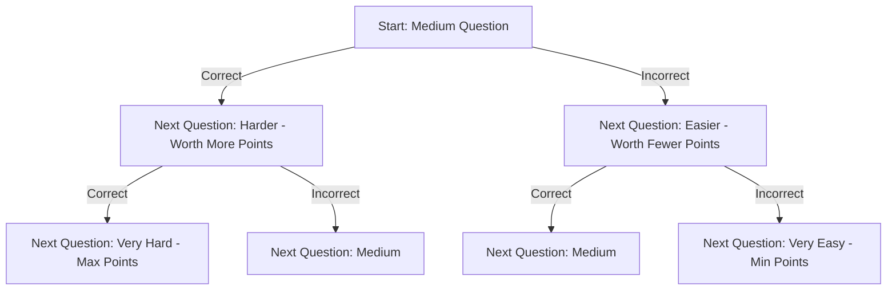

The NMAT by GMAC (Graduate Management Admission Council) is one of the most student-friendly yet demanding MBA entrance exams in India. It is the primary gateway to the prestigious Narsee Monjee Institute of Management Studies (NMIMS), Mumbai, which requires a scaled score of **235 to 245+** for its flagship MBA program.

Two factors make NMAT unique: it is a **Computer Adaptive Test (CAT)**, and it allows candidates to take the exam up to **three times** in a testing window.

In this guide, we analyze how these features affect your NMAT 2026 preparation strategy, examine sectional speed benchmarks, and discuss how to structure your retake plans.

---

## What is a Computer Adaptive Test (CAT)?

Unlike static exams, an adaptive test adjusts its difficulty based on your answers:
- The exam begins with a medium-difficulty question.
- If you answer correctly, the next question is harder and carries **higher weightage/marks**.
- If you answer incorrectly, the next question is easier and carries **fewer marks**.

### Core Implications of NMAT's Adaptive Nature

- **Initial Questions are Critical:** You must secure correct answers in the first 10–12 questions of each section to push the system into the "high difficulty/high marks" zone. Answering early questions wrong will lock you into low-scoring zones, making it hard to recover later.
- **No Skipping Allowed:** You cannot skip a question. You must answer the active question before the system loads the next one.
- **No Review:** Once you submit an answer, you cannot go back to change it.

---

## Sectional Speed Benchmarks: The NMAT Sprint

NMAT is a test of speed. The time available per question is extremely low:

| Section | Questions | Time Limit | Time per Question | Expected Cutoff (Scaled Score) |
| :--- | :---: | :---: | :---: | :---: |
| **Language Skills (LS)** | 36 | 28 Minutes | **46 Seconds** | 76+ |
| **Quantitative Skills (QS)** | 36 | 52 Minutes | **86 Seconds** | 74+ |
| **Logical Reasoning (LR)** | 36 | 40 Minutes | **66 Seconds** | 78+ |
| **Total** | **108** | **120 Minutes** | **66 Seconds (Avg)** | **235+ ([NMIMS Mumbai](/colleges/nmims-mumbai))** |

### Language Skills
Focus on speed-reading. The section contains short RC passages and grammar/vocabulary. Do not spend more than 30 seconds on vocabulary questions.

### Quantitative Skills
This section contains a mix of math and Data Interpretation. Because you have 86 seconds per question, you must avoid complex algebraic derivations and rely on quick approximations.

### Logical Reasoning
LR in NMAT contains a high proportion of **Verbal Reasoning** (critical reasoning, syllogisms, assumptions). These questions can be read and answered in under 45 seconds, saving time for complex arrangement puzzles.

---

## The 3-Attempt Scheduling Strategy

GMAC allows you to take NMAT up to three times (1 main attempt and 2 retakes) within a 70-day window (typically October to December). You must maintain a minimum gap of 15 days between attempts.

To make the most of this policy, schedule your attempts as follows:

### Attempt 1: Early Window (Mid-October)
- **Goal:** Establish a baseline score.
- **Benefit:** If you clear the NMIMS cutoff (235+) in October, your MBA preparation is secure, allowing you to focus entirely on CAT and XAT.

### Attempt 2: Mid-Window (Mid-November)
- **Goal:** Correct sectional deficiencies.
- **Benefit:** If your Attempt 1 score was close (e.g., 220), analyze your sectional performance. Focus your preparation on the section that pulled your score down.

### Attempt 3: Late Window (Mid-December)
- **Goal:** Last-mile effort.
- **Benefit:** Taken after the CAT exam. You will be at your peak academic level, making this the best time to maximize your score.

*Note: Some institutes (including [NMIMS Mumbai](/colleges/nmims-mumbai)) only accept the **first attempt score** for specific programs, while others accept the best score. Check the latest college guidelines before planning your attempts.*

To evaluate your readiness, take our [Free NMAT Mock Test](/blog/free-nmat-mock-test-2026-nmims-prep) or check our [NMAT 2026 Preparation Guide](/blog/nmat-2026-preparation-strategy-240-score).

[👉 Need help scheduling your NMAT attempts? Speak to our counselling team today!](/inquiry)

---

## ❓ Frequently Asked Questions (FAQ)

### What is the typical fee structure for MBA programs in India?
The fee structure varies widely. Government-aided institutes like [FMS Delhi](/colleges/fms-delhi) have low fees (around INR 2 Lakhs), while top-tier private institutions and IIMs can range from INR 15 Lakhs to INR 25 Lakhs.

### Is it possible to pursue an MBA without clearing CAT?
Yes, many colleges accept other entrance exams like XAT, NMAT, SNAP, MAT, or CMAT. Additionally, direct admission options under management quota are available in several private B-schools.

### What is the difference between an MBA and a PGDM?
An MBA is a degree awarded by universities affiliated with UGC, whereas a PGDM is a post-graduate diploma offered by autonomous institutes approved by AICTE. Both are highly valued in the job market.

---

### 🚀 Boost Your Preparation

Looking for more resources? **[Explore Our Premium MBA Mock Test Series 2026](/mock-tests)** to get real-time exam experience and detailed performance analytics.

---

Source: Shiksha.com

---

### 🚀 Boost Your Preparation

Looking for more resources? **[Explore Our Premium MBA Mock Test Series 2026](/mock-tests)** to get real-time exam experience and detailed performance analytics.

---

---

### 🚀 Boost Your Preparation

Looking for more resources? **[Explore Our Premium MBA Mock Test Series 2026](https://www.careerwithmohit.online/tools/mock-tests)** to get real-time exam experience and detailed performance analytics.

---
