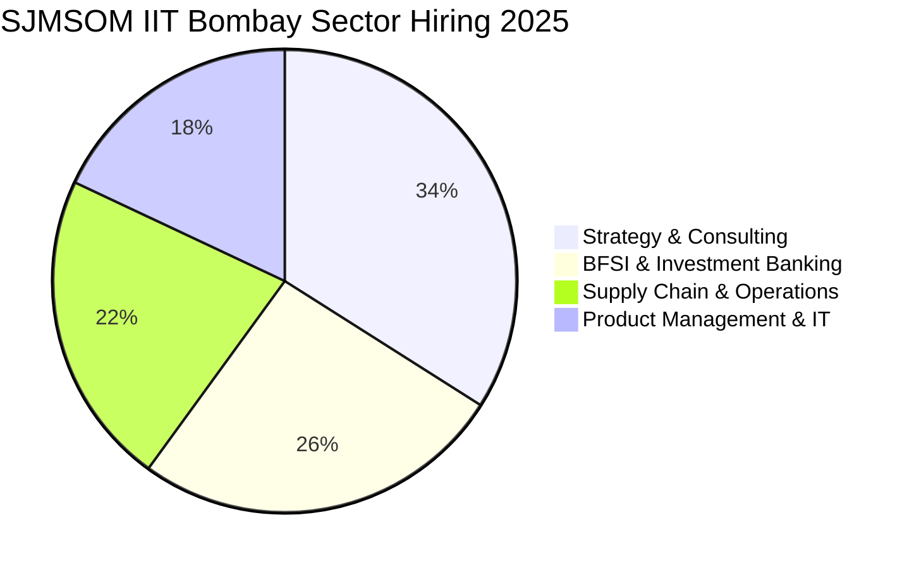

The **Shailesh J. Mehta School of Management (SJMSOM)** at **[IIT Bombay](/colleges/iit-bombay)** stands as one of India's most prestigious management schools, consistently challenging older IIMs in placement figures, corporate reputation, and return on investment.

The **2025 MBA placement season** at SJMSOM was marked by outstanding recruiter confidence, achieving **100% placements** with strong participation across consulting, investment banking, operations, and product management.

Here is the exhaustive analysis of the **SJMSOM IIT Bombay MBA Placement Report 2025**.

---

[InquiryCard title="Aiming for SJMSOM IIT Bombay or Top IIT MBA Programs?" description="Get your CAT percentile and engineering profile mapped to top MBA options with expert counsellor Mohit Jain." cta="Get Free Profile Evaluation" type="admission"]

---

## 1. SJMSOM IIT Bombay Placement 2025: Key Highlights

| Metric | Placement Statistics (2025 Batch) |
| :--- | :--- |
| **Placement Status** | **100% Placements Completed** |
| **Average Package (CTC)** | **₹25.82 LPA** |
| **Median Package (CTC)** | **₹24.50 LPA** |
| **Highest Package (CTC)** | **₹53.80 LPA** |
| **Top 25% Batch Average** | **₹34.10 LPA** |
| **Top 50% Batch Average** | **₹29.80 LPA** |
| **Total Participating Recruiters** | 52+ Premier Companies |
| **Total 2-Year Program Fees** | ₹14.50 – 15.00 Lakhs (Approx.) |

---

## 2. Sector-Wise Placement Breakdown

### 1. Strategy & Management Consulting (34% of Offers)
Consulting firms hired aggressively for business strategy and transformation roles.
*   **Key Recruiters**: Kearney, Deloitte USI, PwC, EY-Parthenon, Accenture Strategy, GEP, Alvarez & Marsal.

### 2. BFSI & Financial Services (26% of Offers)
*   **Key Recruiters**: JP Morgan Chase, Goldman Sachs, Morgan Stanley, ICICI Bank, Axis Bank, Nomura.
*   **Roles Offered**: Investment Banking Analyst, Quantitative Risk, Wealth Management, Corporate Finance.

### 3. Supply Chain, Operations & Manufacturing (22% of Offers)
Capitalizing on IIT Bombay’s deep engineering strengths, global supply chain giants recruited heavily.
*   **Key Recruiters**: Procter & Gamble (P&G), Hindustan Unilever (HUL), Asian Paints, ITC, Flipkart, Micron, Tata Motors.

### 4. Product Management & Technology (18% of Offers)
*   **Key Recruiters**: Microsoft, Amazon, Cisco, Google, Media.net, Adobe.

---

## 3. High ROI: SJMSOM vs Top IIMs & Private B-Schools

| Institute | Total 2-Year Tuition Fees | Average Starting CTC (2025) | Payback Period |
| :--- | :--- | :--- | :--- |
| **SJMSOM IIT Bombay** | **₹14.5 Lakhs** | **₹25.82 LPA** | **~7-8 Months** |
| **[IIM Ahmedabad](/colleges/iim-ahmedabad)** | ₹28.0 Lakhs | ₹34.45 LPA | ~10-12 Months |
| **[SPJIMR Mumbai](/blog/spjimr-mumbai-pgdm-placement-report-2025)** | ₹24.0 Lakhs | ₹32.00 LPA | ~9-11 Months |
| **[MDI Gurgaon](/blog/mdi-gurgaon-pgdm-placement-report-2025)** | ₹25.5 Lakhs | ₹25.60 LPA | ~12-14 Months |

---

## 4. Selection Criteria for CAT Aspirants

*   **CAT Cutoff**: SJMSOM requires a minimum overall CAT percentile of **98.5+ to 99+ percentile** for General category candidates.
*   **Eligibility**: 4-year Bachelor’s degree in Engineering/Technology or Master’s in Science.
*   For the complete national benchmark, read our **[All 21 IIMs Recent Placement Report 2025](/blog/all-iim-recent-placement-report-2025)**.

---

### 🚀 Boost Your Preparation

Looking for more resources? **[Explore Our Premium MBA Mock Test Series 2026](/mock-tests)** to get real-time exam experience and detailed performance analytics.

---
