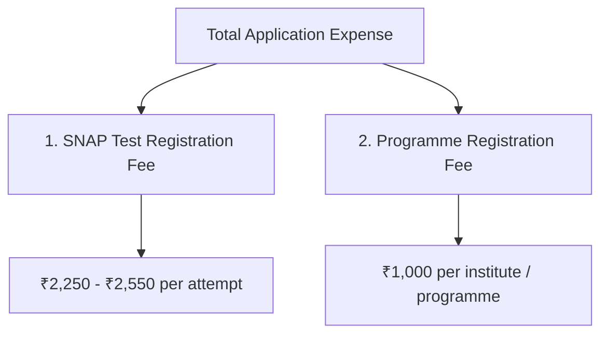
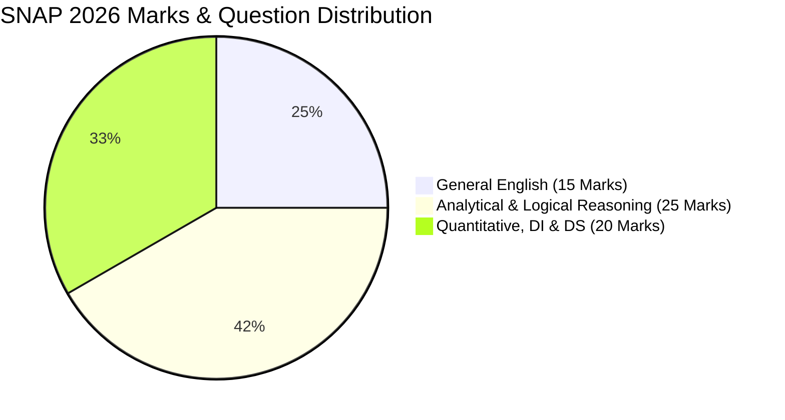

The **Symbiosis International (Deemed University) – SIU** has officially released the **SNAP 2026 Application Form Notification**. With the release of the official brochure and notification, the gateway to 16 prestigious Symbiosis B-schools—including flagship institutions like **[SIBM Pune](/colleges/sibm-pune)**, **[SCMHRD Pune](/colleges/scmhrd-pune)**, **[SIBM Bangalore](/colleges/sibm-bangalore)**, and **SIIB Pune**—is now open for MBA/PGDM aspirants aiming for the 2027–29 batch.

The **Symbiosis National Aptitude Test (SNAP)** is one of India's most popular management entrance exams, known for its fast-paced, 60-minute computer-based test (CBT) structure and candidate-friendly **3-attempt policy**. 

In this comprehensive guide, we provide everything you need to know about the **SNAP 2026 Application Form Notification**: key dates, eligibility parameters, fee breakdown, step-by-step application walkthrough, exam pattern, cutoff trends, and essential tips to avoid costly registration mistakes.

---

> ⚡ **Test Your Speed Before Registering**
>
> Assess your current preparation level with our [Free SNAP Mock Test 2026](/blog/free-snap-mock-test-2026) and check where you stand for top Symbiosis cutoffs.

---

## 📌 SNAP 2026 Notification: Key Highlights & Fact Sheet

| Feature / Milestone | Details |
| :--- | :--- |
| **Exam Name** | Symbiosis National Aptitude Test (SNAP 2026) |
| **Conducting Authority** | Symbiosis International (Deemed University) - SIU Pune |
| **Official Portal** | [snaptest.org](https://www.snaptest.org) |
| **Exam Level** | National-Level Postgraduate Management Entrance Exam |
| **Course Offered** | MBA / M.Sc (Computer Applications, Data Science, Telecom) |
| **Participating Institutes** | 16 SIU Constituent Institutes (26+ MBA specializations) |
| **Mode of Exam** | Computer-Based Test (CBT) across ~80+ cities in India |
| **Exam Duration** | 60 Minutes (1 Hour) |
| **Total Questions & Marks** | 60 Questions | 60 Marks |
| **Marking Scheme** | +1 Mark for Correct Answer; -0.25 Mark for Incorrect Answer |
| **Number of Attempts** | Up to 3 attempts allowed (Best score considered) |

---

## 🗓️ SNAP 2026 Important Dates & Schedule

Mark your calendar with the official schedule announced in the SNAP 2026 notification:

| Event | Official Date / Timeline |
| :--- | :--- |
| **Official Notification Release** | **August 19, 2026** |
| **SNAP 2026 Registration Starts** | **August 21, 2026** |
| **Last Date to Apply & Submit Fees** | **November 25, 2026** |
| **Admit Card Release (Test 1)** | Early December 2026 |
| **Admit Card Release (Test 2 & Test 3)** | Mid December 2026 |
| **SNAP 2026 Test Date 1** | **December 5 / 6, 2026** |
| **SNAP 2026 Test Date 2** | **December 13 / 14, 2026** |
| **SNAP 2026 Test Date 3** | **December 20 / 21, 2026** |
| **Declaration of SNAP 2026 Results** | **January 12, 2027** |
| **GE-PI-WAT Shortlist Announcement** | Late January – February 2027 |

---

## 🎓 SNAP 2026 Eligibility Criteria

Before proceeding with the SNAP application form, verify that you meet the following baseline eligibility criteria:

1. **Academic Qualification:**
   - Candidates must hold a **Bachelor’s degree** in any discipline from a recognized University or Institute of National Importance.
   - Minimum aggregate marks required: **50% marks** (or equivalent CGPA) for General / Open category candidates.
   - **45% marks** (or equivalent CGPA) for candidates belonging to SC / ST / PwD (Differently Abled) categories.

2. **Final Year Graduation Candidates:**
   - Final-year undergraduate students are eligible to apply, provided they complete all requirements for graduation by the deadline set by SIU and submit passing proof.

3. **International Candidates & Foreign Degrees:**
   - Candidates who completed qualifying degrees from foreign universities must obtain an **Equivalence Certificate from the Association of Indian Universities (AIU)**.

4. **Program-Specific Requirements:**
   - Specialized programs such as *MBA (Information Technology)* at SCIT, *MBA (Digital & Telecom Management)* at SIDTM, or *MBA (Operations Management)* at SIOM Nashik may require specific undergraduate backgrounds (e.g., Engineering, Mathematics, or Commerce).

---

## 💳 SNAP 2026 Application Fee Structure

The SNAP registration fee consists of two distinct components:

### 1. SNAP Test Fee (Mandatory)
* **Fee per Test Attempt:** ₹2,250 – ₹2,550 per slot.
* If you opt for **1 attempt:** ₹2,250 – ₹2,550
* If you opt for **2 attempts:** ₹4,500 – ₹5,100
* If you opt for **3 attempts:** ₹6,750 – ₹7,650

### 2. Symbiosis Programme Fee (Mandatory for Admission)
* In addition to the test fee, you must apply to individual Symbiosis institutes and programmes (e.g., [SIBM Pune](/colleges/sibm-pune) MBA, SCMHRD MBA-HR, [SIBM Bangalore](/colleges/sibm-bangalore) MBA).
* **Cost:** **₹1,000 per programme per institute**.
* *Example:* If you apply for SNAP (2 attempts) + SIBM Pune (General MBA) + SCMHRD (MBA) + SIBM Bangalore (MBA), your total investment will be: `(₹2,550 × 2) + (₹1,000 × 3) = ₹8,100`.

*Payment Methods:* Net Banking, Credit Cards, Debit Cards, and UPI gateways. All registration fees are strictly non-refundable and non-transferable.

---

## 📝 Step-by-Step Guide: How to Fill the SNAP 2026 Application Form

Follow this verified step-by-step process to ensure a smooth, error-free application submission:

### Step 1: Online Registration at snaptest.org
1. Visit the official portal: **[www.snaptest.org](https://www.snaptest.org)**.
2. Click on **"Apply Now" / "Register for SNAP 2026"**.
3. Accept the terms & conditions and enter your primary details: Full Name, Date of Birth, Active Mobile Number, and Email Address.
4. Verify your mobile number and email via OTP.
5. Your unique **SNAP ID and Password** will be generated and dispatched to your email and SMS.

### Step 2: Fill Detailed Application Form
1. Log in with your SNAP ID and password.
2. Complete your personal information (Father's Name, Mother's Name, Category, Address, Gender).
3. Enter your academic qualifications:
   - 10th Class details and percentage/board.
   - 12th Class / Diploma stream, board, and marks.
   - Graduation status (Completed / Pursuing), university, stream, and aggregate CGPA/percentage.
   - Work experience (if applicable).

### Step 3: Select Test City & Test Attempts
1. Choose the number of SNAP test attempts (Attempt 1, Attempt 2, Attempt 3).
2. Select your top **3 preferred test cities** in order of priority. (Cities are allotted on a first-come, first-served basis).

### Step 4: Select Symbiosis Institutes & MBA Programmes
1. Check the box for each SIU institute and specific MBA programme you wish to apply for.
2. Ensure you do not miss applying to flagship colleges like [SIBM Pune](/colleges/sibm-pune) or [SCMHRD Pune](/colleges/scmhrd-pune) at this stage.

### Step 5: Upload Scanned Documents
Upload your scanned passport photograph and signature as per official SIU specifications:

| Document | Format | Allowed File Size | Dimensions / Guidelines |
| :--- | :--- | :--- | :--- |
| **Recent Color Photograph** | JPG / JPEG | 10 KB to 500 KB | White background, front-facing, taken within last 3 months |
| **Candidate Signature** | JPG / JPEG | 10 KB to 100 KB | Clear black ink on crisp white paper |

### Step 6: Make Online Payment & Download Confirmation
1. Review all entered details carefully using the **"Preview Form"** button.
2. Proceed to the payment gateway. Pay the combined SNAP test fee + selected institute program fees.
3. Save and download the generated **Application Summary PDF** and **Payment Receipt** for future counselling reference.

---

## ⚡ SNAP 2026 Exam Pattern & Structure

Unlike the 2-hour CAT or 3.5-hour XAT exams, SNAP is a lightning-fast sprint:

| Section | Total Questions | Total Marks | Difficulty Level | Ideal Time Allocation |
| :--- | :---: | :---: | :---: | :---: |
| **General English** (Reading Comp, Verbal Ability) | 15 | 15 Marks | Easy to Moderate | 10 – 12 Minutes |
| **Analytical & Logical Reasoning (ALR)** | 25 | 25 Marks | Moderate | 25 – 28 Minutes |
| **Quantitative, Data Interpretation & Data Sufficiency** | 20 | 20 Marks | Moderate | 20 – 22 Minutes |
| **Total** | **60 Questions** | **60 Marks** | **Overall Speed-Heavy** | **60 Minutes** |

### Key Exam Highlights:
- **No Sectional Time Limit:** You can switch between sections at any time.
- **No Sectional Cutoffs:** SIU institutes only consider your overall aggregate SNAP score.
- **Negative Marking:** Every wrong answer deducts **0.25 marks**.
- Read our detailed [SNAP 2026 Section-Wise Strategy & Attempt Order Guide](/blog/snap-2026-section-wise-trends-which-sections-attempt-first) for scoring 42+ marks.

---

## 🏛️ Top Symbiosis MBA Institutes Accepting SNAP 2026

Here is the tier-wise list of top Symbiosis International University colleges, along with expected SNAP cutoffs and average placement packages:

| Institute | Flagship Programme | Expected SNAP Cutoff Percentile | Expected Score (Out of 60) | Average CTC (LPA) |
| :--- | :--- | :---: | :---: | :---: |
| **[SIBM Pune](/colleges/sibm-pune)** | MBA (General), MBA (Innovation) | **98.5+ %ile** | 42 – 44+ | **₹28.16 LPA** |
| **[SCMHRD Pune](/colleges/scmhrd-pune)** | MBA, MBA (HR), MBA (BA), MBA (IDM) | **97.5+ %ile** | 39 – 41+ | **₹24.28 LPA** |
| **SIIB Pune** | MBA (International Business), MBA (Agri), MBA (E&E) | **93.0+ %ile** | 36 – 38 | **₹13.50 LPA** |
| **[SIBM Bangalore](/colleges/sibm-bangalore)** | MBA, MBA (Business Analytics) | **90.0+ %ile** | 34 – 36 | **₹14.47 LPA** |
| **SIOM Nashik** | MBA (Operations Management - Only for Engineers) | **87.0+ %ile** | 32 – 34 | **₹14.50 LPA** |
| **SIDTM Pune** | MBA (Digital & Telecom Management) | **83.0+ %ile** | 30 – 32 | **₹13.08 LPA** |
| **SCIT Pune** | MBA (Information Technology / Data Science) | **82.0+ %ile** | 29 – 31 | **₹12.02 LPA** |
| **SSBF Pune** | MBA (Banking & Finance) | **80.0+ %ile** | 28 – 30 | **₹11.00 LPA** |
| **SIBM Hyderabad** | MBA | **75.0+ %ile** | 25 – 27 | **₹9.30 LPA** |
| **SIBM Nagpur** | MBA | **70.0+ %ile** | 23 – 25 | **₹9.00 LPA** |

---

## ⚠️ 5 Costly Mistakes to Avoid During SNAP 2026 Registration

1. **Forgetting to Select & Pay for Institutes:** Registering for the SNAP exam alone does **NOT** automatically apply you to SIBM Pune or SCMHRD. You must select each desired institute in the form and pay ₹1,000 per program before their respective deadlines.
2. **Waiting for the Last Date:** With over 1.4 lakh applicants registering for limited test slots, regional test centers fill up rapidly. Applying early ensures you receive your preferred test city and slot.
3. **Registering for Only 1 Attempt:** Since SNAP is a speed-based exam where variance can occur due to unfamiliar questions, taking **2 or 3 attempts** maximizes your chances of scoring 98+ percentile. SIU automatically considers your **best score**.
4. **Mismatch in Name / ID Proof:** Ensure your name exactly matches your official Government ID proof (Aadhar Card / PAN Card / Passport) and 10th-grade certificate.
5. **Blurry Document Uploads:** Photos with dark backgrounds or unclear signatures may lead to form rejection or biometric mismatch at test centers.

---

## ❓ Frequently Asked Questions (FAQ)

### 1. When was the official SNAP 2026 application form notification released?
The official SNAP 2026 notification was released on **August 19, 2026**, on the official Symbiosis portal ([snaptest.org](https://www.snaptest.org)). The online application window opens on **August 21, 2026**.

### 2. What is the last date to fill the SNAP 2026 application form?
The last date to register and pay the registration fee for the SNAP 2026 exam is **November 25, 2026**.

### 3. How many times can a candidate appear for SNAP 2026?
Candidates are permitted to attempt SNAP 2026 up to **three times** across the three scheduled test dates in December. The best scaled score out of all attempts will be considered for final shortlisting.

### 4. What is the registration fee for SNAP 2026?
The SNAP test registration fee is **₹2,250 to ₹2,550 per test attempt**. Additionally, candidates must pay a programme registration fee of **₹1,000 per MBA programme/institute** they wish to apply to.

### 5. Does SNAP have sectional cutoffs?
No, Symbiosis institutes do not have sectional cutoffs. Your overall percentile determines whether you qualify for the GE-PI-WAT shortlist.

### 6. Can final-year students apply for SNAP 2026?
Yes, candidates in their final year of bachelor’s study are eligible to apply, provided they aggregate at least 50% marks (45% for SC/ST/PwD) at the time of final admission.

---

### 📚 Related Resources for MBA Aspirants:

* **[Comprehensive SNAP Exam Guide: Pattern, Marks & Cutoffs](/blog/all-about-snap-exam)**
* **[SNAP 2026 Multiple Attempts Strategy: How to Maximize Your Best Score](/blog/snap-2026-multiple-attempts-maximize-best-score)**
* **[NMAT 2026 Speed & Accuracy Trends: How 3 Attempts Are Changing Strategy](/blog/nmat-2026-speed-accuracy-trends-3-attempts-prep-strategy)**
* **[10 Proven Tips to Crack CAT 2026 Exam](/blog/10-tips-to-crack-cat-exam-2026)**
* **[Top MBA Entrance Exams (OMETS) in India: Complete Guide](/blog/all-about-omets-mba-entrance-exams-2026)**

---

[👉 Confused about choosing the right Symbiosis institutes & specializations for your profile? Book a 1-on-1 Profile Evaluation with our Senior MBA Counsellors today!](/inquiry)

---

### 🚀 Boost Your Preparation

Looking for more resources? **[Explore Our Premium MBA Mock Test Series 2026](/mock-tests)** to get real-time exam experience and detailed performance analytics.

---
