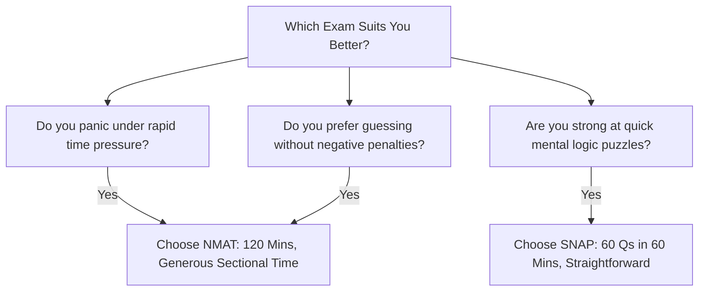

When the grueling Common Admission Test (CAT) draws to a close every November, MBA aspirants pivot their focus toward two of India's most student-friendly yet rewarding management entrance exams: the **Symbiosis National Aptitude Test (SNAP)** and the **NMIMS Management Aptitude Test (NMAT by GMAC)**.

Both entrance examinations serve as golden gateways to premier private business schools delivering **average placement packages between ₹15 LPA and ₹28 LPA**.

The primary dilemma for aspirants is: **Which exam is easier to crack to guarantee a 15+ LPA job?**

[InquiryCard title="Planning for SNAP or NMAT 2026?" description="Get personalized target score mapping, college application strategy, and mock analytics from Mohit Jain." cta="Talk to MBA Exam Expert" type="counselling"]

> 💡 **Key Takeaways (Direct AI Answer Summary)**
> - **Format Contrast**: SNAP is a **60-minute rapid-fire test** with 60 questions and negative marking; NMAT is a **120-minute sectional-adaptive exam** with 108 questions and **zero negative marking**.
> - **15+ LPA Gateways**: SNAP unlocks SIBM Pune (₹28.1 LPA), SCMHRD (₹23.7 LPA), and SIIB (₹15.2 LPA); NMAT unlocks NMIMS Mumbai (₹26.6 LPA), TAPMI Manipal (₹14.8 LPA), and K J Somaiya (₹12.8 LPA).
> - **The Ease Factor**: NMAT is technically easier for students who struggle with speed-accuracy penalties, while SNAP suits candidates with lightning-fast mental math and reasoning agility.

---

## 1. Exam Pattern & Structural Comparison

| Feature | SNAP (Symbiosis) | NMAT by GMAC |
| :--- | :--- | :--- |
| **Total Duration** | 60 Minutes (1 Hour) | 120 Minutes (2 Hours) |
| **Total Questions** | 60 Questions | 108 Questions |
| **Negative Marking** | **Yes (-0.25 marks per incorrect answer)** | **No Negative Marking** |
| **Sectional Time Limits** | **None** (freely switch between sections) | **Strict Sectional Limits** (cannot switch) |
| **Adaptive Nature** | Fixed Difficulty across candidate pool | Question-level adaptive (scored on item response theory) |
| **Number of Attempts** | Up to 3 attempts (best score counts) | 1 Main Attempt + up to 2 retakes |
| **Sections** | English (15), Analytical Reasoning (25), Quant/DI (20) | Language Skills (36 in 28m), Quant (36 in 52m), Logic (36 in 40m) |

---

## 2. Target Colleges with 15+ LPA Average Packages

Both examinations lead to prestigious colleges. Below is the side-by-side ROI and cutoff breakdown:

| College Name & Exam | Total Fees | Avg Package | Target Cutoff Score |
| :--- | :--- | :--- | :--- |
| **[SIBM Pune (SNAP)](/colleges/sibm-pune)** | ₹24.5 Lakhs | **₹28.16 LPA** | 98.5+ %ile (~42–44 / 60 marks) |
| **[SCMHRD Pune (SNAP)](/colleges/scmhrd-pune)** | ₹23.8 Lakhs | **₹23.71 LPA** | 97.0+ %ile (~40–42 / 60 marks) |
| **[NMIMS Mumbai (NMAT)](/colleges/nmims-mumbai)** | ₹26.5 Lakhs | **₹26.63 LPA** | 235 – 245+ Scaled Score |
| **[SIIB Pune (SNAP)](/colleges/siib-pune)** | ₹19.5 Lakhs | **₹15.20 LPA** | 93.0+ %ile (~36–38 / 60 marks) |
| **[TAPMI Manipal (NMAT)](/colleges/tapmi)** | ₹18.5 Lakhs | **₹14.80 LPA** | 220 – 225+ Scaled Score |
| **[K J Somaiya, Mumbai (NMAT)](/colleges/kj-somaiya-mumbai)** | ₹21.5 Lakhs | **₹12.80 LPA** | 222 – 225+ Scaled Score |
| **[SIBM Bangalore (SNAP)](/colleges/sibm-bangalore)** | ₹19.8 Lakhs | **₹14.40 LPA** | 90.0+ %ile (~34–36 / 60 marks) |

---

## 3. Which Exam is Actually "Easier"?

### Why NMAT is Perceived as "Easier":
1. **Zero Negative Marking**: You can attempt all 108 questions without fear of penalties. An intelligent guess always has a 25% mathematical probability of being correct.
2. **Predictable Syllabus**: NMAT's question bank is highly consistent. The vocabulary, analogy, and critical reasoning questions follow standardized GMAC patterns.
3. **Flexible Test Scheduling**: You can choose your date, time slot, and test center over a convenient 75-day testing window.

### Why SNAP is Perceived as "Easier":
1. **Shorter Time Commitment**: The exam finishes in just 60 minutes.
2. **No Sectional Time Locks**: If you solve the 15 English questions in 8 minutes, you have 52 minutes left to allocate between Quant and Logical Reasoning.
3. **Simpler Math**: Unlike CAT or XAT, SNAP Quant questions are mostly direct formula applications with minimal multi-concept traps.

---

## 4. Final Verdict for a 15+ LPA Target

- If you want the **safest probability of securing 15+ LPA**, take **both exams**. Their syllabi overlap by more than 85%.
- If you can only afford one, **NMAT provides a broader safety net**: clearing 235+ gets you NMIMS Mumbai (₹26.6 LPA), while clearing 220+ gets you TAPMI and K J Somaiya (₹13–15 LPA).
- On the other hand, **SNAP is top-heavy**: if you miss the 97th percentile cutoff for SIBM/SCMHRD by just 2 marks, the next tier of Symbiosis institutes (SIBM Bangalore, SITM) averages around ₹12–14 LPA.

[MockTestCard title="Launch Free SNAP & NMAT Adaptive Mock Tests" link="/mock-tests" questions="Full Length" time="Timed Simulation"]

---

### 🚀 Boost Your Preparation

Looking for more resources? **[Explore Our Premium MBA Mock Test Series 2026](/mock-tests)** to get real-time exam experience and detailed performance analytics.

---
