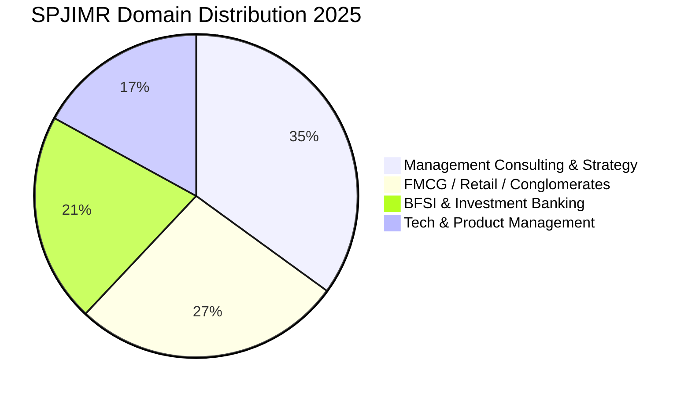

The **S.P. Jain Institute of Management and Research (SPJIMR), Mumbai** ranks among India's top 5 management institutions, frequently standing on par with the Old IIM trio (IIM Ahmedabad, Bangalore, and Calcutta).

The **2025 PGDM placement season** reaffirmed SPJIMR’s leadership, recording an average CTC of **₹32.00 LPA**, a top international package of **₹89.00 LPA**, and over **162 Pre-Placement Offers (PPOs)**.

Here is the exhaustive **SPJIMR Mumbai PGDM Placement Report 2025**.

---

[InquiryCard title="Targeting SPJIMR Profile-Based Admission?" description="Get your profile evaluated for SPJIMR shortlist criteria (academics, achievements, CAT/GMAT scores) by Mohit Jain." cta="Get Free Profile Evaluation" type="admission"]

---

## 1. SPJIMR Mumbai Placement 2025: Key Highlights

| Metric | Statistics (2025 Graduating Class) |
| :--- | :--- |
| **Placement Record** | **100% Final Placements** |
| **Average CTC (Overall)** | **₹32.00 LPA** |
| **Median CTC** | **₹30.50 LPA** |
| **Highest International Package**| **₹89.00 LPA** |
| **Highest Domestic Package** | **₹81.00 LPA** |
| **Top 25% Batch Average** | **₹39.20 LPA** |
| **Top 50% Batch Average** | **₹35.40 LPA** |
| **Pre-Placement Offers (PPOs)** | **162 Offers (48%+ of Batch)** |
| **Total 2-Year Program Fees** | ₹22.50 – 24.00 Lakhs |

---

## 2. Sectoral & Domain Breakdown 2025

### Top Recruiters by Domain:
1. **Management Consulting (35% of Batch)**: McKinsey & Company, Boston Consulting Group (BCG), Bain & Company, Kearney, Alvarez & Marsal, Strategy&, Accenture Strategy, PwC, EY, Deloitte.
2. **FMCG & Consumer Goods (27% of Batch)**: Hindustan Unilever Limited (HUL), Procter & Gamble (P&G), ITC, Nestlé, Mondelez, Colgate-Palmolive, L'Oréal, Johnson & Johnson.
3. **BFSI & Private Equity (21% of Batch)**: Goldman Sachs, Morgan Stanley, Barclays, Avendus Capital, Citibank, Standard Chartered, HSBC, HDFC Bank.
4. **Technology & Product (17% of Batch)**: Microsoft, Amazon, Google, Adobe, Cisco, Uber, Media.net.

---

## 3. Why SPJIMR Outperforms Most Top B-Schools

*   **Autumn Internship Model**: Unlike other B-schools that conduct summer internships after Year 1, SPJIMR students intern in their 3rd semester after completing deep specialization courses, leading to an industry-leading **48%+ PPO conversion rate**.
*   **Values-Based Pedagogy**: Unique initiatives like DOCC (Development of Corporate Citizenship) and ADMAP create well-rounded executive leaders.

---

## 4. Related Placement Reports

*   **[MDI Gurgaon PGDM Placement Report 2025](/blog/mdi-gurgaon-pgdm-placement-report-2025)**
*   **[XLRI Jamshedpur & Delhi Placement Report 2025](/blog/xlri-jamshedpur-delhi-placement-report-2025)**
*   **[IIM BLACKI Placement Report 2025](/blog/iim-blacki-placement-report-2025-salary-recruiters)**
*   **[All 21 IIMs Recent Placement Report 2025](/blog/all-iim-recent-placement-report-2025)**

---

### 🚀 Boost Your Preparation

Looking for more resources? **[Explore Our Premium MBA Mock Test Series 2026](/mock-tests)** to get real-time exam experience and detailed performance analytics.

---
