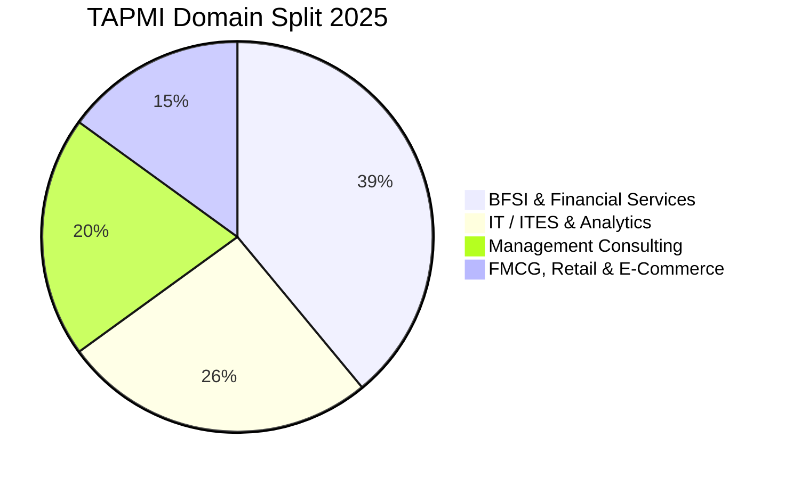

The **T.A. Pai Management Institute (TAPMI), Manipal**—a constituent unit of MAHE (Manipal Academy of Higher Education)—is internationally accredited by AACSB and AMBA, standing among the top private business schools in India.

The **2025 MBA placement season** concluded with **100% placements across all specializations**, with a peak package of **₹32.77 LPA** and over **100 leading corporate recruiters** visiting the scenic Manipal campus.

Here is the complete **TAPMI Manipal MBA Placement Report 2025**.

---

[InquiryCard title="Applying to TAPMI Manipal or Top Private Universities?" description="Get your CAT/XAT/NMAT scores mapped, profile assessed, and interview preparation guided by Mohit Jain." cta="Get Free Counselling" type="admission"]

---

## 1. TAPMI Manipal Placement 2025 Highlights

| Metric | Statistics (2025 Placement Season) |
| :--- | :--- |
| **Placement Rate** | **100% Batch Placements** |
| **Overall Average CTC** | **₹13.90 – 14.00 LPA** |
| **Highest CTC** | **₹32.77 LPA** |
| **Top 25% Batch Average** | **₹19.40 LPA** |
| **Top 50% Batch Average** | **₹16.50 LPA** |
| **Total Participating Recruiters** | 100+ Companies |
| **Total 2-Year Program Fees** | ₹18.00 – 19.50 Lakhs |

---

## 2. Program-Wise Salary Breakdown 2025

| MBA Specialization | Average CTC (2025) | Highest CTC (2025) | Top Recruiting Domain |
| :--- | :--- | :--- | :--- |
| **MBA (General Core)** | **₹14.10 LPA** | ₹32.77 LPA | Consulting & BFSI |
| **MBA - BKFS (Banking & Financial Services)** | **₹14.73 LPA** | ₹26.25 LPA | Investment Banking & Wealth |
| **MBA - Marketing** | **₹13.72 LPA** | ₹19.59 LPA | FMCG & Digital Marketing |
| **MBA - HRM (Human Resources)** | **₹12.86 LPA** | ₹19.59 LPA | IT/ITES & Manufacturing HR |
| **MBA - IB (International Business)** | **₹13.20 LPA** | ₹16.00 LPA | Trade & Global Supply Chain |

---

## 3. Sector-Wise Placement Share 2025

### Key Recruiters:
*   **BFSI (39%)**: JP Morgan, Morgan Stanley, Goldman Sachs, BNY Mellon, HDFC Bank, ICICI Bank, Citi, CRISIL.
*   **IT & Analytics (26%)**: Accenture, Infosys, Cognizant, Wipro, Capgemini, Dell, Oracle.
*   **Consulting (20%)**: Deloitte, PwC, EY, KPMG, Grant Thornton.
*   **FMCG & Retail (15%)**: Titan, Nestlé, ITC, Britannia, Dabur.

---

## 4. Related Placement Reports

*   **[GIM Goa Placement Report 2025](/blog/gim-goa-pgdm-placement-report-2025)**
*   **[Great Lakes Placement Report 2025](/blog/great-lakes-chennai-gurgaon-placement-report-2025)**
*   **[All 21 IIMs Recent Placement Report 2025](/blog/all-iim-recent-placement-report-2025)**

---

### 🚀 Boost Your Preparation

Looking for more resources? **[Explore Our Premium MBA Mock Test Series 2026](/mock-tests)** to get real-time exam experience and detailed performance analytics.

---

---

### 🎓 Need Expert MBA/PGDM Admission Guidance for 2027–2029?
Get personalized 1-on-1 career counselling, GD-PI preparation tips, college shortlisting based on your percentile & budget, and direct application assistance.

👉 **[Click Here to Connect with Our Chief MBA Counsellor on WhatsApp](https://wa.me/919560020771?text=Hi%20Mohit,%20I%20need%20MBA/PGDM%202027-2029%20Admission%20Guidance)** or request a free callback through our inquiry desk.
