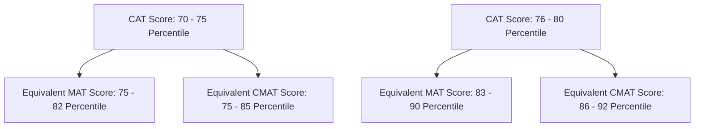

Scoring in the **70 to 80 percentile bracket in CAT or MAT** is one of the most tactical positions an MBA/PGDM candidate can hold for the **2027–29 admission cycle**. While Tier-1 IIMs and top-5 non-IIMs cut off above 90–95 percentile, Delhi NCR—India's largest corporate and educational cluster—is home to several high-performing, AICTE-approved private B-schools that actively recruit talent in the 70–80 percentile range.

These institutions offer modern industry-oriented curricula, dual specializations (such as Business Analytics, Digital Marketing, Fintech, and Supply Chain Management), and robust corporate networking across Gurgaon, Noida, Greater Noida, and New Delhi. With average placement packages ranging between **₹6.0 LPA and ₹12.3 LPA**, these B-schools deliver an impressive Return on Investment (ROI).

In this comprehensive guide by **CareerWithMohit**, we breakdown the **Top 15 PGDM Colleges in Delhi NCR accepting 70-80 Percentile in CAT / MAT for the 2027-29 batch**, covering total fees, cutoffs, real placement stats, and step-by-step direct application strategies.

---

## **Master Overview: Top 15 PGDM Colleges in Delhi NCR (70-80 Percentile CAT/MAT)**

Below is a quick snapshot comparing total tuition fees, average placement packages, and expected CAT/MAT percentiles for the 2027-29 intake:

| Rank | College Name & Location | 2-Year Total Fees (approx.) | CAT / MAT Cutoff (Percentile) | Average Placement (₹ LPA) | Key USP / Advantage |
| :--- | :--- | :--- | :--- | :--- | :--- |
| **1** | [New Delhi Institute of Management (NDIM)](/colleges/new-delhi-institute-of-management), New Delhi | ₹13.75 Lakhs | CAT: 75-80% \| MAT: 80-85% | **₹9.5 - ₹12.5 LPA** | 34-yr legacy, Double Specialization & ASSOCHAM B-School Award |
| **2** | [Jaipuria Institute of Management](/colleges/jaipuria-institute-of-management-noida), Noida | ₹14.50 Lakhs | CAT: 75-80% \| MAT: 80-85% | **₹11.5 - ₹12.3 LPA** | Triple NBA Accredited, Centralized Placements across 4 Campuses |
| **3** | [Fortune Institute of International Business (FIIB)](/colleges/fiib-delhi), Delhi | ₹10.85 Lakhs | CAT: 70-75% \| MAT: 75-80% | **₹8.4 - ₹8.8 LPA** | Vasant Vihar Corporate Hub, Strong Analytics & Finance Focus |
| **4** | [FOSTIIMA Business School](/colleges/fostiima-delhi), New Delhi | ₹10.75 Lakhs | CAT: 70-75% \| MAT: 75-80% | **₹8.9 - ₹10.75 LPA** | Founded by IIM Ahmedabad Alumni, High ROI & Live Projects |
| **5** | [IMS Ghaziabad](/colleges/institute-of-management-studies), Ghaziabad | ₹9.50 Lakhs | CAT: 70-75% \| MAT: 75-80% | **₹8.2 - ₹8.5 LPA** | NAAC A++ Grade, 34+ Years Legacy & Corporate Immersion |
| **6** | [IILM Gurgaon / Greater Noida](/colleges/iilm-gurgaon), Gurgaon/Noida | ₹10.80 - ₹11.50 Lakhs | CAT: 70-75% \| MAT: 75-80% | **₹8.5 - ₹9.2 LPA** | Prime Corporate Belt, Global Study Tours & Industry Mentorship |
| **7** | [Delhi School of Business (DSB / VIPS)](/colleges/dsb-delhi), New Delhi | ₹9.75 - ₹10.50 Lakhs | CAT: 70-75% \| MAT: 75-80% | **₹7.8 - ₹8.5 LPA** | VIPS Infrastructure Backing, Modern FinTech Lab |
| **8** | [JIMS Rohini / Kalkaji](/colleges/jims-rohini), New Delhi | ₹9.30 - ₹9.70 Lakhs | CAT: 75-80% \| MAT: 80% | **₹7.8 - ₹8.3 LPA** | NBA & NAAC Accredited, AIU Equivalent, Strong Delhi Brand |
| **9** | [EMPI Business School](/colleges/empi-delhi), New Delhi | ₹8.75 Lakhs | CAT: 68-72% \| MAT: 70-75% | **₹7.5 - ₹8.2 LPA** | AI & Future Tech Lab, Residential Campus in Chattarpur |
| **10** | [Apeejay School of Management (ASM)](/colleges/asm-apeejay-delhi), Dwarka, Delhi | ₹9.60 - ₹10.20 Lakhs | CAT: 70-75% \| MAT: 75-80% | **₹7.8 - ₹8.6 LPA** | ACBSP (USA) Accredited, Strong FMCG & Retail Recruiter Base |
| **11** | [ITS School of Management](/colleges/its-ghaziabad), Ghaziabad | ₹7.20 - ₹7.80 Lakhs | CAT: 65-70% \| MAT: 70-75% | **₹6.8 - ₹7.5 LPA** | Affordable Budget, 28-yr Legacy, Excellent Placement ROI |
| **12** | [Asian Business School (ABS)](/colleges/asian-business-school-noida), Noida | ₹8.45 - ₹8.95 Lakhs | CAT: 65-70% \| MAT: 70-75% | **₹7.2 - ₹7.8 LPA** | Oxford Executive Diploma Module, Sector 125 Noida Location |
| **13** | [GNIOT Institute of Management Studies (GIMS)](/colleges/gniot-institute-of-management-studies-gims), Greater Noida | ₹6.90 - ₹7.50 Lakhs | CAT: 65-70% \| MAT: 70-75% | **₹6.5 - ₹7.2 LPA** | Practical Corporate Bootcamps & Chanakya Leadership Program |
| **14** | [Lloyd Business School](/colleges/lloyd-business-school-greater-noida), Greater Noida | ₹6.50 - ₹7.20 Lakhs | CAT: 65-70% \| MAT: 70% | **₹6.2 - ₹6.8 LPA** | Work-Integrated PGDM in Supply Chain & Analytics |
| **15** | [Accurate Institute of Management & Technology](/colleges/accurate-greater-noida), Greater Noida | ₹6.80 - ₹7.50 Lakhs | CAT: 65-70% \| MAT: 70% | **₹6.2 - ₹6.7 LPA** | 100% Placement Record track, Focus on Core Operations & Sales |

---

## **In-Depth Profiles: Top 15 Delhi NCR PGDM Colleges (2027-29 Intake)**

### **1. New Delhi Institute of Management (NDIM), New Delhi**
Located in Tughlakabad Institutional Area, **[New Delhi Institute of Management (NDIM)](/colleges/new-delhi-institute-of-management)** is a 34-year-old flagship management institution. Recognized by AICTE and declared equivalent to MBA by the Association of Indian Universities (AIU), NDIM has won the **"Best Industry-Linked B-School"** award by AICTE-CII for consecutive years.

*   **Total Course Fee (2 Years)**: ₹13.75 Lakhs
*   **Entrance Cutoffs**: CAT: 75–80 Percentile | MAT / CMAT / XAT: 80–85 Percentile
*   **Average Placement Package**: ₹9.50 LPA to ₹12.50 LPA (Highest package: ₹18.0+ LPA)
*   **Top Specializations**: Marketing, Finance, HR, Business Analytics, Media & Communication, Digital Marketing.
*   **Major Recruiters**: Deloitte, EY, KPMG, Amazon, ICICI Bank, Tata Consultancy Services, Berger Paints.
*   **Why Choose NDIM?**: Unique **Dual Major Specialization** policy without minor restrictions, combined with a vast 30+ year alumni network across Fortune 500 leadership roles.

---

### **2. Jaipuria Institute of Management, Noida**
**[Jaipuria Institute of Management Noida](/colleges/jaipuria-institute-of-management-noida)** is one of the premier private management institutions in North India holding NBA Accreditation and AIU MBA equivalence. Positioned in Noida's corporate hub, it offers seamless industry interface with top MNCs.

*   **Total Course Fee (2 Years)**: ₹14.50 Lakhs
*   **Entrance Cutoffs**: CAT: 75–80 Percentile | MAT / CMAT / XAT: 80–85 Percentile
*   **Average Placement Package**: ₹11.50 LPA to ₹12.30 LPA (Highest package: ₹22.0 LPA)
*   **Top Specializations**: PGDM (General), PGDM (Service Management), PGDM (Marketing).
*   **Major Recruiters**: Amazon, Deloitte, PwC, HDFC Bank, Dabur, Reckitt Benckiser, Asian Paints.
*   **Why Choose Jaipuria?**: Integrated **Centralized Placement System** linking students across Jaipuria Noida, Lucknow, Jaipur, and Indore campuses to top national placement drives.

---

### **3. Fortune Institute of International Business (FIIB), Vasant Vihar, New Delhi**
Established in 1995 in South Delhi, **[Fortune Institute of International Business (FIIB)](/colleges/fiib-delhi)** is renowned for its analytics-infused PGDM curriculum and global exchange opportunities.

*   **Total Course Fee (2 Years)**: ₹10.85 Lakhs
*   **Entrance Cutoffs**: CAT: 70–75 Percentile | MAT / CMAT: 75–80 Percentile
*   **Average Placement Package**: ₹8.40 LPA to ₹8.80 LPA (Highest package: ₹25.0 LPA International)
*   **Top Specializations**: Financial Management, International Business, Data Analytics, Marketing, HR.
*   **Major Recruiters**: ICICI Bank, Wipro, Moody's Analytics, E&Y, Federal Bank, Coffee Day Beverages.
*   **Why Choose FIIB?**: Premium South Delhi location (Vasant Vihar), focus on live corporate projects, and specialized Business Analytics certification tracks.

---

### **4. FOSTIIMA Business School, Dwarka, New Delhi**
Founded by a group of **IIM Ahmedabad Alumni**, **[FOSTIIMA Business School](/colleges/fostiima-delhi)** brings authentic IIM-style case study pedagogy to Delhi NCR at a reasonable fee structure.

*   **Total Course Fee (2 Years)**: ₹10.75 Lakhs
*   **Entrance Cutoffs**: CAT: 70–75 Percentile | MAT / CMAT / XAT: 75–80 Percentile
*   **Average Placement Package**: ₹8.90 LPA to ₹10.75 LPA (Highest package: ₹25.0 LPA)
*   **Top Specializations**: Marketing, Finance, HR, Operations, Business Analytics.
*   **Major Recruiters**: Deloitte, Kotak Mahindra Bank, Axis Bank, ICICI Securities, InfoEdge (Naukri.com).
*   **Why Choose FOSTIIMA?**: Faculty composition largely consisting of IIM alumni, high practical exposure, and exceptional salary-to-fee ratio.

---

### **5. IMS Ghaziabad (Institute of Management Studies)**
With a 34-year legacy, **[IMS Ghaziabad](/colleges/institute-of-management-studies)** holds an **NAAC A++ Grade** and NBA accreditation. It operates from a expansive green campus in Lal Quan, Ghaziabad.

*   **Total Course Fee (2 Years)**: ₹9.50 Lakhs
*   **Entrance Cutoffs**: CAT: 70–75 Percentile | MAT / CMAT / XAT: 75–80 Percentile
*   **Average Placement Package**: ₹8.20 LPA to ₹8.50 LPA (Highest package: ₹28.0 LPA)
*   **Top Specializations**: PGDM with dual specializations in Finance, Marketing, HR, Data Analytics, Operations.
*   **Major Recruiters**: Gartner, ITC Limited, Amul, Deloitte, Cadbury, DTDC, SBI Life.
*   **Why Choose IMS Ghaziabad?**: NAAC A++ accreditation score, intensive global immersion programs, and extensive alumni presence in North India's FMCG and Banking sectors.

---

### **6. IILM Gurgaon / Greater Noida (IILM University / Institute for Higher Education)**
**[IILM Gurgaon](/colleges/iilm-gurgaon)** sits directly in Golf Course Road/DLF Cyber City belt of Gurgaon, giving students an unmatched geographic advantage for corporate internships and networking.

*   **Total Course Fee (2 Years)**: ₹10.80 Lakhs – ₹11.50 Lakhs
*   **Entrance Cutoffs**: CAT: 70–75 Percentile | MAT / CMAT: 75–80 Percentile
*   **Average Placement Package**: ₹8.50 LPA to ₹9.20 LPA (Highest package: ₹18.0 LPA)
*   **Top Specializations**: PGDM (AICTE Approved), Entrepreneurship, Innovation, Financial Markets.
*   **Major Recruiters**: Ernst & Young, KPMG, Mercer, Accenture, Bain Capability Network.
*   **Why Choose IILM?**: Located inside India's corporate capital (Gurgaon), offering individualized career mentoring and global study modules.

---

### **7. Delhi School of Business (DSB / VIPS-TC), Pitampura, New Delhi**
Operating under the umbrella of **VIPS (Vivekananda Institute of Professional Studies)**, **[Delhi School of Business (DSB)](/colleges/dsb-delhi)** is a top-choice private b-school in North-West Delhi.

*   **Total Course Fee (2 Years)**: ₹9.75 Lakhs – ₹10.50 Lakhs
*   **Entrance Cutoffs**: CAT: 70–75 Percentile | MAT / CMAT: 75–80 Percentile
*   **Average Placement Package**: ₹7.80 LPA to ₹8.50 LPA (Highest package: ₹19.5 LPA)
*   **Top Specializations**: Fintech, Data Analytics, Marketing, International Business.
*   **Major Recruiters**: Deloitte, PwC, Coffee Day, S&P Global, Federal Bank, HDFC Bank.
*   **Why Choose DSB?**: Modern Bloomberg-enabled lab setups, strong VIPS institutional backing, and excellent metro connectivity in New Delhi.

---

### **8. JIMS Rohini (Sector 5) / JIMS Kalkaji, New Delhi**
**[JIMS Rohini](/colleges/jims-rohini)** and JIMS Kalkaji are NBA & NAAC accredited institutes holding AIU equivalence. They are recognized among Delhi's most trustworthy management brands.

*   **Total Course Fee (2 Years)**: ₹9.30 Lakhs – ₹9.70 Lakhs
*   **Entrance Cutoffs**: CAT: 75–80 Percentile | MAT / CMAT: 80+ Percentile
*   **Average Placement Package**: ₹7.80 LPA to ₹8.30 LPA (Highest package: ₹22.0 LPA)
*   **Top Specializations**: PGDM (General), PGDM (International Business), PGDM (Retail Management).
*   **Major Recruiters**: Deloitte, Amazon, Nestlé, ITC, CBRE, ICICI Prudential.
*   **Why Choose JIMS?**: Moderate fee structure under ₹10 Lakhs, AIU recognized degree equivalence, and consistent top-100 NIRF ranking appearances.

---

### **9. EMPI Business School, Chattarpur, New Delhi**
Established in 1995, **[EMPI Business School](/colleges/empi-delhi)** is a fully residential management institution nestled in South Delhi’s green belt near Chattarpur.

*   **Total Course Fee (2 Years)**: ₹8.75 Lakhs
*   **Entrance Cutoffs**: CAT: 68–72 Percentile | MAT / CMAT: 70–75 Percentile
*   **Average Placement Package**: ₹7.50 LPA to ₹8.20 LPA (Highest package: ₹20.0 LPA)
*   **Top Specializations**: AI & Business Analytics, Research & Business Futures, Supply Chain, Advertising.
*   **Major Recruiters**: Cognizant, Genpact, Berger Paints, Deloitte, Mahindra Logistics.
*   **Why Choose EMPI?**: Innovation labs created in partnership with international tech partners, focusing heavily on Artificial Intelligence in management.

---

### **10. Apeejay School of Management (ASM), Dwarka, New Delhi**
**[Apeejay School of Management (ASM Dwarka)](/colleges/asm-apeejay-delhi)** is backed by the prestigious Apeejay Education Society and holds international accreditation from **ACBSP (USA)** alongside AIU equivalence.

*   **Total Course Fee (2 Years)**: ₹9.60 Lakhs – ₹10.20 Lakhs
*   **Entrance Cutoffs**: CAT: 70–75 Percentile | MAT / CMAT: 75–80 Percentile
*   **Average Placement Package**: ₹7.80 LPA to ₹8.60 LPA (Highest package: ₹17.5 LPA)
*   **Top Specializations**: PGDM (General), PGDM (Marketing), International Business, Banking & Finance.
*   **Major Recruiters**: ITC Limited, Asian Paints, Tata Power, Maruti Suzuki, ICICI Bank.
*   **Why Choose ASM?**: Global ACBSP accreditation, 25+ years of operational history, and strong corporate tie-ups in FMCG and Automotive industries.

---

### **11. ITS School of Management, Mohan Nagar, Ghaziabad**
**[ITS School of Management](/colleges/its-ghaziabad)** (Est. 1995) is one of the most budget-friendly PGDM institutions in NCR, offering high ROI for candidates scoring 65–75 percentile.

*   **Total Course Fee (2 Years)**: ₹7.20 Lakhs – ₹7.80 Lakhs
*   **Entrance Cutoffs**: CAT: 65–70 Percentile | MAT / CMAT: 70–75 Percentile
*   **Average Placement Package**: ₹6.80 LPA to ₹7.50 LPA (Highest package: ₹16.0 LPA)
*   **Top Specializations**: Marketing, Finance, HR, Information Technology, International Business.
*   **Major Recruiters**: Dabur, Wipro, TCS, HCL Technologies, Bandhan Bank, Reliance Retail.
*   **Why Choose ITS?**: Low financial risk, total fees under ₹8 Lakhs, and over 300+ campus placement drives held annually.

---

### **12. Asian Business School (ABS), Sector 125, Noida**
Located right off the Noida-Greater Noida Expressway, **[Asian Business School (ABS Noida)](/colleges/asian-business-school-noida)** is part of the Asian Education Group.

*   **Total Course Fee (2 Years)**: ₹8.45 Lakhs – ₹8.95 Lakhs
*   **Entrance Cutoffs**: CAT: 65–70 Percentile | MAT / CMAT: 70–75 Percentile
*   **Average Placement Package**: ₹7.20 LPA to ₹7.80 LPA (Highest package: ₹18.0 LPA)
*   **Top Specializations**: Marketing, Finance, HR, IT.
*   **Major Recruiters**: Deloitte, PwC, KPMG, AXA, Barclays, Naukri.com.
*   **Why Choose ABS?**: Includes a fully sponsored **Executive Diploma in Media & Communication from Oxford Business College (UK)** as part of the core PGDM curriculum.

---

### **13. GNIOT Institute of Management Studies (GIMS), Greater Noida**
Operating inside Knowledge Park II, **[GNIOT Institute of Management Studies (GIMS)](/colleges/gniot-institute-of-management-studies-gims)** delivers a technology-focused PGDM program tailored for modern corporate needs.

*   **Total Course Fee (2 Years)**: ₹6.90 Lakhs – ₹7.50 Lakhs
*   **Entrance Cutoffs**: CAT: 65–70 Percentile | MAT / CMAT: 70–75 Percentile
*   **Average Placement Package**: ₹6.50 LPA to ₹7.20 LPA (Highest package: ₹15.5 LPA)
*   **Top Specializations**: Business Analytics, Digital Marketing, Logistics & Supply Chain, HR.
*   **Major Recruiters**: Reliance Industries, TCS, ICICI Bank, Teleperformance, Airtel.
*   **Why Choose GIMS?**: Structured leadership modules ("Chanakya Series"), practical bootcamps, and budget-friendly fee structure.

---

### **14. Lloyd Business School, Greater Noida**
Situated in Knowledge Park II, **[Lloyd Business School](/colleges/lloyd-business-school-greater-noida)** is known for co-designed industry programs in Supply Chain Management and Business Analytics.

*   **Total Course Fee (2 Years)**: ₹6.50 Lakhs – ₹7.20 Lakhs
*   **Entrance Cutoffs**: CAT: 65–70 Percentile | MAT: 70 Percentile
*   **Average Placement Package**: ₹6.20 LPA to ₹6.80 LPA (Highest package: ₹14.0 LPA)
*   **Top Specializations**: PGDM in Supply Chain Management (in association with Safexpress), Business Analytics (with IBM).
*   **Major Recruiters**: Safexpress, IBM, FlipKart, Amazon, DHL, FedEx.
*   **Why Choose Lloyd?**: Direct industry collaboration with Safexpress & IBM for curriculum, hands-on internships, and job readiness.

---

### **15. Accurate Institute of Management & Technology, Greater Noida**
**[Accurate Institute](/colleges/accurate-greater-noida)** offers AICTE-approved PGDM programs focused on core sales, financial services, and operational logistics.

*   **Total Course Fee (2 Years)**: ₹6.80 Lakhs – ₹7.50 Lakhs
*   **Entrance Cutoffs**: CAT: 65–70 Percentile | MAT: 70 Percentile
*   **Average Placement Package**: ₹6.20 LPA to ₹6.70 LPA (Highest package: ₹15.0 LPA)
*   **Top Specializations**: Marketing, Finance, Human Resource Management, Operations.
*   **Major Recruiters**: HDFC Bank, ICICI Bank, IndusInd Bank, Axis Bank, Extramarks.
*   **Why Choose Accurate?**: Strong campus drive frequency for banking and retail sectors, affordable course fees, and comprehensive GD-PI grooming modules.

---

## **CAT vs MAT Cutoffs & Percentile Equivalence (2027-29 Admissions)**

Understanding how B-schools evaluate different entrance exam scores is vital. Most top private B-schools in Delhi NCR treat MAT percentiles slightly more liberally than CAT percentiles:

*   **CAT 70–75 Percentile** translates to roughly **MAT 75–82 Percentile** or **CMAT 75–85 Percentile**.
*   **CAT 76–80 Percentile** translates to roughly **MAT 83–90 Percentile** or **CMAT 86–92 Percentile**.
*   Institutions such as **NDIM, Jaipuria Noida, and JIMS Rohini** prioritize candidates with consistent academic records (60%+ in Class 10th, 12th, and Graduation) even if the entrance score is hovering near 70-72 percentile.

---

## **Direct Application Advice & GD-PI Strategy for 2027-29 Batch**

Getting into a top-tier private PGDM college in Delhi NCR requires more than just submitting your CAT or MAT scorecard. Follow this step-by-step counselor checklist prepared by **CareerWithMohit**:

### **Step 1: Early Application Advantage (October – January)**
Most top PGDM colleges operate in multi-stage application cycles (Round 1, Round 2, Round 3). 
*   **Rule**: Always apply in **Round 1 or Round 2**. 
*   **Reason**: Seat availability is at 100%, and scholarship allocations (ranging from ₹25,000 to ₹1,500,000 based on CAT/MAT performance) are maximum during early phases.

### **Step 2: Check AIU Approval (MBA Equivalence)**
If you plan to apply for higher studies (Ph.D./FPM) or government competitive exams in the future, ensure the PGDM course holds **AIU (Association of Indian Universities) recognition**. 
*   *AIU Approved in this list*: NDIM Delhi, Jaipuria Noida, IMS Ghaziabad, JIMS Rohini, Apeejay ASM Dwarka, FIIB Delhi.

### **Step 3: Mastering the Personal Interview (PI) & WAT**
With a 70–80 percentile in CAT/MAT, your personal interview carries **30% to 40% weightage** in final selection decisions.
*   **Key Preparation Areas**:
    1.  **Current Affairs**: Focus on major global economic trends, Indian financial policies, AI technology integration, and union budget updates.
    2.  **Why PGDM / Why This College?**: Prepare concrete answers connecting your undergrad background (B.Tech, BBA, B.Com, B.Sc) with the college’s specific specialization USP.
    3.  **Work Experience / Internships**: Be ready to explain your daily responsibilities, key learnings, and why you are seeking management skills now.

### **Step 4: Financial Planning & Education Loans**
*   **Fee Range**: ₹6.5 Lakhs to ₹14.5 Lakhs over 2 years.
*   **Loan Assistance**: Almost all 15 listed colleges have tie-ups with nationalized banks (SBI, Punjab National Bank, Canara Bank) and NBFCs (HDFC Credila, Avanse) for collateral-free education loans up to ₹7.5 Lakhs – ₹10 Lakhs based on admission offer letters.

---

## **frequently Asked Questions (FAQs)**

### **Q1. Is 75 percentile in CAT sufficient for NDIM Delhi or Jaipuria Noida?**
Yes. A score of 75 percentile in CAT makes you eligible for shortlist calls at both NDIM Delhi and Jaipuria Noida. Selection will depend heavily on your performance in Personal Interview (PI), Group Discussion (GD), and past academic consistency.

### **Q2. What is the difference between PGDM and MBA in Delhi NCR colleges?**
PGDM (Post Graduate Diploma in Management) is offered by autonomous AICTE-approved institutes, allowing them to update their syllabus annually to match industry demands. MBA degrees are offered by university-affiliated colleges (like IP University or DU), which follow fixed university curricula. AIU-approved PGDM programs are legally equivalent to MBA degrees.

### **Q3. Which PGDM college in Delhi NCR gives the best ROI under ₹8 Lakhs total fee?**
**ITS School of Management, Ghaziabad** (Fees: ~₹7.20L - ₹7.80L, Avg package: ~₹6.8 - ₹7.5 LPA) and **GNIOT GIMS Greater Noida** (Fees: ~₹6.90L, Avg package: ~₹6.5 - ₹7.2 LPA) offer the highest ROI in the low-fee segment.

### **Q4. Do MAT exam scores hold the same value as CAT scores for PGDM admissions?**
For top private PGDM colleges (like FIIB, FOSTIIMA, DSB, EMPI, IILM), MAT scores are given equal validity for shortlisting candidates. However, the required percentile in MAT is usually 5-10% higher than the corresponding CAT score threshold.

### **Q5. Can I apply for PGDM 2027-29 before my final year graduation results are out?**
Yes, candidates in their final year of graduation can apply provisionally. You must submit your final graduation mark sheets demonstrating minimum 50% marks (45% for reserved categories) by October 31 of your admission year.

---

[👉 Need Help Choosing the Right B-School? Get Free Expert Counseling Now!](/inquiry)

[👉 Compare Any Two B-Schools Side-by-Side with Our Comparison Tool](/tools/college-comparison)

---

Source: AICTE Approved Institutes Portal, Official College Placement Reports 2025-2026, Shiksha, and Industry Benchmark Data.

---

### 🚀 Boost Your Preparation

Looking for more resources? **[Explore Our Premium MBA Mock Test Series 2026](/mock-tests)** to get real-time exam experience and detailed performance analytics.

---
