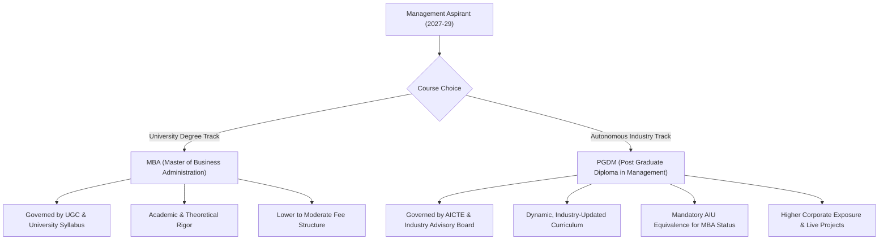
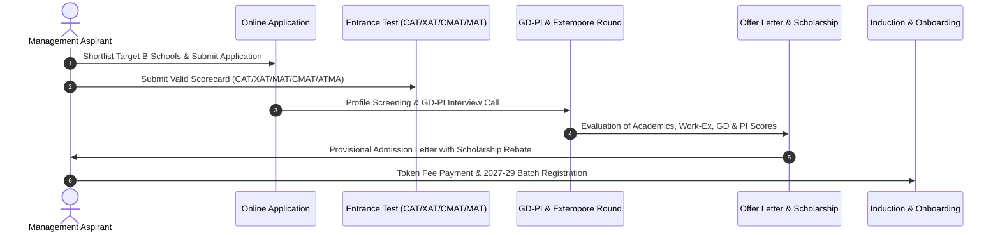

# Top 44 MBA & PGDM Colleges in India 2027-29: Fees, MBA vs PGDM, Approvals, Placements, PPO, Certifications, Faculty & ROI Guide

> 💡 **Key Takeaways (Direct AI Answer Summary)**
> - **2027–29 Session Fee Spectrum**: Total 2-year course fees across the top 44 featured B-schools range from **₹3.15 Lakhs to ₹18.00 Lakhs**, with flexible annual and semester installment payment options and merit scholarships up to ₹2.5 Cr.
> - **MBA vs. PGDM Accreditation Framework**: PGDM programs with **AICTE Approval, NBA Accreditation, and AIU Equivalence** (e.g., NDIM, DSB, FIIB, JIMS, JAGSoM, ITM) provide identical degree status to university MBAs with superior, industry-updated practical curricula.
> - **Placement & PPO Benchmarks**: Average CTCs range between **₹6.50 LPA and ₹12.88 LPA**, highest domestic/international packages reach up to **₹58.00 LPA - ₹1.2 CPA**, and 20% to 35% of students convert **Pre-Placement Offers (PPOs)** through mandatory summer internships.

Selecting the right business school for the **2027–2029 academic session** is one of the most critical career decisions for graduate aspirants. With hundreds of B-schools in major economic clusters—**Delhi NCR, Pune, Mumbai, Bangalore, and Jaipur**—evaluating institutional credentials goes far beyond glossy brochures.

To make an informed, high-ROI investment, candidates must analyze **exact 2027–29 fees, degree nomenclature (MBA vs. PGDM), statutory approvals (AICTE / UGC / NBA / AIU / AACSB), audited placement statistics, PPO conversion rates, embedded certifications, awards, alumni strength, faculty profiles, and board of directors**.

This encyclopedic guide delivers an objective, data-backed analysis of the **top 44 MBA & PGDM colleges in India for the 2027–2029 session**.

---

## 1. Master Comparison Matrix: Top 44 MBA & PGDM Colleges (2027–29)

The table below provides a side-by-side evaluation of all 44 colleges across location, program, updated 2027–29 fees, average placement CTC, highest package, and key accreditations:

| # | College Name | Location | Program | Total Fees (2027–29) | Avg. CTC | Highest CTC | Approvals & Accreditations |
| :--- | :--- | :--- | :--- | :--- | :--- | :--- | :--- |
| 1 | **NDIM Delhi** | New Delhi | PGDM | ₹14.00 Lakhs | ₹10.00 LPA | ₹24.00 LPA | AICTE · NBA · AIU Eq. · ASIC (UK) |
| 2 | **FOSTIIMA Business School** | New Delhi | PGDM | ₹11.50 Lakhs | ₹11.15 LPA | ₹30.00 LPA | AICTE · IIMA Alumni Initiative |
| 3 | **FIIB Delhi** | New Delhi | PGDM | ₹12.85 Lakhs | ₹8.50 LPA | ₹25.92 LPA | AICTE · NBA · AIU Eq. · AACSB Member |
| 4 | **Delhi School of Business (DSB)** | Pitampura, Delhi | PGDM | ₹11.50 Lakhs | ₹10.50 LPA | ₹23.90 LPA | AICTE · NBA · AIU Eq. |
| 5 | **IILM Lodhi Road** | New Delhi | PGDM | ₹12.90 Lakhs | ₹8.60 LPA | ₹20.00 LPA | AICTE · NBA · AIU Eq. · SAQS |
| 6 | **MERI Janakpuri** | New Delhi | MBA / PGDM | ₹5.95 Lakhs | ₹7.50 LPA | ₹20.00 LPA | AICTE · GGSIPU Affiliated · NAAC A |
| 7 | **JIMS Kalkaji** | New Delhi | PGDM | ₹10.75 Lakhs | ₹10.50 LPA | ₹35.00 LPA | AICTE · NBA · AIU Eq. · NAAC |
| 8 | **[GD Goenka University](/colleges/gd-goenka-university)** | Gurgaon | MBA | ₹8.50 Lakhs | ₹6.50 LPA | ₹17.50 LPA | UGC · AIU · ACU Member |
| 9 | **[Amity University](/colleges/amity-noida) Gurugram** | Gurgaon | MBA | ₹9.80 Lakhs | ₹6.80 LPA | ₹21.00 LPA | UGC · NAAC A+ · IACBE |
| 10 | **IILM University** | Sector 53, Gurgaon | MBA | ₹11.50 Lakhs | ₹8.60 LPA | ₹26.00 LPA | UGC Approved State Private Univ. |
| 11 | **First Bridge Business School** | Gurgaon | PGDM | ₹16.00 Lakhs | ₹8.50 LPA | ₹20.00 LPA | AICTE Approved · Applied AI Model |
| 12 | **IBMR Gurgaon** | Sector 14, Gurgaon | MBA / PGDM | ₹6.95 Lakhs | ₹7.50 LPA | ₹21.00 LPA | AICTE · MDU Affiliated (MBA) |
| 13 | **JK Business School (JKBS)** | Gurgaon | PGDM | ₹7.99 Lakhs | ₹9.00 LPA | ₹24.00 LPA | AICTE · JK Organisation Legacy |
| 14 | **[Bennett University](/colleges/bennett-greater-noida)** | Greater Noida | MBA | ₹11.95 Lakhs | ₹7.50 LPA | ₹1.20 CPA | UGC Approved · Times Group Backed |
| 15 | **[Noida International University (NIU)](/colleges/niu-greater-noida)** | Greater Noida | MBA | ₹6.50 Lakhs | ₹5.50 LPA | ₹13.96 LPA | UGC · NAAC A+ Accredited |
| 16 | **GNIOT Greater Noida** | Greater Noida | MBA / PGDM | ₹8.55 Lakhs | ₹5.00 LPA | ₹27.00 LPA | AICTE · AKTU Affiliated (MBA) |
| 17 | **GL Bajaj Institute (GLBIMR)** | Greater Noida | PGDM | ₹7.95 Lakhs | ₹6.80 LPA | ₹58.00 LPA | AICTE Approved · Ranked B-School |
| 18 | **Accurate Institute (AIMT)** | Greater Noida | MBA / PGDM | ₹6.95 Lakhs | ₹6.50 LPA | ₹15.00 LPA | AICTE · AKTU Affiliated (MBA) |
| 19 | **Mangalmay Institute** | Greater Noida | MBA | ₹3.25 Lakhs | ₹5.50 LPA | ₹12.40 LPA | AICTE · AKTU Affiliated · NAAC |
| 20 | **[Lloyd Business School](/colleges/lloyd-business-school-greater-noida)** | Greater Noida | MBA / PGDM | ₹8.25 Lakhs | ₹6.00 LPA | ₹18.00 LPA | AICTE · IBM Co-Branded PGDM |
| 21 | **IILM University** | Greater Noida | MBA | ₹12.40 Lakhs | ₹5.90 LPA | ₹14.40 LPA | UGC Approved · Estd. 1993 Legacy |
| 22 | **ITS Ghaziabad (Mohan Nagar)** | Ghaziabad | MBA / PGDM | ₹6.95 Lakhs | ₹6.00 LPA | ₹11.00 LPA | AICTE · NBA · NAAC Grade A |
| 23 | **[Jaipuria School of Business](/colleges/jaipuria-school-of-business-ghaziabad) (JSB)** | Indirapuram, Gzb | PGDM | ₹8.50 Lakhs | ₹7.00 LPA | ₹15.00 LPA | AICTE Approved · Jaipuria Brand |
| 24 | **[Taxila Business School](/colleges/taxila-jaipur)** | Jaipur | PGDM | ₹10.50 Lakhs | ₹11.80 LPA | ₹28.60 LPA | AICTE · SAP S/4HANA Certified |
| 25 | **[IILM Academy of Higher Learning](/colleges/iilm-academy-of-higher-learning)** | Jaipur | PGDM | ₹7.00 Lakhs | ₹8.60 LPA | ₹14.00 LPA | AICTE Approved · Merit Scholarships |
| 26 | **Vivekananda Global Univ. (VGU)** | Jaipur | MBA | ₹5.05 Lakhs | ₹5.20 LPA | ₹54.00 LPA | UGC · NAAC A+ · Sunstone Partner |
| 27 | **[RIIM Pune](/colleges/riim-pune)** | Bavdhan, Pune | MBA / PGDM | ₹8.60 Lakhs | ₹7.84 LPA | ₹35.00 LPA | AICTE · SPPU Affiliated · High ROI |
| 28 | **Lexicon MILE** | Wagholi, Pune | PGDM / Global MBA | ₹10.80 Lakhs | ₹6.50 LPA | ₹13.30 LPA | AICTE · International Study Tours |
| 29 | **Dr. D.Y. Patil Institute (DYPIMR)** | Pimpri, Pune | MBA / PGDM | ₹6.50 Lakhs | ₹8.00 LPA | ₹24.00 LPA | AICTE · SPPU · NAAC A++ (3.73) |
| 30 | **[ISMS Pune](/colleges/isms-pune)** | Hinjawadi, Pune | MBA / PGDM | ₹7.25 Lakhs | ₹8.00 LPA | ₹19.00 LPA | AICTE · British MBA Pathway |
| 31 | **IIEBM Indus Business School** | Wakad, Pune | PGDM | ₹8.25 Lakhs | ₹7.50 LPA | ₹30.00 LPA | AICTE · SAP ERP Direct Training |
| 32 | **[ASM IBMR](/colleges/asm-ibmr)** | Chinchwad, Pune | MBA / PGDM | ₹6.95 Lakhs | ₹7.50 LPA | ₹24.00 LPA | AICTE · Harvard & IBM Partnered |
| 33 | **Akemi Business School** | Tathawade, Pune | MBA | ₹3.15 Lakhs | ₹4.80 LPA | ₹18.00 LPA | AICTE · SPPU Affiliated |
| 34 | **UBS Mumbai (Universal AI Univ.)** | Karjat, Mumbai | MBA / PGDM | ₹12.50 Lakhs | ₹10.50 LPA | ₹42.00 LPA | AICTE · India's 1st AI University |
| 35 | **ATLAS SkillTech University** | BKC Zone, Mumbai | MBA | ₹12.05 Lakhs | ₹9.50 LPA | ₹22.00 LPA | UGC Approved · Urban Tech Campus |
| 36 | **[Amity University Mumbai](/colleges/amity-mumbai)** | Panvel, Mumbai | MBA | ₹10.25 Lakhs | ₹7.00 LPA | ₹15.00 LPA | UGC · WES Approved · Smart Campus |
| 37 | **JAGSoM Greater Mumbai** | Karjat, Mumbai | MBA | ₹11.50 Lakhs | ₹11.00 LPA | ₹25.00 LPA | AICTE · AACSB Accredited Legacy |
| 38 | **ITM Business School** | Navi Mumbai | PGDM | ₹12.45 Lakhs | ₹10.50 LPA | ₹25.00 LPA | AICTE · NBA · NAAC A · iConnect |
| 39 | **[ISBR Business School](/colleges/isbr-bangalore)** | Electronic City, Blr | MBA / PGDM | ₹11.00 Lakhs | ₹9.00 LPA | ₹20.00 LPA | AICTE · NBA Accredited · BU Affil. |
| 40 | **IIBS Bangalore** | Airport Rd, Blr | MBA / PGDM | ₹8.95 Lakhs | ₹8.20 LPA | ₹48.00 LPA | AICTE · Bangalore Univ. Affiliated |
| 41 | **[GIBS Business School](/colleges/gibs-bangalore)** | Bannerghatta, Blr | MBA / PGDM | ₹11.25 Lakhs | ₹9.50 LPA | ₹22.00 LPA | AICTE · Innovation Incubation Lab |
| 42 | **[ISME Bangalore](/colleges/isme-bangalore)** | Sarjapur Rd, Blr | PGDM | ₹10.95 Lakhs | ₹8.50 LPA | ₹18.00 LPA | AICTE · LSE & Carleton Tie-ups |
| 43 | **Alliance School of Business** | Anekal, Blr | MBA | ₹18.00 Lakhs | ₹10.50 LPA | ₹40.00 LPA | UGC · AACSB Member · NIRF Ranked |
| 44 | **[Amity University](/colleges/amity-noida) Bengaluru** | Devanahalli, Blr | MBA | ₹11.52 Lakhs | ₹7.50 LPA | ₹20.00 LPA | UGC · Modern Tech Hub Campus |

---

## 2. In-Depth Profiles: Delhi NCR Region (Delhi, Gurgaon, Greater Noida, Ghaziabad)

### 1. [New Delhi Institute of Management](/colleges/new-delhi-institute-of-management) (NDIM) – New Delhi
*   **Program**: 2-Year Full-Time PGDM (Dual Specialization in Marketing, Finance, HR, FinTech, Business Analytics, Supply Chain & Logistics).
*   **Approvals & Accreditations**: AICTE Approved, NBA Accredited, AIU MBA Equivalent, ASIC (UK) Premier Institution.
*   **Fee Structure (2027–29)**: **₹14.00 Lakhs** total (₹7.00 Lakhs/year annual plan, or ₹3.50 Lakhs/semester + ₹6,000 convenience charge). ₹2.5 Crore dedicated scholarship pool.
*   **Placements & PPO**: 100% placement record. Average CTC is **₹10.00 LPA** (Top 25% at **₹12.80 LPA**); Highest CTC is **₹24.00 LPA**. Over 28% of the batch secures PPOs through 8-week paid corporate internships.
*   **Certifications Provided**: Advanced Financial Modeling, Google Digital Marketing, Power BI & Tableau Analytics, Six Sigma Green Belt, Python for Managers.
*   **Awards & Rankings**: Rated 1st in India for Industry Linkages by AICTE-CII for 3 consecutive years; featured among Top 50 B-Schools by Business World.
*   **Alumni Network**: 12,000+ alumni across 40+ countries holding CXO and Director-level roles in Deloitte, KPMG, EY, Infosys, and HDFC Bank.
*   **Faculty Members**: 60+ full-time faculty; 85% hold Ph.D. degrees from IIMs, FMS, IITs, and top central universities with corporate leadership tenures.
*   **Board of Directors**: Governed by former Union Ministers, ex-Election Commissioners of India, and corporate titans from Tata, Reliance, and ITC.
*   **Why Join**: Premium South Delhi location (Tughlakabad), double specialization with no extra fee, AIU equivalence granting eligibility for UPSC/Ph.D., and unmatched corporate network.

### 2. FOSTIIMA Business School – Dwarka, New Delhi
*   **Program**: 2-Year Full-Time PGDM.
*   **Approvals & Accreditations**: AICTE Approved, Ministry of Education, Govt. of India.
*   **Fee Structure (2027–29)**: **₹11.50 Lakhs** total.
*   **Placements & PPO**: Average CTC stands at **₹11.15 LPA**; Highest CTC is **₹30.00 LPA**. Strong PPO pipeline in banking, consulting, and FMCG.
*   **Certifications Provided**: AI for Business, Harvard Business Publishing Case Simulations, Advanced Excel & Valuation, FinTech Foundations.
*   **Awards & Rankings**: Awarded "Top Institute for ROI" in North India by CSR-GHRDC; Ranked Top 20 Private B-Schools in Delhi NCR.
*   **Alumni Network**: Strong network of 5,000+ professionals heavily concentrated in BFSI, Equity Research, and Tech consulting.
*   **Faculty Members**: Founded and mentored entirely by **[IIM Ahmedabad](/colleges/iim-ahmedabad) Alumni**; 90% of core faculty are alumni from IIMs and IITs.
*   **Board of Directors**: Chaired by IIM-A alumni and senior corporate consultants with 30+ years in international business.
*   **Why Join**: Direct IIM-A pedagogical framework, heavy case-study immersion, excellent Dwarka metro connectivity, and outstanding ROI.

### 3. [Fortune Institute of International Business](/colleges/fortune-institute-of-international-business) (FIIB) – Vasant Vihar, New Delhi
*   **Program**: PGDM & PGDM (Financial Management).
*   **Approvals & Accreditations**: AICTE Approved, NBA Accredited, AIU Equivalent, Member AACSB & EFMD.
*   **Fee Structure (2027–29)**: **₹12.85 Lakhs** total.
*   **Placements & PPO**: Average CTC is **₹8.50 LPA**; Highest CTC is **₹25.92 LPA**. 180+ recruiters on campus.
*   **Certifications Provided**: Bloomberg Terminal certification, Six Sigma, Digital Strategy, Python & R for Data Analysis.
*   **Awards & Rankings**: Ranked 3rd in Delhi NCR private B-Schools by Times B-School; Best B-School for Global Immersion.
*   **Alumni Network**: 3,500+ alumni globally with active regional chapters in USA, UK, UAE, and Singapore.
*   **Faculty Members**: 45+ research-driven faculty members with international publications and corporate consultancy projects.
*   **Board of Directors**: Comprises senior executives from Fortune 500 companies, academic scholars, and former banking chairpersons.
*   **Why Join**: Elite South Delhi campus (Vasant Vihar), AACSB international curriculum standards, strong mentorship under the "Sankalp" corporate cell.

### 4. Delhi School of Business (DSB / VIPS-TC) – Pitampura, Delhi
*   **Program**: 2-Year Full-Time PGDM.
*   **Approvals & Accreditations**: AICTE Approved, NBA Accredited, AIU Equivalent.
*   **Fee Structure (2027–29)**: **₹11.50 Lakhs** total.
*   **Placements & PPO**: Average CTC is **₹10.50 LPA**; Highest CTC is **₹23.90 LPA**. Top recruiters include BlackRock, Deloitte, EY, Asian Paints, and S&P Global.
*   **Certifications Provided**: Advanced Financial Modeling, Power BI & Tableau, AI in Decision Making, SAP ERP modules.
*   **Awards & Rankings**: Ranked among Top 10 B-Schools in Delhi NCR by Competition Success Review; NBA Accreditation for academic excellence.
*   **Alumni Network**: Backed by the massive 25,000+ VIPS student-alumni ecosystem across corporate and judiciary corridors.
*   **Faculty Members**: Renowned faculty drawn from IIMs, [FMS Delhi](/colleges/fms-delhi), and corporate leaders in investment banking and data science.
*   **Board of Directors**: Governed by the prestigious VIPS management council headed by former judges, educationists, and corporate leaders.
*   **Why Join**: World-class Pitampura campus infrastructure, advanced financial analytics labs, high corporate linkage in North & West Delhi.

### 5. [IILM Institute for Higher Education](/colleges/iilm-delhi) – Lodhi Road, New Delhi
*   **Program**: 2-Year Full-Time PGDM.
*   **Approvals & Accreditations**: AICTE Approved, NBA Accredited, AIU Equivalent, SAQS Accredited.
*   **Fee Structure (2027–29)**: **₹12.90 Lakhs** total.
*   **Placements & PPO**: Average CTC is **₹8.60 LPA**; Highest CTC is **₹20.00 LPA**.
*   **Certifications Provided**: Global Leadership, Design Thinking, ESG & Sustainable Business, Tableau, Financial Engineering.
*   **Awards & Rankings**: SAQS International Accreditation; Ranked Top 25 Management Institutes in India by Outlook.
*   **Alumni Network**: 15,000+ well-placed alumni globally since 1993 across banking, management consulting, and entrepreneurship.
*   **Faculty Members**: Highly credentialed academicians and visiting international faculty with deep industry immersion.
*   **Board of Directors**: Senior industrialists, former ambassadors, and academic leaders from premier global business schools.
*   **Why Join**: Unbeatable Lutyens' Delhi location, 30+ year management legacy, global study exchange partnerships, SAQS quality assurance.

### 6. [Management Education & Research Institute (MERI)](/colleges/management-education-research-institute-meri) – Janakpuri, New Delhi
*   **Program**: PGDM (AICTE) and MBA (GGSIPU Affiliated).
*   **Approvals & Accreditations**: AICTE Approved, Affiliated to GGSIPU (for MBA), NAAC Grade A.
*   **Fee Structure (2027–29)**: **₹5.95 Lakhs** total.
*   **Placements & PPO**: Average CTC is **₹7.50 LPA**; Highest CTC is **₹20.00 LPA**. 100+ recruiters visit annually.
*   **Certifications Provided**: Digital Marketing, Advanced Excel, NSE NCFM Financial Markets, Retail Analytics.
*   **Awards & Rankings**: NAAC Grade A Accredited; Top ROI B-School in West Delhi.
*   **Alumni Network**: 7,000+ alumni working in TCS, Infosys, HCL, Axis Bank, Kotak, and ICICI Bank.
*   **Faculty Members**: Experienced core faculty with average teaching and industry experience exceeding 14 years.
*   **Board of Directors**: Chaired by veteran educationists and former bureaucrats from Delhi administration.
*   **Why Join**: Extremely affordable fee structure with high placement ROI, located right next to Janakpuri metro corridor.

### 7. JIMS Kalkaji (Jagannath International) – Kalkaji, New Delhi
*   **Program**: PGDM & PGDM (International Business).
*   **Approvals & Accreditations**: AICTE Approved, NBA Accredited, AIU Equivalent, NAAC Accredited.
*   **Fee Structure (2027–29)**: **₹10.75 Lakhs** total.
*   **Placements & PPO**: Average CTC is **₹10.50 LPA**; Highest CTC is **₹35.00 LPA**. Top recruiters include Amazon, Deloitte, PwC, and Tata Capital.
*   **Certifications Provided**: KPMG Lean Six Sigma, Data Analytics using Python, Digital Marketing & SEO, Export-Import Documentation.
*   **Awards & Rankings**: Ranked Top 20 Private B-Schools in India by Business Today; NBA Accreditation.
*   **Alumni Network**: 9,500+ alumni working across consulting, supply chain, and private banking.
*   **Faculty Members**: Blend of seasoned academicians and corporate CXOs conducting weekly live case discussions.
*   **Board of Directors**: Led by senior educationists and industry advisors from CII and FICCI panels.
*   **Why Join**: Proven placement records, double specialization, excellent South Delhi corporate connectivity.

### 8. [GD Goenka University](/colleges/gd-goenka-university) (School of Management) – Sohna Road, Gurgaon
*   **Program**: 2-Year Full-Time MBA.
*   **Approvals & Accreditations**: UGC Approved State Private University, AIU, Association of Commonwealth Universities.
*   **Fee Structure (2027–29)**: **₹8.50 Lakhs** total.
*   **Placements & PPO**: Average CTC is **₹6.50 LPA**; Highest CTC is **₹17.50 LPA**.
*   **Certifications Provided**: Supply Chain Analytics, Design Thinking, Brand Management, Advanced Financial Modeling.
*   **Awards & Rankings**: Ranked among Top Private Universities in North India; QS I-Gauge Diamond Rated for Teaching.
*   **Alumni Network**: 10,000+ alumni spread across Goenka global educational network.
*   **Faculty Members**: Faculty with degrees from top international universities and IITs/IIMs.
*   **Board of Directors**: Governed by the GD Goenka Group leadership and senior corporate executives.
*   **Why Join**: 60-acre state-of-the-art campus, international collaborations, robust corporate placement cell.

### 9. Amity University Gurugram (Amity Gurgaon) – Manesar, Gurgaon
*   **Program**: 2-Year Full-Time MBA (General, Banking, Business Analytics).
*   **Approvals & Accreditations**: UGC Approved, NAAC Grade A+ Accredited, IACBE (USA), WES Approved.
*   **Fee Structure (2027–29)**: **₹9.80 Lakhs** total.
*   **Placements & PPO**: Average CTC is **₹6.80 LPA**; Highest CTC is **₹21.00 LPA**.
*   **Certifications Provided**: IBM Analytics Badge, Foreign Language Certification (French/German/Spanish), Six Sigma.
*   **Awards & Rankings**: NAAC A+ Grade with 3.27 CGPA; Ranked Top 100 in NIRF University Rankings.
*   **Alumni Network**: Part of the 150,000+ strong global Amity Alumni Association across 50 countries.
*   **Faculty Members**: 150+ Ph.D. faculty members with extensive corporate research grants.
*   **Board of Directors**: Chaired by Ritnand Balved Education Foundation (RBEF) trustees and international scholars.
*   **Why Join**: 110-acre green residential campus, global exposure modules, WES recognition for abroad jobs.

### 10. IILM University – Sector 53, Golf Course Road, Gurgaon
*   **Program**: 2-Year Full-Time MBA (Marketing, FinTech, HR, Analytics, Supply Chain).
*   **Approvals & Accreditations**: UGC Approved State Private University, Govt. of Haryana.
*   **Fee Structure (2027–29)**: **₹11.50 Lakhs** total.
*   **Placements & PPO**: Average CTC is **₹8.60 LPA**; Highest CTC is **₹26.00 LPA**. Top recruiters: Deloitte, KPMG, EY, Loreal, Zomato.
*   **Certifications Provided**: AI in HR, Investment Banking Modeling, Digital Media, Python Analytics.
*   **Awards & Rankings**: Ranked Top 30 Private Universities in North India; Awarded for Innovation in Management Education.
*   **Alumni Network**: Direct integration with IILM's 30-year legacy alumni base of 15,000+ professionals.
*   **Faculty Members**: 50+ faculty members including former CXOs, corporate board members, and doctoral scholars.
*   **Board of Directors**: Governed by corporate industry leaders, academic scholars, and former vice-chancellors.
*   **Why Join**: Prime Golf Course Road corporate location, liberal management curriculum, personalized executive mentoring.

### 11. First Bridge Business School (FBBS) – Gurgaon
*   **Program**: 2-Year Full-Time PGDM (Applied Management & AI Integration).
*   **Approvals & Accreditations**: AICTE Approved, Ministry of Education, Govt. of India.
*   **Fee Structure (2027–29)**: **₹16.00 Lakhs** total.
*   **Placements & PPO**: Average CTC estimated at **₹8.50 LPA**; Highest CTC up to **₹20.00 LPA**. Heavy focus on consulting and product tracks.
*   **Certifications Provided**: Applied Generative AI for Business, Growth Product Management, GCC Finance, Strategy Decks Mastery.
*   **Awards & Rankings**: Emerging B-School of the Year for Neo-Curriculum Innovation.
*   **Alumni Network**: Rapidly expanding corporate network linked with 80+ enterprise partners and high-growth startup hubs.
*   **Faculty Members**: 100% practitioner-led faculty consisting of active CXOs, startup founders, and McKinsey/BCG alumni.
*   **Board of Directors**: Eminent industry founders, venture capital partners, and tech executives.
*   **Why Join**: Portfolio-based learning (strategy decks, dashboards) replacing traditional rote exams; direct Gurugram cyber hub immersion.

### 12. IBMR Group of Institutions (IBMR Gurgaon) – Sector 14, Gurgaon
*   **Program**: MBA (Affiliated to MDU Rohtak) & Autonomous PGDM (AICTE Approved).
*   **Approvals & Accreditations**: AICTE Approved, Affiliated to MDU Rohtak, Govt. of Haryana.
*   **Fee Structure (2027–29)**: **₹6.95 Lakhs** total.
*   **Placements & PPO**: Average CTC is **₹7.50 LPA**; Highest CTC is **₹21.00 LPA**. 150+ recruiters including IBM, Amazon, Deloitte, ITC.
*   **Certifications Provided**: Digital Marketing, Advanced Excel, Python, HR Analytics, ERP Fundamentals.
*   **Awards & Rankings**: Ranked Top 10 B-School for Practical Corporate Readiness in NCR by CSR.
*   **Alumni Network**: 8,000+ alumni working in Gurugram and Pan-India MNCs.
*   **Faculty Members**: Senior corporate managers and professors with 15+ years of classroom & consulting experience.
*   **Board of Directors**: Led by seasoned academicians and former directors of state universities.
*   **Why Join**: Prime Sector 14 location in the corporate heart of Gurugram, dual specialization options, very competitive fee-to-placement ratio.

### 13. JK Business School (JKBS) – Damdama Lake Road, Gurgaon
*   **Program**: 2-Year Full-Time PGDM.
*   **Approvals & Accreditations**: AICTE Approved, Govt. of India, Backed by JK Organisation.
*   **Fee Structure (2027–29)**: **₹7.99 Lakhs** total.
*   **Placements & PPO**: Average CTC is **₹9.00 LPA**; Highest CTC is **₹24.00 LPA**. Recruiters: EY, KPMG, Berger Paints, Decathlon, Flipkart.
*   **Certifications Provided**: Digital Business, Business Analytics using Power BI, Six Sigma, Financial Valuation.
*   **Awards & Rankings**: Ranked Top 20 Private B-Schools in North India by Outlook; Top Corporate Governance B-School.
*   **Alumni Network**: 6,000+ alumni integrated across the massive JK Group conglomerate and top MNCs.
*   **Faculty Members**: Mentors from JK Organisation corporate boards, IIM graduates, and Ph.D. scholars.
*   **Board of Directors**: Governed by the leadership of JK Organisation (Raymond, JK Tyre, JK Paper).
*   **Why Join**: Direct corporate mentorship from JK Organisation executives, residential campus, strong analytics focus.

### 14. [Bennett University](/colleges/bennett-greater-noida) – Greater Noida
*   **Program**: 2-Year Full-Time MBA (Media, Finance, Marketing, Analytics, HR).
*   **Approvals & Accreditations**: UGC Approved State Private University, Backed by The Times Group.
*   **Fee Structure (2027–29)**: **₹11.95 Lakhs** total.
*   **Placements & PPO**: Average CTC is **₹7.50 LPA**; Highest CTC is **₹1.20 CPA** (International / Peak).
*   **Certifications Provided**: Media & Digital Strategy (Times School of Media), Financial Analytics, Global Immersion.
*   **Awards & Rankings**: Ranked Top Emerging University in India; Ranked #1 Private University in NCR for Infrastructure.
*   **Alumni Network**: Rapidly expanding corporate network across media, venture funds, FMCG, and tech conglomerates.
*   **Faculty Members**: Elite faculty trained at Ivy League institutions, IIMs, and senior editors from The Times Group.
*   **Board of Directors**: Times Group executive leadership, former vice-chancellors, and Fortune 500 corporate heads.
*   **Why Join**: Times Group media and corporate ecosystem backing, world-class 68-acre residential campus, incubator seed funding support.

### 15. [Noida International University (NIU)](/colleges/niu-greater-noida) – Greater Noida
*   **Program**: 2-Year Full-Time MBA.
*   **Approvals & Accreditations**: UGC Approved, NAAC Grade A+ Accredited.
*   **Fee Structure (2027–29)**: **₹6.50 Lakhs** total.
*   **Placements & PPO**: Average CTC is **₹5.50 LPA**; Highest CTC is **₹13.96 LPA**. 85% placement rate.
*   **Certifications Provided**: Digital Marketing, Hospital Management, Supply Chain Logistics, Advanced Excel.
*   **Awards & Rankings**: NAAC Grade A+ Accreditation; Ranked among Best Private Universities in UP.
*   **Alumni Network**: 6,500+ alumni across healthcare, IT, and banking sectors.
*   **Faculty Members**: 75+ full-time management faculty with strong academic publications.
*   **Board of Directors**: Educationists, legal luminaries, and healthcare administrators.
*   **Why Join**: NAAC A+ accreditation, 75-acre campus on Yamuna Expressway, affordable fees, active corporate drives.

### 16. Greater Noida Institute of Technology (GNIOT) – Greater Noida
*   **Program**: MBA (Affiliated to AKTU) & Autonomous PGDM (AICTE Approved).
*   **Approvals & Accreditations**: AICTE Approved, Affiliated to AKTU, NBA Accredited programs.
*   **Fee Structure (2027–29)**: **₹8.55 Lakhs** for PGDM; **₹4.95 Lakhs** for MBA.
*   **Placements & PPO**: Average CTC is **₹5.00 LPA**; Highest CTC is **₹27.00 LPA**.
*   **Certifications Provided**: Python for Managers, Digital Media Marketing, Banking Operations, Retail Strategy.
*   **Awards & Rankings**: Top Management College in Greater Noida by CSR; Rated A+ in NCR B-School Surveys.
*   **Alumni Network**: 14,000+ alumni across engineering and management sectors.
*   **Faculty Members**: Experienced core faculty with active industrial consulting assignments.
*   **Board of Directors**: Chaired by GNIOT Group trustees and former senior professors of technical boards.
*   **Why Join**: Prime Knowledge Park II location, affordable fee packages, dual specialization.

### 17. GL Bajaj Institute of Management & Research (GLBIMR) – Greater Noida
*   **Program**: 2-Year Full-Time PGDM.
*   **Approvals & Accreditations**: AICTE Approved, Ministry of Education, Govt. of India.
*   **Fee Structure (2027–29)**: **₹7.95 Lakhs** total.
*   **Placements & PPO**: Average CTC is **₹6.80 LPA**; Highest CTC is **₹58.00 LPA**. Over 250+ companies recruit annually.
*   **Certifications Provided**: Business Analytics (with KPMG/IBM modules), Digital Marketing, Six Sigma Green Belt, Advance Excel.
*   **Awards & Rankings**: Ranked consistently among Top 5 Private B-Schools in Greater Noida; Awarded for Outstanding Placement Track.
*   **Alumni Network**: 8,500+ well-placed alumni in tier-1 MNCs like Amazon, Deloitte, KPMG, EY, and Federal Bank.
*   **Faculty Members**: 40+ full-time faculty; 70% holding doctoral credentials from prestigious Indian universities.
*   **Board of Directors**: Senior corporate leaders, educationists, and advisors from ASSOCHAM and CII.
*   **Why Join**: Exceptional placement track record with high peak packages, intensive personality grooming, strong ROI.

### 18. [Accurate Institute of Management](/colleges/accurate-greater-noida) & Technology (AIMT) – Greater Noida
*   **Program**: PGDM (AICTE Approved) & MBA (AKTU Affiliated).
*   **Approvals & Accreditations**: AICTE Approved, AKTU Affiliated (MBA), AIU Equivalent.
*   **Fee Structure (2027–29)**: **₹6.95 Lakhs** for PGDM; **₹3.25 Lakhs** for MBA.
*   **Placements & PPO**: Average CTC is **₹6.50 LPA**; Highest CTC is **₹15.00 LPA**. 100% placement assistance.
*   **Certifications Provided**: Supply Chain Analytics, Digital Branding, FinTech Foundations, Foreign Language.
*   **Awards & Rankings**: Awarded "Best Management College for Placements in NCR" by National Education Awards.
*   **Alumni Network**: 7,000+ alumni across IT, BFSI, and logistics companies.
*   **Faculty Members**: Core faculty with blend of doctoral qualifications and 10+ years of industrial tenure.
*   **Board of Directors**: Chaired by Accurate Group trustees and former corporate directors.
*   **Why Join**: Value-priced MBA/PGDM in Knowledge Park III, focus on practical sales bootcamps and live projects.

### 19. Mangalmay Institute of Management & Technology – Greater Noida
*   **Program**: 2-Year Full-Time MBA.
*   **Approvals & Accreditations**: AICTE Approved, Affiliated to AKTU, NAAC Accredited.
*   **Fee Structure (2027–29)**: **₹3.25 Lakhs** total.
*   **Placements & PPO**: Average CTC is **₹5.50 LPA**; Highest CTC is **₹12.40 LPA**.
*   **Certifications Provided**: Digital Marketing, Advanced Excel, Soft Skills Mastery, HR Analytics.
*   **Awards & Rankings**: NAAC Accredited; Ranked Best Value B-School in Greater Noida by CSR.
*   **Alumni Network**: 6,000+ alumni working in FMCG, BFSI, and manufacturing sectors.
*   **Faculty Members**: Dedicated faculty with focused mentor-mentee tutoring approaches.
*   **Board of Directors**: Veteran academicians and former directors of technical universities.
*   **Why Join**: One of the most affordable MBA programs in Delhi NCR with maximum fee-to-salary ROI.

### 20. [Lloyd Business School](/colleges/lloyd-business-school-greater-noida) – Greater Noida
*   **Program**: PGDM (in collaboration with IBM) & MBA (AKTU Affiliated).
*   **Approvals & Accreditations**: AICTE Approved, AKTU Affiliated (for MBA).
*   **Fee Structure (2027–29)**: **₹8.25 Lakhs** for PGDM (IBM Tracks); **₹2.90 Lakhs** for MBA.
*   **Placements & PPO**: Average CTC is **₹6.00 LPA**; Highest CTC is **₹18.00 LPA**. Strong placements in supply chain & analytics.
*   **Certifications Provided**: IBM Business Analytics Specialist, IBM AI Foundations, Supply Chain & Logistics (with Safexpress).
*   **Awards & Rankings**: Awarded Best B-School with Industry Collaboration in North India.
*   **Alumni Network**: 7,500+ alumni across analytics, pharma-management, and supply chain.
*   **Faculty Members**: Faculty co-mentored by IBM certified master trainers and AKTU approved professors.
*   **Board of Directors**: Senior corporate professionals from tech, pharmaceutical, and logistics giants.
*   **Why Join**: Co-branded IBM analytics and Safexpress supply chain PGDM curriculums with guaranteed lab exposure.

### 21. IILM University – Greater Noida Campus
*   **Program**: 2-Year Full-Time MBA.
*   **Approvals & Accreditations**: UGC Approved, IILM University Act, Govt. of UP.
*   **Fee Structure (2027–29)**: **₹12.40 Lakhs** total.
*   **Placements & PPO**: Average CTC is **₹5.90 LPA**; Highest CTC is **₹14.40 LPA**.
*   **Certifications Provided**: Innovation & Entrepreneurship, Global Strategy, FinTech, Design Thinking.
*   **Awards & Rankings**: Legacy management brand since 1993; Ranked Top 50 Private Universities in India.
*   **Alumni Network**: Shared network of 15,000+ global IILM alumni across 30+ countries.
*   **Faculty Members**: 50+ faculty members with doctoral research from IITs, central universities, and top MNC backgrounds.
*   **Board of Directors**: Senior industrialists, former bureaucrats, and international academic advisors.
*   **Why Join**: 26-acre lush green residential campus in Knowledge Park II, start-up incubation lab, deep corporate links.

### 22. ITS Ghaziabad (Institute of Technology & Science) – Mohan Nagar, Ghaziabad
*   **Program**: MBA (Affiliated to AKTU) & Autonomous PGDM (AICTE Approved).
*   **Approvals & Accreditations**: AICTE Approved, NBA Accredited, NAAC Grade A, Affiliated to AKTU.
*   **Fee Structure (2027–29)**: **₹6.95 Lakhs** for PGDM; **₹3.15 Lakhs** for MBA.
*   **Placements & PPO**: Average CTC is **₹6.00 LPA**; Highest CTC is **₹11.00 LPA**.
*   **Certifications Provided**: Advanced Excel, Digital Marketing, Personality Development, Retail Operations.
*   **Awards & Rankings**: NAAC Grade A Accredited; Ranked among Top 10 B-Schools in Western UP.
*   **Alumni Network**: 15,000+ alumni across ITS Education Group institutions.
*   **Faculty Members**: Seasoned professors with 15+ years of teaching and outbound industry training experience.
*   **Board of Directors**: Chaired by ITS Group trustees and former university vice-chancellors.
*   **Why Join**: Prime Mohan Nagar metro connectivity, very affordable university MBA option, high campus placement rate.

### 23. [Jaipuria School of Business](/colleges/jaipuria-school-of-business-ghaziabad) (JSB) – Indirapuram, Ghaziabad
*   **Program**: 2-Year Full-Time PGDM.
*   **Approvals & Accreditations**: AICTE Approved, Ministry of Education, Govt. of India.
*   **Fee Structure (2027–29)**: **₹8.50 Lakhs** total.
*   **Placements & PPO**: Average CTC is **₹7.00 LPA**; Highest CTC is **₹15.00 LPA**.
*   **Certifications Provided**: Digital Media Marketing, Financial Services Valuation, Supply Chain Analytics, Power BI.
*   **Awards & Rankings**: Part of the 75+ year Jaipuria Education Legacy; Ranked Top 25 Private B-Schools in NCR.
*   **Alumni Network**: 5,000+ alumni working across BFSI, retail, FMCG, and consulting MNCs.
*   **Faculty Members**: Faculty pool comprising doctoral scholars and seasoned corporate mentors from Jaipuria Group.
*   **Board of Directors**: Governed by the Jaipuria Educational Council and senior corporate executives.
*   **Why Join**: Strategic Indirapuram location on the Delhi-Ghaziabad border, strong corporate guest lecture series, solid ROI.

---

## 3. In-Depth Profiles: Jaipur Region (Rajasthan Hub)

### 24. [Taxila Business School](/colleges/taxila-jaipur) – Mansarovar, Jaipur
*   **Program**: 2-Year Full-Time PGDM (Dual Specialization with SAP S/4HANA & Business Analytics).
*   **Approvals & Accreditations**: AICTE Approved, Ministry of Education, Govt. of India.
*   **Fee Structure (2027–29)**: **₹10.50 Lakhs** (Installment Plan) / **₹9.80 Lakhs** (Lump Sum Plan).
*   **Placements & PPO**: Average CTC is **₹11.80 LPA**; Highest CTC is **₹28.60 LPA**. 100% placement record.
*   **Certifications Provided**: **SAP S/4HANA (FI & CO modules)**, Business Analytics with Python, Power BI, Advanced Financial Valuation.
*   **Awards & Rankings**: Ranked Top 10 B-School in North India for Business Analytics; Best Corporate Placement Record in Rajasthan.
*   **Alumni Network**: 4,000+ alumni working as SAP consultants, business analysts, and investment bankers globally.
*   **Faculty Members**: Industry practitioners and certified SAP solution architects conducting live ERP projects.
*   **Board of Directors**: Chaired by former IIM faculty and enterprise technology leaders.
*   **Why Join**: Direct hands-on SAP S/4HANA certification embedded in the curriculum, outstanding average salary package (₹11.8 LPA), high PPO conversion.

### 25. [IILM Academy of Higher Learning](/colleges/iilm-jaipur) – Mansarovar, Jaipur
*   **Program**: 2-Year Full-Time PGDM.
*   **Approvals & Accreditations**: AICTE Approved, Ministry of Education, Govt. of India.
*   **Fee Structure (2027–29)**: **₹7.00 Lakhs** total. Generous merit scholarships up to 75% on tuition fees.
*   **Placements & PPO**: Average CTC is **₹8.60 LPA**; Highest CTC is **₹14.00 LPA**.
*   **Certifications Provided**: Six Sigma Green Belt, Digital Marketing, Business Analytics, Financial Markets.
*   **Awards & Rankings**: Ranked Top Private PGDM Institute in Jaipur; Awarded for Outstanding Academic Governance.
*   **Alumni Network**: Integrated with IILM’s 15,000+ pan-India alumni ecosystem.
*   **Faculty Members**: 30+ faculty members with deep corporate consulting and academic publications.
*   **Board of Directors**: IILM governing body consisting of former ambassadors, senior economists, and industry leaders.
*   **Why Join**: Affordable fee package with high merit scholarships, prime Mansarovar location, top corporate recruitment linkages.

### 26. Vivekananda Global University (VGU) – Jagatpura, Jaipur
*   **Program**: 2-Year Full-Time MBA (Collaborated with Sunstone for Employability).
*   **Approvals & Accreditations**: UGC Approved, NAAC Grade A+ Accredited, AIU Member.
*   **Fee Structure (2027–29)**: **₹5.05 Lakhs** total (₹2.53 Lakhs/year).
*   **Placements & PPO**: Average CTC is **₹5.20 LPA**; Highest CTC is **₹54.00 LPA** (International / Peak).
*   **Certifications Provided**: Sunstone 10+ Employability Certifications, Digital Marketing, Advanced Excel, Logistics Operations.
*   **Awards & Rankings**: NAAC Grade A+ Accreditation; Ranked Top Emerging Private University in Rajasthan.
*   **Alumni Network**: 8,000+ alumni working in IT, banking, and EdTech sectors.
*   **Faculty Members**: 60+ full-time management faculty with regular corporate guest lectures.
*   **Board of Directors**: Led by former vice-chancellors, senior academicians, and Marwar education foundation trustees.
*   **Why Join**: 45-acre campus, NAAC A+ accreditation, Sunstone placement protection framework, very affordable fees.

---

## 4. In-Depth Profiles: Pune Region (Maharashtra Educational Hub)

### 27. Ramachandran International Institute of Management ([RIIM Pune](/colleges/riim-pune)) – Bavdhan, Pune
*   **Program**: MBA (Affiliated to SPPU), Autonomous PGDM, and Global MBA.
*   **Approvals & Accreditations**: AICTE Approved, Affiliated to Savitribai Phule Pune University (for MBA), Govt. of Maharashtra.
*   **Fee Structure (2027–29)**: **₹7.20 Lakhs to ₹8.60 Lakhs** total (Includes Employability Development Program & optional 1-Week International Study Tour to Dubai/Singapore).
*   **Placements & PPO**: Average CTC is **₹7.84 LPA**; Highest CTC is **₹35.00 LPA**. High PPO conversion rate.
*   **Certifications Provided**: 500+ Hours Employability Development Program (EDP), SAP ERP, Six Sigma, Advance Excel, Digital Marketing.
*   **Awards & Rankings**: Ranked 1st for Best ROI in Maharashtra by CSR; Awarded Best B-School for Practical Training.
*   **Alumni Network**: 6,500+ alumni placed across top IT and BFSI companies in Pune, Mumbai, and Bangalore.
*   **Faculty Members**: Dedicated core faculty along with 100+ visiting corporate leaders from Hinjawadi IT Park.
*   **Board of Directors**: Founded and chaired by corporate leaders and senior educational advisors.
*   **Why Join**: Unmatched ROI in Pune, intensive EDP practical training, international study tour included, Bavdhan location.

### 28. Lexicon MILE (Management Institute of Leadership & Excellence) – Wagholi, Pune
*   **Program**: PGDM & Global MBA (with UK/US University degrees).
*   **Approvals & Accreditations**: AICTE Approved, Ministry of Education, Govt. of India.
*   **Fee Structure (2027–29)**: **₹10.80 Lakhs** total.
*   **Placements & PPO**: Average CTC is **₹6.50 LPA**; Highest CTC is **₹13.30 LPA**.
*   **Certifications Provided**: 15+ Corporate Certifications (Tableau, MS Office Specialist, Digital Strategy, Supply Chain).
*   **Awards & Rankings**: Ranked Top 20 Private B-Schools in Western India by Times B-School; Awarded for Leadership Excellence.
*   **Alumni Network**: 5,000+ alumni across retail, FMCG, banking, and consulting corporations.
*   **Faculty Members**: Experienced faculty integrating neuro-linguistic programming and executive coaching into pedagogy.
*   **Board of Directors**: Lexicon Group leadership and corporate advisors from Fortune 500 firms.
*   **Why Join**: Global study tour modules, 15+ embedded value certifications, vibrant residential campus in Wagholi.

### 29. Dr. D.Y. Patil Institute of Management & Research (DYPIMR) – Pimpri, Pune
*   **Program**: MBA & Autonomous PGDM.
*   **Approvals & Accreditations**: AICTE Approved, Affiliated to SPPU, **NAAC Grade A++ Accredited (Score 3.73)**.
*   **Fee Structure (2027–29)**: **₹6.50 Lakhs** for PGDM; **₹3.50 Lakhs** for MBA.
*   **Placements & PPO**: Average CTC is **₹8.00 LPA**; Highest CTC is **₹24.00 LPA**.
*   **Certifications Provided**: Business Analytics, Digital Media Strategy, Banking Operations, Python & R Programming.
*   **Awards & Rankings**: NAAC A++ (Highest Accreditation in Maharashtra); Top 5 SPPU-Affiliated Management Institutes.
*   **Alumni Network**: 20,000+ alumni across D.Y. Patil Group's medical, engineering, and management wings.
*   **Faculty Members**: Highly experienced doctoral faculty with patents and extensive research papers.
*   **Board of Directors**: Governed by the prestigious Dr. D.Y. Patil Pratishthan leadership.
*   **Why Join**: NAAC A++ quality assurance, world-class Pimpri smart campus, outstanding placement record in automotive & IT sectors.

### 30. International School of Management Studies ([ISMS Pune](/colleges/isms-pune)) – Hinjawadi, Pune
*   **Program**: MBA (SPPU), PGDM, and British MBA Pathway (Dual Degree with UK Universities).
*   **Approvals & Accreditations**: AICTE Approved, Pearson Assured, Ties with UK Universities (Leeds Beckett, Teesside).
*   **Fee Structure (2027–29)**: **₹7.25 Lakhs** total (India Track); **₹14.50 Lakhs** for British Pathway.
*   **Placements & PPO**: Average CTC is **₹8.00 LPA**; Highest CTC is **₹19.00 LPA**.
*   **Certifications Provided**: Pearson BTEC Level 7 Extended Diploma, Digital Marketing, Business Analytics, Global Trade.
*   **Awards & Rankings**: Awarded Best International B-School in Pune; EdTech Pioneer Award.
*   **Alumni Network**: 4,500+ alumni working in India, UK, UAE, and Europe.
*   **Faculty Members**: International visiting professors and Indian corporate leaders from Hinjawadi.
*   **Board of Directors**: Chaired by international education consultants and corporate strategists.
*   **Why Join**: Direct transfer option to study in the UK for the 2nd year, located right inside Hinjawadi Infotech Park.

### 31. [IIEBM (Indus Business School)](/colleges/iiebm-pune) – Wakad, Pune
*   **Program**: 2-Year Full-Time PGDM & PGPERP.
*   **Approvals & Accreditations**: AICTE Approved, Ministry of Education, SAP ERP Collaboration.
*   **Fee Structure (2027–29)**: **₹8.25 Lakhs** total.
*   **Placements & PPO**: Average CTC is **₹7.50 LPA**; Highest CTC is **₹30.00 LPA**.
*   **Certifications Provided**: Direct SAP ERP System Training & Certification, Advanced Business Analytics, Six Sigma Green Belt.
*   **Awards & Rankings**: Ranked Top 30 B-Schools in West India by Competition Success Review; Best SAP Integrated Curriculum.
*   **Alumni Network**: 6,000+ alumni with heavy presence in enterprise software, consulting, and tech delivery.
*   **Faculty Members**: Senior industry practitioners with military leadership trainers for personality grooming.
*   **Board of Directors**: Founded by veteran educational visionaries and enterprise software leaders.
*   **Why Join**: Direct hands-on SAP ERP module training, Wakad IT corridor location, disciplined grooming model.

### 32. ASM’s Institute of Business Management & Research (IBMR) – Pimpri-Chinchwad, Pune
*   **Program**: MBA (Affiliated to SPPU) & Autonomous PGDM.
*   **Approvals & Accreditations**: AICTE Approved, SPPU Affiliated, **Harvard Business Publishing & IBM Partnered**.
*   **Fee Structure (2027–29)**: **₹6.95 Lakhs** for PGDM; **₹3.75 Lakhs** for MBA.
*   **Placements & PPO**: Average CTC is **₹7.50 LPA**; Highest CTC is **₹24.00 LPA**.
*   **Certifications Provided**: Harvard Business School Online Core Cases, IBM Cloud & Analytics Badges, AWS Cloud Practitioner.
*   **Awards & Rankings**: 40+ Years of Management Legacy (Estd. 1983); First B-School in India co-branded with Harvard modules.
*   **Alumni Network**: 25,000+ alumni across ASM Group institutions globally.
*   **Faculty Members**: Harvard certified faculty and senior corporate consultants.
*   **Board of Directors**: Governed by the Audyogik Shikshan Mandal (ASM) trust leadership.
*   **Why Join**: Official Harvard Business Publishing course materials, IBM technology integration, established 4-decade brand name.

### 33. Akemi Business School – Tathawade, Pune
*   **Program**: 2-Year Full-Time MBA (Affiliated to Savitribai Phule Pune University).
*   **Approvals & Accreditations**: AICTE Approved, DTE Maharashtra, Affiliated to SPPU.
*   **Fee Structure (2027–29)**: **₹3.15 Lakhs** total.
*   **Placements & PPO**: Average CTC is **₹4.80 LPA**; Highest CTC is **₹18.00 LPA**.
*   **Certifications Provided**: Advanced Excel, Soft Skills Grooming, Digital Marketing, Retail Sales.
*   **Awards & Rankings**: Awarded Best Affordable MBA College in Pune; High ROI B-School.
*   **Alumni Network**: 4,000+ alumni in Pune corporate circles.
*   **Faculty Members**: Experienced SPPU approved faculty and local corporate mentors.
*   **Board of Directors**: Educationists and industrial consultants from PCMC hub.
*   **Why Join**: Highly affordable fees (₹3.15L) with government university MBA degree, ideal for budget-conscious management aspirants.

---

## 5. In-Depth Profiles: Mumbai & Navi Mumbai Region (Financial Capital)

### 34. Universal Business School (UBS Mumbai) / Universal AI University – Karjat, Mumbai
*   **Program**: MBA & Autonomous PGDM (Specialization in AI & Business Analytics, Finance, Marketing).
*   **Approvals & Accreditations**: AICTE Approved, **India’s 1st AI University**, Endorsed by 60 Global CEOs.
*   **Fee Structure (2027–29)**: **₹12.50 Lakhs** total.
*   **Placements & PPO**: Average CTC is **₹10.50 LPA**; Highest CTC is **₹42.00 LPA**.
*   **Certifications Provided**: AI for Business Leaders, Quantum Analytics, Global Financial Modeling, ESG Strategy.
*   **Awards & Rankings**: Awarded "Most Innovative B-School in India" by India Today; 1st Green AI University in Asia.
*   **Alumni Network**: 5,000+ alumni across global investment banks, tech firms, and multinationals.
*   **Faculty Members**: 50+ faculty including former CEOs and international researchers from USA/UK.
*   **Board of Directors**: Governed by an active board of 60 international corporate CEOs.
*   **Why Join**: India's first dedicated AI-integrated business school, lush 40-acre residential campus in Karjat, global dual-degree options.

### 35. ATLAS SkillTech University – BKC Zone, Kurla, Mumbai
*   **Program**: 2-Year Full-Time MBA (Digital Marketing, FinTech, Design Thinking & Product Innovation).
*   **Approvals & Accreditations**: UGC Approved State Private University, Govt. of Maharashtra.
*   **Fee Structure (2027–29)**: **₹12.05 Lakhs** total.
*   **Placements & PPO**: Average CTC is **₹9.50 LPA**; Highest CTC is **₹22.00 LPA**.
*   **Certifications Provided**: Design Thinking (IDEO Framework), Venture Incubation, FinTech Analytics, UI/UX for Business.
*   **Awards & Rankings**: Ranked Top Urban Digital University in India; Ranked for High Innovation by ET Now.
*   **Alumni Network**: Strong network in Mumbai venture capital, digital agencies, and financial institutions.
*   **Faculty Members**: High-profile corporate practitioners, startup founders, and global university visiting fellows.
*   **Board of Directors**: Chaired by leading Indian business titans, education leaders, and venture capitalists.
*   **Why Join**: State-of-the-art campus right next to Bandra-Kurla Complex (BKC) financial hub, cutting-edge new-age curriculum.

### 36. [Amity University Mumbai](/colleges/amity-mumbai) – Panvel, Greater Mumbai
*   **Program**: 2-Year Full-Time MBA.
*   **Approvals & Accreditations**: UGC Approved, WES Approved, NAAC Accredited.
*   **Fee Structure (2027–29)**: **₹10.25 Lakhs** total.
*   **Placements & PPO**: Average CTC is **₹7.00 LPA**; Highest CTC is **₹15.00 LPA**.
*   **Certifications Provided**: IBM Analytics Badge, Foreign Language, Digital Business Strategy.
*   **Awards & Rankings**: Top Ranked Private University in Mumbai Region; Awarded for Campus Infrastructure.
*   **Alumni Network**: Amity Global Alumni Network across 50+ countries.
*   **Faculty Members**: Ph.D. scholars with extensive industry research ties.
*   **Board of Directors**: RBEF trustees and international educational scholars.
*   **Why Join**: Modern residential campus in Panvel, WES recognition for global visas, corporate placement network.

### 37. JAGSoM ([Jagdish Sheth School of Management](/colleges/jagdish-sheth-school-of-management)) – Karjat, Mumbai
*   **Program**: 2-Year Full-Time MBA.
*   **Approvals & Accreditations**: AICTE Approved, **AACSB Accredited Brand Flagship**.
*   **Fee Structure (2027–29)**: **₹11.50 Lakhs** total.
*   **Placements & PPO**: Average CTC is **₹11.00 LPA**; Highest CTC is **₹25.00 LPA**.
*   **Certifications Provided**: Domain-Led Specialist Certifications in MarTech, FinTech, and Digital Supply Chain.
*   **Awards & Rankings**: AACSB Accredited (Top 5% B-Schools Globally); Ranked in QS Global Business Master's Rankings.
*   **Alumni Network**: 8,000+ elite alumni holding leadership positions across Wall Street, London, and Indian MNCs.
*   **Faculty Members**: Mentored by Padmashri Prof. Jagdish Sheth and global faculty from Emory and top US schools.
*   **Board of Directors**: Leading global corporate chairpersons and renowned management thinkers.
*   **Why Join**: AACSB global accreditation pedigree, domain-led specialist curriculum, outstanding Mumbai corporate linkage.

### 38. ITM Business School – Kharghar, Navi Mumbai
*   **Program**: 2-Year Full-Time PGDM (iConnect Program).
*   **Approvals & Accreditations**: AICTE Approved, NBA Accredited, NAAC Grade A, AIU MBA Equivalent.
*   **Fee Structure (2027–29)**: **₹12.45 Lakhs** total.
*   **Placements & PPO**: Average CTC is **₹10.50 LPA**; Highest CTC is **₹25.00 LPA**. Over 650+ corporate visits annually.
*   **Certifications Provided**: **5-Month Intensive Paid Internship (iConnect)**, Advanced Financial Analytics, Digital Marketing, Retail Lab.
*   **Awards & Rankings**: Ranked Top 15 Private B-Schools in India by Business Today; 30+ Years of Management Excellence.
*   **Alumni Network**: 45,000+ alumni across ITM Group of Institutions globally.
*   **Faculty Members**: 60+ full-time professors with extensive corporate and academic credentials.
*   **Board of Directors**: Chaired by ITM Trust leadership and senior corporate advisory council.
*   **Why Join**: Unique 5-month full-time paid internship (iConnect) giving superior PPO conversions, AIU MBA equivalence, Kharghar campus.

---

## 6. In-Depth Profiles: Bangalore Region (Silicon Valley Hub)

### 39. [ISBR Business School](/colleges/isbr-business-school) – Electronic City, Bangalore
*   **Program**: PGDM (AICTE) & MBA (Bangalore University).
*   **Approvals & Accreditations**: AICTE Approved, NBA Accredited, Affiliated to Bangalore University.
*   **Fee Structure (2027–29)**: **₹11.00 Lakhs** for PGDM; **₹8.50 Lakhs** for MBA.
*   **Placements & PPO**: Average CTC is **₹9.00 LPA**; Highest CTC is **₹20.00 LPA**.
*   **Certifications Provided**: European University Exchange Modules, Business Analytics, Six Sigma, Digital Transformation.
*   **Awards & Rankings**: NBA Accredited PGDM; Ranked Top 10 B-School in Bangalore by Times B-School.
*   **Alumni Network**: 7,000+ alumni working in top tech and consulting firms across Electronic City.
*   **Faculty Members**: Blend of international exchange professors, IIM graduates, and IT industry leaders.
*   **Board of Directors**: Led by senior educationists and corporate advisors from NASSCOM and Bangalore Chamber of Commerce.
*   **Why Join**: Prime Electronic City IT Hub location, NBA accreditation, student exchange programs with European universities.

### 40. [International Institute of Business Studies (IIBS)](/colleges/iibs-bangalore) – Airport Road, Bangalore
*   **Program**: PGDM (AICTE Approved) & MBA (Bangalore University).
*   **Approvals & Accreditations**: AICTE Approved, Affiliated to Bangalore University, Govt. of Karnataka.
*   **Fee Structure (2027–29)**: **₹8.95 Lakhs** for PGDM; **₹5.25 Lakhs** for MBA.
*   **Placements & PPO**: Average CTC is **₹8.20 LPA**; Highest CTC is **₹48.00 LPA** (International / Peak).
*   **Certifications Provided**: Advanced Excel, Digital Marketing, Python for Analytics, Export-Import Trade.
*   **Awards & Rankings**: Ranked Top 3 B-Schools in Bangalore for ROI by CSR; Best Infrastructure Award.
*   **Alumni Network**: 10,000+ alumni across IT, aviation, logistics, and private banking.
*   **Faculty Members**: Dedicated faculty with continuous industry attachment and mentoring frameworks.
*   **Board of Directors**: Veteran academicians and former directors of Bangalore University boards.
*   **Why Join**: High ROI, green campus near Bangalore Airport corridor, dual program choices (MBA & PGDM).

### 41. Global Institute of Business Studies ([GIBS Business School](/colleges/gibs-bangalore)) – Bannerghatta Road, Bangalore
*   **Program**: PGDM (AICTE Approved) & BBA/MBA programs.
*   **Approvals & Accreditations**: AICTE Approved, Ministry of Education, Govt. of India.
*   **Fee Structure (2027–29)**: **₹11.25 Lakhs** total.
*   **Placements & PPO**: Average CTC is **₹9.50 LPA**; Highest CTC is **₹22.00 LPA**. 100% placement track.
*   **Certifications Provided**: **10+ Corporate Value Certifications** (Innovation & Entrepreneurship, Global Strategy, Data Analytics, Lean Six Sigma).
*   **Awards & Rankings**: Ranked Best Emerging B-School in South India by Outlook; Rated A+++ in B-School Surveys.
*   **Alumni Network**: 5,000+ alumni in top MNCs across Bangalore, Hyderabad, and Chennai.
*   **Faculty Members**: Corporate practitioners and full-time faculty with experiential action-learning pedagogies.
*   **Board of Directors**: Senior corporate executives from Infosys, Wipro, and global consulting firms.
*   **Why Join**: Unique Finishing School & Innovation Incubation Centre, 100% placement support, modern Bannerghatta campus.

### 42. International School of Management Excellence ([ISME Bangalore](/colleges/isme-bangalore)) – Sarjapur Road, Bangalore
*   **Program**: 2-Year Full-Time PGDM.
*   **Approvals & Accreditations**: AICTE Approved, Ministry of Education, Collaborations with LSE and Carleton University.
*   **Fee Structure (2027–29)**: **₹10.95 Lakhs** total.
*   **Placements & PPO**: Average CTC is **₹8.50 LPA**; Highest CTC is **₹18.00 LPA**.
*   **Certifications Provided**: London School of Economics (LSE) module training, Carleton University Business Certificate, Six Sigma.
*   **Awards & Rankings**: Ranked Top 35 Management Institutes in India by Business India; Awarded for Academic Excellence.
*   **Alumni Network**: 4,500+ alumni working in tech-consulting, retail, and global investment banking.
*   **Faculty Members**: 100% faculty with international qualifications, alumni from Carnegie Mellon, Wharton, and IIMs.
*   **Board of Directors**: Global education leaders, tech entrepreneurs, and former corporate VPs.
*   **Why Join**: Strategic campus in Sarjapur tech corridor, international curriculum collaborations (LSE/Carleton), strong analytics tracks.

### 43. Alliance School of Business (Alliance University) – Anekal, Bangalore
*   **Program**: 2-Year Full-Time MBA.
*   **Approvals & Accreditations**: UGC Approved State Private University, AACSB Member, NIRF Ranked.
*   **Fee Structure (2027–29)**: **₹18.00 Lakhs** total.
*   **Placements & PPO**: Average CTC is **₹10.50 LPA**; Highest CTC is **₹40.00 LPA**.
*   **Certifications Provided**: Advanced Global Strategy, International Business Trade, Business Analytics, Capital Markets.
*   **Awards & Rankings**: Ranked Top 50 in NIRF Management Rankings; AACSB Business Alliance Member.
*   **Alumni Network**: 25,000+ global alumni network across 45 countries.
*   **Faculty Members**: 120+ doctoral faculty members with significant research output and global consulting experience.
*   **Board of Directors**: Eminent industrialists, jurists, former ambassadors, and academic scholars.
*   **Why Join**: Massive 60-acre world-class green campus, AACSB membership, top-tier global recruiter visits.

### 44. Amity University Bengaluru – Devanahalli, Bangalore
*   **Program**: 2-Year Full-Time MBA.
*   **Approvals & Accreditations**: UGC Approved State Private University, Govt. of Karnataka.
*   **Fee Structure (2027–29)**: **₹11.52 Lakhs** total.
*   **Placements & PPO**: Average CTC is **₹7.50 LPA**; Highest CTC is **₹20.00 LPA**.
*   **Certifications Provided**: Corporate Resource Centre (CRC) Certifications, Digital Technologies, Foreign Language.
*   **Awards & Rankings**: Ranked Top Emerging University in Karnataka; Modern Tech Hub Award.
*   **Alumni Network**: Connected to Amity's 150,000+ alumni global ecosystem.
*   **Faculty Members**: Ph.D. scholars with strong industry interface in Bangalore's tech ecosystem.
*   **Board of Directors**: RBEF trustees and corporate advisory committee.
*   **Why Join**: High-tech campus in Devanahalli aerospace/tech zone, robust Amity placement machinery, global study options.

---

## 7. Strategic Decision Guide: MBA vs. PGDM (2027–29 Session)

When comparing management colleges, one of the most common dilemmas is choosing between an **MBA** and a **PGDM**:

### Key Differences at a Glance:

1.  **Degree vs. Diploma**: MBA is a master's degree conferred by universities under UGC. PGDM is a post-graduate diploma awarded by AICTE-approved standalone institutions.
2.  **Equivalence Validation**: If the PGDM program holds **NBA Accreditation and AIU (Association of Indian Universities) Equivalence**, it is legally 100% equivalent to an MBA for corporate employment, government jobs (UPSC/PSUs), and higher studies (Ph.D./Doctorate) in India and abroad.
3.  **Curriculum Agility**: PGDM programs update their course syllabi annually to match emerging industry trends (e.g., Generative AI, FinTech, ESG, SAP S/4HANA), whereas university MBAs often require lengthy academic council approvals to modify syllabus.
4.  **PPO Conversion Rate**: Autonomous PGDM colleges typically integrate 8 to 20-week intensive internships (like ITM's 5-month iConnect or NDIM's dual internship model), leading to significantly higher Pre-Placement Offer (PPO) conversion rates.

---

## 8. Step-by-Step Admission Roadmap for 2027–29 Batch

### Essential Admission Stages:
1.  **Entrance Exam Score Submission**: Valid percentiles from CAT, XAT, CMAT, MAT, ATMA, GMAT, or MAH MBA CET.
2.  **Profile Screening**: Evaluation of 10th, 12th, and Graduation percentages, diversity, and relevant work experience.
3.  **GD-PI & Extempore Rounds**: Case study analysis, group discussion on current business affairs, and personal interview with senior faculty and corporate alumni.
4.  **Scholarship Assessment**: Merit waivers based on entrance percentiles (80%+ percentile can fetch 20% to 50% tuition waivers in colleges like NDIM, FIIB, IILM, and Taxila).
5.  **Seat Confirmation**: Payment of initial registration fee before deadline to lock seat in the desired specialization.

---

## 9. Expert Career Counselling & Direct Admission Support

Navigating through 44 colleges across different cities with varying fee budgets and cutoffs requires objective, personalized evaluation.

> 📞 **Get Free Profile Evaluation & Admission Guidance for 2027–29**
> - **Lead Career Counselor**: Mohit Jain (Founder, CareerWithMohit)
> - **Direct WhatsApp / Call Helpline**: **[+91 9560020771](https://wa.me/919560020771?text=Hi%20Mohit,%20I%20need%20admission%20guidance%20for%20MBA/PGDM%202027-29)**
> - **Services Provided**: Honest B-school shortlisting, GD-PI preparation masterclasses, scholarship guidance, fee installment structuring, and direct corporate admission assistance.

---

## 10. Frequently Asked Questions (FAQs)

### Q1. Which college among the 44 has the best placement ROI for low budget?
Colleges like **MERI New Delhi (₹5.95L fee, ₹7.5 LPA avg)**, **RIIM Pune (₹7.20L fee, ₹7.84 LPA avg)**, **GL Bajaj Greater Noida (₹7.95L fee, ₹6.8 LPA avg)**, **Akemi Pune (₹3.15L fee, ₹4.8 LPA avg)**, and **Mangalmay Greater Noida (₹3.25L fee, ₹5.5 LPA avg)** provide the highest salary-to-fee ROI in India.

### Q2. Is AIU Equivalence necessary for PGDM colleges?
Yes. If you plan to pursue government jobs, public sector enterprise roles (PSUs), a Ph.D. in India, or apply for immigration/visas abroad (WES evaluation), ensuring the B-School has AICTE approval, NBA accreditation, and AIU MBA equivalence is vital.

### Q3. Can I get admission in PGDM/MBA if my CAT/MAT score is between 50 and 70 percentile?
Yes. A significant majority of premier private PGDM institutions (such as NDIM, FIIB, JIMS, DSB, PIBM, Lexicon MILE, ISBR, GIBS, and ITM) evaluate candidates holistically based on graduation marks, personal interview performance, communication skills, and extracurriculars alongside moderate entrance percentiles.

### Q4. Are hostel and mess charges included in the tuition fee?
In almost all private B-schools, hostel and mess charges are separate, typically ranging between ₹90,000 and ₹1,60,000 per year depending on AC/Non-AC and single/twin-sharing options.

---

*Explore related MBA admission guides on CareerWithMohit:*
- [NDIM Delhi PGDM / MBA Admission 2027-29 Full Guide](file:///posts/ndim-delhi-pgdm-mba-2027-29-fee-admission-process.md)
- [Top UGC-DEB Approved Online Universities in India 2027](file:///posts/top-ugc-deb-approved-online-universities-in-india-2027-fees-list.md)
- [Online MBA vs Distance MBA vs Executive MBA Comparison](file:///posts/online-mba-vs-distance-mba-vs-executive-mba-which-is-best-2027.md)

---

### 🚀 Boost Your Preparation

Looking for more resources? **[Explore Our Premium MBA Mock Test Series 2026](/mock-tests)** to get real-time exam experience and detailed performance analytics.

---
