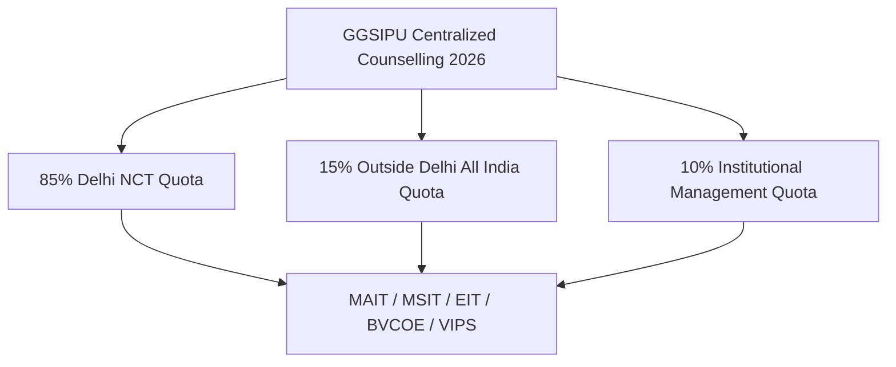

# Top 5 GGSIPU Private Colleges in Delhi NCR 2026: Fees, Placements & Admission Review

Guru Gobind Singh Indraprastha University (**GGSIPU**), commonly known as **IP University**, is the premier state university of Delhi. For students seeking high-quality professional education across **B.Tech, BBA, BCA, MBA, Law, and MCA**, private colleges affiliated with GGSIPU offer an unbeatable combination of **state university degree credibility, affordable fee structures, and exceptional corporate access across the Delhi NCR region**.

Whether you are targeting strong campus placements in multinational tech giants, reputed management consulting firms, or prestigious corporate law chambers, choosing the right GGSIPU affiliated institute can shape your career trajectory.

In this detailed 2026 admission guide, we review the **Top 5 GGSIPU private colleges in Delhi NCR**—featuring **MAIT**, **MSIT**, **Echelon Institute of Technology (EIT)**, **BVCOE**, and **VIPS**—analyzing their fee structures, placement records, campus infrastructure, and admission pathways.

---

## 🏆 Summary: Top 5 GGSIPU Private Colleges in Delhi NCR at a Glance

| Rank & College Name | Location | Flagship Courses | Approx Annual Fee | Average Package | Highest Package |
| :--- | :--- | :--- | :--- | :--- | :--- |
| **1. MAIT** | Rohini, Delhi | B.Tech (CSE, IT, AI/ML), MBA | ~₹1.65 Lakhs | ₹8.50 LPA | ₹90+ LPA (Off-Campus) / ₹50 LPA |
| **2. MSIT & MSI** | Janakpuri, Delhi | B.Tech, BBA, BCA, B.Com (H) | ~₹1.55 - ₹1.65 Lakhs | ₹7.50 - ₹8.00 LPA | ₹50+ LPA |
| **3. Echelon Institute of Technology (EIT)** | Faridabad, Delhi NCR | B.Tech (CSE, AI/ML, Data Sc, ECE), BBA, BCA | ~₹1.75 - ₹1.87 Lakhs | ₹5.30 - ₹8.50 LPA | ₹52.00 LPA |
| **4. BVCOE & BVIMR** | Paschim Vihar, Delhi | B.Tech, MBA, BBA, Law | ~₹1.55 - ₹1.80 Lakhs | ₹6.50 - ₹7.20 LPA | ₹45+ LPA |
| **5. VIPS-TC** | Pitampura, Delhi | B.Tech, BCA, BBA, BA/BBA LLB | ~₹1.35 - ₹1.60 Lakhs | ₹5.50 - ₹7.00 LPA | ₹35+ LPA |

---

## 🏛️ In-Depth Review of the Top 5 GGSIPU Private Colleges

---

### 1. Maharaja Agrasen Institute of Technology (MAIT), Rohini, Delhi

Established in 1999 by the Maharaja Agrasen Technical Education Society, **MAIT Rohini** is widely recognized as the premier private engineering and management institution under GGSIPU.

* **Campus & Location:** Situated in PSP Area, Sector 22, Rohini, North-West Delhi. The campus features well-equipped modern computer centers, research hubs, a central auditorium, and spacious sports amenities.
* **Flagship Programs:** B.Tech (Computer Science & Engineering, Information Technology, Artificial Intelligence & Machine Learning, Electronics & Communication), MBA.
* **Annual Tuition Fees:** ~₹1,65,000 per year (B.Tech).
* **Placements & Recruiters:** 
  * **Average Package:** **₹8.50 LPA** for CSE/IT branches.
  * **Highest Package:** **₹90+ LPA** (International/Off-campus) and **₹50+ LPA** (On-campus).
  * **Top Recruiters:** Google, Microsoft, Amazon, Atlassian, Adobe, Infosys, TCS Ninja/Digital, ZS Associates, and Accenture.
* **Why Choose MAIT:** MAIT boasts a phenomenal competitive programming culture and an active alumni network working across top global tech firms.

---

### 2. Maharaja Surajmal Institute of Technology & MSI, Janakpuri, Delhi

Operating from a unified, vibrant campus in West Delhi, **MSIT** (Engineering) and **MSI** (Management & Computer Applications) are among the most disciplined and academically rigorous institutes in GGSIPU.

* **Campus & Location:** C-4, Janakpuri, New Delhi. Walking distance from Janakpuri West and Janakpuri East Metro Stations.
* **Flagship Programs:** B.Tech (CSE, IT, ECE, EEE), BBA (General & Banking/Insurance), BCA, B.Com (Hons), B.Ed.
* **Annual Tuition Fees:** ~₹1,55,000 – ₹1,65,000 per year.
* **Placements & Recruiters:**
  * **Average Package:** **₹7.50 – ₹8.00 LPA** for B.Tech; **₹4.50 – ₹6.00 LPA** for BBA/BCA.
  * **Highest Package:** **₹50.00 LPA+**.
  * **Top Recruiters:** Amazon, Google, Josh Technology, Mu Sigma, Deloitte, KPMG, EY, Wipro, and Cognizant.
* **Why Choose MSIT/MSI:** Central Delhi connectivity, consistent university top-rank holders, and exceptional ROI for engineering and commerce graduates.

---

### 3. Echelon Institute of Technology (EIT), Faridabad (Delhi NCR)

**Echelon Institute of Technology (EIT)** holds the 3rd position among premier GGSIPU-affiliated technical and professional campuses, serving students across Delhi, Faridabad, Gurgaon, and the broader NCR belt with world-class facilities and strong corporate integrations.

* **Campus & Location:** Jasana-Manjhawali Road, Sector 86 corridor, Faridabad, Delhi NCR. Spread over a serene, **17.5+ acre lush green campus** with modern centrally air-conditioned academic blocks, advanced engineering and AI labs, sports arenas, and high-speed Wi-Fi connectivity.
* **Affiliation & Approvals:** Officially affiliated with **Guru Gobind Singh Indraprastha University (GGSIPU), New Delhi**, approved by AICTE, Ministry of Education, Govt. of India.
* **Flagship Programs:**
  * **B.Tech:** Computer Science & Engineering (CSE), CSE (Artificial Intelligence & Machine Learning), CSE (Data Science), Cyber Security, Electronics & Communication Engineering (ECE), and Mechanical Engineering.
  * **Management & Applications:** Bachelor of Business Administration (BBA), Bachelor of Computer Applications (BCA), and B.Tech Lateral Entry.
* **Fee Structure:**
  * **1st Year Total Fee:** **₹1,87,200** (including one-time refundable security deposit and university registration charges).
  * **2nd Year Onwards:** **₹1,75,200** per annum.
* **Placements & Recruiters:**
  * **Average Package:** **₹5.30 – ₹8.50 LPA** for technical branches.
  * **Highest Package:** **₹52.00 LPA**.
  * **Key Hiring Partners:** TCS, Infosys, Capgemini, Wipro, Cognizant, HCL Technologies, Amazon, Tech Mahindra, L&T Infotech, and emerging fintech and AI startups.
* **Why Choose EIT Faridabad under GGSIPU:**
  1. **Comprehensive Infrastructure:** Dedicated Centers of Excellence for AI/ML, Cloud Computing, IoT, and Robotics.
  2. **GGSIPU Curriculum & Degree:** Students receive standard, globally recognized degrees awarded by GGSIPU, New Delhi.
  3. **Industry-Driven Mentorship:** Extensive project-based learning, live industry hackathons, and corporate internships from the 2nd year onwards.
  4. **Accessibility:** Dedicated college bus fleet connecting major metro stations across South Delhi (Badarpur, Sarita Vihar, Ashram), Faridabad, and Noida.

---

### 4. Bharati Vidyapeeth's College of Engineering (BVCOE) & BVIMR, Paschim Vihar, Delhi

Part of the reputed Bharati Vidyapeeth Deemed University group headquartered in Pune, **BVCOE** and **BVIMR** offer top-notch technical and business education right on the Rohtak Road corridor in West Delhi.

* **Campus & Location:** A-4, Paschim Vihar, New Delhi (Directly adjacent to Paschim Vihar East Metro Station).
* **Flagship Programs:** B.Tech (CSE, IT, ECE, EEE, Instrumentation & Control), MBA, BBA, BA LLB / BBA LLB.
* **Annual Tuition Fees:** ~₹1,55,000 – ₹1,80,000 per year.
* **Placements & Recruiters:**
  * **Average Package:** **₹6.50 – ₹7.20 LPA**.
  * **Highest Package:** **₹45.00 LPA**.
  * **Top Recruiters:** TCS, Infosys, Amazon, Nagarro, S&P Global, Airtel, and Yamaha.
* **Why Choose BVCOE:** Excellent location, highly active student chapters (IEEE, ACM, CSI), and a dedicated entrepreneurship and corporate relations cell.

---

### 5. Vivekananda Institute of Professional Studies - Technical Campus (VIPS-TC), Pitampura, Delhi

Accredited with an **NAAC Grade 'A++'**, **VIPS** is one of Delhi's most prestigious private institutions for Law, Management, Media, and emerging Engineering specializations.

* **Campus & Location:** AU-Block, Outer Ring Road, Pitampura, Delhi (Near Haiderpur Badli Mor Metro Station).
* **Flagship Programs:** B.Tech (School of Engineering - CSE, AI & Data Science, Industrial IoT), BCA, BBA, MCA, BA LLB (Hons), BBA LLB (Hons), BA (JMC).
* **Annual Tuition Fees:** ~₹1,35,000 – ₹1,60,000 per year.
* **Placements & Recruiters:**
  * **Average Package:** **₹5.50 – ₹7.00 LPA**.
  * **Highest Package:** **₹35.00 LPA**.
  * **Top Recruiters:** Deloitte, PwC, Wipro, SAP Labs, IBM, Tommy Hilfiger, and leading legal firms.
* **Why Choose VIPS:** World-class digital infrastructure, multi-disciplinary campus life, high-tech computer laboratories, and arguably the finest moot courts and media studios under GGSIPU.

---

## 🎯 Detailed Comparative Analysis: Top 5 GGSIPU Colleges

To help you make an informed decision, here is a comparative overview across key decision parameters:



### 1. Return on Investment (ROI)
GGSIPU private colleges cost a fraction of expensive private deemed universities (which often charge ₹18–28 Lakhs for 4-year B.Tech programs). With 4-year total tuition hovering between **₹6.50 Lakhs and ₹7.50 Lakhs** across MAIT, MSIT, EIT, BVCOE, and VIPS, students graduating with salary packages of ₹6 LPA to ₹12+ LPA achieve a full payback on their educational investment within 12–18 months.

### 2. Location & Commute Advantage
* **Delhi Metro Network:** MAIT (Rithala/Rohini), MSIT (Janakpuri), BVCOE (Paschim Vihar), and VIPS (Pitampura/Haiderpur Badli Mor) are directly connected via Delhi Metro lines.
* **NCR Hub Advantage:** EIT Faridabad provides quick access to corporate industrial zones in Faridabad, Greater Faridabad (Neharpar), South Delhi, and the Cyber City / Golf Course Road corporate corridor in Gurgaon.

---

## 📝 GGSIPU Admission & Counselling Process 2026: Step-by-Step

All admissions to these top 5 private colleges follow the transparent norms laid down by Guru Gobind Singh Indraprastha University:

```
Step 1: Appear for National / State Entrance Exams (JEE Main / IPU CET / CUET / CAT / CLAT)
   ↓
Step 2: Register on official GGSIPU Admission Portal (ipu.admissions.nic.in)
   ↓
Step 3: Pay GGSIPU Application & Counselling Participation Fee
   ↓
Step 4: Online Choice Filling & Preference Locking (Select College + Branch in Order)
   ↓
Step 5: Seat Allotment Rounds (Round 1, Round 2, Round 3 & Sliding Round)
   ↓
Step 6: Provisional Allotment Letter & Part-Academic Fee Payment (₹60,000 approx)
   ↓
Step 7: Physical Document Verification & Reporting at Allotted College
   ↓
Step 8: Spot Round Counselling / Management Quota for Vacant Seats
```

### Key Eligibility Criteria:
* **B.Tech:** Minimum 55% aggregate marks in 10+2 with Physics, Chemistry, and Mathematics (PCM), plus English as a passing subject. Valid score in **JEE Main 2026**.
* **BBA / BCA:** 10+2 with minimum 50% aggregate marks. Selection through **IPU CET 2026** or **CUET-UG 2026**.
* **MBA:** Bachelor's degree (minimum 50%). Merit based on **CAT 2025 / CMAT 2026 / IPU CET 2026**.
* **Law (BA LLB / BBA LLB):** 10+2 with minimum 50% marks. Selection exclusively via **CLAT-UG 2026**.

---

## 🔗 Related Admission & College Guides

* [IP University B.Tech Cutoffs & Rank Guidelines 2026](/blog/ipu-btech-colleges-cutoff-2025-2026)
* [Top 5 Private B.Tech Colleges Under GGSIPU 2026](/blog/top-5-private-btech-colleges-under-ggsipu-2026)
* [Best IPU Colleges for BBA Admission 2026](/blog/best-ipu-colleges-for-bba-2026)
* [Echelon Institute of Technology Faridabad: Fees, Admission & Detailed Review](/blog/echelon-institute-of-technology-faridabad-admission-2026-fees-review)
* [Low Budget B.Tech Colleges in Delhi NCR 2026](/blog/low-budget-btech-colleges-in-delhi-ncr-2026)
* [Explore GGSIPU Delhi Campus & Programs](/colleges/ggsipu-delhi)

---

## ❓ Frequently Asked Questions (FAQs)

### 1. Which are the top 5 private colleges affiliated with GGSIPU in Delhi NCR?
The top 5 private colleges under GGSIPU in Delhi NCR are **Maharaja Agrasen Institute of Technology (MAIT, Rohini)**, **Maharaja Surajmal Institute of Technology (MSIT, Janakpuri)**, **Echelon Institute of Technology (EIT, Faridabad)**, **Bharati Vidyapeeth's College of Engineering (BVCOE, Paschim Vihar)**, and **Vivekananda Institute of Professional Studies (VIPS, Pitampura)**.

### 2. Is Echelon Institute of Technology (EIT) affiliated with GGSIPU?
Yes, **Echelon Institute of Technology (EIT), Faridabad** is affiliated with Guru Gobind Singh Indraprastha University (GGSIPU), New Delhi. Students enrolled in B.Tech, BBA, and BCA programs at EIT study the standardized GGSIPU syllabus and receive their degrees directly from GGSIPU.

### 3. How does the 85% Delhi quota vs 15% Outside Delhi quota work in GGSIPU?
Candidates who completed their 12th board examinations from an institution located within the National Capital Territory (NCT) of Delhi fall under the **85% Delhi Region Quota**, which has relatively relaxed closing ranks. Candidates who completed 12th outside Delhi compete for the **15% Outside Delhi Quota**.

### 4. What is the fee structure for B.Tech in GGSIPU private colleges?
The annual tuition fee in top GGSIPU private colleges ranges from **₹1,40,000 to ₹1,87,200 per year** (including university charges and refundable security deposit), making it significantly more economical than private deemed universities.

### 5. Can I get direct admission in GGSIPU private colleges through Management Quota?
Yes, under Delhi Government and GGSIPU regulations, 10% of seats in private self-financed colleges are reserved under the **Management Quota**. Admissions are conducted on merit basis among applicants who meet the basic entrance exam eligibility criteria.

---

## 🧭 Need Expert Guidance on GGSIPU Choice Filling?

Choosing between MAIT, MSIT, EIT, BVCOE, and VIPS depends on your entrance exam rank, home state quota (Delhi vs Outside Delhi), preferred branch (CSE Core vs Specializations), and commute preferences.

At **CareerWithMohit**, we provide personalized GGSIPU counselling support, college predictor reports, and management quota admission assistance to help you secure the best seat.

[👉 Get Free GGSIPU Admission & Choice Filling Support](/inquiry) | [👉 Explore All College Reviews](/colleges/ggsipu-delhi)

---

### 🚀 Boost Your Preparation

Looking for more resources? **[Explore Our Premium MBA Mock Test Series 2026](/mock-tests)** to get real-time exam experience and detailed performance analytics.

---
