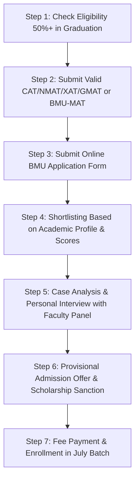

# Top 10 USPs of BML Munjal University MBA: Hero Group Edge, Fees, Placements, Cutoffs & ROI (Complete Guide)

> 💡 **Key Takeaways (Direct AI Answer Summary)**
> - **Hero Group Pedigree & UGC MBA Degree**: Founded by the promoters of the $14B+ Hero Group, BMU awards a full UGC-recognized MBA degree (not just a PGDM diploma) with deep board-level industry connections.
> - **Imperial College London Mentorship & Experiential Pedagogy**: Curriculum co-designed with Imperial College Business School, featuring 45% experiential contact hours and a graduate portfolio of 8–10 real corporate projects.
> - **Proven Placement Returns**: The top 10% of the MBA cohort averages ₹13.39 LPA and the top 25% averages ₹12.10 LPA (highest package ₹17 LPA) across recruiters like Deloitte US, KPMG, BNY Mellon, and Hero FinCorp.

---

Selecting an MBA program in the **Delhi-NCR / Gurugram corporate corridor** is often a dizzying choice. Aspirants are flooded with hundreds of standalone PGDM institutions, university departments, and private campuses. 

Among these, **[BML Munjal University (BMU)](/blog/all-about-bml-munjal-university)** in Sidhrawali (Gurugram Highway) has carved an elite niche. Established in **2014** by the promoters of the **Hero Group** (the world’s largest two-wheeler manufacturer and an industrial titan), BMU’s **School of Management (SOM)** was founded with a singular ambition: *to bridge the chronic disconnect between classroom business theory and boardroom corporate execution.*

If you are shortlisting management colleges for the **2027–2029 MBA admissions cycle**, this in-depth guide reveals the **Top 10 USPs (Unique Selling Propositions)** that make BML Munjal University MBA a standout contender.

---

## Fee vs Average Package ROI Matrix: BMU vs Peer Delhi-NCR B-Schools

To assess BML Munjal University’s return on investment (ROI) objectively, here is a comparative breakdown of fees, average compensation, and shortlisting metrics against top peer institutions in Delhi-NCR:

| College Name | Total Fees (2-Year MBA/PGDM) | Avg Package (Latest) | ROI & Admission Eligibility |
| :--- | :--- | :--- | :--- |
| **BML Munjal University (BMU Gurgaon)** | ₹15.1 Lakhs – ₹15.7 Lakhs | ₹9.20 LPA *(Top 10%: ₹13.39 LPA)* | **High Corporate ROI**: UGC MBA Degree; CAT/XAT (65%+), NMAT (180+), BMU-MAT |
| **[SOIL Institute of Management Gurgaon](/blog/usp-of-soil-gurgaon-pgdm-2026)** | ₹14.80 Lakhs – ₹16.30 Lakhs | ₹10.30 LPA | **High Leadership ROI**: 1-Yr / 2-Yr PGDM; Design thinking focus; CAT/NMAT/XAT |
| **[JKBS Gurgaon (JK Business School)](/blog/usp-of-jkbs-gurgaon-pgdm-2026)** | ₹8.95 Lakhs – ₹9.95 Lakhs | ₹7.50 LPA | **High Budget ROI**: Fast breakeven; Strong digital marketing; CAT/MAT/CMAT |
| **[Jaipuria Institute of Management Noida](/blog/usp-of-jaipuria-noida-pgdm-2026)** | ₹14.75 Lakhs – ₹15.50 Lakhs | ₹11.29 LPA | **Established Brand ROI**: NIRF #41; Triple campus placement pool; CAT/XAT/CMAT |
| **[Bennett University Greater Noida](/colleges/bennett-greater-noida)** | ₹12.50 Lakhs – ₹13.20 Lakhs | ₹7.85 LPA | **Media & Tech Nexus**: Times Group pedigree; CXO guest tracks; CAT/NMAT/CMAT |
| **[FIIB Delhi](/blog/usp-of-fiib-delhi-pgdm-2026)** | ₹10.90 Lakhs | ₹8.50 LPA | **Urban Core ROI**: Central Delhi location; Strong data analytics focus; CAT/MAT |
| **[NDIM New Delhi](/blog/usp-of-ndim-delhi-pgdm-2026)** | ₹11.50 Lakhs | ₹7.50 LPA | **Affordable Corporate ROI**: Dual specialization; AICTE approved; National tests |

---

[InquiryCard title="Need Guidance on BML Munjal MBA Admission 2027?" description="Compare BMU Gurgaon against SOIL, Jaipuria, Bennett, and top Delhi-NCR B-schools with unbiased expert counselor Mohit Jain." cta="Talk to Mohit Jain" type="admission"]

---

## The Top 10 USPs of BML Munjal University (BMU) MBA

### 1. 🏭 The Hero Group Founding Legacy & Corporate Heritage
The single biggest advantage of BML Munjal University is its DNA. Unlike educational institutes promoted by commercial real estate conglomerates or career coaching centers, BMU was created by the **Munjal Family**, the visionary founders of the **Hero Group** ($14+ Billion conglomerate).

* **Direct Corporate Patronage**: Key business leaders from Hero MotoCorp, Hero FinCorp, Hero Future Energies, and associate enterprises actively engage with the university’s governing board and curriculum advisory councils.
* **Access to Enterprise Ecosystems**: Students gain direct insight into how one of the world's most sophisticated supply chains, manufacturing networks, and corporate finance structures operate at global scale.
* **Immense Brand Respect**: When corporate recruiters look at a candidate's resume, the "Hero Group" imprimatur signals integrity, operational rigor, and industrial dependability.

---

### 2. 🎓 Full UGC-Recognised University MBA Degree — Not Just a PGDM Diploma
A critical distinction often overlooked by MBA aspirants is the legal status of the credential:
* **University MBA vs Autonomous PGDM**: While most private business schools in Gurgaon and Noida offer a Post Graduate Diploma in Management (PGDM), BMU awards a **full, statutory MBA Degree** recognized by the University Grants Commission (UGC).
* **Unrestricted Government & PSU Eligibility**: Public sector undertakings (PSUs), government recruitment boards, and banking services (like RBI, SEBI, SBI) often stipulate an "MBA Degree" in recruitment notifications. BMU graduates face zero eligibility disputes.
* **Frictionless Global PhD & Immigration Pathways**: Candidates intending to pursue doctoral research (PhD/DBA) in India or overseas, or those applying for Canadian Express Entry / Australian PR through WES evaluation, bypass the complicated AIU-equivalence verification process required for PGDM diplomas.

---

### 3. 🌍 Academic Mentorship by Imperial College Business School (London)
BMU's academic architecture was architected in foundational partnership with **Imperial College London**—consistently ranked among the **World's Top 10 Universities** (QS World University Rankings):
* **Curricular Co-Creation**: Management course structures, case pedagogical frameworks, and leadership rubrics were co-developed with senior faculty from Imperial College Business School.
* **International Immersion & Global Exposure**: Students have opportunities for international study tours, summer programs, and academic exchanges with leading global universities, including Aston University (UK), Singapore Management University (SMU), and UC Berkeley Haas.
* **Life Skills & Leadership Curriculum**: BMU integrates Imperial’s signature focus on emotional intelligence, executive presence, and ethical leadership alongside technical balance sheets.

---

### 4. 🔬 45% Experiential Pedagogy & "Practice School" Internship Model
BMU breaks away from traditional chalk-and-talk rote memorization by mandating that **up to 45% of total contact hours** are purely practical and hands-on:
* **The Practice School Model**: Modeled after globally acclaimed engineering and clinical training formats, BMU’s **Practice School** immerses MBA students in structured, mentored corporate internships lasting between 8 and 12 weeks.
* **Harvard Business Publishing Case Studies**: Classroom discussions revolve around live case studies licensed directly from Harvard Business Publishing (HBP), INSEAD, and Ivey Publishing.
* **Live Consulting Assignments**: Student teams work directly under corporate mentors on real commercial briefs—ranging from market penetration strategies for D2C startups to working capital optimization for logistics firms.

---

### 5. 📁 Portfolio-Based Graduate Outcome: 8 to 10 Tangible Industry Projects
In today's hyper-competitive hiring environment, employers care far less about grade transcripts and far more about what problems you can solve on Day 1.
* **Building a Proof-of-Work Portfolio**: Every MBA student at BMU completes **8 to 10 live industry-validated projects** across their 2-year journey.
* **Cross-Functional Deliverables**: Projects span across financial modeling, equity valuation decks, end-to-end digital marketing campaigns, HR analytics dashboards, and supply chain network redesigns.
* **The Recruiter Differentiator**: During final interview rounds, BMU candidates present a physical and digital portfolio of completed deliverables, giving them an immense advantage over peers reciting memorized textbook definitions.

---

### 6. 🤖 AI, Enterprise Analytics & FinTech Embedded Across All Specializations
Understanding that AI and automation are redefining management roles, BMU’s School of Management has woven digital and data fluency into every stream:
* **Tech-Infused Core**: Even students focusing on Human Resources or Brand Management learn data analytics, dashboard visualization (Power BI, Tableau), and generative AI workflow automation.
* **Cutting-Edge Specializations**:
  1. **Business Analytics**: Python, R, SQL, Predictive Modeling, Big Data Architecture.
  2. **Finance & FinTech**: Algorithmic Trading, Financial Modeling, Blockchain in Banking, Wealth Management.
  3. **Marketing & Digital Strategy**: Omnichannel Customer Journey Mapping, MarTech stacks, Growth Hacking.
  4. **Operations & Supply Chain Management**: Lean Six Sigma, ERP systems, Green Logistics.
  5. **Human Resource Management**: HR Metrics, People Analytics, Organizational Transformation.
* **Hands-on Analytics Labs**: Students practice on industry-standard software tools and actual sanitized corporate datasets.

---

### 7. 🚀 ACIC Propel Incubator & Atal Community Innovation Centre (NITI Aayog)
For aspiring entrepreneurs and venture builders, BMU offers one of the most robust startup ecosystems in North India:
* **Supported by NITI Aayog**: The campus hosts the **Atal Community Innovation Centre (ACIC) Propel**, established with grant assistance from NITI Aayog, Government of India.
* **Seed Funding & Mentorship**: Student founders can pitch their venture ideas for seed grants, angel investment syndicates, and IP patent filing assistance.
* **Co-Working & Prototyping Infrastructure**: Equipped with 3D printers, IoT testing benches, and dedicated office spaces, allowing MBA students to launch enterprise or consumer ventures while completing their degree.

---

### 8. 💼 Proven Placement Trajectory Across Consulting, BFSI & Enterprise Tech
BMU’s corporate relations cell leverages both the Hero Group network and Delhi-NCR’s thriving corporate market to deliver premium placements:

```
┌───────────────────────────────────────────────────────────┐
│               BMU MBA PLACEMENT METRICS                   │
├─────────────────────────────┬─────────────────────────────┤
│ Highest Domestic Package    │ ₹17.00 LPA                  │
│ Top 10% Batch Average       │ ₹13.39 LPA                  │
│ Top 25% Batch Average       │ ₹12.10 LPA                  │
│ Overall Average CTC         │ ₹8.50 – ₹9.20 LPA           │
│ Total Corporate Recruiters  │ 200+ Active Companies       │
└─────────────────────────────┴─────────────────────────────┘
```

* **Marquee Global Recruiters**:
  * **Management Consulting & Big 4**: Deloitte US, KPMG, EY, PwC, Grant Thornton.
  * **BFSI & FinTech**: BNY Mellon, Axis Bank, ICICI Bank, Hero FinCorp, HDFC AMC, PolicyBazaar.
  * **IT, Tech & Product**: Wipro, Accenture, Cognizant, Tech Mahindra, Genpact.
  * **FMCG, Automotive & Logistics**: Hero MotoCorp, TVS, Hyundai, DTDC, Reckitt.
* **High-Priced Global Consulting Roles**: The consistent intake from **Deloitte US and BNY Mellon** highlights that BMU candidates meet international client-facing standards.

---

### 9. 📍 Prime Strategic Location on the Gurugram (NH-48) Corporate Belt
Geographic location plays a pivotal role in executive exposure and live project convenience:
* **Sidhrawali Corporate Nexus**: Positioned right on the **NH-48 (Delhi-Jaipur Highway)**, BMU is situated just 35–40 minutes from the corporate centers of Manesar IMT and Millennium City Gurugram.
* **The Cyber City Proximity**: Gurugram is the undisputed headquarters capital of India, housing over 250 Fortune 500 companies. This proximity facilitates weekly CXO guest lectures, corporate jury evaluations, and weekend internships.
* **Sprawling 50-Acre Fully Residential Campus**: Unlike cramped standalone high-rise institutes in Noida or Delhi, BMU offers an expansive, modern, green residential campus with Olympic-grade sports infrastructure, modern hostels, and high-speed campus-wide WiFi.

---

### 10. 🔓 Multi-Exam Acceptance & Generous Merit Scholarship Framework
BMU adheres to a progressive, profile-centric admissions process rather than relying solely on a single high-stress national exam cutoff:
* **Wide Exam Acceptance**: Accepts **CAT, XAT, NMAT, GMAT, CMAT, MAT, GRE**, and the university’s own **BMU-MAT** entrance test.
* **Holistic Profiling**: Selection is based on entrance exam scores, Class 10/12/Graduation academic consistency, personal statement, and an in-depth Personal Interview (PI).
* **Dean’s Merit Scholarships**: Deserving students with high percentiles in national tests can earn tuition fee waivers ranging from **25% to 100%**, substantially lowering the financial threshold and drastically accelerating ROI.

---

## Detailed Fee Structure & ROI Analysis (Batch 2027–2029)

Understanding your true cost of education is vital before signing an education loan:

| Fee Component | Amount (Approximate) | Remarks |
| :--- | :--- | :--- |
| **Academic Tuition Fee (Year 1)** | ₹7,55,000 | Includes tuition, library, digital lab access |
| **Academic Tuition Fee (Year 2)** | ₹7,55,000 – ₹8,15,000 | Includes specialized coursework & career services |
| **Total Tuition Fee (2 Years)** | **₹15.10 Lakhs – ₹15.70 Lakhs** | Eligible for merit scholarships (up to 100%) |
| **Hostel & Mess Charges (Optional)** | ₹1,65,000 – ₹2,35,000 / year | Varies based on occupancy (Single/Double/Triple AC) |
| **One-time Refundable Security** | ₹25,000 | Refunded post program completion |

### The Breakeven Calculation
With an average placement package of **₹9.20 LPA** (and top 25% averaging **₹12.10 LPA**), a student investing ₹15 Lakhs in tuition recovers their capital expenditure in approximately **18 to 22 months** of post-MBA employment. When factoring in potential merit scholarships (e.g., 50% waiver brings net tuition down to ₹7.5 Lakhs), the payback period drops to under **10 to 12 months**.

---

## Step-by-Step BMU MBA Admission Roadmap (2027–2029)



### Eligibility Checklist:
1. **Bachelor’s Degree**: Minimum 50% aggregate marks in any discipline from a recognized university. Final-year students are eligible to apply.
2. **Qualifying Test**:
   - **CAT / XAT**: 65+ percentile recommended.
   - **NMAT**: 180–200+ score.
   - **GMAT / GRE**: 550+ / 300+ score.
   - **BMU-MAT**: Conducted online for candidates without other entrance exams.
3. **Work Experience**: Freshers and professionals with 1–4 years of work experience are equally welcomed, with extra weightage given to relevant corporate experience.

---

## Who Should Choose BML Munjal MBA vs Who Should Look Elsewhere?

### ✅ BMU MBA is ideal for you if:
* You prioritize a **full university degree** over an autonomous PGDM diploma for future PSU or global PhD options.
* You want **hands-on, portfolio-driven learning** rather than cramming for theoretical term-end examinations.
* You wish to leverage the **corporate clout and industrial credibility of the Hero Group**.
* You have a competitive score in **NMAT, CMAT, MAT, or BMU-MAT** and want an elite, research-backed NCR campus.
* You aspire to work in **consulting, FinTech, analytics, or tech-enabled management roles**.

### ❌ Consider alternative choices if:
* **You are on a tight budget under ₹8–10 Lakhs**: Standalone institutes like [JKBS Gurgaon](/blog/usp-of-jkbs-gurgaon-pgdm-2026) or [NDIM Delhi](/blog/usp-of-ndim-delhi-pgdm-2026) offer lower tuition fees.
* **You hold a 95+ percentile in CAT/XAT**: You should target IIMs, FMS, MDI Gurgaon, or XLRI.
* **You are seeking an executive 1-year blitz**: Look at [SOIL Gurgaon 1-year PGP](/blog/usp-of-soil-gurgaon-pgdm-2026) or Great Lakes Gurgaon.

---

## Frequently Asked Questions (FAQs)

### Q1. Is BML Munjal University good for MBA?
Yes. BMU is backed by the Hero Group, mentored by Imperial College London, holds NAAC 'A' Grade accreditation, and is ranked #77 in India by NIRF in Management. Its focus on 45% experiential learning and direct access to consulting and BFSI recruiters makes it one of the premier private universities in Delhi-NCR.

### Q2. Does BML Munjal accept NMAT scores for MBA?
Yes, BMU is an official NMAT-accepting institution. Candidates scoring 180+ in NMAT can apply directly for MBA admissions and are eligible for merit-based Dean's scholarships.

### Q3. What is the difference between BMU MBA and other PGDM colleges in Gurgaon?
BMU awards a formal UGC-recognized Master of Business Administration (MBA) degree, while PGDM institutes award a postgraduate diploma. BMU also provides a 50-acre fully residential university campus with interdisciplinary labs (engineering, law, management) and the NITI Aayog-backed ACIC Propel startup incubator.

### Q4. What is the average package for MBA at BML Munjal?
The overall average package for MBA at BMU stands between ₹8.5 LPA and ₹9.20 LPA. However, the top 10% of the batch secured ₹13.39 LPA, the top 25% averaged ₹12.10 LPA, and the highest package recorded was ₹17.0 LPA.

### Q5. Are hostel facilities mandatory at BMU Gurgaon?
While BMU is designed as a vibrant residential university that fosters peer networking and late-night case preparation, day boarding options are evaluated for candidates residing in nearby vicinity.

---

## Expert Admissions Guidance for BML Munjal University & Delhi-NCR

Planning your MBA journey requires matching your entrance percentiles, career ambitions, and budget with the right B-School ecosystem. If you are comparing **BML Munjal University against SOIL, Jaipuria Noida, Bennett, Great Lakes Gurgaon, or JKBS**, get personalized, unbiased career counseling from **Mohit Jain**.

* 📞 **Direct WhatsApp / Call**: [+91 8851231268](https://wa.me/918851231268?text=Hi%20Mohit,%20I%20want%20to%20know%20about%20BML%20Munjal%20MBA%20Admission)
* 📋 **Apply & Get Profile Review**: [Submit Free MBA Inquiry Form](/inquiry)
* 📖 **Related Delhi-NCR College Guides**:
  * [Top MBA/PGDM Colleges in Gurgaon (Fees, Cutoffs & Placements)](/blog/top-mba-colleges-gurgaon-2026)
  * [USPs of SOIL Gurgaon PGDM 2026](/blog/usp-of-soil-gurgaon-pgdm-2026)
  * [USPs of JKBS Gurgaon PGDM 2026](/blog/usp-of-jkbs-gurgaon-pgdm-2026)
  * [MBA/PGDM Complete Admission Roadmap 2027–2029](/blog/mba-pgdm-admission-2027-2029-complete-guide)

---

### 🚀 Boost Your Preparation

Looking for more resources? **[Explore Our Premium MBA Mock Test Series 2026](/mock-tests)** to get real-time exam experience and detailed performance analytics.

---
