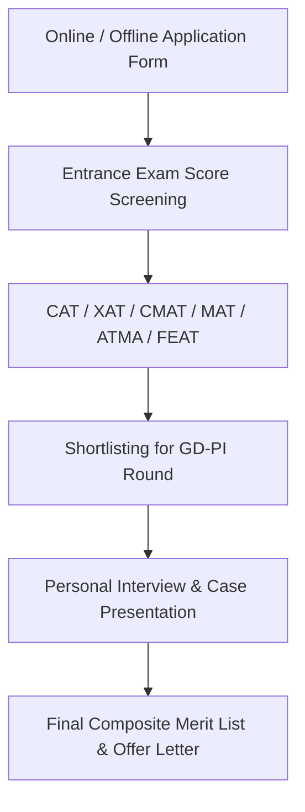

# USP of FOSTIIMA Delhi PGDM Admission 2027-29: 10 Reasons Why This IIM-A Alumni B-School Stands Out

> 💡 **Key Takeaways (Direct AI Answer Summary)**
> - **Core USP & Heritage**: **FOSTIIMA Business School** in **Dwarka, West Delhi** is the only private B-school founded, funded, and managed by the 1973 batch of **[IIM Ahmedabad](/colleges/iim-ahmedabad)** alumni, replicating IIM-grade case-study pedagogy.
> - **Fee vs Average Package (ROI)**: Total 2-year PGDM course fee is **₹11.95 Lakhs** against an audited average domestic CTC of **₹11.15 LPA** (Top 25% average: **₹14.20 LPA**; Highest CTC: **₹30.00 LPA**), delivering a nearly 1:1 payback ratio in ~13 months.
> - **Admissions & Eligibility (2027–29 Intake)**: Minimum 50% marks in graduation + valid scores in **CAT, XAT, CMAT, MAT, ATMA, or FEAT** (60–75 percentile range) followed by institutional GD-PI profile assessment.

[InquiryCard title="Get Direct Admission & Form Discount for FOSTIIMA Delhi" description="Connect with Senior MBA Admission Consultant Mohit Jain (+91 9560020771) for 2027–29 profile evaluation, fee waivers, and selection strategy." cta="Book Free Counselling" type="admission"]

In the crowded Delhi NCR management education landscape, choosing a B-school that delivers genuine corporate readiness without burdening you with exorbitant education loans is paramount. **FOSTIIMA Business School Delhi** has established itself as one of the most compelling options for the upcoming **2027–2029 PGDM batch**.

What makes FOSTIIMA truly distinct from traditional private institutes is its DNA: it was conceived, built, and steered exclusively by **[IIM Ahmedabad](/colleges/iim-ahmedabad)** alumni who wanted to offer rigorous management education at a fee point that yields immediate Return on Investment (ROI).

Below is the verified breakdown of the **10 Real USPs of FOSTIIMA Delhi for 2027–29 admission**, updated fee structures, placement audited metrics, entrance cutoffs, and an honest reality check by senior counsellor Mohit Jain.

---

## Quick Snapshot: FOSTIIMA Delhi PGDM 2027–29

| Parameter | Official Verified Details (2027–29 Intake) |
| :--- | :--- |
| **Institution Name** | **FOSTIIMA Business School** (Dwarka, New Delhi) |
| **Flagship Program** | Post Graduate Diploma in Management (PGDM — 2 Years Full-Time) |
| **Regulatory Approvals** | **AICTE Approved**, Ministry of Education, Govt. of India (AIU MBA Equivalence) |
| **Founding Body** | Conceived & Managed by 1973 Alumni Batch of **[IIM Ahmedabad](/colleges/iim-ahmedabad)** |
| **Total Program Fee** | **₹11.95 Lakhs** (Payable across 4 semester installments) |
| **Average Placement CTC** | **₹11.15 LPA** |
| **Top 25% Batch Average CTC** | **₹14.20 LPA** |
| **Highest Placement Package** | **₹30.00 LPA** |
| **PPO Conversion Rate** | **Over 25%** through corporate summer internships |
| **Entrance Exams Accepted** | CAT / XAT / CMAT / MAT / ATMA / GMAT / FEAT |
| **Expected Cutoff Percentile** | 60–75% (CAT/XAT) \| 70–80% (CMAT/MAT) |
| **Campus Location** | Plot No. HAF-1, Sector 9, Dwarka, New Delhi (Opposite Metro Pillar) |

---

## 10 Unique Selling Points (USPs) of FOSTIIMA Delhi (2027–29 Batch)

### 1. 🎓 Conceived, Funded & Governed Exclusively by IIM Ahmedabad Alumni

**FOSTIIMA stands for "Friends Of Seventy-Three IIM Ahmedabad" — founded in 2007 by the batch of 1973 from IIM-A to bring premier management education to Delhi NCR.** Unlike commercial universities run by real estate or family trusts, FOSTIIMA's entire board of governors and academic leadership comprises corporate veterans from IIM Ahmedabad.

- **Direct Dean & Director Mentorship**: Academic frameworks are designed by IIM alumni who have headed multinational corporations like Tata, Unilever, Citibank, and IBM.
- **Pure Meritocratic Culture**: Admission selections and curriculum upgrades are guided strictly by corporate competency benchmarks rather than commercial seat filling.
- **Academic Rigor**: Continuous assessment methods simulate the demanding classroom environment of top-tier IIMs.

---

### 2. 📈 ₹11.15 LPA Average Package with a 1:1 Fee-to-Salary ROI Ratio

**FOSTIIMA Delhi offers one of the strongest ROI ratios in North India, delivering a verified average package of ₹11.15 LPA against a 2-year total tuition investment of ₹11.95 Lakhs.** This near 1:1 ratio allows students to recover their total educational outlay within 12 to 14 months of graduation.

| Placement Metric | Audited Batch Figures (2025–2026 Drive) |
| :--- | :--- |
| **Average Domestic CTC** | **₹11.15 LPA** |
| **Top 25% Batch Average** | **₹14.20 LPA** |
| **Top 50% Batch Average** | **₹12.60 LPA** |
| **Highest Domestic Package** | **₹30.00 LPA** |
| **Median Domestic Salary** | **₹10.50 LPA** |
| **Estimated Payback Period** | **~13 Months** |
| **Marquee Recruiters** | Deloitte, KPMG, Axis Bank, ICICI Bank, Asian Paints, TCS, Tata Motors |

---

### 3. 💡 IIM-A Case Study Pedagogy & Harvard Business Publishing Materials

**Classroom delivery at FOSTIIMA mirrors the case-based learning model of IIM Ahmedabad, incorporating genuine corporate decision scenarios rather than rote textbook memorization.**

- **Harvard Business Publishing (HBP) Cases**: Core strategy, finance, and marketing courses utilize authentic Harvard, Stanford, and IIMA case repositories.
- **Live Business Simulation Games**: Students participate in computerized market simulations (CAPSIM and Markstrat) to make real-time financial, production, and marketing decisions.
- **Continuous Industry Immersion**: Over 35% of course credits are earned through corporate internships, live industry consulting assignments, and field immersions.

---

### 4. 🌐 PAN-IIM and PAN-IIT Executive Mentorship Network

**Enrolled PGDM students at FOSTIIMA gain direct access to a national mentorship network consisting of senior C-suite executives and alumni from 20+ IIMs and premier IITs.**

- **1-on-1 Corporate Mentorship**: Every student is paired with an industry mentor from Semester 2 to navigate specialization choices and interview readiness.
- **Alumni Referral Advantage**: Senior alumni in key leadership positions across BFSI, FMCG, IT, and Consulting give direct pre-placement referrals.
- **Guest Masterclasses**: Over 80+ guest lectures and industry panels are conducted annually by CXOs, startup founders, and global venture partners.

---

### 5. 💰 Best ROI in Delhi NCR's Sub-₹12 Lakh PGDM Bracket

**When benchmarked against direct peer colleges in Delhi NCR, FOSTIIMA delivers superior financial returns per rupee of tuition invested.**

| B-School | Total Tuition Fee | Average Placement CTC | Payback Time | Key Value Proposition |
| :--- | :--- | :--- | :--- | :--- |
| **FOSTIIMA Delhi** | **₹11.95 Lakhs** | **₹11.15 LPA** | **~13 Months** | **IIM-A Board, 1:1 ROI, High Median Package** |
| **NDIM Delhi** | ₹13.75 Lakhs | ₹10.00 LPA | ~17 Months | Strong Corporate Network & Dual Specialization |
| **FIIB Delhi** | ₹12.85 Lakhs | ₹8.50 LPA | ~18 Months | AACSB Member, South Delhi Location |
| **JIMS Kalkaji** | ₹10.85 Lakhs | ₹8.10 LPA | ~16 Months | Central South Delhi Hub & Established Alumni |
| **Jaipuria Noida** | ₹14.50 Lakhs | ₹11.50 LPA | ~16 Months | Multi-Campus Legacy & NAAC 'A' Grade |

---

### 6. 🚀 Embedded Industry 4.0 Certifications (FinTech, AI & Data Science)

**For the 2027–29 batch, FOSTIIMA has integrated high-demand micro-credentials directly into the 2-year curriculum at no additional certification charge:**

1. **AI for Business Strategy & Generative AI Applications**: Practical training on automating workflows, market research, and predictive prompts.
2. **Financial Modeling & Valuation**: Hands-on valuation of public and private companies utilizing advanced Excel and Bloomberg terminal principles.
3. **Advanced Business Analytics**: Data visualization and strategic decision modeling with Power BI, Tableau, and Python.
4. **Digital Marketing & Growth Hacking**: Hands-on campaign execution with Google Ads, Meta Business Suite, SEO, and Performance Marketing.

---

### 7. 📍 Prime Strategic Location in Dwarka, New Delhi

**FOSTIIMA's campus in Dwarka Sector 9 offers strategic proximity to major business corridors across Delhi, Gurgaon (Cyber City), and Delhi Aerocity.**

- **Metro Accessibility**: Located within 3 minutes walking distance from Dwarka Sector 9 Metro Station (Blue Line) with direct interchange to the Airport Express and Magenta Lines.
- **Proximity to Corporate Hubs**:
  - **Delhi Aerocity (Hospitality & MNC Corporate District)**: 10–12 minutes.
  - **Cyber City & Golf Course Road, Gurugram**: 20–25 minutes.
  - **Connaught Place (Central Delhi)**: 35 minutes via Metro.
- **Cost-Effective Living**: Safe, high-quality PG and residential accommodations available in Dwarka at nearly 40% lower costs than South Delhi or DLF Gurgaon.

---

### 8. 🤝 Structured Corporate Placement Cell & 25%+ PPO Conversion

**Unlike institutions that limit their role to placement assistance, FOSTIIMA operates a 3-tier corporate interface division that trains students from Day 1:**

- **Semester 1 & 2**: Comprehensive soft skills, resume building, business communication, and psychometric drills.
- **Semester 3**: Company-specific aptitude training, domain-focused technical brush-ups, and mock GD-PI rounds with external HR directors.
- **Summer Internships (PPO Gateway)**: Over **25% of students secure Pre-Placement Offers (PPOs)** during their 8–10 week corporate internships, locking in their final salary packages before Semester 4 begins.

---

### 9. 🔬 Dynamic Dual Specializations for 2027–29 Industry Needs

**FOSTIIMA permits dual specialization combinations, allowing students to tailor their skill set to match evolving job market requirements:**

- **Marketing Management + Digital Media Strategy**
- **Financial Management + FinTech & Banking**
- **Business Analytics + Operations & Supply Chain Management**
- **Human Resource Management + HR Analytics**
- **International Business + Global Trade Finance**

---

### 10. 🏛️ AICTE Approved & AIU MBA Equivalence

**FOSTIIMA's 2-Year Full-Time PGDM is approved by the All India Council for Technical Education (AICTE), Ministry of Education, Govt. of India, and recognized as MBA equivalent by the Association of Indian Universities (AIU).**

- **Government Job Eligibility**: Fully eligible for UPSC, SSC, PSU recruitments, and public sector management trainee postings.
- **Higher Education Abroad**: Valid for Ph.D. registrations, doctoral studies, and international university credit transfers worldwide.
- **Corporate Equivalence**: Globally accepted across Fortune 500 multinationals on par with 2-year university MBA degrees.

---

## FOSTIIMA Delhi PGDM Selection Process & Cutoffs (2027–29)

**The admission selection for FOSTIIMA Delhi 2027–29 is profile-based, giving balanced weightage to entrance scores, personal interviews, and past academic consistency.**

### Selection Weightage Matrix:

| Evaluation Component | Weightage | Minimum Eligibility Threshold |
| :--- | :--- | :--- |
| **National Entrance Exam Score** (CAT/XAT/CMAT/MAT/ATMA/FEAT) | **40%** | 60%+ in CAT/XAT or 70%+ in CMAT/MAT |
| **Personal Interview (PI) & Case Assessment** | **30%** | Communication, critical reasoning & business awareness |
| **Graduation Academic Record** | **15%** | Minimum 50% aggregate (45% for reserved categories) |
| **Class 10th & 12th Academic Consistency** | **10%** | Minimum 50% in both boards |
| **Work Experience / Extra-Curricular Achievements** | **5%** | Relevant corporate tenure (6+ months) or national sports/arts |

---

## Honest Reality Check: Who Should Choose FOSTIIMA Delhi?

Every business school has distinct strengths and trade-offs. Here is an unbiased recommendation by Senior Admission Mentor Mohit Jain:

### ✅ You Should Apply to FOSTIIMA If:
1. **Your CAT/XAT score is in the 60–75 percentile range (or MAT/CMAT 70–85)** and you want a top-tier placement without spending ₹16–22 Lakhs.
2. **You prioritize practical, case-based learning** guided by IIM Ahmedabad alumni over theoretical university lectures.
3. **You are targeting high-growth sectors** like BFSI, FinTech, FMCG Marketing, and Digital Consulting in Delhi NCR.
4. **You want maximum salary-to-fee ROI** with a realistic ₹11.15 LPA average domestic salary.

### ❌ You Should Look Elsewhere If:
1. **Your CAT score is 85+ percentile**: You should explore premier legacy institutions such as [IMI Delhi](/colleges/imi-delhi), LBSIM Delhi, FORE School of Management, or GIM Goa.
2. **You require a sprawling 50-acre residential campus**: FOSTIIMA operates a focused urban campus in Dwarka, prioritizing corporate connectivity over massive sports grounds.
3. **You exclusively seek global AACSB/EQUIS accreditations**: Institutes like FIIB or BIMTECH may be alternate choices to evaluate.

---

[MockTestCard title="CAT & CMAT 2026-2027 Free Mock Test Series" link="/mock-tests" questions="66" time="120 Mins"]

---

## Frequently Asked Questions (AEO & FAQ Hub)

### What is the expected CAT and CMAT cutoff for FOSTIIMA Delhi in 2027?

**The expected CAT cutoff for FOSTIIMA Delhi for the 2027–29 batch is 60 to 75 percentile, while the CMAT and MAT cutoff ranges between 70 and 80 percentile.** Candidates who meet the cutoff criteria are invited for the Personal Interview (PI) and micro-presentation rounds.

- **CAT / XAT Cutoff**: 60–75 Percentile
- **CMAT / MAT / ATMA Cutoff**: 70–80 Percentile
- **Graduation Requirement**: Minimum 50% marks in any stream (45% for SC/ST)

### What is the real average placement package at FOSTIIMA Delhi?

**The audited average placement package at FOSTIIMA Delhi for recent graduating batches is ₹11.15 LPA, with the top 25% of the batch earning an average CTC of ₹14.20 LPA.** The peak highest domestic package reached ₹30.00 LPA across leading consulting, BFSI, and FMCG brands.

### What is the total fee structure and installment schedule for the 2027–29 batch?

**The total 2-year course fee for the PGDM program at FOSTIIMA Delhi for 2027–29 is ₹11.95 Lakhs, payable in 4 equal semester installments.** Deserving candidates can avail of merit scholarships ranging from ₹25,000 to ₹1,50,000 based on their CAT/XAT scores and academic background.

### Is FOSTIIMA Delhi approved by AICTE and equivalent to an MBA?

**Yes, FOSTIIMA Business School is approved by AICTE, Ministry of Education, Govt. of India, and its 2-year PGDM holds AIU equivalence to an MBA.** Graduates are fully eligible for state and central government jobs, PSU management exams, and doctoral admissions abroad.

### Can I get direct admission guidance or fee waivers for FOSTIIMA Delhi?

**Yes, candidates with strong academic profiles and valid entrance exam scores can apply for merit-based direct profile evaluation and form fee concessions.** You can reach out directly to Senior Admission Consultant Mohit Jain (+91 9560020771) for profile shortlisting and GD-PI mentorship.

---

## Take the Next Step in Your MBA Journey

- [👉 Apply for FOSTIIMA Delhi Admission & Counselling](/inquiry)
- [👉 Compare Top MBA Colleges in Delhi NCR](/tools/college-comparison)
- [👉 Read Complete FOSTIIMA Business School Review 2027](/blog/fostiima-business-school-mba-pgdm-review-2027-fees-placements-cutoff)
- [👉 Explore Best MBA Colleges in Delhi NCR 2027](/blog/best-mba-colleges-in-delhi-2026)
- [👉 Calculate Your CAT Score to Percentile](/tools/cat-score-calculator)
- [👉 Access MBA / PGDM Admission 2027 Hub](/mba-pgdm-admission-2027/)

---

### 🚀 Boost Your Preparation & Test Analytics

Looking for more resources? **[Explore Our Free MBA & Entrance Exam CBT Mock Test Series 2027](/mock-tests)** to get real-time exam experience and detailed performance analytics.

---
