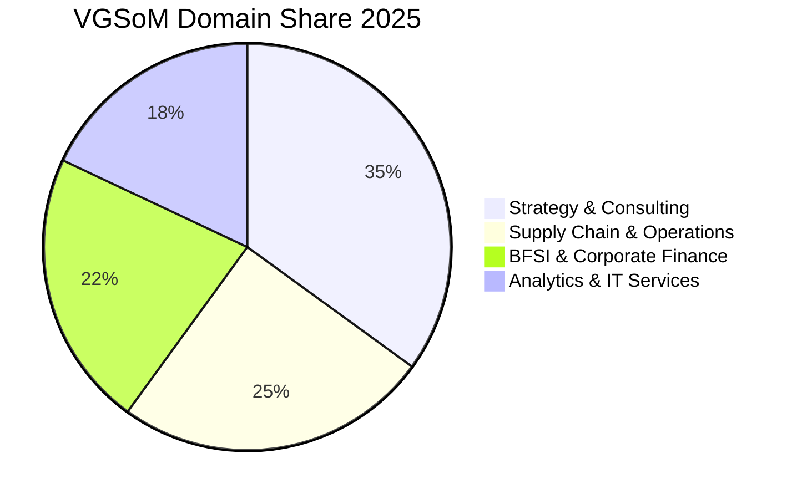

Established in 1993 as the first business school within the IIT ecosystem, the **Vinod Gupta School of Management (VGSoM) at IIT Kharagpur** holds a storied legacy of developing data-driven management leaders.

The **2025 MBA placement season** at VGSoM demonstrated solid corporate resilience, delivering an average CTC of **₹22.75 LPA** for a larger cohort of 142 graduates.

Here is the complete **VGSoM IIT Kharagpur MBA Placement Report 2025**.

---

[InquiryCard title="Evaluating IIT MBA Programs like VGSoM or SJMSOM?" description="Get your CAT score mapped to IIT MBA eligibility and shortlist the best colleges for your career goals." cta="Get Free Profile Evaluation" type="admission"]

---

## 1. VGSoM IIT Kharagpur 2025 Placement Highlights

| Metric | Statistics (2025 Final Placement) |
| :--- | :--- |
| **Placement Success** | **100% Final Placement Record** |
| **Batch Size Placed** | 142 Students |
| **Average Package (CTC)** | **₹22.75 LPA** |
| **Median Package** | **₹21.80 LPA** |
| **Highest Package** | **₹37.63 LPA** |
| **Top 25% Average** | **₹28.90 LPA** |
| **Top 50% Average** | **₹25.40 LPA** |
| **Total 2-Year Program Fees** | ₹13.00 – 14.00 Lakhs |

---

## 2. Domain & Sector Distribution 2025

### Leading Recruiters by Domain:
1. **Strategy & Consulting (35%)**: McKinsey, Deloitte, PwC, EY, Cognizant Business Consulting, Infosys Consulting.
2. **Operations & Supply Chain (25%)**: Amazon, ITC, Titan, Schneider Electric, Tata Steel, Reliance Industries.
3. **BFSI & Fintech (22%)**: Goldman Sachs, JP Morgan, Wells Fargo, ICICI Bank, IndusInd Bank, Axis Bank.
4. **Analytics & Technology (18%)**: IBM, Tiger Analytics, EXL, Wipro, Capgemini.

---

## 3. High ROI Benchmark

With total program fees under **₹14 Lakhs** and an average package exceeding **₹22.75 LPA**, VGSoM continues to provide an enviable return on investment (payback under 8 to 10 months).

*   Compare with **[SJMSOM [IIT Bombay](/colleges/iit-bombay) Placement Report 2025](/blog/sjmsom-iit-bombay-mba-placement-report-2025)**
*   Compare with **[DoMS IIT Delhi Placement Report 2025](/blog/doms-iit-delhi-mba-placement-report-2025)**

---

### 🚀 Boost Your Preparation

Looking for more resources? **[Explore Our Premium MBA Mock Test Series 2026](/mock-tests)** to get real-time exam experience and detailed performance analytics.

---
