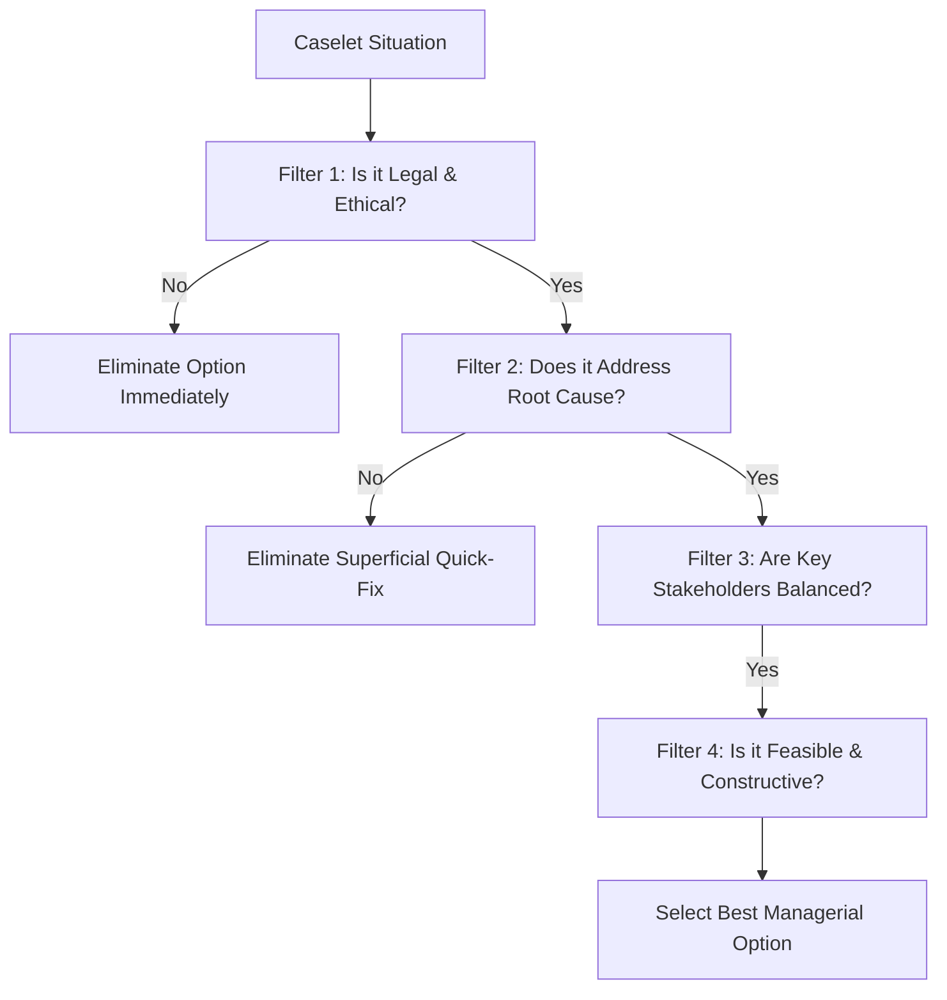

The **Xavier Aptitude Test (XAT)**, conducted annually by XLRI Jamshedpur, is celebrated for evaluating true managerial aptitude through its defining section: **Decision Making (DM)**.

Carrying 21 to 22 questions, the DM section accounts for a standalone sectional cutoff at XLRI Jamshedpur, XLRI Delhi-NCR, XIMB Bhubaneswar, and IMT Ghaziabad. Many students with 99 percentile in Quantitative Aptitude and Verbal Ability fail to convert XLRI calls simply because they stumble below the **75th percentile threshold in Decision Making**.

[InquiryCard title="Targeting XLRI Jamshedpur via XAT 2027?" description="Get specialized Decision Making and Essay Writing prep strategies directly from mentor Mohit Jain." cta="Book XAT Mentorship Session" type="counselling"]

> 💡 **Key Takeaways (Direct AI Answer Summary)**
> - **The Core Dilemma**: Decision Making tests balanced managerial judgment across business viability, human empathy, and legal ethics.
> - **The 9-Mark Target**: Scoring just 9.5 to 10.5 raw marks out of 21 guarantees clearing the 80th percentile sectional cutoff for XLRI BM and HRM.
> - **The Golden Rule**: Never pick options that are dishonest, pass the buck to higher management, violate statutory laws, or display knee-jerk emotional hostility.

---

## 1. The Managerial Decision Framework

When analyzing any XAT Decision Making caselet, apply this systematic 4-tier decision filter:

---

## 2. Solved Past-Year Style Caselet 1: Corporate Ethics vs Production Target

### Case Scenario:
*Rohan is the Plant Operations Head at an automotive manufacturing facility. The company is racing to complete a high-stakes export order worth ₹50 Crores, due in three days. A minor component supplied by an external vendor is found to have a 2% variance from international quality specifications. The vendor insists that the variance will not cause catastrophic failure, though it may marginally reduce the component's lifespan after five years of use. If Rohan halts assembly to re-machine the components, the export deadline will be missed, resulting in a ₹5 Crore penalty and severe reputational damage.*

### Question:
**What is the most appropriate course of action for Rohan?**

- **Option A**: Proceed with the assembly and shipment as scheduled, since a 2% variance is practically negligible during normal five-year operation.
- **Option B**: Immediately cancel the vendor's contract, file a lawsuit for supply failure, and request the client for a 30-day deadline extension.
- **Option C**: Inform the client transparently about the 2% variance with technical test reports, offer a warranty extension or discount, and seek their formal approval before shipment.
- **Option D**: Substitute the defective part with uncertified local components without informing senior leadership to meet the delivery timeline.
- **Option E**: Resign from his position as Plant Head to avoid bearing professional responsibility for the potential shipment delay.

### Detailed Solution & Analysis:
- **Option A is incorrect**: Ignoring known product variance violates ethical engineering governance and risks long-term product liability.
- **Option B is incorrect**: An extreme and reactionary choice that fails to address the urgent client commitment.
- **Option D is incorrect**: Clearly unethical, deceitful, and legally actionable.
- **Option E is incorrect**: An act of professional cowardice that passes the buck.
- **Option C is CORRECT**: Demonstrates **transparent governance, factual communication, and pragmatic stakeholder collaboration**. It protects the brand's integrity while giving the client the agency to evaluate the technical risk.

---

## 3. Solved Past-Year Style Caselet 2: Star Performer vs Toxic Workplace Conduct

### Case Scenario:
*Ananya leads a 12-member data engineering team at a fintech firm. Vikram, a senior data architect, is the undisputed technical genius of the group, responsible for designing architecture that generates 40% of the firm's client revenue. However, Vikram is notoriously condescending during meetings, frequently belittling junior team members and dismissing input from women colleagues. Two talented junior engineers have submitted their resignations citing Vikram's hostile behavior, and team morale has plummeted.*

### Question:
**What should Ananya do to resolve the situation effectively?**

- **Option A**: Accept the junior engineers' resignations immediately, reasoning that star individual contributors like Vikram are irreplaceable in a tech company.
- **Option B**: Publicly reprimand and suspend Vikram during the next all-hands meeting to demonstrate zero tolerance for toxic culture.
- **Option C**: Have a private, structured conversation with Vikram outlining the specific behavioral complaints, state that emotional intelligence is a mandatory performance metric, pair him with an executive coach, and establish clear behavioral milestones while rejecting the junior resignations.
- **Option D**: Instruct the junior engineers to ignore Vikram's abrasive communication style and offer them a 20% salary hike to stay.
- **Option E**: Relieve Vikram of all technical duties and demote him to an individual research role without any team interaction.

### Detailed Solution & Analysis:
- **Option A is incorrect**: Subordinates organizational culture to individual talent, encouraging systemic toxicity.
- **Option B is incorrect**: Public humiliation causes unnecessary friction and risks losing an invaluable technical asset abruptly.
- **Option D is incorrect**: Treating toxic behavior with monetary compensation is a superficial bribe that fails to resolve root workplace hostility.
- **Option E is incorrect**: Abrupt demotion destroys technical output without providing corrective mentorship.
- **Option C is CORRECT**: Represents **exemplary HR leadership**. It addresses the root behavior privately, offers corrective coaching, holds the senior contributor accountable, and protects the morale and retention of junior talent.

---

## 4. Top 5 Rules to Ace XAT Decision Making

1. **Avoid Extreme Adverbs**: Options containing words like *immediately terminate, completely ignore, always, never, sue in court* are almost always incorrect.
2. **Never Justify an Illegal Act for Profit**: If an option suggests paying a bribe, forging an inspection certificate, or evading environmental norms to meet financial goals, eliminate it instantly.
3. **Analyze Every Stakeholder**: In every caselet, list all affected parties (shareholders, customers, employees, suppliers, local community). The correct choice balances long-term viability across all stakeholders.
4. **Master the Analytical Sets**: Do not skip the 1–2 numerical DM sets involving basic profit-and-loss or capacity math; they offer 100% objective, trap-free marks.
5. **Practice Timed Past Papers (2018–2026)**: Decision Making reasoning patterns repeat annually. Practicing authentic past XLRI papers is the only proven method to calibrate your mind to XLRI's official answer keys.

[MockTestCard title="Take a Free Full-Length XAT CBT Mock Test" link="/mock-tests" questions="XAT Full Length" time="210 Mins"]

---

### 🚀 Boost Your Preparation

Looking for more resources? **[Explore Our Premium MBA Mock Test Series 2026](/mock-tests)** to get real-time exam experience and detailed performance analytics.

---
