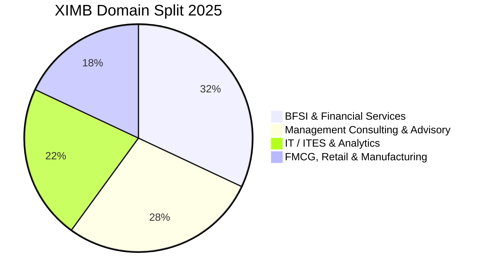

The **Xavier Institute of Management, Bhubaneswar (XIMB)** under **XIM University** is recognized as one of Eastern India's most prestigious business schools, boasting over 35 years of executive education excellence.

The **2025 MBA placement season** concluded with **100% placements**, driven by strong participation across BFSI, IT Consulting, FMCG, and Strategy, achieving an average CTC of **₹18.25 LPA** and a peak package of **₹32.80 LPA**.

Here is the complete **XIMB Bhubaneswar MBA Placement Report 2025**.

---

[InquiryCard title="Targeting XIMB, TAPMI, or Top Private Management Colleges?" description="Get your CAT/XAT/X-GMT scores mapped and explore admission shortlists with Mohit Jain." cta="Get Free Counselling" type="admission"]

---

## 1. XIMB Placement 2025 Highlights

| Metric | Statistics (2025 Placement Season) |
| :--- | :--- |
| **Placement Record** | **100% Placement Success** |
| **Average CTC (Overall)** | **₹18.25 LPA** |
| **Median CTC** | **₹17.50 LPA** |
| **Highest CTC** | **₹32.80 LPA** |
| **Top 25% Batch Average** | **₹24.10 LPA** |
| **Top 50% Batch Average** | **₹20.80 LPA** |
| **Total 2-Year Program Fees** | ₹20.00 – 21.50 Lakhs |

---

## 2. Sector-Wise Placement Distribution 2025

### Key Recruiters by Sector:
*   **BFSI (32%)**: Goldman Sachs, Morgan Stanley, HSBC, ICICI Bank, HDFC Bank, Axis Bank, CRISIL.
*   **Consulting (28%)**: Deloitte, PwC, KPMG, EY, Accenture Strategy, Cognizant Business Consulting.
*   **IT/ITES (22%)**: Microsoft, Amazon, Infosys, Wipro, Capgemini, IBM, Genpact.
*   **Marketing & Manufacturing (18%)**: Tata Steel, Nestlé, Maruti Suzuki, Vedanta, Titan.

---

## 3. Related Placement Reports

*   **[XLRI Jamshedpur & Delhi Placement Report 2025](/blog/xlri-jamshedpur-delhi-placement-report-2025)**
*   **[TAPMI Manipal Placement Report 2025](/blog/tapmi-manipal-mba-placement-report-2025)**
*   **[All 21 IIMs Recent Placement Report 2025](/blog/all-iim-recent-placement-report-2025)**

---

### 🚀 Boost Your Preparation

Looking for more resources? **[Explore Our Premium MBA Mock Test Series 2026](/mock-tests)** to get real-time exam experience and detailed performance analytics.

---
